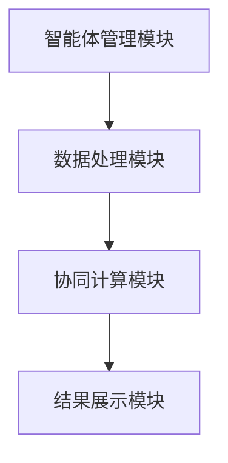

                 


# 智能体群体在市场泡沫检测中的应用

> 关键词：智能体群体，市场泡沫，金融市场，协同智能体，算法原理，系统设计

> 摘要：本文探讨了智能体群体在市场泡沫检测中的应用，从基本概念、算法原理到系统设计和项目实战，全面解析了智能体群体在金融市场中的优势与实现方法。通过详细分析市场泡沫的传统检测方法与基于智能体的方法的对比，结合实际案例，展示了智能体群体在检测市场泡沫中的潜力和效果。

---

## 第一章：智能体群体与市场泡沫概述

### 1.1 智能体群体的基本概念

#### 1.1.1 智能体的定义与分类
智能体（Agent）是指具有感知环境、自主决策、执行任务能力的实体。智能体可以是软件程序、机器人或其他智能系统。根据功能和智能水平，智能体可以分为以下几类：
- **反应式智能体**：根据当前感知做出实时反应，不依赖历史信息。
- **认知式智能体**：具备推理、规划和学习能力，能够处理复杂任务。
- **协作式智能体**：多个智能体协同工作，共同完成复杂任务。

#### 1.1.2 智能体群体的特征与优势
智能体群体具有以下特征：
- **分布式计算**：任务分布在多个智能体上，避免单点故障。
- **自主性**：每个智能体独立决策，无需中央控制。
- **协作性**：通过通信和协调，共同完成复杂任务。
- **适应性**：能够根据环境变化动态调整行为。

智能体群体的优势在于能够处理复杂、动态的环境，尤其是金融市场这种高度不确定的领域。

#### 1.1.3 智能体群体与传统算法的对比
传统算法通常依赖中心化计算，而智能体群体通过分布式协作解决问题。在金融市场中，智能体群体能够更灵活地应对市场变化，而传统算法在面对突发情况时可能表现不佳。

### 1.2 市场泡沫的基本概念

#### 1.2.1 市场泡沫的定义与特征
市场泡沫是指资产价格远高于其实际价值的现象。通常表现为价格的快速上涨和随后的急剧下跌。市场泡沫的特征包括：
- **价格虚高**：资产价格脱离基本面。
- **交易量激增**：投资者蜂拥而入，推动价格上涨。
- **非理性行为**：投资者基于情绪而非理性决策。

#### 1.2.2 市场泡沫的形成机制
市场泡沫的形成通常由以下因素驱动：
- **信息不对称**：投资者获取信息的能力不均衡。
- **羊群效应**：投资者跟随市场趋势，导致价格偏离实际价值。
- **杠杆效应**：过度杠杆化加剧价格波动。

#### 1.2.3 市场泡沫对金融系统的影响
市场泡沫破裂可能导致金融危机，例如2008年的次贷危机。因此，及时检测市场泡沫对金融稳定至关重要。

### 1.3 智能体群体在市场泡沫检测中的应用背景

#### 1.3.1 当前市场泡沫检测的主要挑战
传统市场泡沫检测方法主要依赖统计分析和专家判断，存在以下挑战：
- **数据复杂性**：金融市场数据高度动态且非线性。
- **模型局限性**：传统模型难以捕捉复杂市场行为。
- **实时性要求**：需要快速检测以避免损失。

#### 1.3.2 智能体群体的优势与潜力
智能体群体能够通过分布式协作和实时数据处理，克服传统方法的局限性。智能体群体能够模拟市场参与者的复杂行为，从而更准确地检测市场泡沫。

#### 1.3.3 智能体群体在金融领域的研究现状
目前，智能体群体在金融市场中的应用主要集中在交易策略优化、风险管理和市场模拟。然而，将智能体群体应用于市场泡沫检测仍处于探索阶段。

---

## 第二章：多智能体系统的基本原理

### 2.1 多智能体系统的定义与分类

#### 2.1.1 多智能体系统的定义
多智能体系统（Multi-Agent System, MAS）是由多个智能体组成的分布式系统，智能体之间通过通信和协作完成复杂任务。

#### 2.1.2 多智能体系统的分类与特点
多智能体系统可以分为以下几类：
- **协作式智能体系统**：智能体协同完成任务。
- **竞争式智能体系统**：智能体之间存在竞争关系。
- **混合式智能体系统**：同时包含协作和竞争关系。

多智能体系统的优点包括灵活性、鲁棒性和适应性。

#### 2.1.3 多智能体系统与分布式系统的关系
多智能体系统与分布式系统密切相关，但多智能体系统强调智能体的自主性和协作性，而分布式系统更关注资源分配和任务调度。

### 2.2 智能体的协作机制

#### 2.2.1 智能体之间的通信与协调
智能体之间通过通信协议交换信息，协调行为。常见的通信方式包括发布-订阅模型和点对点通信。

#### 2.2.2 多智能体系统的任务分配
任务分配是多智能体系统的核心问题之一，通常采用分布式算法和协商机制。

#### 2.2.3 智能体群体的决策机制
智能体群体决策通常基于分布式计算和集体判断，例如使用投票机制或共识算法。

### 2.3 多智能体系统在金融市场中的应用

#### 2.3.1 金融市场的复杂性与多智能体系统的匹配性
金融市场高度动态且复杂，多智能体系统能够模拟市场参与者的多种行为。

#### 2.3.2 多智能体系统在金融预测中的应用
多智能体系统可以通过模拟市场行为，帮助预测价格走势。

#### 2.3.3 多智能体系统在风险管理中的应用
多智能体系统能够实时监控市场风险，提前预警潜在问题。

---

## 第三章：市场泡沫检测的方法与挑战

### 3.1 市场泡沫的传统检测方法

#### 3.1.1 基于价格波动的传统方法
通过分析价格波动率和偏离程度判断是否存在市场泡沫。

#### 3.1.2 基于成交量分析的传统方法
分析成交量与价格的关系，判断市场是否过热。

#### 3.1.3 基于基本面分析的传统方法
通过分析企业基本面数据，评估资产是否被高估。

### 3.2 基于智能体群体的市场泡沫检测方法

#### 3.2.1 智能体群体模拟市场行为
通过模拟投资者行为，分析市场泡沫的形成和扩散过程。

#### 3.2.2 智能体群体的协同分析
利用智能体群体的协作能力，综合分析市场信息，判断是否存在泡沫。

#### 3.2.3 智能体群体的实时检测
通过实时数据处理和协同分析，快速检测市场泡沫。

### 3.3 市场泡沫检测的挑战

#### 3.3.1 数据复杂性
金融市场数据高度动态且非线性，难以建模。

#### 3.3.2 模型局限性
传统模型难以捕捉复杂市场行为。

#### 3.3.3 实时性要求
需要快速检测以避免损失。

---

## 第四章：智能体群体协同的算法原理

### 4.1 协同机制的数学模型

#### 4.1.1 协同机制的定义
协同机制是指智能体之间通过通信和协调完成任务的方式。

#### 4.1.2 协同机制的分类
协同机制可以分为同步和异步两种类型。

#### 4.1.3 协同机制的数学模型
协同机制可以通过状态空间模型表示，例如：
$$
\text{State} = \{s_1, s_2, \ldots, s_n\}
$$
其中，$s_i$表示第i个智能体的状态。

### 4.2 智能体群体的分布式计算

#### 4.2.1 分布式计算的定义
分布式计算是指任务分布在多个计算节点上，通过协作完成。

#### 4.2.2 分布式计算的实现
通过消息传递机制和任务分配算法实现分布式计算。

#### 4.2.3 分布式计算的优势
分布式计算能够提高系统的并行性和扩展性。

### 4.3 智能体群体的数学模型

#### 4.3.1 智能体群体的博弈论模型
通过博弈论模型分析智能体之间的策略选择，例如纳什均衡。

#### 4.3.2 智能体群体的统计模型
通过统计模型分析市场行为，例如多元回归模型：
$$
y = \beta_0 + \beta_1 x_1 + \beta_2 x_2 + \ldots + \beta_k x_k + \epsilon
$$

#### 4.3.3 智能体群体的动态模型
通过时间序列模型分析市场动态，例如ARIMA模型：
$$
\text{ARIMA}(p, d, q)
$$

---

## 第五章：智能体群体协同的系统设计

### 5.1 系统功能设计

#### 5.1.1 需求分析
系统需要实现智能体群体的协作、数据处理和结果输出。

#### 5.1.2 功能模块
系统主要模块包括智能体管理、数据处理、协同计算和结果展示。

#### 5.1.3 功能流程
智能体接收数据，协同计算，输出结果。

### 5.2 系统架构设计

#### 5.2.1 模块化设计
将系统划分为多个模块，例如智能体模块、数据模块和通信模块。

#### 5.2.2 通信协议设计
设计智能体之间的通信协议，例如基于WebSocket的实时通信。

#### 5.2.3 系统架构图
使用mermaid绘制系统架构图：



### 5.3 系统实现

#### 5.3.1 环境配置
需要安装Python、NumPy、Pandas等库。

#### 5.3.2 核心代码实现
实现智能体之间的通信和协同计算，例如：

```python
import numpy as np
import pandas as pd

class Agent:
    def __init__(self, id):
        self.id = id
        self.data = None

    def receive_data(self, data):
        self.data = data

    def process_data(self):
        # 数据处理逻辑
        pass

    def send_result(self):
        # 发送结果
        pass
```

#### 5.3.3 代码解读与分析
通过代码实现智能体的通信和协作，分析数据并输出结果。

### 5.4 系统测试

#### 5.4.1 测试环境
在虚拟环境中部署系统，进行功能测试。

#### 5.4.2 测试用例
设计测试用例，验证系统功能。

#### 5.4.3 测试结果
记录测试结果，分析系统性能和稳定性。

---

## 第六章：智能体群体协同的项目实战

### 6.1 环境安装与配置

#### 6.1.1 环境配置
安装Python、NumPy、Pandas等库。

#### 6.1.2 工具安装
安装Jupyter Notebook、Git等开发工具。

### 6.2 核心代码实现

#### 6.2.1 智能体通信代码
实现智能体之间的通信，例如：

```python
import socket

class AgentCommunicator:
    def __init__(self, host, port):
        self.host = host
        self.port = port
        self.sock = socket.socket(socket.AF_INET, socket.SOCK_STREAM)

    def connect(self):
        self.sock.connect((self.host, self.port))

    def send_data(self, data):
        self.sock.send(data)

    def receive_data(self):
        data = self.sock.recv(1024)
        return data
```

#### 6.2.2 数据处理代码
实现数据处理逻辑，例如：

```python
import pandas as pd

def process_data(data):
    df = pd.DataFrame(data)
    # 数据分析逻辑
    return df
```

#### 6.2.3 协同计算代码
实现智能体群体的协同计算，例如：

```python
from threading import Thread

class Agent:
    def __init__(self, id, host, port):
        self.id = id
        self.host = host
        self.port = port
        self.data = None

    def run(self):
        Thread(target=self.receive_data).start()

    def receive_data(self):
        while True:
            # 接收数据
            pass

    def send_result(self, result):
        # 发送结果
        pass
```

### 6.3 实际案例分析

#### 6.3.1 案例背景
选择一个具体金融市场数据，例如2008年次贷危机前的房地产市场。

#### 6.3.2 数据分析
使用智能体群体分析数据，判断是否存在市场泡沫。

#### 6.3.3 检测结果
输出检测结果，验证系统准确性。

### 6.4 项目总结

#### 6.4.1 项目成果
总结项目实现的功能和效果。

#### 6.4.2 经验总结
总结项目中的经验教训。

#### 6.4.3 改进建议
提出改进系统性能和功能的建议。

---

## 第七章：总结与展望

### 7.1 全文总结

#### 7.1.1 核心成果
总结智能体群体在市场泡沫检测中的应用成果。

#### 7.1.2 经验总结
总结项目中的经验教训。

#### 7.1.3 系统性能
分析系统性能和稳定性。

### 7.2 未来展望

#### 7.2.1 智能体群体的优化方向
探讨智能体群体的优化方向，例如增强学习和自适应算法。

#### 7.2.2 新兴技术的结合
探讨与区块链、大数据等新兴技术的结合。

#### 7.2.3 应用场景拓展
探讨智能体群体在其他金融领域的应用潜力。

---

## 附录

### 附录A：相关数据集

#### 附录A.1 数据集描述
列出用于实验的数据集及其来源。

#### 附录A.2 数据集下载链接
提供数据集的下载链接。

### 附录B：工具包安装

#### 附录B.1 Python包安装
列出需要安装的Python包及其版本。

#### 附录B.2 工具包使用说明
提供工具包的使用说明和示例代码。

### 附录C：参考文献

#### 附录C.1 主要参考文献
列出主要参考文献及其来源。

---

通过以上章节的详细分析和讲解，我们可以看到智能体群体在市场泡沫检测中的巨大潜力和实际应用价值。未来，随着人工智能和分布式计算技术的不断发展，智能体群体将在金融市场中发挥越来越重要的作用。

