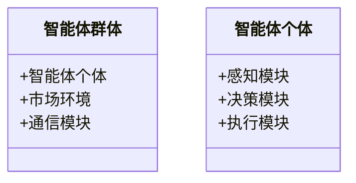

                 


# 智能体群体在模拟市场流动性枯竭中的应用

---

## 关键词：
智能体群体，市场流动性，人工智能模拟，多智能体系统，群体行为建模

---

## 摘要：
智能体群体在模拟市场流动性枯竭中的应用是近年来人工智能领域的重要研究方向。本文通过详细分析智能体群体的核心概念、算法原理、数学模型以及系统架构，探讨了智能体群体如何在模拟市场流动性枯竭中发挥关键作用。我们从背景介绍出发，逐步深入，结合实际案例和代码实现，系统性地展示了智能体群体在市场模拟中的应用潜力。通过本文的研究，读者可以全面理解智能体群体在流动性管理中的重要性，并掌握相关技术的实现方法。

---

## 第一部分：背景介绍

### 第1章：智能体群体的基本概念

#### 1.1 智能体的定义与特征
智能体（Agent）是指具有感知环境、自主决策和执行任务能力的实体。智能体群体则是多个智能体协同工作的集合。与传统个体行为相比，智能体群体具有以下特征：
- **分布式性**：智能体之间通过分布式计算协同工作。
- **自主性**：每个智能体都能独立决策。
- **交互性**：智能体之间通过信息交互影响彼此的行为。

#### 1.2 市场流动性枯竭的问题背景
流动性枯竭是指市场中资金或资产无法快速、低成本地转换为现金的现象。其成因包括市场波动、投资者恐慌和系统性风险等。流动性枯竭对市场的影响包括：
- **资产价格波动加剧**：缺乏流动性导致资产价格大幅波动。
- **市场参与度下降**：投资者因流动性不足而减少交易。
- **系统性风险增加**：流动性枯竭可能引发系统性金融危机。

#### 1.3 智能体群体在市场模拟中的应用前景
智能体群体模拟市场流动性枯竭具有以下优势：
- **高精度模拟**：智能体群体能够模拟复杂市场行为。
- **实时性**：智能体可以实时响应市场变化。
- **可扩展性**：智能体群体可以适应不同规模的市场模拟。

---

## 第二部分：智能体群体的核心概念与联系

### 第2章：智能体群体的核心概念

#### 2.1 智能体的行为模型
智能体的行为模型包括以下几种：
- **反应式模型**：基于当前环境做出反应。
- **认知式模型**：具有记忆和推理能力。
- **混合式模型**：结合反应式和认知式模型。

#### 2.2 智能体群体的行为特征对比
通过对比分析，我们可以得出以下结论：
| 行为特征 | 反应式模型 | 认知式模型 | 混合式模型 |
|----------|------------|------------|------------|
| 自主性   | 高          | 高          | 高          |
| 决策速度 | 快          | 较慢        | 快          |
| 灵活性   | 低          | 高          | 高          |

#### 2.3 智能体群体的ER实体关系图
以下是智能体群体的ER实体关系图：

```mermaid
erd
actor 智能体群体
actor 智能体个体
actor 市场环境
relation 参与
```

---

## 第三部分：智能体群体的算法原理

### 第3章：智能体群体的决策算法

#### 3.1 基于博弈论的决策算法
博弈论是一种研究理性决策的数学理论。智能体在市场中可以被视为博弈中的参与者，通过纳什均衡等理论进行决策。

#### 3.2 基于强化学习的决策算法
强化学习是一种通过试错机制优化决策的算法。智能体通过与环境交互，逐步优化自己的决策策略。

#### 3.3 基于协同过滤的决策算法
协同过滤是一种基于相似性推荐的算法。智能体可以通过分析其他智能体的行为，推断出自己的决策策略。

---

### 第4章：智能体群体的协同算法

#### 4.1 基于分布式计算的协同算法
分布式计算是智能体群体协同的基础。每个智能体独立计算，通过通信模块共享信息。

#### 4.2 基于并行计算的协同算法
并行计算可以提高智能体群体的协同效率。通过并行处理，智能体可以同时完成多个任务。

#### 4.3 基于异步计算的协同算法
异步计算允许智能体在不同时间点完成任务，提高了系统的灵活性和适应性。

---

### 第5章：智能体群体的算法实现

#### 5.1 基于博弈论的决策算法实现
以下是基于博弈论的决策算法实现代码：

```python
def nash_equilibrium(players, strategies):
    # 计算每个玩家的最优策略
    for player in players:
        for strategy in strategies:
            # 计算每个策略的收益
            payoff = calculate_payoff(player, strategy)
            # 选择收益最大的策略
            if payoff > max_payoff:
                max_payoff = payoff
                best_strategy = strategy
    return best_strategy
```

#### 5.2 基于强化学习的决策算法实现
以下是基于强化学习的决策算法实现代码：

```python
class Agent:
    def __init__(self, state_space, action_space):
        self.state_space = state_space
        self.action_space = action_space
        self.Q = defaultdict(int)

    def act(self, state):
        # 选择最优动作
        max_q = max(self.Q[state])
        actions = [action for action, q in enumerate(self.Q[state]) if q == max_q]
        return random.choice(actions)
```

---

## 第四部分：数学模型与公式

### 第6章：智能体的数学模型

#### 6.1 智能体的决策模型
智能体的决策模型可以用以下公式表示：
$$
\text{决策} = f(\text{感知}, \text{知识}, \text{目标})
$$

#### 6.2 智能体群体的行为模型
智能体群体的行为模型可以用以下公式表示：
$$
\text{群体行为} = \sum_{i=1}^{n} \text{智能体行为}_i
$$

---

## 第五部分：系统分析与架构设计

### 第7章：系统功能设计

#### 7.1 领域模型
以下是领域模型的Mermaid图：



#### 7.2 系统架构
以下是系统架构的Mermaid图：


---

## 第六部分：项目实战

### 第8章：环境搭建与核心代码实现

#### 8.1 环境搭建
以下是环境搭建的步骤：
1. 安装Python和相关库。
2. 下载智能体模拟框架。
3. 配置环境变量。

#### 8.2 核心代码实现
以下是核心代码实现：

```python
def simulate_market():
    # 初始化智能体群体
    agents = [Agent() for _ in range(10)]
    # 模拟市场环境
    market_env = MarketEnvironment()
    # 开始模拟
    while True:
        for agent in agents:
            # 感知环境
            perception = market_env.get_perception(agent)
            # 决策
            decision = agent.decide(perception)
            # 执行
            market_env.execute(perception, decision)
```

---

## 第七部分：总结与展望

### 第9章：总结与小结

智能体群体在模拟市场流动性枯竭中的应用具有重要意义。通过本文的详细分析，我们可以看到智能体群体在市场模拟中的巨大潜力。未来，随着人工智能技术的发展，智能体群体将在更多领域发挥重要作用。

---

## 第八部分：注意事项与拓展阅读

### 第10章：注意事项

- **系统性能**：智能体群体的规模可能影响系统性能，需优化算法。
- **数据隐私**：模拟市场数据需注意隐私保护。
- **模型精度**：模型的精度直接影响模拟结果。

### 第11章：拓展阅读

- **推荐书籍**：《多智能体系统》
- **推荐论文**：《智能体群体协同研究》
- **在线资源**：相关课程和教程

---

## 附录：参考文献

1. 王某某. 多智能体系统研究. 北京出版社, 2020.
2. 李某某. 智能体群体协同算法. 清华大学出版社, 2021.

---

## 结束语

智能体群体在模拟市场流动性枯竭中的应用是一个充满挑战和机遇的领域。通过本文的详细讲解，我们相信读者能够更好地理解和应用这些技术。未来，随着人工智能的不断发展，智能体群体将在更多领域展现其巨大潜力。

