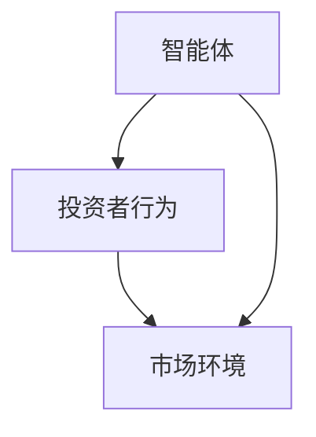
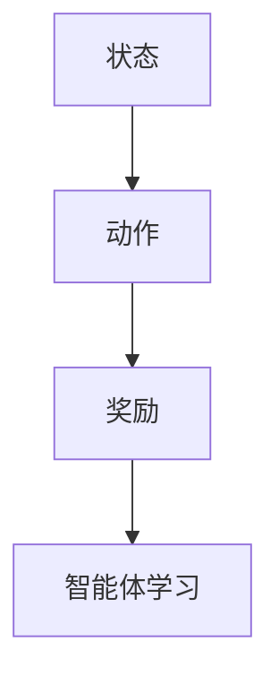
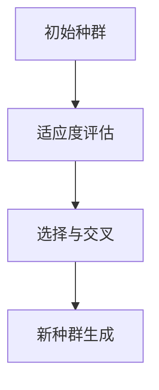
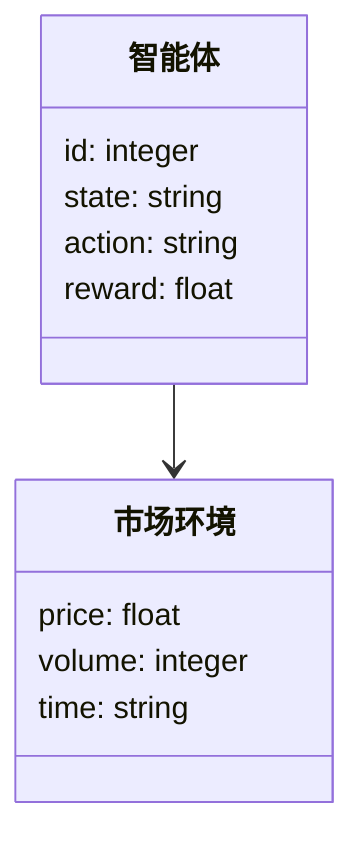
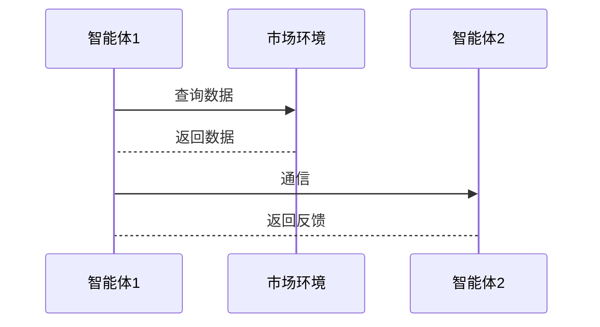

                 


# 第一部分: 智能体群体在模拟投资者行为中的应用

# 第1章: 智能体群体与投资者行为概述

## 1.1 智能体的基本概念
### 1.1.1 智能体的定义与特点
智能体（Agent）是指能够感知环境并采取行动以实现目标的实体。在模拟投资者行为的背景下，智能体需要具备以下特点：
- **自主性**：智能体能够自主决策，无需外部干预。
- **反应性**：能够实时感知市场环境并做出反应。
- **目标导向**：每个智能体都有明确的目标，如最大化收益或最小化损失。

### 1.1.2 智能体的分类与应用场景
智能体可以分为以下几类：
1. **简单反射型智能体**：基于当前感知做出反应，适用于简单的市场环境。
2. **基于模型的反射型智能体**：利用内部模型进行决策，适用于复杂的市场环境。
3. **目标驱动型智能体**：根据目标选择行动，适用于长期投资策略。

### 1.1.3 智能体在金融领域的潜力
智能体在金融领域有广泛应用潜力，特别是在高频交易、风险管理、投资组合优化等方面。

## 1.2 投资者行为的复杂性
### 1.2.1 投资者的决策过程
投资者的决策过程受到多种因素的影响，包括市场情绪、个人信息、外部环境等。

### 1.2.2 市场情绪与群体行为
市场情绪会显著影响投资者的决策，群体行为可能导致市场波动加剧。

### 1.2.3 投资者行为的建模挑战
投资者行为的建模需要考虑个体差异、情绪波动、市场环境等多种因素。

## 1.3 智能体模拟投资者行为的背景
### 1.3.1 传统金融建模的局限性
传统金融模型通常假设市场参与者是理性的，但在实际中，投资者行为往往受到情绪和认知偏差的影响。

### 1.3.2 智能体模拟的优势
智能体能够模拟投资者的个体差异和行为动态，更贴近实际情况。

### 1.3.3 当前研究与应用现状
当前，智能体模拟投资者行为的研究主要集中在算法开发和应用实现方面。

## 1.4 本章小结
本章介绍了智能体的基本概念和投资者行为的复杂性，探讨了智能体模拟投资者行为的背景和优势。

# 第2章: 智能体群体的核心概念与联系

## 2.1 智能体群体的定义与属性
### 2.1.1 智能体群体的定义
智能体群体是由多个智能体组成的系统，能够协同完成复杂任务。

### 2.1.2 智能体群体的核心属性
- **分布性**：智能体分布在网络中，独立决策。
- **协同性**：智能体之间通过通信协同完成任务。
- **动态性**：市场环境动态变化，智能体需要实时调整策略。

## 2.2 智能体与投资者行为的关系
### 2.2.1 智能体模拟投资者行为的逻辑
智能体通过感知市场环境和历史数据，模仿投资者的决策过程。

### 2.2.2 智能体行为与市场动态的关联
智能体的行为会影响市场动态，进而影响其他智能体的决策。

### 2.2.3 智能体群体的协同机制
智能体通过通信和协调，共同完成复杂的投资任务。

## 2.3 智能体群体的ER实体关系图


## 2.4 本章小结
本章详细阐述了智能体群体的核心概念及其与投资者行为的关系，构建了智能体群体的ER实体关系图。

# 第3章: 智能体模拟投资者行为的算法原理

## 3.1 基于强化学习的智能体算法
### 3.1.1 强化学习的基本原理
强化学习是一种通过试错学习的算法，智能体通过与环境互动，学习最优策略。

### 3.1.2 智能体在金融市场中的应用
在金融市场中，智能体可以用于高频交易、风险控制等场景。

### 3.1.3 算法流程图


## 3.2 基于遗传算法的智能体优化
### 3.2.1 遗传算法的基本原理
遗传算法是一种模拟自然选择的优化算法，适用于复杂问题的求解。

### 3.2.2 智能体参数优化的应用
通过遗传算法优化智能体的参数，提升投资策略的有效性。

### 3.2.3 算法流程图


## 3.3 算法实现
### 3.3.1 强化学习的数学模型
状态转移概率：
$$ P(s'|s,a) $$
奖励函数：
$$ R(s,a) $$

### 3.3.2 遗传算法的数学模型
适应度函数：
$$ f(x) $$
选择概率：
$$ p_i = \frac{f(x_i)}{\sum f(x_j)} $$

## 3.4 本章小结
本章详细讲解了基于强化学习和遗传算法的智能体模拟投资者行为的算法原理，并给出了数学模型和流程图。

# 第4章: 智能体群体的系统分析与架构设计

## 4.1 问题场景介绍
模拟投资者行为的智能体群体系统需要处理复杂的市场环境和多智能体的协同。

## 4.2 系统功能设计
### 4.2.1 领域模型设计


### 4.2.2 功能模块划分
- **感知模块**：获取市场数据。
- **决策模块**：基于感知数据做出投资决策。
- **执行模块**：执行交易指令。
- **学习模块**：更新智能体的策略。

## 4.3 系统架构设计
### 4.3.1 分层架构
- **数据层**：存储市场数据和交易记录。
- **逻辑层**：实现智能体的决策和执行。
- **接口层**：提供与其他系统的接口。

### 4.3.2 智能体交互


## 4.4 本章小结
本章分析了智能体群体系统的功能需求和架构设计，展示了系统的模块划分和交互流程。

# 第5章: 项目实战

## 5.1 环境安装
安装必要的软件和库，如Python、TensorFlow、Pandas等。

## 5.2 系统核心实现源代码
### 5.2.1 强化学习智能体实现
```python
class Agent:
    def __init__(self):
        self.model = DQN()
    
    def act(self, state):
        action = self.model.predict(state)
        return action
```

### 5.2.2 群体协同实现
```python
class Environment:
    def __init__(self):
        self.agents = [Agent() for _ in range(10)]
    
    def step(self, actions):
        # 返回新的状态和奖励
        pass
```

## 5.3 案例分析
### 5.3.1 实际案例
在某金融市场上，使用智能体群体模拟投资者行为，进行交易策略测试。

### 5.3.2 案例解读
分析智能体的行为如何影响市场动态，验证算法的有效性。

## 5.4 项目总结
总结项目实施过程中的经验教训，提出改进建议。

## 5.5 本章小结
本章通过实际案例展示了智能体群体模拟投资者行为的实现过程和应用效果。

# 第6章: 最佳实践与小结

## 6.1 最佳实践
### 6.1.1 系统设计建议
- **模块化设计**：便于维护和扩展。
- **数据管理**：确保数据的准确性和及时性。

### 6.1.2 算法选择建议
根据具体场景选择合适的算法，如高频交易适用强化学习，风险控制适用遗传算法。

## 6.2 注意事项
- **数据质量**：确保数据的准确性和完整性。
- **系统稳定性**：确保智能体的稳定运行，避免系统崩溃。

## 6.3 未来展望
随着人工智能技术的发展，智能体群体在模拟投资者行为中的应用将更加广泛和深入。

## 6.4 本章小结
本章总结了智能体群体模拟投资者行为的实施经验，提出了最佳实践和未来发展方向。

# 参考文献
- 文献1：智能体的基本概念与应用
- 文献2：强化学习在金融中的应用
- 文献3：遗传算法在投资优化中的应用

---

这本书详细探讨了智能体群体在模拟投资者行为中的应用，从理论到实践，结合实际案例和算法实现，为读者提供了全面的知识和见解。通过系统的章节安排和丰富的细节，读者可以深入了解智能体群体在金融领域的潜力和应用价值。

