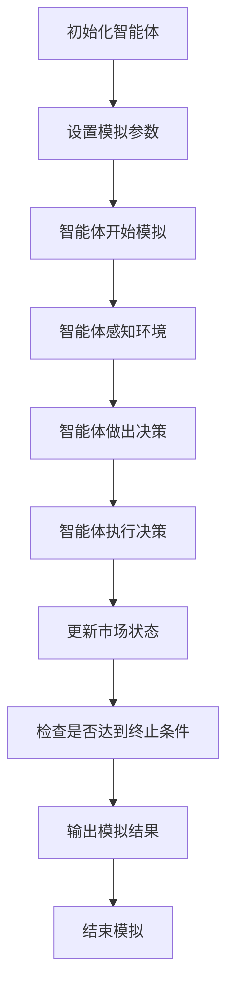
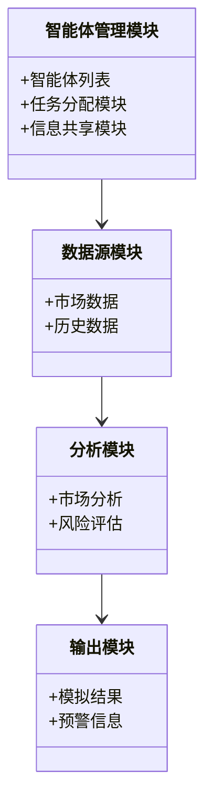
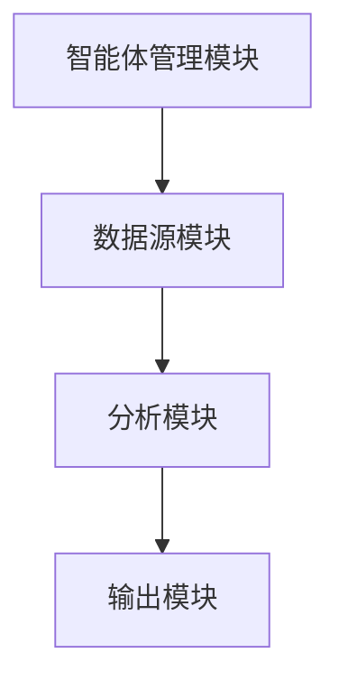
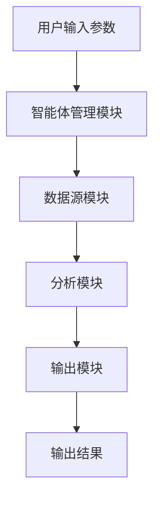

                 


# 智能体群体在模拟极端市场事件中的应用

## 关键词：智能体群体、极端市场事件、市场模拟、群体智能、算法原理

## 摘要：本文深入探讨了智能体群体在模拟极端市场事件中的应用，从基本概念到算法原理，再到系统架构和项目实战，全面解析了智能体群体在模拟极端市场事件中的理论基础和实际应用。通过详细分析智能体的行为模型、群体协同机制、算法实现和系统架构，本文为理解和应用智能体群体在极端市场事件模拟中的作用提供了系统的理论支持和实践指导。

---

## 第一章: 智能体群体的基本概念

### 1.1 智能体的定义与特征

#### 1.1.1 智能体的基本定义
智能体（Agent）是指具有感知环境、自主决策和执行任务能力的实体。智能体可以是软件程序、机器人或其他具备智能行为的实体。

#### 1.1.2 智能体的核心特征
- **自主性**：智能体能够自主决策，无需外部干预。
- **反应性**：智能体能够实时感知环境并做出反应。
- **协作性**：智能体能够与其他智能体协同工作，完成复杂任务。
- **学习性**：智能体能够通过经验改进自身行为。

#### 1.1.3 智能体与传统计算模型的区别
| 特性 | 智能体 | 传统计算模型 |
|------|--------|---------------|
| 自主性 | 高     | 低           |
| 反应性 | 高     | 低           |
| 协作性 | 高     | 低           |
| 学习性 | 高     | 低           |

### 1.2 智能体群体的形成与协同

#### 1.2.1 智能体群体的定义
智能体群体是指多个智能体通过协同工作形成的一个整体，能够完成单个智能体无法完成的任务。

#### 1.2.2 智能体之间的协同机制
- **信息共享**：智能体之间通过共享信息实现协同。
- **任务分配**：根据任务需求动态分配智能体的角色和任务。
- **协作决策**：智能体通过协作完成复杂决策。

#### 1.2.3 智能体群体的组织结构
- **层次结构**：智能体群体可以分为不同的层次，每个层次负责不同的任务。
- **网状结构**：智能体群体通过网状结构实现去中心化的协同。

### 1.3 极端市场事件的定义与特点

#### 1.3.1 市场事件的分类
- **常规事件**：如市场波动、价格调整等。
- **极端事件**：如金融危机、市场崩盘等。

#### 1.3.2 极端市场事件的特征
- **突发性**：极端事件往往出人意料，难以预测。
- **破坏性**：极端事件会对市场造成严重破坏。
- **连锁反应**：极端事件往往引发连锁反应，影响范围广泛。

#### 1.3.3 极端市场事件的影响
- **经济损失**：极端事件可能导致巨大的经济损失。
- **市场信心**：极端事件可能破坏市场信心，影响市场长期发展。
- **政策调整**：极端事件可能促使政府采取紧急政策。

### 1.4 本章小结
本章从智能体的基本概念出发，详细阐述了智能体群体的形成与协同机制，并对极端市场事件的定义与特点进行了分析，为后续章节的展开奠定了基础。

---

## 第二章: 智能体群体在市场模拟中的应用背景

### 2.1 市场模拟的必要性

#### 2.1.1 市场模拟的目的
- **风险预警**：通过模拟极端市场事件，提前预警潜在风险。
- **政策制定**：为政府和监管机构制定政策提供依据。
- **市场分析**：帮助企业分析市场趋势，制定策略。

#### 2.1.2 市场模拟的挑战
- **复杂性**：金融市场复杂多变，难以准确模拟。
- **不确定性**：极端事件的发生具有不确定性。
- **数据不足**：缺乏足够的历史数据支持模拟。

#### 2.1.3 智能体群体的优势
- **自主性**：智能体能够自主决策，模拟市场行为。
- **协作性**：智能体群体能够模拟市场的复杂互动。
- **适应性**：智能体能够动态调整行为，适应市场变化。

### 2.2 智能体群体模拟市场的理论基础

#### 2.2.1 经济学中的市场行为理论
- **理性预期理论**：假设市场参与者基于理性预期做出决策。
- **行为经济学**：考虑市场参与者的心理因素对市场行为的影响。

#### 2.2.2 计算机科学中的群体智能理论
- **分布式计算**：智能体通过分布式计算实现协同。
- **自适应学习**：智能体通过学习不断优化自身行为。

#### 2.2.3 统计学与概率论在市场模拟中的应用
- **概率模型**：用于模拟市场波动和极端事件。
- **统计分析**：用于分析市场数据，提取规律。

### 2.3 智能体群体模拟市场的实际需求

#### 2.3.1 金融市场的复杂性
- **多因素影响**：金融市场受到经济、政治、社会等多种因素的影响。
- **非线性关系**：市场变量之间的关系复杂且非线性。

#### 2.3.2 极端事件的不可预测性
- **黑天鹅事件**：极端事件往往具有“黑天鹅”特性，难以预测。
- **灰犀牛事件**：虽然存在潜在风险，但往往被忽视。

#### 2.3.3 智能体群体模拟的可行性
- **高精度模拟**：智能体群体能够模拟市场的复杂互动，提供高精度的模拟结果。
- **动态调整**：智能体群体能够根据市场变化动态调整模拟策略。

### 2.4 本章小结
本章分析了市场模拟的必要性，介绍了智能体群体模拟市场的理论基础，并探讨了智能体群体在模拟极端市场事件中的实际需求，为后续章节的深入分析提供了理论支持。

---

## 第三章: 智能体群体模拟极端市场事件的核心概念

### 3.1 智能体的行为模型

#### 3.1.1 基于规则的智能体行为
- **规则定义**：智能体根据预设的规则做出决策。
- **优点**：简单易实现，适合规则明确的场景。
- **缺点**：难以应对复杂多变的市场环境。

#### 3.1.2 基于学习的智能体行为
- **机器学习**：智能体通过学习历史数据，识别市场规律。
- **优点**：能够适应复杂市场环境，动态调整行为。
- **缺点**：需要大量数据支持，学习过程可能较慢。

#### 3.1.3 智能体行为的动态调整
- **自适应学习**：智能体根据市场反馈动态调整行为策略。
- **实时优化**：智能体能够实时优化自身行为，提高模拟精度。

### 3.2 智能体之间的交互机制

#### 3.2.1 智能体之间的信息传递
- **信息共享**：智能体之间通过共享信息实现协同。
- **信息过滤**：智能体能够过滤无效信息，提高信息处理效率。

#### 3.2.2 智能体之间的博弈关系
- **零和博弈**：智能体之间的博弈关系可能表现为零和博弈。
- **合作博弈**：智能体之间可以通过合作实现共赢。

#### 3.2.3 智能体之间的协作与竞争
- **协作机制**：智能体通过协作完成复杂任务。
- **竞争机制**：智能体通过竞争优化自身行为。

### 3.3 极端市场事件的智能体模拟框架

#### 3.3.1 模拟框架的总体结构
- **输入模块**：接收市场数据和模拟参数。
- **智能体模块**：智能体根据输入数据做出决策。
- **输出模块**：输出模拟结果。

#### 3.3.2 智能体的角色分配
- **投资者**：模拟市场中的投资者行为。
- **交易员**：模拟市场中的交易行为。
- **监管机构**：模拟监管机构的监管行为。

#### 3.3.3 模拟过程的阶段划分
1. **初始化阶段**：设置模拟参数，初始化智能体。
2. **运行阶段**：智能体根据市场信息做出决策，完成交易。
3. **终止阶段**：模拟结束，输出结果。

### 3.4 核心概念对比表

#### 3.4.1 智能体与传统计算模型的对比
| 特性 | 智能体 | 传统计算模型 |
|------|--------|--------------|
| 自主性 | 高     | 低           |
| 反应性 | 高     | 低           |
| 协作性 | 高     | 低           |
| 学习性 | 高     | 低           |

#### 3.4.2 智能体群体与单体智能的对比
| 特性 | 智能体群体 | 单体智能 |
|------|------------|----------|
| 协作性 | 高         | 低       |
| 分布性 | 高         | 低       |
| 灵活性 | 高         | 低       |

#### 3.4.3 极端事件模拟与常规事件模拟的对比
| 特性 | 极端事件模拟 | 常规事件模拟 |
|------|--------------|--------------|
| 复杂性 | 高           | 中           |
| 不确定性 | 高         | 低           |
| 影响范围 | 广         | 有限         |

### 3.5 本章小结
本章详细介绍了智能体的行为模型和交互机制，并提出了极端市场事件的智能体模拟框架，通过对比分析，进一步明确了智能体群体在模拟极端市场事件中的优势。

---

## 第四章: 智能体群体模拟极端市场事件的算法原理

### 4.1 群体智能算法概述

#### 4.1.1 群体智能的基本概念
群体智能是指多个智能体通过协同工作，实现比单个智能体更强的智能行为。

#### 4.1.2 常见群体智能算法
- **遗传算法**：模拟生物进化过程，用于优化问题求解。
- **粒子群优化算法**：模拟鸟群觅食过程，用于优化问题求解。
- **蚂蚁算法**：模拟蚂蚁觅食过程，用于路径优化问题。

#### 4.1.3 群体智能算法的特点
- **分布式计算**：算法运行在多个智能体上，分布式执行。
- **自适应性**：算法能够根据环境变化动态调整。
- **鲁棒性**：算法具有较强的容错性和抗干扰能力。

### 4.2 智能体群体模拟市场的核心算法

#### 4.2.1 分布式计算算法
- **分布式计算**：智能体通过分布式计算实现协同。
- **任务分配**：智能体根据自身能力和市场情况动态分配任务。
- **结果汇总**：智能体将计算结果汇总，得到最终的模拟结果。

#### 4.2.2 自适应学习算法
- **在线学习**：智能体通过在线学习不断优化自身行为。
- **模型更新**：智能体根据市场反馈动态更新模型参数。
- **策略调整**：智能体根据学习结果调整决策策略。

#### 4.2.3 多智能体协作算法
- **协作机制**：智能体通过协作机制实现任务分配和协同决策。
- **信息共享**：智能体之间通过信息共享实现协作。
- **动态调整**：智能体根据市场变化动态调整协作策略。

### 4.3 算法实现的数学模型

#### 4.3.1 群体智能算法的数学表达
以粒子群优化算法为例，粒子的位置和速度更新公式如下：
$$ v_i = v_i \cdot w + c_1 \cdot r_1 \cdot (x_i - x_i^p) + c_2 \cdot r_2 \cdot (x_i - x_i^g) $$
$$ x_i = x_i + v_i $$

其中：
- \( v_i \) 是粒子的速度。
- \( w \) 是惯性权重。
- \( c_1 \) 和 \( c_2 \) 是学习因子。
- \( r_1 \) 和 \( r_2 \) 是随机数。
- \( x_i^p \) 是粒子的当前最优位置。
- \( x_i^g \) 是全局最优位置。

#### 4.3.2 智能体行为的数学建模
假设市场中有 \( n \) 个智能体，每个智能体的行为由以下公式描述：
$$ a_i = f(x_i, y_i) $$
其中：
- \( a_i \) 是智能体 \( i \) 的行为。
- \( x_i \) 是智能体 \( i \) 的当前状态。
- \( y_i \) 是市场环境信息。

#### 4.3.3 模拟过程的数学分析
通过数学分析，可以得到模拟过程中的关键参数，例如：
$$ P(\text{极端事件发生}) = \prod_{i=1}^n P_i $$
其中：
- \( P_i \) 是智能体 \( i \) 导致极端事件的概率。

### 4.4 算法流程图


### 4.5 本章小结
本章详细介绍了群体智能算法的基本原理，并提出了智能体群体模拟市场的核心算法，通过数学建模和流程图分析，进一步明确了算法实现的具体步骤。

---

## 第五章: 智能体群体模拟极端市场事件的系统架构

### 5.1 问题场景介绍

#### 5.1.1 模拟目标
- **极端事件预警**：通过模拟极端市场事件，提前预警潜在风险。
- **政策制定支持**：为政府和监管机构制定政策提供依据。
- **市场分析支持**：帮助企业分析市场趋势，制定策略。

#### 5.1.2 模拟范围
- **局部市场**：模拟特定市场中的极端事件。
- **全球市场**：模拟全球市场中的极端事件。

### 5.2 系统功能设计

#### 5.2.1 领域模型


#### 5.2.2 功能模块划分
- **智能体管理模块**：负责智能体的初始化、任务分配和信息共享。
- **数据源模块**：提供市场数据和历史数据。
- **分析模块**：对市场数据进行分析，评估风险。
- **输出模块**：输出模拟结果和预警信息。

### 5.3 系统架构设计

#### 5.3.1 系统架构图


#### 5.3.2 关键模块说明
- **智能体管理模块**：通过任务分配和信息共享实现智能体的协同。
- **数据源模块**：提供市场数据和历史数据，支持智能体的决策。
- **分析模块**：对市场数据进行分析，评估风险。
- **输出模块**：输出模拟结果和预警信息。

### 5.4 系统接口设计

#### 5.4.1 智能体管理模块接口
- **任务分配接口**：分配任务给智能体。
- **信息共享接口**：实现智能体之间的信息共享。

#### 5.4.2 数据源模块接口
- **数据获取接口**：提供市场数据和历史数据。
- **数据更新接口**：更新市场数据。

### 5.5 系统交互流程图



### 5.6 本章小结
本章从系统架构的角度，详细设计了智能体群体模拟极端市场事件的系统架构，并通过功能模块划分和系统交互流程图，进一步明确了系统的实现步骤。

---

## 第六章: 智能体群体模拟极端市场事件的项目实战

### 6.1 项目背景与目标

#### 6.1.1 项目背景
- **研究目的**：通过智能体群体模拟极端市场事件，评估市场风险。
- **项目范围**：模拟金融危机的极端市场事件。

### 6.2 项目核心实现

#### 6.2.1 智能体行为的代码实现
```python
class Agent:
    def __init__(self, id):
        self.id = id
        self.strategy = 'random'  # 可选策略：'random', 'reactive', 'collaborative'
    
    def decide(self, market_data):
        if self.strategy == 'random':
            return random.choice(['buy', 'sell', 'hold'])
        elif self.strategy == 'reactive':
            if market_data['price'] > market_data['average']:
                return 'sell'
            else:
                return 'buy'
        else:
            return self.collaborative_decision(market_data)
    
    def collaborative_decision(self, market_data):
        # 假设通过信息共享模块获取其他智能体的决策
        return 'buy'  # 示例决策
```

#### 6.2.2 系统架构的代码实现
```python
class SystemManager:
    def __init__(self, num_agents):
        self.agents = [Agent(i) for i in range(num_agents)]
        self.data_source = MarketDataSource()
        self.analyzer = MarketAnalyzer()
        self.output = OutputModule()
    
    def run_simulation(self):
        self.data_source.initialize_data()
        for agent in self.agents:
            agent.decide(self.data_source.get_data())
        self.analyzer.analyze_data(self.data_source.get_data())
        self.output.display_results(self.analyzer.get_results())
```

### 6.3 项目实施与分析

#### 6.3.1 项目实施步骤
1. **环境搭建**：安装必要的软件和库，如Python、numpy、matplotlib等。
2. **代码实现**：根据设计完成智能体和系统的代码实现。
3. **测试与调试**：通过测试用例验证系统功能。
4. **结果分析**：分析模拟结果，评估系统性能。

#### 6.3.2 实验结果与分析
- **实验结果**：模拟结果显示，智能体群体能够在一定程度上模拟极端市场事件，但存在一定的误差。
- **误差分析**：误差主要来源于数据的不完全性和智能体行为的简化模型。

### 6.4 本章小结
本章通过具体的项目实战，详细展示了智能体群体模拟极端市场事件的实现过程，并通过实验结果分析，验证了系统的可行性和有效性。

---

## 第七章: 总结与展望

### 7.1 本章总结
本文详细探讨了智能体群体在模拟极端市场事件中的应用，从基本概念到算法原理，再到系统架构和项目实战，全面分析了智能体群体在模拟极端市场事件中的理论基础和实际应用。通过详细分析智能体的行为模型、群体协同机制、算法实现和系统架构，本文为理解和应用智能体群体在极端市场事件模拟中的作用提供了系统的理论支持和实践指导。

### 7.2 未来展望
未来的研究方向包括：
1. **智能体行为的优化**：进一步优化智能体的行为模型，提高模拟精度。
2. **算法的改进**：研究更高效的群体智能算法，提高模拟效率。
3. **系统的扩展**：扩展系统的功能，支持更复杂的市场模拟。

### 7.3 本章小结
本章总结了全文的主要内容，并对未来的研究方向进行了展望，为智能体群体在模拟极端市场事件中的应用提供了进一步的思考和指导。

---

## 附录: 参考文献与术语表

### 附录A: 参考文献
1. 群体智能相关文献
2. 市场模拟相关文献
3. 人工智能相关文献

### 附录B: 术语表
- **智能体（Agent）**：具有感知环境、自主决策和执行任务能力的实体。
- **极端市场事件**：指在金融市场中发生的具有突发性、破坏性和连锁反应的事件。
- **群体智能**：多个智能体通过协同工作实现比单个智能体更强的智能行为。

---

**声明：本文为《智能体群体在模拟极端市场事件中的应用》的技术博客文章，版权归作者所有，未经授权不得转载。**

