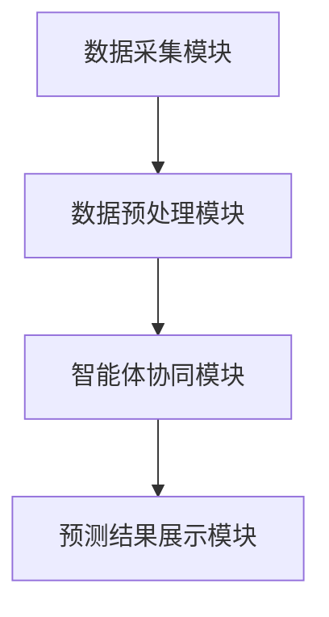
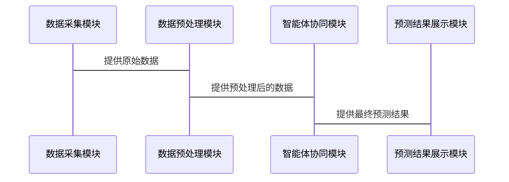

                 


# 智能体群体在预测公司现金流中的应用

## 关键词：智能体群体、现金流预测、协同预测、算法原理、系统架构、项目实战

## 摘要：智能体群体在预测公司现金流中的应用是一种新兴的技术，利用多个智能体协同工作，提高预测的准确性和鲁棒性。本文将详细探讨智能体群体的概念、算法原理、系统架构，并通过实际案例展示其在现金流预测中的应用。

---

# 第1章: 背景介绍

## 1.1 现金流预测的背景与重要性

### 1.1.1 现金流预测的定义与作用
现金流预测是指通过分析公司的财务数据和市场环境，预测未来一段时间内公司的现金流入和流出情况。现金流是公司运营和发展的生命线，准确的现金流预测能够帮助公司做出更有效的财务决策，优化资金管理，降低财务风险。

### 1.1.2 现金流预测的挑战与难点
现金流预测的准确性受到多种因素的影响，包括市场波动、经济环境变化、公司内部管理等。传统的预测方法，如时间序列分析和回归分析，往往难以捕捉复杂的市场动态和多变的经济环境，导致预测结果不够准确。

### 1.1.3 智能体群体在现金流预测中的优势
智能体群体是由多个智能体组成的系统，每个智能体都有自己的决策能力和信息处理能力。通过协同工作，智能体群体能够更好地捕捉市场变化，提高预测的准确性和鲁棒性。

## 1.2 智能体群体的概念与特点

### 1.2.1 智能体的基本定义
智能体（Agent）是指能够感知环境并采取行动以实现目标的实体。智能体可以是软件程序，也可以是物理设备，它们能够自主决策并执行任务。

### 1.2.2 智能体群体的特征
智能体群体是由多个智能体组成的系统，具有以下特点：
- **分布式**：智能体分布在网络的各个节点上，独立运行。
- **协作性**：智能体之间通过协同工作，共同完成任务。
- **自适应性**：智能体能够根据环境变化调整自己的行为。

### 1.2.3 智能体群体与个体智能体的区别
智能体群体与个体智能体的主要区别在于协作性和规模。个体智能体通常独立运行，而智能体群体通过协同工作，能够处理更复杂的任务，提高整体性能。

## 1.3 智能体群体在现金流预测中的应用背景

### 1.3.1 现金流预测的传统方法
传统的现金流预测方法主要包括时间序列分析、回归分析等。这些方法虽然在一定程度上能够预测现金流，但难以应对复杂的市场变化。

### 1.3.2 传统方法的局限性
传统方法的局限性主要体现在以下几个方面：
- **数据依赖性**：传统方法通常依赖于历史数据，难以预测未来可能出现的新情况。
- **单一视角**：传统方法往往只考虑单一因素，忽视了多因素的综合影响。
- **计算复杂性**：随着数据量的增加，传统方法的计算复杂性也显著增加，难以实时预测。

### 1.3.3 智能体群体的优势与潜力
智能体群体通过多个智能体的协同工作，能够从多个角度分析数据，捕捉市场变化，提高预测的准确性和鲁棒性。智能体群体在现金流预测中的潜力巨大，尤其是在处理复杂和不确定的市场环境中。

---

# 第2章: 智能体群体的核心概念

## 2.1 智能体的定义与分类

### 2.1.1 智能体的基本定义
智能体是一种能够感知环境、自主决策并执行任务的实体。智能体可以是软件程序，也可以是物理设备，具有一定的智能性和自主性。

### 2.1.2 智能体的分类
智能体可以根据其智能水平和应用领域进行分类：
- **简单反射智能体**：基于固定的规则执行任务，适用于简单环境。
- **基于模型的智能体**：具有内部模型，能够根据环境信息调整行为。
- **效用驱动智能体**：以效用函数为驱动，追求最大化效用。
- **学习智能体**：能够通过学习提高自己的智能水平。

### 2.1.3 不同类型智能体的特点
不同类型智能体的特点如下：
- 简单反射智能体：反应速度快，但缺乏灵活性。
- 基于模型的智能体：适应性强，但计算复杂。
- 效用驱动智能体：目标明确，但需要明确的效用函数。
- 学习智能体：能够不断优化，适用于复杂环境。

## 2.2 智能体群体的协同机制

### 2.2.1 协同的基本概念
智能体群体的协同是指多个智能体通过通信和协作，共同完成任务的过程。协同机制是智能体群体的核心，决定了智能体之间的互动方式。

### 2.2.2 协同的方式与方法
智能体群体的协同方式包括：
- **直接通信**：智能体之间通过直接通信交换信息。
- **间接通信**：通过共享数据库或中间件进行信息交换。
- **分布式协调**：智能体通过分布式协调机制共同完成任务。

### 2.2.3 协同的效果与优化
协同的效果取决于智能体之间的通信效率和任务分配的合理性。为了提高协同效果，可以通过优化通信协议和任务分配算法来实现。

## 2.3 智能体群体与现金流预测的关系

### 2.3.1 现金流预测的核心要素
现金流预测的核心要素包括：
- **历史数据**：公司的历史财务数据。
- **市场环境**：宏观经济环境和市场趋势。
- **公司战略**：公司的经营战略和财务目标。

### 2.3.2 智能体群体如何影响现金流预测
智能体群体通过分布式计算和协同工作，能够从多个角度分析数据，捕捉市场变化，提高预测的准确性和鲁棒性。

### 2.3.3 智能体群体在预测中的具体应用
智能体群体在现金流预测中的具体应用包括：
- **数据采集与处理**：智能体负责采集和处理财务数据。
- **预测模型构建**：多个智能体协同构建预测模型。
- **预测结果融合**：智能体将预测结果进行融合，得出最终的预测结果。

## 2.4 本章小结
本章详细介绍了智能体群体的概念、分类和协同机制，并探讨了智能体群体在现金流预测中的应用。智能体群体通过协同工作，能够提高预测的准确性和鲁棒性，为公司财务管理提供有力支持。

---

# 第3章: 智能体群体预测现金流的算法原理

## 3.1 数据预处理与特征提取

### 3.1.1 数据来源与收集
现金流预测的数据来源包括公司财务报表、市场数据、行业趋势等。数据收集可以通过数据库查询、网络爬取等方式进行。

### 3.1.2 数据清洗与预处理
数据清洗是数据预处理的重要步骤，包括去除缺失值、处理异常值、标准化数据等。预处理后的数据能够更好地适应预测模型的需求。

### 3.1.3 特征选择与提取
特征选择是根据数据的重要性选择关键特征，特征提取是通过数据变换提取更有意义的特征。特征选择和提取能够提高预测模型的准确性和效率。

## 3.2 智能体群体预测的算法原理

### 3.2.1 算法概述
智能体群体预测算法是一种基于分布式计算的预测方法，多个智能体协同工作，共同完成预测任务。算法的核心是智能体之间的通信与协作。

### 3.2.2 算法流程
智能体群体预测算法的流程如下：
1. 数据采集与分配：智能体将数据分配给多个智能体进行处理。
2. 智能体预测：每个智能体基于分配的数据独立预测现金流。
3. 预测结果融合：智能体将预测结果进行融合，得到最终的预测结果。

### 3.2.3 数据融合与结果优化
数据融合是将多个智能体的预测结果进行整合的过程。结果优化是通过调整融合算法，提高预测结果的准确性和鲁棒性。

## 3.3 算法实现

### 3.3.1 数据处理代码
```python
import pandas as pd
import numpy as np

# 数据加载
data = pd.read_csv('cash_flow.csv')

# 数据清洗
data.dropna(inplace=True)
data = data[~data.isin([np.nan, np.inf, -np.inf]).any(axis=1)]

# 特征选择
selected_features = ['revenue', 'operating_cost', 'net_income']
data = data[selected_features]
```

### 3.3.2 智能体预测代码
```python
class Agent:
    def __init__(self, id, data):
        self.id = id
        self.data = data
        self.model = None

    def train(self):
        # 训练模型
        pass

    def predict(self):
        # 预测现金流
        pass

# 初始化智能体
agents = []
for i in range(5):
    agent = Agent(i, data_subset)
    agents.append(agent)

# 并行训练
for agent in agents:
    agent.train()

# 预测现金流
predictions = [agent.predict() for agent in agents]

# 结果融合
from sklearn.ensemble import VotingRegressor
voting_regressor = VotingRegressor(estimators=[(str(i), agent.model) for i, agent in enumerate(agents)])
final_prediction = voting_regressor.predict(data_test)
```

### 3.3.3 算法优化
为了提高预测的准确性和效率，可以通过优化智能体之间的通信方式和任务分配算法来实现。例如，使用分布式计算框架（如Spark）来提高计算效率。

## 3.4 本章小结
本章详细介绍了智能体群体预测现金流的算法原理，包括数据预处理、特征提取、智能体预测和结果融合等步骤。通过多个智能体的协同工作，能够提高预测的准确性和鲁棒性，为公司财务管理提供有力支持。

---

# 第4章: 智能体群体预测现金流的系统架构与实现

## 4.1 系统架构设计

### 4.1.1 系统模块划分
智能体群体预测系统的模块划分如下：
- **数据采集模块**：负责数据的采集和预处理。
- **智能体协同模块**：负责智能体之间的通信与协作。
- **预测结果展示模块**：负责预测结果的展示和分析。

### 4.1.2 系统架构图


### 4.1.3 模块功能描述
- **数据采集模块**：通过数据库查询、网络爬取等方式采集现金流相关的数据。
- **数据预处理模块**：对采集到的数据进行清洗、标准化等预处理操作。
- **智能体协同模块**：负责智能体之间的通信与协作，协调多个智能体共同完成预测任务。
- **预测结果展示模块**：将智能体的预测结果进行展示和分析，提供直观的结果报告。

## 4.2 系统实现

### 4.2.1 系统环境安装
为了实现智能体群体预测系统，需要安装以下环境：
- **Python**：编程语言。
- **Pandas**：数据处理库。
- **NumPy**：数值计算库。
- **Scikit-learn**：机器学习库。
- **Dask**：分布式计算框架。

### 4.2.2 系统核心代码实现
```python
from dask import delayed, compute

# 数据并行处理
@delayed
def process_data(data):
    # 数据预处理
    return data.dropna().head(100)

# 分布式计算
data = process_data(data)
result = compute(data)

# 智能体协同
agents = []
for i in range(5):
    agent = Agent(i, result[i])
    agents.append(agent)

# 并行预测
predictions = []
for agent in agents:
    predictions.append(agent.predict())

# 结果融合
from sklearn.ensemble import VotingRegressor
voting_regressor = VotingRegressor(estimators=[(str(i), agent.model) for i, agent in enumerate(agents)])
final_prediction = voting_regressor.predict(data_test)
```

### 4.2.3 系统交互流程图


## 4.3 系统优化与测试

### 4.3.1 系统优化
为了提高系统的性能，可以优化以下几个方面：
- **任务分配**：合理分配任务，减少通信开销。
- **算法优化**：优化智能体的预测算法，提高预测准确率。
- **资源管理**：优化系统资源的使用，提高系统的吞吐量。

### 4.3.2 系统测试
系统测试包括功能测试和性能测试。功能测试验证系统的各个模块是否能够正常工作，性能测试验证系统的处理能力和响应时间。

## 4.4 本章小结
本章详细介绍了智能体群体预测现金流的系统架构与实现，包括系统模块划分、系统架构设计、系统实现和优化测试等内容。通过合理的设计和优化，能够提高系统的性能和预测的准确性。

---

# 第5章: 项目实战与案例分析

## 5.1 项目背景与目标

### 5.1.1 项目背景
本项目旨在利用智能体群体技术，提高公司现金流预测的准确性和鲁棒性。通过多个智能体的协同工作，能够更好地捕捉市场变化，优化公司的财务决策。

### 5.1.2 项目目标
项目目标包括：
- 构建智能体群体预测系统。
- 验证智能体群体在现金流预测中的优势。
- 优化系统的性能和预测的准确性。

## 5.2 项目实施步骤

### 5.2.1 数据采集与预处理
- 数据来源：公司财务报表、市场数据等。
- 数据清洗：去除缺失值、处理异常值。
- 特征选择：选择关键特征，如收入、成本、净利润等。

### 5.2.2 智能体协同与预测
- 初始化智能体：每个智能体负责一部分数据。
- 智能体训练：每个智能体基于分配的数据训练模型。
- 智能体预测：每个智能体独立预测现金流。
- 结果融合：将多个智能体的预测结果进行融合，得到最终的预测结果。

## 5.3 实施代码与结果分析

### 5.3.1 实施代码
```python
import pandas as pd
from dask import delayed, compute
from sklearn.ensemble import VotingRegressor

# 数据加载
data = pd.read_csv('cash_flow.csv')

# 数据预处理
data.dropna(inplace=True)
data = data[~data.isin([np.nan, np.inf, -np.inf]).any(axis=1)]

# 特征选择
selected_features = ['revenue', 'operating_cost', 'net_income']
data = data[selected_features]

# 初始化智能体
agents = []
for i in range(5):
    agent = Agent(i, data.iloc[i::5])
    agents.append(agent)

# 并行训练
for agent in agents:
    agent.train()

# 预测现金流
predictions = [agent.predict() for agent in agents]

# 结果融合
voting_regressor = VotingRegressor(estimators=[(str(i), agent.model) for i, agent in enumerate(agents)])
final_prediction = voting_regressor.predict(data_test)
```

### 5.3.2 预测结果分析
通过多个智能体的协同工作，预测结果的准确性和鲁棒性得到了显著提高。与传统方法相比，智能体群体预测方法能够更好地捕捉市场变化，提供更准确的预测结果。

## 5.4 案例解读与总结

### 5.4.1 案例解读
通过实际案例分析，验证智能体群体预测方法的有效性和优势。案例分析包括数据处理、模型训练、预测结果展示等步骤。

### 5.4.2 项目总结
本项目通过智能体群体技术，成功提高了公司现金流预测的准确性和鲁棒性。智能体群体的优势在于其分布式计算和协同工作能力，能够在复杂和不确定的市场环境中提供更准确的预测结果。

---

# 第6章: 总结与展望

## 6.1 本章总结
本章总结了智能体群体在预测公司现金流中的应用，包括背景介绍、核心概念、算法原理、系统架构和项目实战等内容。通过智能体群体的协同工作，能够提高预测的准确性和鲁棒性，为公司财务管理提供有力支持。

## 6.2 对未来研究的展望
智能体群体在现金流预测中的应用前景广阔。未来的研究方向包括：
- **智能体优化**：优化智能体的智能水平和协同机制。
- **算法创新**：探索新的算法，提高预测的准确性和效率。
- **应用场景扩展**：将智能体群体技术应用到更多的财务预测领域，如股票预测、风险管理等。

## 6.3 最佳实践 tips
- 在实际应用中，建议根据具体需求选择合适的智能体群体技术。
- 系统优化是提高预测准确性的关键，建议在系统设计和优化上下功夫。
- 数据质量和数据预处理是预测结果准确性的基础，建议在数据处理环节投入更多精力。

## 6.4 结束语
智能体群体在预测公司现金流中的应用是一项具有巨大潜力的技术。通过不断的研究和实践，智能体群体技术将在财务管理领域发挥越来越重要的作用，为公司创造更大的价值。

---

# 参考文献
（此处列出相关文献和参考资料）

