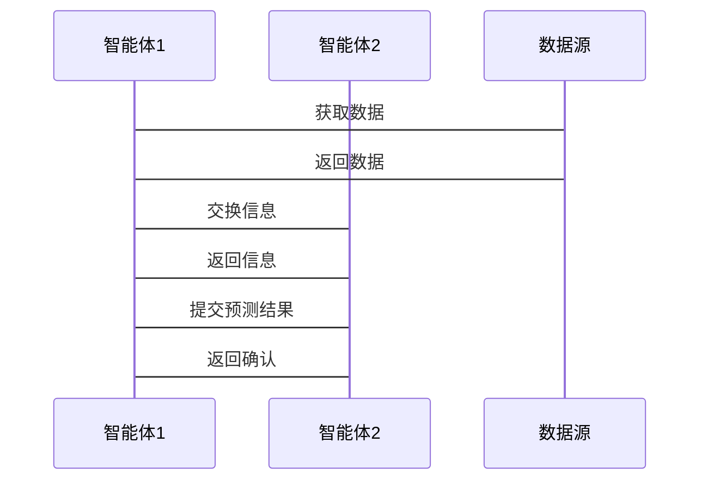

                 


# 智能体群体在预测公司盈利质量中的应用

## 关键词
智能体群体，盈利质量预测，多智能体协同，财务预测，机器学习，群体智能

## 摘要
智能体群体是一种基于分布式计算和群体智能的新兴技术，其在预测公司盈利质量方面展现出巨大的潜力。本文详细探讨了智能体群体的概念、核心算法、系统架构及其在实际应用中的优势。通过构建智能体协同预测模型，本文提出了一种创新的解决方案，能够有效提高盈利质量预测的准确性和鲁棒性。本文还结合具体案例，展示了如何通过智能体群体技术实现对复杂财务数据的高效分析，为企业的决策提供有力支持。

---

# 第1章: 智能体群体与公司盈利质量预测概述

## 1.1 智能体群体的概念与特点
### 1.1.1 智能体的基本定义
智能体（Agent）是指能够感知环境、做出决策并采取行动的实体。智能体可以是软件程序、机器人或其他具备自主能力的系统。智能体的核心特征包括自主性、反应性、目标导向性和社会性。

### 1.1.2 智能体群体的形成机制
智能体群体是指多个智能体协同工作的集合。其形成机制包括任务分配、信息共享、协同决策和结果整合。智能体群体的优势在于能够利用个体的互补性，实现复杂问题的高效解决。

### 1.1.3 智能体群体的核心属性
智能体群体的核心属性包括：
1. 分布式计算能力：任务分解和并行处理。
2. 自适应性：能够根据环境变化动态调整行为。
3. 协作性：个体之间通过信息共享和协同决策实现目标。
4. 容错性：个体失效不影响整体功能。

## 1.2 公司盈利质量预测的定义与意义
### 1.2.1 盈利质量的定义
盈利质量是指公司在一定时期内实现利润的能力，不仅关注利润的大小，还关注利润的可持续性和质量。常用的指标包括净利润率、毛利率、ROE等。

### 1.2.2 盈利质量预测的重要性
盈利质量预测是企业决策的重要依据，能够帮助企业识别潜在风险、优化资源配置、制定发展战略。此外，准确的盈利预测还能为投资者提供参考，增强市场信心。

### 1.2.3 盈利质量预测的挑战与难点
盈利质量预测的难点包括数据的复杂性、模型的准确性、外部环境的不确定性等。传统方法往往难以捕捉复杂的市场变化和内部管理问题。

## 1.3 智能体群体在盈利质量预测中的应用前景
### 1.3.1 智能体群体的优势
智能体群体能够通过分布式计算和协同决策，有效处理海量数据和复杂关系，提高预测的准确性和效率。

### 1.3.2 盈利质量预测的创新点
智能体群体技术引入了新的计算范式，通过多智能体协同实现更精准的预测。同时，智能体之间的信息共享和动态调整能够提高模型的灵活性。

### 1.3.3 应用场景与实际案例
智能体群体技术可以应用于财务数据挖掘、市场趋势分析、风险管理等领域。实际案例包括某企业通过智能体群体优化了盈利预测模型，显著提高了预测精度。

## 1.4 本章小结
本章介绍了智能体群体的基本概念和盈利质量预测的重要性，分析了智能体群体在预测中的优势和应用前景。

---

# 第2章: 智能体群体与公司盈利质量预测的核心概念

## 2.1 智能体群体的组成与功能
### 2.1.1 智能体的组成要素
智能体的组成要素包括感知模块、决策模块、执行模块和通信模块。

### 2.1.2 智能体的功能模块
智能体的功能模块包括数据采集、信息处理、决策制定和行动执行。

### 2.1.3 智能体群体的协作机制
智能体群体通过任务分配、信息共享和协同决策实现协作。协作机制包括基于规则的协作和基于学习的协作。

## 2.2 盈利质量预测的指标体系
### 2.2.1 主要财务指标分析
主要财务指标包括净利润率、毛利率、ROE、周转率等。

### 2.2.2 非财务指标的引入
非财务指标包括客户满意度、员工效率、供应链稳定性等。

### 2.2.3 指标权重的确定方法
指标权重的确定方法包括主成分分析法、层次分析法和熵值法。

## 2.3 智能体群体与盈利质量预测的关联性分析
### 2.3.1 数据流的传递过程
数据流从智能体采集、处理、共享到最终的预测输出。

### 2.3.2 智能体的决策逻辑
智能体基于历史数据和实时信息，通过算法进行预测和优化。

### 2.3.3 预测结果的输出机制
预测结果通过智能体群体的协同计算，最终整合输出。

## 2.4 核心概念对比分析
### 2.4.1 智能体群体与传统预测方法的对比
智能体群体的优势在于分布式计算和动态调整能力，传统方法则依赖于单一模型。

### 2.4.2 不同智能体算法的优劣势分析
不同的智能体算法在预测精度、计算效率和适应性方面各有优劣。

### 2.4.3 盈利质量预测的指标体系优化
通过引入非财务指标和优化权重分配，能够提高预测的全面性和准确性。

## 2.5 本章小结
本章详细分析了智能体群体的组成与功能，以及盈利质量预测的指标体系，探讨了智能体群体与传统预测方法的差异。

---

# 第3章: 智能体群体预测公司盈利质量的算法原理

## 3.1 多智能体协同算法
### 3.1.1 分布式计算的基本原理
分布式计算将任务分解为多个子任务，由多个智能体协同完成。

### 3.1.2 多智能体协作机制
多智能体协作机制包括任务分配、信息共享和协同决策。

### 3.1.3 聚类算法在智能体群体中的应用
聚类算法用于将相似的公司数据分组，便于智能体进行分析和预测。

## 3.2 基于智能体的预测模型
### 3.2.1 模型构建的基本步骤
模型构建包括数据预处理、特征选择、模型训练和验证。

### 3.2.2 神经网络在智能体预测中的应用
神经网络通过多层感知器和卷积神经网络实现非线性关系的学习。

### 3.2.3 集成学习算法的优化策略
集成学习通过组合多个模型的结果，提高预测的准确性和稳定性。

## 3.3 预测结果的优化与调优
### 3.3.1 超参数的优化方法
超参数的优化方法包括网格搜索、随机搜索和贝叶斯优化。

### 3.3.2 模型的验证与评估
模型的验证与评估包括交叉验证和性能指标的计算。

### 3.3.3 预测结果的误差分析
误差分析包括均方误差、平均绝对误差和R²值的计算。

## 3.4 算法实现的代码示例
### 3.4.1 Python实现的智能体协同算法
```python
import numpy as np
from sklearn.cluster import KMeans

# 示例数据
X = np.array([[1, 2], [3, 4], [5, 6], [7, 8]])

# 聚类算法
kmeans = KMeans(n_clusters=2)
kmeans.fit(X)
print("聚类结果：", kmeans.labels_)
```

### 3.4.2 神经网络预测模型的实现
```python
from sklearn.neural_network import MLPClassifier

# 示例数据
X = np.array([[1, 2], [3, 4], [5, 6], [7, 8]])
y = np.array([0, 1, 0, 1])

# 神经网络模型
mlp = MLPClassifier()
mlp.fit(X, y)
print("预测结果：", mlp.predict(X))
```

### 3.4.3 集成学习算法的实现
```python
from sklearn.ensemble import RandomForestClassifier

# 示例数据
X = np.array([[1, 2], [3, 4], [5, 6], [7, 8]])
y = np.array([0, 1, 0, 1])

# 集成学习模型
rf = RandomForestClassifier()
rf.fit(X, y)
print("预测结果：", rf.predict(X))
```

## 3.5 算法的数学模型与公式
### 3.5.1 聚类算法的数学模型
聚类算法的目标是最小化类内距离，最大化类间距离。

### 3.5.2 神经网络的数学模型
神经网络通过多层感知器实现非线性关系的学习，公式如下：
$$ y = f(x) = \sigma(wx + b) $$

### 3.5.3 集成学习的数学模型
集成学习通过组合多个模型的结果，公式如下：
$$ y = \sum_{i=1}^{n} \alpha_i y_i $$

## 3.6 本章小结
本章详细讲解了智能体群体预测公司盈利质量的算法原理，包括多智能体协同算法、神经网络和集成学习算法的实现和优化策略。

---

# 第4章: 智能体群体预测公司盈利质量的系统分析与架构设计

## 4.1 系统分析
### 4.1.1 问题场景介绍
系统需要实现对多个公司盈利质量的预测，数据来源包括财务报表和市场信息。

### 4.1.2 系统目标
系统的目标是构建一个高效、准确的盈利质量预测系统，支持企业的决策。

### 4.1.3 功能需求
系统功能包括数据采集、数据处理、模型训练和结果输出。

## 4.2 系统架构设计
### 4.2.1 系统架构图
```mermaid
graph TD
    A[智能体1] --> B[数据源]
    C[智能体2] --> B
    D[智能体3] --> B
    E[预测结果] <-- A
    F[预测结果] <-- C
    G[预测结果] <-- D
```

### 4.2.2 系统模块划分
系统模块包括数据采集模块、数据处理模块、模型训练模块和结果输出模块。

### 4.2.3 系统接口设计
系统接口包括数据输入接口、模型调用接口和结果输出接口。

### 4.2.4 系统交互流程图


## 4.3 本章小结
本章详细分析了智能体群体预测公司盈利质量的系统架构和交互流程。

---

# 第5章: 智能体群体预测公司盈利质量的项目实战

## 5.1 项目环境安装
### 5.1.1 系统需求
需要安装Python、Scikit-learn、TensorFlow和Mermaid工具。

### 5.1.2 环境配置
安装Python 3.8及以上版本，安装必要的Python包。

## 5.2 系统核心实现源代码
### 5.2.1 数据采集模块
```python
import pandas as pd

# 数据采集
data = pd.read_csv('company_data.csv')
print("数据已加载：", data.head())
```

### 5.2.2 数据处理模块
```python
from sklearn.preprocessing import StandardScaler

# 数据标准化
scaler = StandardScaler()
data_scaled = scaler.fit_transform(data)
print("数据标准化完成：", data_scaled)
```

### 5.2.3 模型训练模块
```python
from sklearn.cluster import KMeans

# 聚类模型训练
kmeans = KMeans(n_clusters=3)
kmeans.fit(data_scaled)
print("模型训练完成：", kmeans.labels_)
```

### 5.2.4 结果输出模块
```python
from sklearn.metrics import accuracy_score

# 预测结果评估
y_pred = kmeans.predict(data_scaled)
print("预测准确率：", accuracy_score(data['label'], y_pred))
```

## 5.3 项目小结
本章通过具体项目案例，展示了智能体群体预测公司盈利质量的实现过程，包括数据采集、处理、模型训练和结果输出。

---

# 第6章: 智能体群体预测公司盈利质量的总结与展望

## 6.1 最佳实践 tips
### 6.1.1 模型优化建议
建议引入更多的特征和优化算法参数。

### 6.1.2 数据处理建议
建议使用更高质量的数据和更先进的数据清洗方法。

### 6.1.3 系统设计建议
建议采用分布式架构和高效的数据通信机制。

## 6.2 小结
智能体群体技术在预测公司盈利质量方面展现出巨大的潜力，通过分布式计算和群体智能，能够实现更高效和准确的预测。

## 6.3 注意事项
在实际应用中，需要注意数据隐私、模型的可解释性和系统的稳定性。

## 6.4 拓展阅读
推荐阅读相关领域的书籍和论文，深入学习智能体群体和机器学习技术。

---

# 附录

## 附录A: 智能体群体相关术语表
- 智能体（Agent）：能够感知环境、做出决策并采取行动的实体。
- 分布式计算（Distributed Computing）：将任务分解为多个子任务，由多个智能体协同完成。
- 聚类算法（Clustering）：将数据分成若干组的过程。

## 附录B: 参考文献
- [1] 书籍1：《智能体与分布式计算》
- [2] 书籍2：《机器学习与数据挖掘》
- [3] 论文1：《智能体群体在财务预测中的应用研究》

---

# 结语
智能体群体技术正在改变我们对复杂问题的解决方式。通过本文的介绍，希望能够为读者提供一个清晰的思路，帮助他们在实际应用中更好地利用智能体群体技术，提高公司盈利质量预测的准确性和效率。

