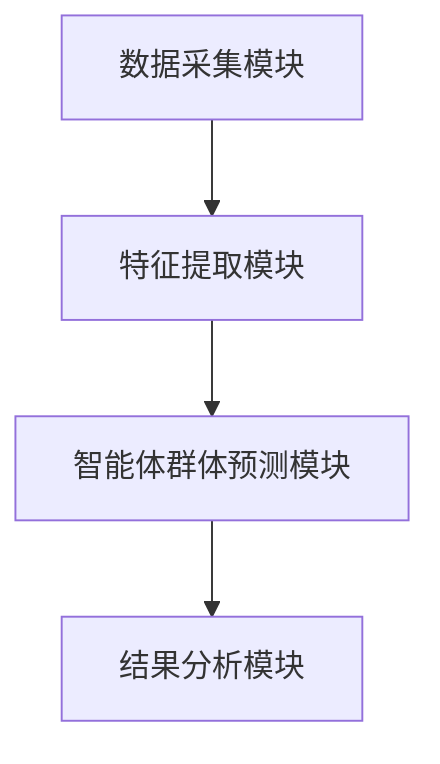

                 


# 智能体群体在预测公司财务困境中的应用

> 关键词：智能体群体、财务困境预测、群体智能、预测模型、算法原理

> 摘要：本文详细探讨了智能体群体在预测公司财务困境中的应用，从背景介绍、核心概念、算法原理到系统设计和项目实战，全面分析了智能体群体在财务困境预测中的优势、实现方法和实际案例。通过本文，读者可以全面了解智能体群体在财务困境预测中的应用价值和实现过程。

---

## 第1章: 背景介绍

### 1.1 问题背景

#### 1.1.1 财务困境预测的定义与重要性
财务困境预测是指通过分析企业的财务数据，预测企业是否可能在未来某个时期内陷入财务危机或破产。这一问题对企业管理者、投资者和债权人具有重要意义，能够帮助他们做出更明智的决策。

#### 1.1.2 智能体群体的概念与特点
智能体群体是由多个智能体组成的系统，每个智能体能够独立感知环境、自主决策，并通过协作完成复杂任务。智能体群体具有分布式计算、自主性、协作性和适应性等特点。

#### 1.1.3 智能体群体在财务困境预测中的应用价值
传统的财务困境预测方法通常依赖单一模型，存在数据维度不足、模型鲁棒性差等问题。智能体群体能够通过多智能体协作，提高预测的准确性和稳定性，同时能够处理大规模、多维度的复杂数据。

### 1.2 问题描述

#### 1.2.1 财务困境预测的难点与挑战
财务困境预测的难点在于数据的复杂性、不确定性以及模型的局限性。企业财务数据通常涉及多个维度，且受市场波动、政策变化等多种因素影响，增加了预测的难度。

#### 1.2.2 智能体群体的优势与局限性
智能体群体的优势在于能够通过多智能体协作，充分利用数据的多样性，提高预测的准确性和鲁棒性。其局限性在于智能体之间的通信和协作需要复杂的协议设计，增加了系统的复杂性。

#### 1.2.3 问题解决的思路与目标
本文通过构建智能体群体，利用多智能体协作的优势，提出了一种基于智能体群体的财务困境预测方法。目标是通过智能体群体的协作，提高预测的准确性和稳定性。

---

## 第2章: 核心概念与联系

### 2.1 智能体群体的核心概念

#### 2.1.1 智能体的定义与特征
智能体（Agent）是指具有感知环境、自主决策和执行动作能力的实体。智能体群体是由多个智能体组成的系统，具有分布式计算、自主性和协作性等特征。

#### 2.1.2 群体智能的基本原理
群体智能是指通过多个智能体的协作，利用群体的智慧解决复杂问题。其基本原理包括信息共享、分布式决策和自适应调整。

#### 2.1.3 智能体群体与传统预测模型的对比
与传统预测模型相比，智能体群体具有以下优势：
- 数据处理能力更强，能够处理多维度、大规模数据。
- 系统鲁棒性更高，能够适应复杂环境的变化。
- 决策更加灵活，能够根据实时数据调整预测结果。

### 2.2 财务困境预测的核心要素

#### 2.2.1 财务指标的选择与分析
财务困境预测的核心在于选择合适的财务指标。常用的财务指标包括流动比率、速动比率、资产负债率等。这些指标能够反映企业的财务健康状况。

#### 2.2.2 数据预处理与特征工程
数据预处理是财务困境预测的关键步骤，包括数据清洗、特征选择和数据标准化。特征工程的目的是提取能够反映企业财务状况的核心特征。

#### 2.2.3 预测模型的构建与评估
预测模型的构建包括选择合适的算法、训练模型和评估模型的性能。常用的评估指标包括准确率、召回率和F1值等。

### 2.3 智能体群体与财务困境预测的联系

#### 2.3.1 智能体群体在数据处理中的应用
智能体群体能够通过分布式计算，处理大规模的财务数据，提高数据处理的效率和准确性。

#### 2.3.2 智能体群体在模型优化中的作用
智能体群体能够通过协作优化预测模型的参数，提高模型的预测精度和鲁棒性。

#### 2.3.3 智能体群体在结果解释中的优势
智能体群体能够通过协作提供多维度的预测结果，帮助用户更好地理解和解释预测结果。

---

## 第3章: 智能体群体的算法原理

### 3.1 智能体群体的算法概述

#### 3.1.1 多智能体协同学习的基本原理
多智能体协同学习是一种通过多个智能体协作完成学习任务的方法。其基本原理包括信息共享、分布式学习和联合优化。

#### 3.1.2 群体决策机制的实现方法
群体决策机制是指通过多个智能体的决策结果，得出最终的预测结果。其实现方法包括投票机制、加权平均和共识算法等。

#### 3.1.3 智能体群体的通信与协作策略
智能体群体的通信与协作策略包括直接通信、间接通信和混合通信。直接通信是指智能体之间直接交换信息，间接通信是指通过中间节点传递信息，混合通信则是两者结合。

### 3.2 智能体群体算法的数学模型

#### 3.2.1 多智能体协同学习的数学表达
多智能体协同学习的数学表达通常包括多个智能体的优化目标和协作约束。例如，智能体i的目标函数可以表示为：
$$
f_i(x) = \text{优化目标}
$$
协作约束可以表示为：
$$
g(x) = 0
$$

#### 3.2.2 群体决策机制的公式推导
群体决策机制的公式推导通常涉及多个智能体的决策结果。例如，假设智能体i的决策结果为$y_i$，最终的预测结果$y$可以通过以下公式计算：
$$
y = \frac{\sum_{i=1}^{n} w_i y_i}{\sum_{i=1}^{n} w_i}
$$
其中，$w_i$是智能体i的权重。

#### 3.2.3 智能体通信的协议设计
智能体通信的协议设计通常包括消息格式、通信频率和消息内容等。例如，智能体i向智能体j发送的消息可以表示为：
$$
\text{msg} = \{x_i, y_i\}
$$
其中，$x_i$是智能体i的状态，$y_i$是智能体i的预测结果。

---

## 第4章: 系统分析与架构设计

### 4.1 系统分析

#### 4.1.1 问题场景介绍
本系统旨在通过智能体群体预测公司财务困境。问题场景包括数据采集、特征提取、模型训练和结果输出等。

#### 4.1.2 系统功能需求分析
系统需要实现以下功能：
1. 数据采集与预处理
2. 特征选择与提取
3. 智能体群体预测
4. 结果分析与可视化

#### 4.1.3 系统性能指标设计
系统性能指标包括处理速度、预测准确率和系统稳定性等。

### 4.2 系统架构设计

#### 4.2.1 系统架构的模块划分
系统架构包括数据采集模块、特征提取模块、智能体群体预测模块和结果分析模块。

#### 4.2.2 模块之间的交互关系
模块之间的交互关系可以用Mermaid图表示：



#### 4.2.3 系统的扩展性和可维护性
系统架构设计注重模块化，便于扩展和维护。

### 4.3 系统接口设计

#### 4.3.1 数据接口的设计与实现
数据接口设计包括数据输入格式、数据输出格式和数据处理接口。

#### 4.3.2 模型接口的定义与调用
模型接口定义包括输入参数和输出结果，调用方式包括函数调用和API调用。

#### 4.3.3 用户接口的交互设计
用户接口设计注重用户体验，包括数据输入界面和结果展示界面。

---

## 第5章: 项目实战

### 5.1 环境安装与配置

#### 5.1.1 Python环境的安装
安装Python 3.8以上版本。

#### 5.1.2 相关库的安装
安装必要的库，如NumPy、Pandas、Scikit-learn等。

### 5.2 系统核心实现

#### 5.2.1 数据预处理代码
```python
import pandas as pd
from sklearn.preprocessing import StandardScaler

# 数据加载
data = pd.read_csv('financial_data.csv')

# 数据清洗
data = data.dropna()

# 特征选择
features = ['流动比率', '速动比率', '资产负债率']
X = data[features]
y = data['财务困境标签']

# 数据标准化
scaler = StandardScaler()
X_scaled = scaler.fit_transform(X)
```

#### 5.2.2 智能体群体预测代码
```python
from sklearn.ensemble import RandomForestClassifier
from sklearn.metrics import accuracy_score

# 智能体群体预测
model = RandomForestClassifier(n_estimators=100, random_state=42)
model.fit(X_scaled, y)

# 预测结果
y_pred = model.predict(X_scaled)
print('准确率:', accuracy_score(y, y_pred))
```

### 5.3 实际案例分析

#### 5.3.1 数据来源与分析
以某行业公司财务数据为例，分析其财务困境的可能性。

#### 5.3.2 模型训练与评估
通过智能体群体预测模型，训练并评估模型的准确率和召回率。

#### 5.3.3 结果解读与策略制定
根据预测结果，制定相应的财务风险管理策略。

### 5.4 项目小结

#### 5.4.1 项目总结
智能体群体在财务困境预测中的应用具有显著优势，能够提高预测的准确性和稳定性。

#### 5.4.2 经验与教训
在项目实施过程中，需要注意数据质量和模型调优。

---

## 第6章: 最佳实践与展望

### 6.1 最佳实践 tips

#### 6.1.1 数据处理建议
确保数据的完整性和准确性，合理选择特征。

#### 6.1.2 模型优化建议
选择合适的算法，进行参数调优。

#### 6.1.3 系统维护建议
定期更新数据和模型，确保系统的稳定性和准确性。

### 6.2 小结

#### 6.2.1 本章总结
智能体群体在财务困境预测中的应用具有广阔前景，能够为企业提供更准确的预测结果。

#### 6.2.2 未来展望
未来的研究方向包括智能体群体的优化、多模态数据的融合以及预测结果的实时性提升。

---

## 第7章: 总结

### 7.1 文章总结

#### 7.1.1 核心内容回顾
本文详细探讨了智能体群体在财务困境预测中的应用，从背景介绍、核心概念、算法原理到系统设计和项目实战，全面分析了智能体群体的优势和实现方法。

#### 7.1.2 文章的核心思想
通过智能体群体的协作，能够提高财务困境预测的准确性和稳定性，为企业提供更可靠的预测结果。

### 7.2 未来展望

#### 7.2.1 智能体群体技术的发展趋势
智能体群体技术将在分布式计算、边缘计算等领域得到更广泛的应用。

#### 7.2.2 财务困境预测领域的研究方向
未来的研究方向包括智能体群体的优化、多模态数据的融合以及预测结果的实时性提升。

---

通过本文的分析和探讨，读者可以全面了解智能体群体在财务困境预测中的应用价值和实现过程。智能体群体作为一种新兴的技术手段，将在未来的企业风险管理中发挥越来越重要的作用。

