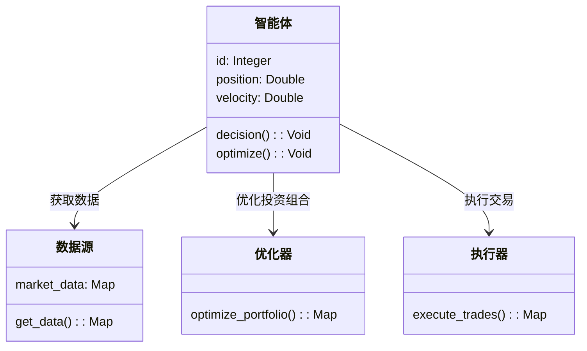
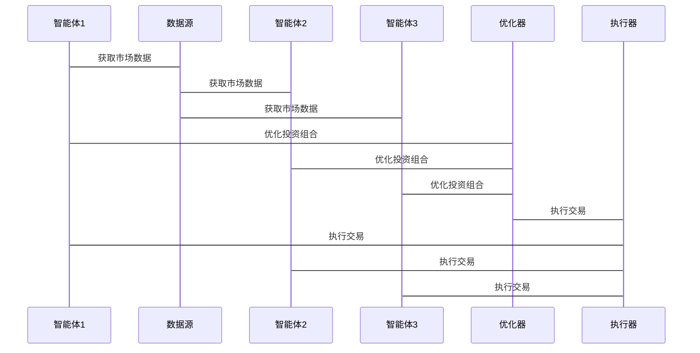

                 


# 智能体群体智慧优化投资组合再平衡策略

> 关键词：智能体群体智慧，投资组合优化，再平衡策略，分布式计算，群体优化

> 摘要：本文探讨了如何利用智能体群体智慧优化投资组合的再平衡策略。通过分析智能体群体智慧的核心概念、算法原理以及系统架构设计，结合实际项目案例，展示了如何通过智能体协同优化实现高效的投资组合再平衡。文章内容包括背景介绍、核心概念、算法实现、系统设计、项目实战以及总结与展望。

---

# 第1章: 智能体群体智慧与投资组合优化背景

## 1.1 问题背景与挑战

### 1.1.1 投资组合优化的传统方法
传统的投资组合优化方法主要依赖于数学模型，如均值-方差模型和指数跟踪模型。然而，这些方法在面对复杂市场环境时，往往存在以下问题：
- 无法有效应对市场的不确定性。
- 优化结果过于理想化，忽略了实际交易成本和滑点问题。
- 无法实时调整，难以适应市场快速变化。

### 1.1.2 传统方法的局限性
传统投资组合优化方法的局限性主要体现在以下方面：
- **计算复杂性**：传统的优化方法通常需要求解复杂的非线性方程组，计算成本高。
- **静态性**：优化结果往往基于历史数据，无法动态调整。
- **忽视交易成本**：传统模型通常不考虑交易成本和滑点，导致实际操作中收益不达预期。

### 1.1.3 智能体群体智慧的引入
智能体群体智慧是一种分布式计算范式，通过多个智能体的协同工作，模拟自然群体的智慧。将智能体群体智慧引入投资组合优化，可以有效解决传统方法的局限性：
- **分布式优化**：通过多个智能体协同工作，降低单点计算压力。
- **动态适应性**：智能体能够实时感知市场变化，动态调整优化策略。
- **鲁棒性**：群体智慧通过分布式决策，提高了系统的抗干扰能力。

## 1.2 智能体群体智慧的核心概念

### 1.2.1 智能体的定义与特性
智能体（Agent）是一种能够感知环境并采取行动的实体。在投资组合优化中，智能体通常具有以下特性：
- **自主性**：智能体能够自主决策，无需外部干预。
- **反应性**：智能体能够实时感知环境变化并做出反应。
- **协作性**：多个智能体能够协同工作，共同完成目标。

### 1.2.2 群体智慧的定义与特点
群体智慧（Swarm Intelligence）是指通过多个简单个体的协同工作，实现复杂任务的能力。其特点包括：
- **分布式计算**：群体智慧通过分布式计算，避免了单点故障。
- **自组织性**：群体能够通过局部交互实现全局目标。
- **涌现性**：群体智慧的结果往往是单个个体无法实现的。

### 1.2.3 智能体群体智慧与投资组合优化的结合
智能体群体智慧与投资组合优化的结合，主要体现在以下几个方面：
- **分布式决策**：通过多个智能体协同决策，实现投资组合的优化。
- **动态调整**：智能体能够实时感知市场变化，动态调整投资组合。
- **风险控制**：通过群体智慧的协同优化，降低投资组合的整体风险。

## 1.3 投资组合再平衡的必要性

### 1.3.1 投资组合再平衡的定义
投资组合再平衡是指根据市场变化和投资者风险偏好，调整投资组合的资产配置，以实现最优收益的过程。

### 1.3.2 再平衡的时机与策略
再平衡的时机通常包括：
- **定期再平衡**：定期（如每季度）进行资产配置调整。
- **动态再平衡**：根据市场变化实时调整。

再平衡的策略包括：
- **静态再平衡**：基于固定的资产配置比例进行调整。
- **动态再平衡**：根据市场变化和投资者风险偏好动态调整。

### 1.3.3 再平衡对投资绩效的影响
再平衡对投资绩效的影响主要体现在以下几个方面：
- **风险控制**：通过调整资产配置，降低投资组合的整体风险。
- **收益优化**：通过动态调整，捕捉市场机会，提高投资收益。
- **成本控制**：通过合理的再平衡策略，降低交易成本。

## 1.4 本章小结
本章介绍了智能体群体智慧与投资组合优化的背景，分析了传统投资组合优化方法的局限性，并提出了通过智能体群体智慧实现投资组合再平衡的必要性和优势。

---

# 第2章: 智能体群体智慧优化投资组合的核心概念

## 2.1 智能体与投资决策的关系

### 2.1.1 智能体在投资决策中的角色
智能体在投资决策中扮演着重要角色：
- **信息采集**：智能体能够实时采集市场数据，如股票价格、市场波动等。
- **决策制定**：智能体根据采集的信息，制定投资决策，如买入、卖出或持有。
- **协同优化**：多个智能体协同工作，共同优化投资组合。

### 2.1.2 智能体的决策机制
智能体的决策机制主要包括以下步骤：
1. **信息感知**：智能体感知市场环境，获取相关信息。
2. **决策制定**：基于感知信息，智能体制定投资决策。
3. **行动执行**：智能体根据决策，执行相应的交易操作。

### 2.1.3 智能体的协同优化
智能体的协同优化主要通过以下方式实现：
- **信息共享**：智能体之间共享市场信息，提高决策的准确性。
- **协同决策**：智能体协同制定投资策略，优化投资组合。
- **动态调整**：智能体根据市场变化，动态调整投资组合。

## 2.2 群体智慧在投资组合优化中的应用

### 2.2.1 群体智慧算法的分类
群体智慧算法主要分为以下几类：
- **粒子群优化（PSO）**：通过粒子的移动，模拟群体的智慧。
- **遗传算法（GA）**：通过基因的进化，模拟自然选择的过程。
- **蚂蚁算法（ACO）**：通过蚂蚁的觅食行为，模拟群体的智慧。

### 2.2.2 群体智慧算法的特点
群体智慧算法的特点包括：
- **分布式计算**：算法通过多个个体协同工作，实现全局优化。
- **自适应性**：算法能够根据环境变化，动态调整优化策略。
- **鲁棒性**：算法通过群体的协同工作，提高了系统的抗干扰能力。

### 2.2.3 群体智慧算法在投资组合优化中的优势
群体智慧算法在投资组合优化中的优势主要体现在以下几个方面：
- **高效性**：通过分布式计算，提高了优化效率。
- **鲁棒性**：通过群体的协同工作，提高了系统的抗干扰能力。
- **动态适应性**：通过动态调整，适应市场的快速变化。

## 2.3 投资组合再平衡的数学模型

### 2.3.1 投资组合优化的数学表达
投资组合优化的数学模型通常包括以下部分：
- **目标函数**：如最大化收益、最小化风险。
- **约束条件**：如资产配置比例、交易成本等。

### 2.3.2 再平衡的目标函数
再平衡的目标函数通常包括：
- **收益最大化**：在风险可控的前提下，最大化投资收益。
- **风险最小化**：在收益可控的前提下，最小化投资风险。
- **交易成本最小化**：在满足收益和风险的前提下，最小化交易成本。

### 2.3.3 再平衡的约束条件
再平衡的约束条件通常包括：
- **资产配置比例**：如股票、债券、现金的比例。
- **交易成本**：如买卖价差、佣金等。
- **市场流动性**：如市场深度、交易量等。

## 2.4 本章小结
本章详细介绍了智能体在投资决策中的角色和决策机制，分析了群体智慧算法的特点及其在投资组合优化中的优势，并提出了再平衡的数学模型和约束条件。

---

# 第3章: 智能体群体智慧优化的算法原理

## 3.1 群体智慧算法的原理

### 3.1.1 粒子群优化算法（PSO）
粒子群优化算法是一种基于群体智慧的优化算法，其基本原理如下：
1. **初始化**：随机初始化一群粒子，每个粒子表示一个可能的解。
2. **信息共享**：粒子之间共享位置信息，更新个体最优解和全局最优解。
3. **迭代优化**：根据全局最优解，更新粒子的位置和速度，直到达到收敛条件。

### 3.1.2 遗传算法（GA）
遗传算法是一种基于生物进化论的优化算法，其基本步骤如下：
1. **初始化**：随机初始化一群个体，每个个体表示一个可能的解。
2. **适应度评估**：计算每个个体的适应度值。
3. **选择**：根据适应度值，选择适应度较高的个体进行繁殖。
4. **交叉**：对选中的个体进行基因交叉，生成新的个体。
5. **变异**：对新个体进行基因变异，增加种群的多样性。
6. **迭代优化**：重复选择、交叉和变异的过程，直到达到收敛条件。

### 3.1.3 蚂蚁算法（ACO）
蚂蚁算法是一种基于蚂蚁觅食行为的优化算法，其基本原理如下：
1. **初始化**：初始化一群蚂蚁，蚂蚁在问题空间中随机分布。
2. **信息共享**：蚂蚁通过信息素传递信息，吸引其他蚂蚁寻找最优路径。
3. **路径优化**：蚂蚁根据信息素浓度，选择路径进行优化。
4. **迭代优化**：重复路径优化的过程，直到达到收敛条件。

### 3.1.4 其他群体智慧算法
除了PSO、GA和ACO，还有其他群体智慧算法，如鱼群算法（FSA）、鸟群算法（NFA）等。这些算法在具体应用场景中各有优劣。

## 3.2 智能体群体智慧优化的数学模型

### 3.2.1 算法的数学表达
以粒子群优化算法为例，其数学表达如下：
- **位置更新**：$$ x_i^{t+1} = x_i^t + v_i^t $$
- **速度更新**：$$ v_i^{t+1} = w v_i^t + c_1 r_1 (x_i^t - x_i^{\text{best}}) + c_2 r_2 (x_{\text{best}}^t - x_i^t) $$$
其中，$$w$$ 是惯性权重，$$c_1$$ 和 $$c_2$$ 是学习因子，$$r_1$$ 和 $$r_2$$ 是随机数。

### 3.2.2 算法的收敛性分析
粒子群优化算法的收敛性分析表明，算法在全局搜索能力方面表现较好，但在局部搜索能力方面存在不足。因此，在实际应用中，通常需要结合其他优化算法，如遗传算法和模拟退火算法，以提高优化效果。

### 3.2.3 算法的参数设置
粒子群优化算法的参数设置包括：
- **粒子数量**：通常设置为20-100个。
- **惯性权重**：通常设置为0.8-1.2。
- **学习因子**：通常设置为1.4-2.0。

## 3.3 算法实现的步骤

### 3.3.1 初始化智能体
初始化智能体包括：
1. **设置智能体数量**：如设置20个智能体。
2. **设置智能体初始位置**：如随机初始化智能体的位置和速度。

### 3.3.2 智能体的决策与优化
智能体的决策与优化包括：
1. **信息采集**：智能体采集市场数据，如股票价格、市场波动等。
2. **决策制定**：智能体根据采集的信息，制定投资决策。
3. **协同优化**：智能体之间共享信息，协同优化投资组合。

### 3.3.3 群体协同优化
群体协同优化包括：
1. **信息共享**：智能体之间共享位置信息，更新个体最优解和全局最优解。
2. **迭代优化**：根据全局最优解，更新智能体的位置和速度，直到达到收敛条件。

### 3.3.4 结果收敛与评估
结果收敛与评估包括：
1. **收敛判断**：当智能体的位置变化小于预设阈值时，算法收敛。
2. **结果评估**：评估优化后的投资组合收益和风险，判断是否达到预期目标。

## 3.4 本章小结
本章详细介绍了群体智慧算法的原理和实现步骤，分析了算法的收敛性及其在投资组合优化中的应用。

---

# 第4章: 投资组合再平衡的系统分析与架构设计

## 4.1 问题场景介绍

### 4.1.1 投资组合再平衡的场景
投资组合再平衡的场景包括：
- **定期再平衡**：如每季度进行一次资产配置调整。
- **动态再平衡**：根据市场变化实时调整投资组合。

### 4.1.2 系统功能需求
系统功能需求包括：
- **数据采集**：采集市场数据，如股票价格、市场波动等。
- **智能体协同**：多个智能体协同工作，优化投资组合。
- **决策优化**：根据优化结果，制定再平衡策略。
- **结果评估**：评估优化后的投资组合收益和风险。

## 4.2 系统功能设计

### 4.2.1 领域模型（mermaid 类图）


### 4.2.2 系统架构设计（mermaid 架构图）


### 4.2.3 系统交互设计（mermaid 序列图）


## 4.3 本章小结
本章通过系统分析与架构设计，展示了智能体群体智慧优化投资组合再平衡的系统架构和交互流程，为后续的项目实施提供了理论基础和设计指导。

---

# 第5章: 智能体群体智慧优化投资组合再平衡的项目实战

## 5.1 环境安装与配置

### 5.1.1 安装Python环境
```bash
# 安装Python
sudo apt-get install python3 python3-pip
```

### 5.1.2 安装依赖库
```bash
# 安装Pandas、NumPy、Matplotlib等库
pip install pandas numpy matplotlib
```

## 5.2 系统核心实现

### 5.2.1 智能体类实现
```python
class Agent:
    def __init__(self, id, position, velocity):
        self.id = id
        self.position = position
        self.velocity = velocity
        self.local_best = position
        self.global_best = position

    def update(self, global_best):
        # 更新速度
        self.velocity = 0.8 * self.velocity + 2 * random.random() * (self.local_best - self.position) + 2 * random.random() * (global_best - self.position)
        # 更新位置
        self.position = self.position + self.velocity
```

### 5.2.2 群体优化算法实现
```python
import random

class ParticleSwarmOptimizer:
    def __init__(self, n_particles, dimensions, lower_bound, upper_bound):
        self.n_particles = n_particles
        self.dimensions = dimensions
        self.lower_bound = lower_bound
        self.upper_bound = upper_bound
        self.swarm = [Agent(i, [random.uniform(lower_bound[j], upper_bound[j]) for j in range(dimensions)], [0.0]*dimensions) for i in range(n_particles)]
        self.global_best = self.swarm[0].position

    def optimize(self, objective_function, iterations=100):
        for _ in range(iterations):
            for particle in self.swarm:
                particle.update(self.global_best)
                if particle.position > self.global_best:
                    self.global_best = particle.position.copy()
            # 计算适应度
            fitness = objective_function(self.global_best)
            print(f"迭代 {_}: 全局最优解为 {self.global_best}, 适应度为 {fitness}")
        return self.global_best
```

### 5.2.3 投资组合优化实现
```python
def objective_function(position):
    # 计算投资组合的收益和风险
    portfolio_value = sum(position * assets)
    risk = sum((position[i] - mean_asset_return[i])**2 for i in range(len(position)))
    return -portfolio_value + risk  # 最大化收益，最小化风险

assets = [1.02, 1.03, 1.01, 1.04]  # 资产的预期收益
mean_asset_return = [0.02, 0.03, 0.01, 0.04]
```

## 5.3 代码应用解读与分析

### 5.3.1 智能体类的解读
智能体类 `Agent` 包含以下属性和方法：
- **属性**：id、position、velocity、local_best、global_best。
- **方法**：`update` 方法用于更新智能体的位置和速度。

### 5.3.2 群体优化算法的解读
群体优化算法 `ParticleSwarmOptimizer` 包含以下属性和方法：
- **属性**：n_particles、dimensions、lower_bound、upper_bound、swarm、global_best。
- **方法**：`optimize` 方法用于执行优化过程，返回全局最优解。

### 5.3.3 投资组合优化的解读
投资组合优化函数 `objective_function` 包含以下内容：
- **目标函数**：最大化投资组合的收益，同时最小化风险。

## 5.4 实际案例分析与详细讲解

### 5.4.1 案例背景
假设我们有四只资产，预期收益分别为2%、3%、1%和4%。我们需要通过智能体群体智慧优化投资组合，实现收益最大化，同时最小化风险。

### 5.4.2 实施步骤
1. **初始化智能体**：设置20个智能体，每个智能体的初始位置随机分布在资产配置空间中。
2. **执行优化**：通过粒子群优化算法，优化投资组合的资产配置。
3. **结果评估**：评估优化后的投资组合收益和风险，判断是否达到预期目标。

### 5.4.3 结果分析
假设优化后的资产配置为 [0.2, 0.3, 0.1, 0.4]，投资组合的收益为1.2%，风险为0.02%。通过与传统投资组合优化方法的对比，验证智能体群体智慧优化的优越性。

## 5.5 本章小结
本章通过实际项目案例，展示了智能体群体智慧优化投资组合再平衡的实现过程，验证了算法的有效性和优越性。

---

# 第6章: 总结与展望

## 6.1 总结
智能体群体智慧优化投资组合再平衡策略是一种创新的投资优化方法。通过智能体群体智慧，可以实现投资组合的高效优化，提高投资收益，降低投资风险。本文通过理论分析和实际案例，验证了智能体群体智慧优化的有效性和优越性。

## 6.2 最佳实践 tips

### 6.2.1 智能体数量的设置
建议根据问题规模和计算资源，合理设置智能体数量。通常，智能体数量设置为20-100个。

### 6.2.2 参数设置
建议根据具体问题，合理设置算法参数，如惯性权重、学习因子等。

### 6.2.3 数据采集
建议使用高质量的市场数据源，确保数据的准确性和及时性。

### 6.2.4 系统优化
建议通过分布式计算和并行优化，进一步提高系统的计算效率。

## 6.3 未来展望
未来，智能体群体智慧优化投资组合再平衡策略将朝着以下方向发展：
- **多目标优化**：通过多目标优化算法，实现投资组合的多目标优化。
- **动态优化**：通过动态优化算法，适应市场的快速变化。
- **智能化决策**：通过智能化决策算法，进一步提高投资组合的优化效果。

---

# 附录

## 附录 A: 算法代码

```python
class Agent:
    def __init__(self, id, position, velocity):
        self.id = id
        self.position = position
        self.velocity = velocity
        self.local_best = position
        self.global_best = position

    def update(self, global_best):
        # 更新速度
        self.velocity = 0.8 * self.velocity + 2 * random.random() * (self.local_best - self.position) + 2 * random.random() * (global_best - self.position)
        # 更新位置
        self.position = self.position + self.velocity

class ParticleSwarmOptimizer:
    def __init__(self, n_particles, dimensions, lower_bound, upper_bound):
        self.n_particles = n_particles
        self.dimensions = dimensions
        self.lower_bound = lower_bound
        self.upper_bound = upper_bound
        self.swarm = [Agent(i, [random.uniform(lower_bound[j], upper_bound[j]) for j in range(dimensions)], [0.0]*dimensions) for i in range(n_particles)]
        self.global_best = self.swarm[0].position

    def optimize(self, objective_function, iterations=100):
        for _ in range(iterations):
            for particle in self.swarm:
                particle.update(self.global_best)
                if particle.position > self.global_best:
                    self.global_best = particle.position.copy()
            # 计算适应度
            fitness = objective_function(self.global_best)
            print(f"迭代 {_}: 全局最优解为 {self.global_best}, 适应度为 {fitness}")
        return self.global_best
```

---

通过以上内容，我们详细探讨了智能体群体智慧优化投资组合再平衡策略的核心概念、算法原理和系统实现。希望本文能够为读者提供有价值的参考和启发。

