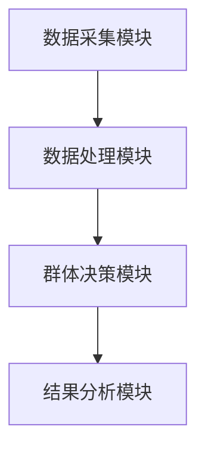

                 

# 智能体群体智慧在价值投资决策中的应用

## 关键词：智能体，群体智慧，价值投资，决策算法，投资组合优化

## 摘要：智能体群体智慧通过分布式计算和协作学习，优化投资决策过程。本文系统介绍其理论基础、算法实现和实际应用，涵盖数学模型、系统架构和项目实战，展示其在提升投资收益和风险管理中的潜力。

---

## 第一部分：智能体群体智慧概述

### 第1章：智能体与群体智慧基础

#### 1.1 智能体的基本概念
- **智能体定义**：智能体是具备感知环境、做出决策并采取行动的实体。
- **群体智慧特点**：通过多个智能体协作，产生超越个体的集体智慧。
- **智能体与群体智慧的关系**：智能体是构建群体智慧的基本单元，群体智慧通过智能体的协作实现更复杂的决策。

#### 1.2 价值投资决策的背景与挑战
- **价值投资背景**：基于基本面分析，寻找被市场低估的投资标的。
- **传统投资决策的局限性**：信息处理能力有限，难以应对复杂市场变化。
- **智能体群体智慧的应用前景**：通过分布式计算和协作学习，优化投资决策过程。

---

## 第二部分：智能体群体智慧的核心概念

### 第2章：智能体的行为模型

#### 2.1 智能体的行为机制
- **感知环境**：通过数据采集模块获取市场信息。
- **决策制定**：基于算法计算出最优行动方案。
- **行动执行**：根据决策结果进行投资操作。

#### 2.2 群体决策机制
- **信息共享**：智能体之间共享市场数据和分析结果。
- **共识形成**：通过投票机制达成一致决策。
- **动态调整**：根据市场变化实时更新决策策略。

### 第3章：群体智慧的数学模型

#### 3.1 群体决策的数学表达
- **单个智能体决策函数**：$D_i = f(x_i)$，其中$x_i$是第i个智能体的输入数据。
- **群体决策组合函数**：$D_{group} = \sum_{i=1}^{n} w_i D_i$，$w_i$是权重系数。
- **群体共识模型**：$C = \arg\max(D_1, D_2, ..., D_n)$，选出最大值作为共识决策。

#### 3.2 群体智慧的优化算法
- **加权投票算法**：每个智能体的投票权根据其历史表现加权。
- **融合算法**：将多个智能体的决策结果进行加权融合。
- **自适应算法**：根据市场环境动态调整权重系数。

---

## 第三部分：智能体群体智慧的算法原理

### 第4章：算法实现与优化

#### 4.1 基础算法介绍
- **分布式计算算法**：任务分解到多个智能体，分别处理后汇总结果。
- **聚类算法**：基于相似性将市场数据分成若干簇，进行分类决策。
- **协作算法**：智能体之间协作完成复杂任务，如数据采集和分析。

#### 4.2 群体决策算法
- **加权投票算法**：智能体根据权重进行投票，最终决策为加权和。
- **融合算法**：将多个决策结果进行加权融合，得到最终决策。
- **自适应算法**：根据市场变化动态调整权重系数，优化决策过程。

#### 4.3 算法实现与优化
- **实现步骤**：数据采集→预处理→算法计算→结果融合→决策输出。
- **优化策略**：动态调整权重系数，引入机器学习模型提升准确性。
- **性能评估**：通过准确率、召回率等指标评估算法效果。

---

## 第四部分：智能体群体智慧的系统架构设计

### 第5章：系统架构设计

#### 5.1 系统功能模块设计
- **数据采集模块**：实时采集市场数据，如股票价格、财务指标等。
- **数据处理模块**：对数据进行清洗、转换和特征提取。
- **群体决策模块**：实现智能体之间的信息共享和群体决策。
- **结果分析模块**：分析决策结果，评估投资收益和风险。

#### 5.2 系统架构图

#### 5.3 系统接口设计
- **数据接口**：与数据源（如股票数据库）对接，获取实时数据。
- **决策接口**：与其他系统（如交易系统）交互，执行投资决策。
- **用户接口**：提供可视化界面，供用户查看决策结果和分析报告。

---

## 第五部分：智能体群体智慧的项目实战

### 第6章：项目实战

#### 6.1 环境安装
- **工具安装**：安装Python、Pandas、Matplotlib等工具。
- **数据获取**：通过API获取股票数据，如Yahoo Finance。

#### 6.2 系统实现
- **数据预处理**：清洗数据，提取有用的特征。
- **算法实现**：实现加权投票算法，完成群体决策。
- **结果分析**：绘制收益曲线，评估算法效果。

#### 6.3 实际案例分析
- **案例背景**：选取某段时间的股票数据，测试算法效果。
- **算法表现**：比较传统投资策略与群体智慧策略的收益和风险。
- **结果解读**：分析群体智慧策略的优势和局限性。

---

## 第六部分：总结与展望

### 6.1 总结
- **核心优势**：智能体群体智慧通过分布式计算和协作学习，提升投资决策的准确性和鲁棒性。
- **实际应用**：在投资组合优化、风险管理等领域展现出巨大潜力。

### 6.2 展望
- **未来研究方向**：探索更高效的算法，如深度学习在群体决策中的应用。
- **技术发展趋势**：随着AI和大数据技术的发展，智能体群体智慧在金融领域的应用将更加广泛。

---

## 第七部分：最佳实践与注意事项

### 7.1 最佳实践
- **数据质量**：确保数据准确、完整，避免噪声干扰。
- **算法选择**：根据具体场景选择合适的算法，避免盲目应用。
- **结果验证**：通过回测和实证分析，验证算法的有效性。

### 7.2 注意事项
- **模型过拟合**：避免算法在特定数据集上过拟合，影响泛化能力。
- **计算资源**：群体智慧算法需要大量计算资源，需做好硬件准备。
- **风险管理**：智能体决策可能带来更高风险，需建立风险控制机制。

---

## 参考文献
（此处列出相关文献和资源）

---

通过以上详细的内容，可以系统地了解智能体群体智慧在价值投资中的应用，从理论到实践，逐步深入，为投资决策提供新的思路和方法。

