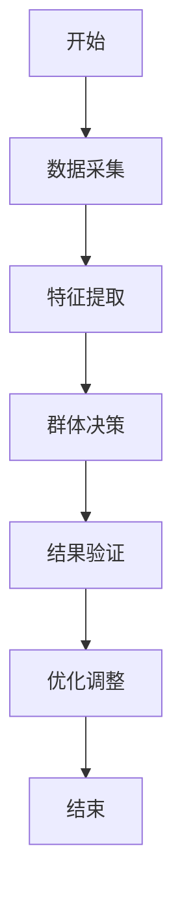
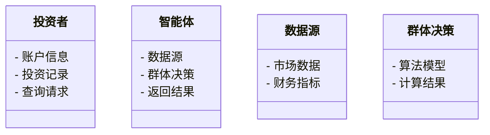
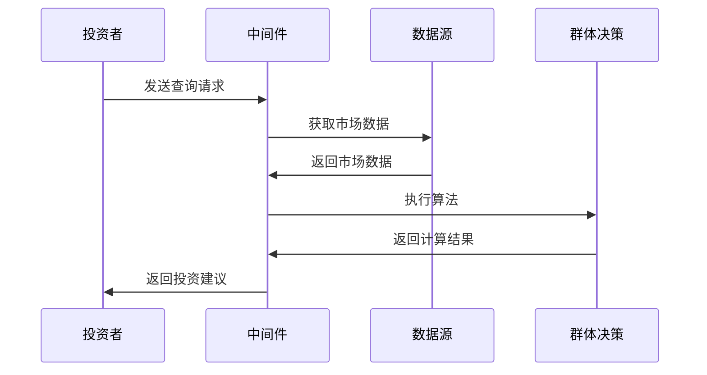

                 


# 智能体群体智慧在识别价值陷阱中的应用：避免投资误区

> 关键词：智能体、群体智慧、价值陷阱、投资误区、算法原理、系统架构、项目实战

> 摘要：智能体群体智慧在识别价值陷阱中的应用：避免投资误区。本文详细探讨了智能体群体智慧在投资分析中的作用，通过算法原理、系统架构和项目实战，展示了如何利用群体智慧避免投资误区，提升投资决策的准确性。

---

## 目录大纲

1. **摘要**  
2. **关键词**  
3. **目录**

---

# 第一部分: 背景介绍

## 第1章: 问题背景与描述

### 1.1 问题背景
#### 1.1.1 价值陷阱的定义与特征
价值陷阱是指那些表面上看似具有吸引力，但实际上存在隐藏风险或不合理的投资机会。投资者可能因信息不对称、情绪影响或分析不足而误判，导致投资损失。

#### 1.1.2 传统投资分析的局限性
传统投资分析依赖于个体经验和数据处理，存在主观性高、信息处理不全等问题。个体投资者容易受到情绪影响，难以全面捕捉市场变化。

#### 1.1.3 智能体群体智慧的引入
智能体群体智慧通过多个智能体的协同工作，利用数据驱动的方法，提供更全面的分析和决策支持，帮助投资者识别价值陷阱。

### 1.2 问题描述
#### 1.2.1 价值陷阱的识别难点
价值陷阱的识别需要全面的数据分析和多维度的考量，个体投资者往往难以做到。

#### 1.2.2 投资者误区的常见类型
包括过度自信、从众心理、信息过滤等，这些误区可能导致投资者误判市场情况。

#### 1.2.3 群体智慧在投资决策中的潜力
通过多个智能体协同工作，群体智慧可以弥补个体分析的不足，提供更全面的市场洞察。

## 第2章: 问题解决与边界

### 2.1 智能体群体智慧的解决方案
#### 2.1.1 智能体的基本概念
智能体是指能够感知环境、自主决策并执行任务的实体，可以是软件程序或算法。

#### 2.1.2 群体智慧的实现机制
通过多个智能体的协同工作，利用数据共享和信息整合，形成集体智慧，提高决策的准确性。

#### 2.1.3 价值陷阱识别的算法框架
基于群体智慧的算法，通过数据挖掘和机器学习，识别潜在的价值陷阱。

### 2.2 边界与外延
#### 2.2.1 智能体群体智慧的应用范围
适用于股票、基金等金融产品的投资分析，帮助投资者识别潜在风险。

#### 2.2.2 与其他投资分析方法的对比
与传统分析方法相比，群体智慧更具数据驱动和全面性。

#### 2.2.3 未来可能的拓展方向
未来可能拓展至更多金融领域，如外汇、期货等，进一步提升投资决策的准确性。

---

# 第二部分: 核心概念与联系

## 第3章: 核心概念原理

### 3.1 智能体与群体智慧
#### 3.1.1 智能体的定义与属性
智能体具有感知、决策和执行能力，能够独立完成任务。

#### 3.1.2 群体智慧的特征与优势
群体智慧通过多个智能体的协同，能够发现个体无法察觉的模式和趋势。

#### 3.1.3 智能体在投资分析中的角色
智能体通过数据处理和模式识别，帮助投资者发现价值陷阱。

### 3.2 价值陷阱识别的数学模型
#### 3.2.1 模型的输入与输出
输入：市场数据、财务指标；输出：价值陷阱识别结果。

#### 3.2.2 关键参数的定义与计算
关键参数包括市盈率、市净率等，通过算法计算潜在风险。

#### 3.2.3 模型的验证与优化
通过历史数据验证模型准确性，不断优化算法以提高识别率。

## 第4章: 核心概念对比与ER关系图

### 4.1 智能体与传统投资分析的对比
#### 4.1.1 分析方法的对比
智能体采用数据驱动的群体智慧，传统方法依赖个体经验。

#### 4.1.2 数据处理的对比
智能体处理速度快、维度广，传统方法处理速度慢、维度有限。

#### 4.1.3 结果应用的对比
智能体结果更全面，传统方法结果更依赖个体判断。

### 4.2 ER实体关系图
```mermaid
er
actor:投资者
/--> 智能体:多个智能体
智能体 --> 数据源:市场数据
智能体 --> 群体决策:群体智慧输出
群体决策 --> 投资决策:最终决策
```

---

# 第三部分: 算法原理讲解

## 第5章: 算法原理与流程

### 5.1 算法流程图


### 5.2 算法实现
#### 5.2.1 数据预处理
对数据进行清洗和标准化处理，确保数据质量。

#### 5.2.2 特征提取与选择
提取关键特征，如市盈率、市净率等，用于后续分析。

#### 5.2.3 群体决策算法
使用机器学习算法，如随机森林、支持向量机等，进行群体决策。

#### 5.2.4 结果验证
通过历史数据验证算法准确性，调整参数优化性能。

---

# 第四部分: 系统分析与架构设计

## 第6章: 系统分析与架构设计

### 6.1 问题场景介绍
系统应用于金融投资领域，帮助投资者识别价值陷阱。

### 6.2 系统功能设计
#### 6.2.1 领域模型类图


### 6.3 系统架构设计
#### 6.3.1 系统架构图


#### 6.3.2 系统接口设计
接口定义：RESTful API，提供数据查询和结果返回功能。

#### 6.3.3 系统交互流程


---

# 第五部分: 项目实战

## 第7章: 项目实战

### 7.1 环境安装
安装Python、机器学习库（如scikit-learn）和可视化工具（如Matplotlib）。

### 7.2 系统核心实现
#### 7.2.1 核心代码实现
```python
import numpy as np
from sklearn.ensemble import RandomForestClassifier

# 数据预处理
data = np.array([...])
X = data[:, :-1]
y = data[:, -1]

# 群体决策算法
model = RandomForestClassifier()
model.fit(X, y)

# 预测结果
预测结果 = model.predict(X)
```

#### 7.2.2 代码功能解读
代码实现数据预处理、模型训练和预测，展示了群体智慧在投资分析中的应用。

### 7.3 实际案例分析
分析某股票的历史数据，识别潜在的价值陷阱，提供投资建议。

### 7.4 项目总结
项目成功展示了智能体群体智慧在投资分析中的应用，提高了识别价值陷阱的准确性。

---

# 第六部分: 最佳实践

## 第8章: 最佳实践

### 8.1 小结
智能体群体智慧在识别价值陷阱中的应用，通过数据驱动的方法，帮助投资者避免误区。

### 8.2 注意事项
投资者应结合市场变化和个体判断，合理使用群体智慧的分析结果。

### 8.3 拓展阅读
推荐相关书籍和论文，进一步学习智能体群体智慧的应用。

---

# 参考文献
[在此处列出参考文献]

---

通过以上步骤，我们可以系统地撰写一篇结构清晰、内容丰富的技术博客文章，详细探讨智能体群体智慧在识别价值陷阱中的应用，帮助投资者避免误区，提升投资决策的准确性。

