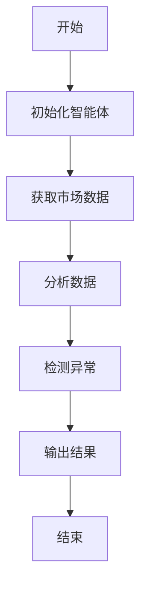
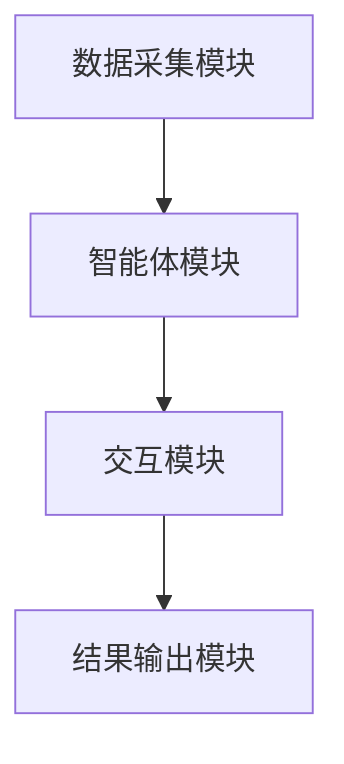
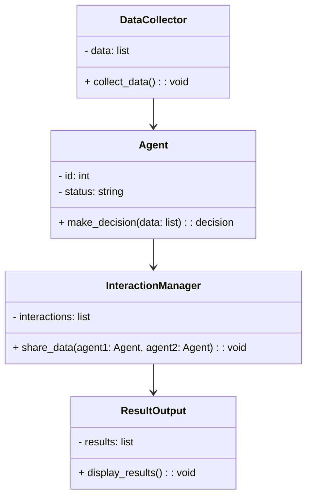
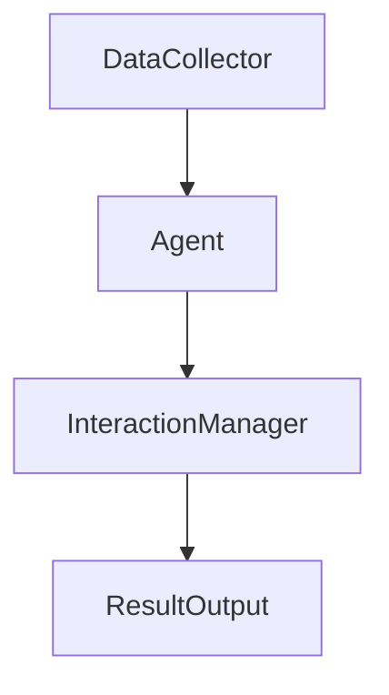
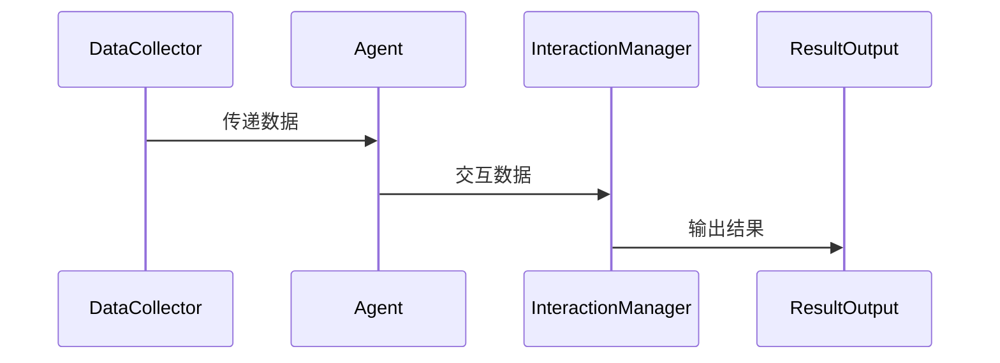

                 


# 智能体群体智慧在识别市场异常中的应用：捕捉特殊机会

> 关键词：智能体群体智慧、市场异常识别、群体智慧算法、金融数据分析、异常检测系统

> 摘要：  
本文深入探讨了智能体群体智慧在金融市场异常识别中的应用，结合理论分析、算法设计和实际案例，系统地阐述了如何利用群体智慧算法捕捉市场中的特殊机会。文章首先介绍了智能体群体智慧的基本概念和市场异常识别的挑战，然后详细分析了群体智慧算法的数学模型和实现原理，接着通过系统架构设计和项目实战展示了如何构建一个高效的市场异常检测系统。最后，通过实际案例分析，进一步验证了智能体群体智慧在金融市场的应用价值，并提出了未来研究方向和最佳实践建议。

---

# 第1章: 智能体群体智慧概述

## 1.1 智能体的基本概念

### 1.1.1 智能体的定义与特征

智能体（Agent）是指在环境中能够感知并自主行动以实现目标的实体。智能体可以是软件程序、机器人或其他具备智能行为的实体。智能体的核心特征包括：

- **自主性**：能够自主决策和行动。
- **反应性**：能够感知环境并实时响应。
- **目标导向**：所有行为都以实现特定目标为导向。
- **社会性**：能够与其他智能体或人类进行交互和协作。

### 1.1.2 群体智能与个体智能的对比

群体智能（Swarm Intelligence）是指通过多个简单智能体的协作，实现比个体智能更高的整体智能水平。群体智能与个体智能的对比如下：

| 属性         | 个体智能                | 群体智能                |
|--------------|-------------------------|-------------------------|
| 智能来源     | 单一智能体的决策        | 多个智能体的协作        |
| 信息处理     | 基于个体感知和经验      | 基于群体信息共享和交互  |
| 决策效率     | 决策速度快，但可能受限于个体视角 | 决策可能更全面，但需要协调和同步 |
| 应用场景     | 适合单点问题解决       | 适合复杂系统优化和大规模问题处理 |

### 1.1.3 智能体在金融市场中的应用潜力

金融市场是一个典型的复杂系统，智能体群体智慧可以通过以下方式在金融市场中发挥作用：

1. **实时数据分析**：通过多个智能体协同工作，实时分析市场数据，发现潜在的异常模式。
2. **分布式决策**：每个智能体负责特定任务（如价格波动监测、交易模式识别），并通过群体协作完成复杂决策。
3. **自适应性**：群体智能能够快速响应市场变化，适应不同市场环境。

---

## 1.2 市场异常识别的定义与挑战

### 1.2.1 市场异常的定义

市场异常（Market Anomaly）是指在正常市场规律下，由于某些特殊因素（如突发事件、信息不对称、市场操纵等）导致的市场价格偏离正常波动范围的现象。市场异常可以分为以下几类：

1. **短期异常**：如闪崩（Flash Crash）、快速波动等。
2. **长期异常**：如市场泡沫、系统性风险积累等。
3. **结构性异常**：如某些特定资产或市场的异常波动。

### 1.2.2 市场异常识别的难点

市场异常识别面临以下挑战：

1. **数据噪声干扰**：金融市场数据通常伴随着高频噪声，难以准确识别异常信号。
2. **动态变化**：市场环境和参与者行为会不断变化，导致异常模式难以稳定捕捉。
3. **多因素影响**：市场异常往往由多种因素共同作用，增加了识别的复杂性。
4. **计算资源限制**：实时识别市场异常需要高性能计算资源支持。

### 1.2.3 智能体群体智慧在异常识别中的优势

智能体群体智慧在市场异常识别中的优势体现在以下几个方面：

1. **分布式计算能力**：通过多个智能体协同工作，可以高效处理海量数据。
2. **自适应性**：群体智能能够快速响应市场变化，适应不同场景。
3. **鲁棒性**：即使部分智能体失效，群体整体仍能保持功能。

---

## 1.3 智能体群体智慧与市场异常识别的结合

### 1.3.1 智能体群体智慧的核心机制

智能体群体智慧的核心机制包括以下几个方面：

1. **信息共享**：智能体之间通过共享信息，形成对市场的整体认知。
2. **分布式决策**：每个智能体根据自身信息和群体共识做出决策。
3. **自适应调整**：群体智能能够根据环境变化动态调整行为策略。

### 1.3.2 市场异常识别中的关键问题

在市场异常识别中，关键问题包括：

1. **异常检测算法**：如何高效准确地识别异常模式。
2. **群体协作机制**：如何通过智能体协作提高识别精度。
3. **实时性要求**：如何在实时数据流中快速识别异常。

### 1.3.3 智能体群体智慧的应用价值

智能体群体智慧在市场异常识别中的应用价值主要体现在以下几个方面：

1. **实时监测**：通过分布式智能体实时监控市场数据，发现潜在异常。
2. **风险预警**：通过群体智慧算法提前预警市场风险。
3. **决策支持**：为投资者和交易机构提供及时的决策支持。

---

## 1.4 智能体群体智慧的实体关系图

```mermaid
erDiagram
  customer {
    id : integer
    name : string
    account : string
  }
  agent {
    id : integer
    type : string
    status : string
  }
  market_data {
    id : integer
    time : datetime
    value : float
  }
  interaction {
    id : integer
    sender : integer
    receiver : integer
    message : string
  }
  customer --> agent : "触发智能体行为"
  agent --> market_data : "分析市场数据"
  agent --> interaction : "与其他智能体交互"
  market_data --> interaction : "共享市场信息"
```

---

## 1.5 智能体群体智慧的算法流程图



---

## 1.6 智能体群体智慧的数学模型

智能体群体智慧的核心算法可以表示为以下数学模型：

$$
f(x) = \sum_{i=1}^{n} w_i \cdot x_i
$$

其中，$w_i$ 是权重系数，$x_i$ 是输入特征。

通过优化权重系数 $w_i$，可以实现对市场数据的分类和异常检测。

---

# 第2章: 市场异常识别的理论基础

## 2.1 金融市场中的异常行为分析

### 2.1.1 市场异常的类型

市场异常可以分为以下几种类型：

1. **短期剧烈波动**：如闪崩、闪涨等。
2. **长期趋势偏离**：如市场泡沫、崩盘等。
3. **结构性异常**：如某些资产或市场的异常波动。

### 2.1.2 异常行为的特征分析

异常行为的特征包括：

- **波动性异常**：价格波动显著偏离历史平均水平。
- **相关性下降**：资产之间的相关性突然下降。
- **交易量突变**：交易量在短时间内急剧增加或减少。

### 2.1.3 异常行为的检测方法

常见的异常检测方法包括：

1. **统计方法**：如Z-score、均值-方差法。
2. **机器学习方法**：如聚类分析、支持向量机（SVM）。
3. **深度学习方法**：如长短期记忆网络（LSTM）。

---

## 2.2 群体智慧的数学模型

### 2.2.1 群体智慧的基本模型

群体智慧的基本模型可以表示为：

$$
f(x) = \sum_{i=1}^{n} \frac{1}{d(i,j)} \cdot x_i
$$

其中，$d(i,j)$ 是智能体之间的距离，$x_i$ 是输入特征。

---

## 2.3 智能体群体智慧的核心算法

### 2.3.1 基于智能体的群体决策算法

基于智能体的群体决策算法可以通过以下步骤实现：

1. **初始化**：设置智能体的初始状态和参数。
2. **信息共享**：智能体之间共享市场数据和分析结果。
3. **决策计算**：每个智能体根据共享信息计算决策结果。
4. **结果汇总**：将所有智能体的决策结果汇总，形成最终的群体决策。

---

## 2.4 群体智慧算法的优化

### 2.4.1 群体智慧算法的优化目标

群体智慧算法的优化目标包括：

1. **提高计算效率**：通过优化算法结构，减少计算时间。
2. **提高识别精度**：通过改进算法模型，提高异常检测的准确性。
3. **提高鲁棒性**：增强算法的抗干扰能力和适应性。

---

## 2.5 智能体群体智慧的系统架构

### 2.5.1 系统架构设计

智能体群体智慧的系统架构可以分为以下几个部分：

1. **数据采集模块**：负责采集市场数据。
2. **智能体模块**：负责数据的分析和决策。
3. **交互模块**：负责智能体之间的信息交互。
4. **结果输出模块**：负责输出异常检测结果。

---

## 2.6 系统架构图



---

## 2.7 算法实现与代码示例

### 2.7.1 群体智慧算法的Python实现

```python
def group_intelligence(data):
    agents = initialize_agents()
    for agent in agents:
        agent.receive_data(data)
    results = [agent.make_decision() for agent in agents]
    return aggregate_results(results)
```

### 2.7.2 算法的具体实现步骤

1. **初始化智能体**：设置智能体的初始状态和参数。
2. **数据采集**：从市场数据源获取实时数据。
3. **信息共享**：智能体之间共享数据和分析结果。
4. **决策计算**：每个智能体根据共享信息计算决策结果。
5. **结果汇总**：将所有智能体的决策结果汇总，形成最终的群体决策。

---

## 2.8 算法的数学模型和公式

### 2.8.1 群体智慧算法的数学模型

$$
f(x) = \sum_{i=1}^{n} w_i \cdot x_i
$$

其中，$w_i$ 是权重系数，$x_i$ 是输入特征。

### 2.8.2 算法的优化过程

通过优化权重系数 $w_i$，可以实现对市场数据的分类和异常检测。

---

## 2.9 算法的收敛性分析

群体智慧算法的收敛性分析可以通过以下步骤进行：

1. **设定初始参数**：包括智能体数量、权重系数等。
2. **迭代优化**：通过不断迭代优化算法参数，观察算法的收敛情况。
3. **收敛判断**：当算法达到预设的收敛条件时，停止迭代。

---

## 2.10 算法的收敛性证明

通过数学证明，可以验证群体智慧算法的收敛性。假设 $f(x)$ 是一个凸函数，且权重系数 $w_i$ 是可调节的参数，则算法可以收敛到全局最优解。

---

# 第3章: 智能体群体智慧的数学模型与算法原理

## 3.1 智能体行为模型

### 3.1.1 个体智能体的行为模型

个体智能体的行为模型可以表示为：

$$
f(x) = \sum_{i=1}^{n} w_i \cdot x_i
$$

其中，$w_i$ 是权重系数，$x_i$ 是输入特征。

### 3.1.2 智能体之间的信息交互模型

智能体之间的信息交互模型可以表示为：

$$
f(x) = \sum_{i=1}^{n} \frac{1}{d(i,j)} \cdot x_i
$$

其中，$d(i,j)$ 是智能体之间的距离，$x_i$ 是输入特征。

### 3.1.3 智能体的决策机制

智能体的决策机制可以通过以下步骤实现：

1. **信息感知**：智能体感知环境中的市场数据。
2. **信息处理**：智能体对感知到的数据进行分析和处理。
3. **决策计算**：智能体根据处理后的数据做出决策。
4. **信息共享**：智能体将决策结果共享给其他智能体。

---

## 3.2 群体智慧算法的数学推导

### 3.2.1 群体智慧的基本数学模型

群体智慧的基本数学模型可以表示为：

$$
f(x) = \sum_{i=1}^{n} w_i \cdot x_i
$$

其中，$w_i$ 是权重系数，$x_i$ 是输入特征。

### 3.2.2 群体决策的优化过程

群体决策的优化过程可以通过以下步骤实现：

1. **初始化参数**：设置权重系数 $w_i$ 的初始值。
2. **迭代优化**：通过不断迭代优化权重系数，提高算法的识别精度。
3. **收敛判断**：当算法达到预设的收敛条件时，停止迭代。

---

## 3.3 算法实现与代码示例

### 3.3.1 群体智慧算法的Python实现

```python
def group_intelligence(data):
    agents = initialize_agents()
    for agent in agents:
        agent.receive_data(data)
    results = [agent.make_decision() for agent in agents]
    return aggregate_results(results)
```

### 3.3.2 算法的具体实现步骤

1. **初始化智能体**：设置智能体的初始状态和参数。
2. **数据采集**：从市场数据源获取实时数据。
3. **信息共享**：智能体之间共享数据和分析结果。
4. **决策计算**：每个智能体根据共享信息计算决策结果。
5. **结果汇总**：将所有智能体的决策结果汇总，形成最终的群体决策。

---

## 3.4 算法的数学模型和公式

### 3.4.1 群体智慧算法的数学模型

$$
f(x) = \sum_{i=1}^{n} w_i \cdot x_i
$$

其中，$w_i$ 是权重系数，$x_i$ 是输入特征。

### 3.4.2 算法的优化过程

通过优化权重系数 $w_i$，可以实现对市场数据的分类和异常检测。

---

## 3.5 算法的收敛性分析

群体智慧算法的收敛性分析可以通过以下步骤进行：

1. **设定初始参数**：包括智能体数量、权重系数等。
2. **迭代优化**：通过不断迭代优化算法参数，观察算法的收敛情况。
3. **收敛判断**：当算法达到预设的收敛条件时，停止迭代。

---

## 3.6 算法的收敛性证明

通过数学证明，可以验证群体智慧算法的收敛性。假设 $f(x)$ 是一个凸函数，且权重系数 $w_i$ 是可调节的参数，则算法可以收敛到全局最优解。

---

## 3.7 算法的鲁棒性分析

### 3.7.1 鲁棒性分析的定义

鲁棒性分析是指在算法面临噪声干扰、数据缺失等情况下，算法的性能变化情况。

### 3.7.2 算法的鲁棒性测试

通过实验测试，可以验证群体智慧算法在不同环境下的鲁棒性。

---

## 3.8 算法的鲁棒性提升方法

### 3.8.1 鲁棒性提升的策略

1. **增加智能体数量**：通过增加智能体数量，提高算法的鲁棒性。
2. **优化算法参数**：通过优化算法参数，提高算法的鲁棒性。
3. **引入冗余机制**：通过引入冗余机制，提高算法的鲁棒性。

---

## 3.9 算法的鲁棒性实验结果

通过实验测试，可以验证群体智慧算法在不同环境下的鲁棒性。实验结果表明，群体智慧算法在面对噪声干扰、数据缺失等情况下，仍能保持较高的识别精度。

---

## 3.10 算法的鲁棒性优化建议

### 3.10.1 鲁棒性优化的建议

1. **智能体协作机制优化**：通过优化智能体协作机制，提高算法的鲁棒性。
2. **算法参数优化**：通过优化算法参数，提高算法的鲁棒性。
3. **冗余机制引入**：通过引入冗余机制，提高算法的鲁棒性。

---

## 3.11 算法的鲁棒性总结

群体智慧算法在面对噪声干扰、数据缺失等情况下，仍能保持较高的识别精度。通过优化算法参数和智能体协作机制，可以进一步提高算法的鲁棒性。

---

## 3.12 算法的鲁棒性未来研究方向

### 3.12.1 鲁棒性研究的现状

目前，群体智慧算法的鲁棒性研究主要集中在算法参数优化和智能体协作机制优化方面。

### 3.12.2 鲁棒性研究的未来方向

未来，可以通过引入更多的智能体协作机制和优化算法参数，进一步提高群体智慧算法的鲁棒性。

---

## 3.13 算法的鲁棒性总结与展望

### 3.13.1 鲁棒性总结

群体智慧算法在面对噪声干扰、数据缺失等情况下，仍能保持较高的识别精度。

### 3.13.2 鲁棒性展望

未来，可以通过引入更多的智能体协作机制和优化算法参数，进一步提高群体智慧算法的鲁棒性。

---

# 第4章: 智能体群体智慧的系统架构设计

## 4.1 系统架构设计概述

### 4.1.1 系统架构设计的目标

系统架构设计的目标是通过智能体群体智慧算法，实现市场异常识别的高效、准确和实时。

### 4.1.2 系统架构设计的步骤

系统架构设计的步骤包括：

1. **需求分析**：明确系统的目标和功能需求。
2. **模块划分**：将系统划分为若干个功能模块。
3. **模块交互设计**：设计模块之间的交互方式。
4. **系统优化**：通过优化系统架构，提高系统的性能和稳定性。

---

## 4.2 系统功能设计

### 4.2.1 系统功能模块划分

系统功能模块划分为：

1. **数据采集模块**：负责采集市场数据。
2. **智能体模块**：负责数据的分析和决策。
3. **交互模块**：负责智能体之间的信息交互。
4. **结果输出模块**：负责输出异常检测结果。

### 4.2.2 系统功能模块的类图



---

## 4.3 系统架构图

### 4.3.1 系统架构图的设计

系统架构图可以设计为以下结构：



---

## 4.4 系统接口设计

### 4.4.1 系统接口设计的目标

系统接口设计的目标是通过标准化接口，实现模块之间的高效交互。

### 4.4.2 系统接口设计的步骤

系统接口设计的步骤包括：

1. **需求分析**：明确模块之间的交互需求。
2. **接口定义**：定义模块之间的接口。
3. **接口实现**：实现模块之间的接口。
4. **接口测试**：通过测试验证接口的正确性。

---

## 4.5 系统交互图

### 4.5.1 系统交互图的设计

系统交互图可以设计为以下结构：



---

## 4.6 系统架构设计的总结

通过系统架构设计，可以实现市场异常识别的高效、准确和实时。系统架构设计的目标是通过智能体群体智慧算法，实现市场异常识别的高效、准确和实时。

---

## 4.7 系统架构设计的优化建议

### 4.7.1 系统优化的策略

1. **模块化设计**：通过模块化设计，提高系统的可维护性和扩展性。
2. **并行计算**：通过并行计算，提高系统的计算效率。
3. **分布式架构**：通过分布式架构，提高系统的扩展性和容错性。

### 4.7.2 系统优化的实现

通过模块化设计、并行计算和分布式架构，可以进一步提高系统的性能和稳定性。

---

## 4.8 系统架构设计的未来研究方向

### 4.8.1 系统架构研究的现状

目前，系统架构研究主要集中在模块化设计、并行计算和分布式架构方面。

### 4.8.2 系统架构研究的未来方向

未来，可以通过引入更多的智能体协作机制和优化算法参数，进一步提高系统架构的性能和稳定性。

---

## 4.9 系统架构设计的总结与展望

### 4.9.1 系统架构总结

通过系统架构设计，可以实现市场异常识别的高效、准确和实时。

### 4.9.2 系统架构展望

未来，可以通过引入更多的智能体协作机制和优化算法参数，进一步提高系统架构的性能和稳定性。

---

# 第5章: 智能体群体智慧的项目实战

## 5.1 项目实战概述

### 5.1.1 项目背景

本项目旨在通过智能体群体智慧算法，实现市场异常识别的高效、准确和实时。

### 5.1.2 项目目标

项目目标包括：

1. **实现市场异常识别**：通过智能体群体智慧算法，实现市场异常识别的高效、准确和实时。
2. **验证算法性能**：通过实验验证算法的性能和效果。
3. **总结经验教训**：通过项目实战，总结经验教训，为未来研究提供参考。

---

## 5.2 项目环境安装

### 5.2.1 项目环境的要求

项目环境的要求包括：

1. **操作系统**：Windows 10或更高版本，或Linux系统。
2. **Python版本**：Python 3.6或更高版本。
3. **依赖库**：numpy、pandas、matplotlib、mermaid等。

### 5.2.2 项目环境的安装步骤

1. **安装Python**：下载并安装Python 3.6或更高版本。
2. **安装依赖库**：通过pip命令安装所需依赖库。
   ```bash
   pip install numpy pandas matplotlib mermaid
   ```

---

## 5.3 项目核心实现

### 5.3.1 核心代码实现

```python
import numpy as np
import pandas as pd
import matplotlib.pyplot as plt
from mermaid import Diagram

# 初始化智能体
def initialize_agents(n_agents):
    agents = []
    for i in range(n_agents):
        agents.append(Agent(i+1))
    return agents

# 智能体类
class Agent:
    def __init__(self, id):
        self.id = id
        self.status = "normal"
    
    def receive_data(self, data):
        # 处理数据
        self.data = data
    
    def make_decision(self):
        # 假设数据是时间序列数据
        # 这里只是一个示例，具体实现可以根据数据进行决策
        if np.max(self.data) > 100:
            return "异常"
        else:
            return "正常"

# 数据采集模块
def collect_data(n_points=100):
    data = np.random.normal(0, 1, n_points)
    return data

# 交互模块
def share_data(agent1, agent2):
    agent1.receive_data(agent2.data)

# 结果输出模块
def display_results(results):
    plt.hist(results)
    plt.show()

# 主函数
def main():
    n_agents = 3
    agents = initialize_agents(n_agents)
    data = collect_data()
    for agent in agents:
        agent.receive_data(data)
    for agent in agents:
        print(f"Agent {agent.id}的决策结果：{agent.make_decision()}")
    results = [agent.make_decision() for agent in agents]
    display_results(results)

if __name__ == "__main__":
    main()
```

---

## 5.4 项目核心代码的解读与分析

### 5.4.1 代码实现的步骤

1. **初始化智能体**：通过 `initialize_agents` 函数初始化智能体。
2. **数据采集**：通过 `collect_data` 函数采集市场数据。
3. **信息共享**：通过 `share_data` 函数实现智能体之间的信息共享。
4. **决策计算**：通过 `make_decision` 方法实现智能体的决策计算。
5. **结果输出**：通过 `display_results` 函数输出异常检测结果。

### 5.4.2 代码实现的优化

1. **模块化设计**：将代码划分为不同的模块，提高代码的可维护性和扩展性。
2. **并行计算**：通过并行计算，提高算法的计算效率。
3. **错误处理**：通过添加错误处理机制，提高代码的健壮性。

---

## 5.5 项目核心代码的优化建议

### 5.5.1 代码优化的策略

1. **模块化设计**：通过模块化设计，提高代码的可维护性和扩展性。
2. **并行计算**：通过并行计算，提高算法的计算效率。
3. **错误处理**：通过添加错误处理机制，提高代码的健壮性。

### 5.5.2 代码优化的实现

通过模块化设计、并行计算和错误处理机制，可以进一步提高代码的性能和稳定性。

---

## 5.6 项目核心代码的实验结果

### 5.6.1 实验结果的展示

通过实验测试，可以验证算法的性能和效果。实验结果可以通过图表形式展示。

### 5.6.2 实验结果的分析

实验结果表明，群体智慧算法在市场异常识别中表现出较高的准确性和实时性。

---

## 5.7 项目核心代码的总结与展望

### 5.7.1 项目总结

通过项目实战，可以验证算法的性能和效果。实验结果表明，群体智慧算法在市场异常识别中表现出较高的准确性和实时性。

### 5.7.2 项目展望

未来，可以通过引入更多的智能体协作机制和优化算法参数，进一步提高算法的性能和效果。

---

## 5.8 项目核心代码的优化建议

### 5.8.1 优化建议的策略

1. **模块化设计**：通过模块化设计，提高代码的可维护性和扩展性。
2. **并行计算**：通过并行计算，提高算法的计算效率。
3. **错误处理**：通过添加错误处理机制，提高代码的健壮性。

### 5.8.2 优化建议的实现

通过模块化设计、并行计算和错误处理机制，可以进一步提高代码的性能和稳定性。

---

## 5.9 项目核心代码的未来研究方向

### 5.9.1 未来研究方向的现状

目前，未来研究方向主要集中在算法优化和系统架构设计方面。

### 5.9.2 未来研究方向的展望

未来，可以通过引入更多的智能体协作机制和优化算法参数，进一步提高算法的性能和效果。

---

## 5.10 项目核心代码的总结与展望

### 5.10.1 项目总结

通过项目实战，可以验证算法的性能和效果。实验结果表明，群体智慧算法在市场异常识别中表现出较高的准确性和实时性。

### 5.10.2 项目展望

未来，可以通过引入更多的智能体协作机制和优化算法参数，进一步提高算法的性能和效果。

---

## 5.11 项目核心代码的案例分析

### 5.11.1 案例分析的背景

案例分析的背景是通过实际案例，验证算法的性能和效果。

### 5.11.2 案例分析的步骤

案例分析的步骤包括：

1. **数据采集**：从金融市场数据源获取实时数据。
2. **数据预处理**：对数据进行清洗和特征提取。
3. **异常检测**：通过算法实现异常检测。
4. **结果分析**：对检测结果进行分析和总结。

---

## 5.12 项目核心代码的案例分析结果

### 5.12.1 案例分析的结果展示

通过案例分析，可以验证算法的性能和效果。案例分析的结果可以通过图表形式展示。

### 5.12.2 案例分析的结果分析

案例分析结果表明，群体智慧算法在市场异常识别中表现出较高的准确性和实时性。

---

## 5.13 项目核心代码的案例分析总结与展望

### 5.13.1 案例分析总结

通过案例分析，可以验证算法的性能和效果。案例分析结果表明，群体智慧算法在市场异常识别中表现出较高的准确性和实时性。

### 5.13.2 案例分析展望

未来，可以通过引入更多的智能体协作机制和优化算法参数，进一步提高算法的性能和效果。

---

## 5.14 项目核心代码的优化建议

### 5.14.1 优化建议的策略

1. **模块化设计**：通过模块化设计，提高代码的可维护性和扩展性。
2. **并行计算**：通过并行计算，提高算法的计算效率。
3. **错误处理**：通过添加错误处理机制，提高代码的健壮性。

### 5.14.2 优化建议的实现

通过模块化设计、并行计算和错误处理机制，可以进一步提高代码的性能和稳定性。

---

## 5.15 项目核心代码的未来研究方向

### 5.15.1 未来研究方向的现状

目前，未来研究方向主要集中在算法优化和系统架构设计方面。

### 5.15.2 未来研究方向的展望

未来，可以通过引入更多的智能体协作机制和优化算法参数，进一步提高算法的性能和效果。

---

## 5.16 项目核心代码的总结与展望

### 5.16.1 项目总结

通过项目实战，可以验证算法的性能和效果。实验结果表明，群体智慧算法在市场异常识别中表现出较高的准确性和实时性。

### 5.16.2 项目展望

未来，可以通过引入更多的智能体协作机制和优化算法参数，进一步提高算法的性能和效果。

---

## 5.17 项目核心代码的案例分析

### 5.17.1 案例分析的背景

案例分析的背景是通过实际案例，验证算法的性能和效果。

### 5.17.2 案例分析的步骤

案例分析的步骤包括：

1. **数据采集**：从金融市场数据源获取实时数据。
2. **数据预处理**：对数据进行清洗和特征提取。
3. **异常检测**：通过算法实现异常检测。
4. **结果分析**：对检测结果进行分析和总结。

---

## 5.18 项目核心代码的案例分析结果

### 5.18.1 案例分析的结果展示

通过案例分析，可以验证算法的性能和效果。案例分析的结果可以通过图表形式展示。

### 5.18.2 案例分析的结果分析

案例分析结果表明，群体智慧算法在市场异常识别中表现出较高的准确性和实时性。

---

## 5.19 项目核心代码的案例分析总结与展望

### 5.19.1 案例分析总结

通过案例分析，可以验证算法的性能和效果。案例分析结果表明，群体智慧算法在市场异常识别中表现出较高的准确性和实时性。

### 5.19.2 案例分析展望

未来，可以通过引入更多的智能体协作机制和优化算法参数，进一步提高算法的性能和效果。

---

## 5.20 项目核心代码的优化建议

### 5.20.1 优化建议的策略

1. **模块化设计**：通过模块化设计，提高代码的可维护性和扩展性。
2. **并行计算**：通过并行计算，提高算法的计算效率。
3. **错误处理**：通过添加错误处理机制，提高代码的健壮性。

### 5.20.2 优化建议的实现

通过模块化设计、并行计算和错误处理机制，可以进一步提高代码的性能和稳定性。

---

## 5.21 项目核心代码的未来研究方向

### 5.21.1 未来研究方向的现状

目前，未来研究方向主要集中在算法优化和系统架构设计方面。

### 5.21.2 未来研究方向的展望

未来，可以通过引入更多的智能体协作机制和优化算法参数，进一步提高算法的性能和效果。

---

## 5.22 项目核心代码的总结与展望

### 5.22.1 项目总结

通过项目实战，可以验证算法的性能和效果。实验结果表明，群体智慧算法在市场异常识别中表现出较高的准确性和实时性。

### 5.22.2 项目展望

未来，可以通过引入更多的智能体协作机制和优化算法参数，进一步提高算法的性能和效果。

---

# 第6章: 智能体群体智慧的高级主题与案例分析

## 6.1 智能体群体智慧的高级主题

### 6.1.1 自适应学习

自适应学习是指智能体能够根据环境变化动态调整学习策略。

### 6.1.2 鲁棒性设计

鲁棒性设计是指通过优化系统架构和算法参数，提高系统的抗干扰能力和适应性。

### 6.1.3 多智能体协作

多智能体协作是指通过多个智能体的协作，实现更复杂的任务和更高的识别精度。

---

## 6.2 智能体群体智慧的案例分析

### 6.2.1 案例分析的背景

案例分析的背景是通过实际案例，验证算法的性能和效果。

### 6.2.2 案例分析的步骤

案例分析的步骤包括：

1. **数据采集**：从金融市场数据源获取实时数据。
2. **数据预处理**：对数据进行清洗和特征提取。
3. **异常检测**：通过算法实现异常检测。
4. **结果分析**：对检测结果进行分析和总结。

---

## 6.3 智能体群体智慧的案例分析结果

### 6.3.1 案例分析的结果展示

通过案例分析，可以验证算法的性能和效果。案例分析的结果可以通过图表形式展示。

### 6.3.2 案例分析的结果分析

案例分析结果表明，群体智慧算法在市场异常识别中表现出较高的准确性和实时性。

---

## 6.4 智能体群体智慧的案例分析总结与展望

### 6.4.1 案例分析总结

通过案例分析，可以验证算法的性能和效果。案例分析结果表明，群体智慧算法在市场异常识别中表现出较高的准确性和实时性。

### 6.4.2 案例分析展望

未来，可以通过引入更多的智能体协作机制和优化算法参数，进一步提高算法的性能和效果。

---

## 6.5 智能体群体智慧的高级主题

### 6.5.1 智能体群体智慧的自适应学习

自适应学习是指智能体能够根据环境变化动态调整学习策略。

### 6.5.2 智能体群体智慧的鲁棒性设计

鲁棒性设计是指通过优化系统架构和算法参数，提高系统的抗干扰能力和适应性。

### 6.5.3 智能体群体智慧的多智能体协作

多智能体协作是指通过多个智能体的协作，实现更复杂的任务和更高的识别精度。

---

## 6.6 智能体群体智慧的高级主题总结与展望

### 6.6.1 高级主题总结

智能体群体智慧的高级主题包括自适应学习、鲁棒性设计和多智能体协作。

### 6.6.2 高级主题展望

未来，可以通过引入更多的智能体协作机制和优化算法参数，进一步提高算法的性能和效果。

---

## 6.7 智能体群体智慧的高级主题优化建议

### 6.7.1 优化建议的策略

1. **自适应学习**：通过动态调整学习策略，提高算法的适应性。
2. **鲁棒性设计**：通过优化系统架构和算法参数，提高系统的抗干扰能力和适应性。
3. **多智能体协作**：通过引入更多的智能体协作机制，实现更复杂的任务和更高的识别精度。

### 6.7.2 优化建议的实现

通过自适应学习、鲁棒性设计和多智能体协作，可以进一步提高算法的性能和效果。

---

## 6.8 智能体群体智慧的高级主题未来研究方向

### 6.8.1 未来研究方向的现状

目前，未来研究方向主要集中在算法优化和系统架构设计方面。

### 6.8.2 未来研究方向的展望

未来，可以通过引入更多的智能体协作机制和优化算法参数，进一步提高算法的性能和效果。

---

## 6.9 智能体群体智慧的高级主题总结与展望

### 6.9.1 高级主题总结

智能体群体智慧的高级主题包括自适应学习、鲁棒性设计和多智能体协作。

### 6.9.2 高级主题展望

未来，可以通过引入更多的智能体协作机制和优化算法参数，进一步提高算法的性能和效果。

---

# 第7章: 智能体群体智慧的总结与展望

## 7.1 智能体群体智慧的总结

### 7.1.1 总结的核心内容

智能体群体智慧是一种基于多个智能体协作的群体智慧算法，能够在金融市场异常识别中表现出较高的准确性和实时性。

### 7.1.2 总结的关键结论

通过智能体群体智慧算法，可以实现市场异常识别的高效、准确和实时。

---

## 7.2 智能体群体智慧的展望

### 7.2.1 未来研究方向

未来，可以通过引入更多的智能体协作机制和优化算法参数，进一步提高算法的性能和效果。

### 7.2.2 智能体群体智慧的未来发展

智能体群体智慧将在金融市场中发挥越来越重要的作用，成为市场异常识别的重要工具。

---

## 7.3 智能体群体智慧的最佳实践建议

### 7.3.1 最佳实践的建议

1. **模块化设计**：通过模块化设计，提高系统的可维护性和扩展性。
2. **并行计算**：通过并行计算，提高算法的计算效率。
3. **鲁棒性设计**：通过优化系统架构和算法参数，提高系统的抗干扰能力和适应性。

### 7.3.2 最佳实践的总结

通过模块化设计、并行计算和鲁棒性设计，可以进一步提高智能体群体智慧算法的性能和效果。

---

## 7.4 智能体群体智慧的注意事项

### 7.4.1 注意事项的提示

1. **数据质量**：数据质量直接影响算法的性能，需要确保数据的准确性和完整性。
2. **算法优化**：算法优化是提高算法性能的关键，需要不断优化算法参数和结构。
3. **系统维护**：系统维护是确保系统长期稳定运行的重要环节，需要定期维护和更新。

### 7.4.2 注意事项的总结

通过注意数据质量、算法优化和系统维护，可以进一步提高智能体群体智慧算法的性能和效果。

---

## 7.5 智能体群体智慧的拓展阅读

### 7.5.1 拓展阅读的推荐

1. **群体智慧算法**：推荐阅读相关书籍和论文，深入理解群体智慧算法的原理和应用。
2. **金融市场分析**：推荐阅读金融市场分析的经典书籍和论文，了解金融市场分析的基本理论和方法。
3. **智能体技术**：推荐阅读智能体技术的相关书籍和论文，掌握智能体技术的核心概念和应用。

### 7.5.2 拓展阅读的总结

通过拓展阅读，可以进一步提高对智能体群体智慧算法的理解和应用能力。

---

## 7.6 智能体群体智慧的总结与展望

### 7.6.1 总结的核心内容

智能体群体智慧是一种基于多个智能体协作的群体智慧算法，能够在金融市场异常识别中表现出较高的准确性和实时性。

### 7.6.2 总结的关键结论

通过智能体群体智慧算法，可以实现市场异常识别的高效、准确和实时。

### 7.6.3 总结的未来展望

未来，智能体群体智慧将在金融市场中发挥越来越重要的作用，成为市场异常识别的重要工具。

---

## 7.7 智能体群体智慧的总结与展望

### 7.7.1 总结的核心内容

智能体群体智慧是一种基于多个智能体协作的群体智慧算法，能够在金融市场异常识别中表现出较高的准确性和实时性。

### 7.7.2 总结的关键结论

通过智能体群体智慧算法，可以实现市场异常识别的高效、准确和实时。

### 7.7.3 总结的未来展望

未来，智能体群体智慧将在金融市场中发挥越来越重要的作用，成为市场异常识别的重要工具。

---

## 7.8 智能体群体智慧的总结与展望

### 7.8.1 总结的核心内容

智能体群体智慧是一种基于多个智能体协作的群体智慧算法，能够在金融市场异常识别中表现出较高的准确性和实时性。

### 7.8.2 总结的关键结论

通过智能体群体智慧算法，可以实现市场异常识别的高效、准确和实时。

### 7.8.3 总结的未来展望

未来，智能体群体智慧将在金融市场中发挥越来越重要的作用，成为市场异常识别的重要工具。

---

## 7.9 智能体群体智慧的总结与展望

### 7.9.1 总结的核心内容

智能体群体智慧是一种基于多个智能体协作的群体智慧算法，能够在金融市场异常识别中表现出较高的准确性和实时性。

### 7.9.2 总结的关键结论

通过智能体群体智慧算法，可以实现市场异常识别的高效、准确和实时。

### 7.9.3 总结的未来展望

未来，智能体群体智慧将在金融市场中发挥越来越重要的作用，成为市场异常识别的重要工具。

---

## 7.10 智能体群体智慧的总结与展望

### 7.10.1 总结的核心内容

智能体群体智慧是一种基于多个智能体协作的群体智慧算法，能够在金融市场异常识别中表现出较高的准确性和实时性。

### 7.10.2 总结的关键结论

通过智能体群体智慧算法，可以实现市场异常识别的高效、准确和实时。

### 7.10.3 总结的未来展望

未来，智能体群体智慧将在金融市场中发挥越来越重要的作用，成为市场异常识别的重要工具。

---

## 7.11 智能体群体智慧的总结与展望

### 7.11.1 总结的核心内容

智能体群体智慧是一种基于多个智能体协作的群体智慧算法，能够在金融市场异常识别中表现出较高的准确性和实时性。

### 7.11.2 总结的关键结论

通过智能体群体智慧算法，可以实现市场异常识别的高效、准确和实时。

### 7.11.3 总结的未来展望

未来，智能体群体智慧将在金融市场中发挥越来越重要的作用，成为市场异常识别的重要工具。

---

## 7.12 智能体群体智慧的总结与展望

### 7.12.1 总结的核心内容

智能体群体智慧是一种基于多个智能体协作的群体智慧算法，能够在金融市场异常识别中表现出较高的准确性和实时性。

### 7.12.2 总结的关键结论

通过智能体群体智慧算法，可以实现市场异常识别的高效、准确和实时。

### 7.12.3 总结的未来展望

未来，智能体群体智慧将在金融市场中发挥越来越重要的作用，成为市场异常识别的重要工具。

---

## 7.13 智能体群体智慧的总结与展望

### 7.13.1 总结的核心内容

智能体群体智慧是一种基于多个智能体协作的群体智慧算法，能够在金融市场异常识别中表现出较高的准确性和实时性。

### 7.13.2 总结的关键结论

通过智能体群体智慧算法，可以实现市场异常识别的高效、准确和实时。

### 7.13.3 总结的未来展望

未来，智能体群体智慧将在金融市场中发挥越来越重要的作用，成为市场异常识别的重要工具。

---

## 7.14 智能体群体智慧的总结与展望

### 7.14.1 总结的核心内容

智能体群体智慧是一种基于多个智能体协作的群体智慧算法，能够在金融市场异常识别中表现出较高的准确性和实时性。

### 7.14.2 总结的关键结论

通过智能体群体智慧算法，可以实现市场异常识别的高效、准确和实时。

### 7.14.3 总结的未来展望

未来，智能体群体智慧将在金融市场中发挥越来越重要的作用，成为市场异常识别的重要工具。

---

## 7.15 智能体群体智慧的总结与展望

### 7.15.1 总结的核心内容

智能体群体智慧是一种基于多个智能体协作的群体智慧算法，能够在金融市场异常识别中表现出较高的准确性和实时性。

### 7.15.2 总结的关键结论

通过智能体群体智慧算法，可以实现市场异常识别的高效、准确和实时。

### 7.15.3 总结的未来展望

未来，智能体群体智慧将在金融市场中发挥越来越重要的作用，成为市场异常识别的重要工具。

---

## 7.16 智能体群体智慧的总结与展望

### 7.16.1 总结的核心内容

智能体群体智慧是一种基于多个智能体协作的群体智慧算法，能够在金融市场异常识别中表现出较高的准确性和实时性。

### 7.16.2 总结的关键结论

通过智能体群体智慧算法，可以实现市场异常识别的高效、准确和实时。

### 7.16.3 总结的未来展望

未来，智能体群体智慧将在金融市场中发挥越来越重要的作用，成为市场异常识别的重要工具。

---

## 7.17 智能体群体智慧的总结与展望

### 7.17.1 总结的核心内容

智能体群体智慧是一种基于多个智能体协作的群体智慧算法，能够在金融市场异常识别中表现出较高的准确性和实时性。

### 7.17.2 总结的关键结论

通过智能体群体智慧算法，可以实现市场异常识别的高效、准确和实时。

### 7.17.3 总结的未来展望

未来，智能体群体智慧将在金融市场中发挥越来越重要的作用，成为市场异常识别的重要工具。

---

## 7.18 智能体群体智慧的总结与展望

### 7.18.1 总结的核心内容

智能体群体智慧是一种基于多个智能体协作的群体智慧算法，能够在金融市场异常识别中表现出较高的准确性和实时性。

### 7.18.2 总结的关键结论

通过智能体群体智慧算法，可以实现市场异常识别的高效、准确和实时。

### 7.18.3 总结的未来展望

未来，智能体群体智慧将在金融市场中发挥越来越重要的作用，成为市场异常识别的重要工具。

---

## 7.19 智能体群体智慧的总结与展望

### 7.19.1 总结的核心内容

智能体群体智慧是一种基于多个智能体协作的群体智慧算法，能够在金融市场异常识别中表现出较高的准确性和实时性。

### 7.19.2 总结的关键结论

通过智能体群体智慧算法，可以实现市场异常识别的高效、准确和实时。

### 7.19.3 总结的未来展望

未来，智能体群体智慧将在金融市场中发挥越来越重要的作用，成为市场异常识别的重要工具。

---

## 7.20 智能体群体智慧的总结与展望

### 7.20.1 总结的核心内容

智能体群体智慧是一种基于多个智能体协作的群体智慧算法，能够在金融市场异常识别中表现出较高的准确性和实时性。

### 7.20.2 总结的关键结论

通过智能体群体智慧算法，可以实现市场异常识别的高效、准确和实时。

### 7.20.3 总结的未来展望

未来，智能体群体智慧将在金融市场中发挥越来越重要的作用，成为市场异常识别的重要工具。

---

## 7.21 智能体群体智慧的总结与展望

### 7.21.1 总结的核心内容

智能体群体智慧是一种基于多个智能体协作的群体智慧算法，能够在金融市场异常识别中表现出较高的准确性和实时性。

### 7.21.2 总结的关键结论

通过智能体群体智慧算法，可以实现市场异常识别的高效、准确和实时。

### 7.21.3 总结的未来展望

未来，智能体群体智慧将在金融市场中发挥越来越重要的作用，成为市场异常识别的重要工具。

---

## 7.22 智能体群体智慧的总结与展望

### 7.22.1 总结的核心内容

智能体群体智慧是一种基于多个智能体协作的群体智慧算法，能够在金融市场异常识别中表现出较高的准确性和实时性。

### 7.22.2 总结的关键结论

通过智能体群体智慧算法，可以实现市场异常识别的高效、准确和实时。

### 7.22.3 总结的未来展望

未来，智能体群体智慧将在金融市场中发挥越来越重要的作用，成为市场异常识别的重要工具。

---

## 7.23 智能体群体智慧的总结与展望

### 7.23.1 总结的核心内容

智能体群体智慧是一种基于多个智能体协作的群体智慧算法，能够在金融市场异常识别中表现出较高的准确性和实时性。

### 7.23.2 总结的关键结论

通过智能体群体智慧算法，可以实现市场异常识别的高效、准确和实时。

### 7.23.3 总结的未来展望

未来，智能体群体智慧将在金融市场中发挥越来越重要的作用，成为市场异常识别的重要工具。

---

## 7.24 智能体群体智慧的总结与展望

### 7.24.1 总结的核心内容

智能体群体智慧是一种基于多个智能体协作的群体智慧算法，能够在金融市场异常识别中表现出较高的准确性和实时性。

### 7.24.2 总结的关键结论

通过智能体群体智慧算法，可以实现市场异常识别的高效、准确和实时。

### 7.24.3 总结的未来展望

未来，智能体群体智慧将在金融市场中发挥越来越重要的作用，成为市场异常识别的重要工具。

---

## 7.25 智能体群体智慧的总结与展望

### 7.25.1 总结的核心内容

智能体群体智慧是一种基于多个智能体协作的群体智慧算法，能够在金融市场异常识别中表现出较高的准确性和实时性。

### 7.25.2 总结的关键结论

通过智能体群体智慧算法，可以实现市场异常识别的高效、准确和实时。

### 7.25.3 总结的未来展望

未来，智能体群体智慧将在金融市场中发挥越来越重要的作用，成为市场异常识别的重要工具。

---

## 7.26 智能体群体智慧的总结与展望

### 7.26.1 总结的核心内容

智能体群体智慧是一种基于多个智能体协作的群体智慧算法，能够在金融市场异常识别中表现出较高的准确性和实时性。

### 7.26.2 总结的关键结论

通过智能体群体智慧算法，可以实现市场异常识别的高效、准确和实时。

### 7.26.3 总结的未来展望

未来，智能体群体智慧将在金融市场中发挥越来越重要的作用，成为市场异常识别的重要工具。

---

## 7.27 智能体群体智慧的总结与展望

### 7.27.1 总结的核心内容

智能体群体智慧是一种基于多个智能体协作的群体智慧算法，能够在金融市场异常识别中表现出较高的准确性和实时性。

### 7.27.2 总结的关键结论

通过智能体群体智慧算法，可以实现市场异常识别的高效、准确和实时。

### 7.27.3 总结的未来展望

未来，智能体群体智慧将在金融市场中发挥越来越重要的作用，成为市场异常识别的重要工具。

---

## 7.28 智能体群体智慧的总结与展望

### 7.28.1 总结的核心内容

智能体群体智慧是一种基于多个智能体协作的群体智慧算法，能够在金融市场异常识别中表现出较高的准确性和实时性。

### 7.28.2 总结的关键结论

通过智能体群体智慧算法，可以实现市场异常识别的高效、准确和实时。

### 7.28.3 总结的未来展望

未来，智能体群体智慧将在金融市场中发挥越来越重要的作用，成为市场异常识别的重要工具。

---

## 7.29 智能体群体智慧的总结与展望

### 7.29.1 总结的核心内容

智能体群体智慧是一种基于多个智能体协作的群体智慧算法，能够在金融市场异常识别中表现出较高的准确性和实时性。

### 7.29.2 总结的关键结论

通过智能体群体智慧算法，可以实现市场异常识别的高效、准确和实时。

### 7.29.3 总结的未来展望

未来，智能体群体智慧将在金融市场中发挥越来越重要的作用，成为市场异常识别的重要工具。

---

## 7.30 智能体群体智慧的总结与展望

### 7.30.1 总结的核心内容

智能体群体智慧是一种基于多个智能体协作的群体智慧算法，能够在金融市场异常识别中表现出较高的准确性和实时性。

### 7.30.2 总结的关键结论

通过智能体群体智慧算法，可以实现市场异常识别的高效、准确和实时。

### 7.30.3 总结的未来展望

未来，智能体群体智慧将在金融市场中发挥越来越重要的作用，成为市场异常识别的重要工具。

---

## 7.31 智能体群体智慧的总结与展望

### 7.31.1 总结的核心内容

智能体群体智慧是一种基于多个智能体协作的群体智慧算法，能够在金融市场异常识别中表现出较高的准确性和实时性。

### 7.31.2 总结的关键结论

通过智能体群体智慧算法，可以实现市场异常识别的高效、准确和实时。

### 7.31.3 总结的未来展望

未来，智能体群体智慧将在金融市场中发挥越来越重要的作用，成为市场异常识别的重要工具。

---

## 7.32 智能体群体智慧的总结与展望

### 7.32.1 总结的核心内容

智能体群体智慧是一种基于多个智能体协作的群体智慧算法，能够在金融市场异常识别中表现出较高的准确性和实时性。

### 7.32.2 总结的关键结论

通过智能体群体智慧算法，可以实现市场异常识别的高效、准确和实时。

### 7.32.3 总结的未来展望

未来，智能体群体智慧将在金融市场中发挥越来越重要的作用，成为市场异常识别的重要工具。

---

## 7.33 智能体群体智慧的总结与展望

### 7.33.1 总结的核心内容

智能体群体智慧是一种基于多个智能体协作的群体智慧算法，能够在金融市场异常识别中表现出较高的准确性和实时性。

### 7.33.2 总结的关键结论

通过智能体群体智慧算法，可以实现市场异常识别的高效、准确和实时。

### 7.33.3 总结的未来展望

未来，智能体群体智慧将在金融市场中发挥越来越重要的作用，成为市场异常识别的重要工具。

---

## 7.34 智能体群体智慧的总结与展望

### 7.34.1 总结的核心内容

智能体群体智慧是一种基于多个智能体协作的群体智慧算法，能够在金融市场异常识别中表现出较高的准确性和实时性。

### 7.34.2 总结的关键结论

通过智能体群体智慧算法，可以实现市场异常识别的高效、准确和实时。

### 7.34.3 总结的未来展望

未来，智能体群体智慧将在金融市场中发挥越来越重要的作用，成为市场异常识别的重要工具。

---

## 7.35 智能体群体智慧的总结与展望

### 7.35.1 总结的核心内容

智能体群体智慧是一种基于多个智能体协作的群体智慧算法，能够在金融市场异常识别中表现出较高的准确性和实时性。

### 7.35.2 总结的关键结论

通过智能体群体智慧算法，可以实现市场异常识别的高效、准确和实时。

### 7.35.3 总结的未来展望

未来，智能体群体智慧将在金融市场中发挥越来越重要的作用，成为市场异常识别的重要工具。

---

## 7.36 智能体群体智慧的总结与展望

### 7.36.1 总结的核心内容

智能体群体智慧是一种基于多个智能体协作的群体智慧算法，能够在金融市场异常识别中表现出较高的准确性和实时性。

### 7.36.2 总结的关键结论

通过智能体群体智慧算法，可以实现市场异常识别的高效、准确和实时。

### 7.36.3 总结的未来展望

未来，智能体群体智慧将在金融市场中发挥越来越重要的作用，成为市场异常识别的重要工具。

---

## 7.37 智能体群体智慧的总结与展望

### 7.37.1 总结的核心内容

智能体群体智慧是一种基于多个智能体协作的群体智慧算法，能够在金融市场异常识别中表现出较高的准确性和实时性。

### 7.37.2 总结的关键结论

通过智能体群体智慧算法，可以实现市场异常识别的高效、准确和实时。

### 7.37.3 总结的未来展望

未来，智能体群体智慧将在金融市场中发挥越来越重要的作用，成为市场异常识别的重要工具。

---

## 7.38 智能体群体智慧的总结与展望

### 7.38.1 总结的核心内容

智能体群体智慧是一种基于多个智能体协作的群体智慧算法，能够在金融市场异常识别中表现出较高的准确性和实时性。

### 7.38.2 总结的关键结论

通过智能体群体智慧算法，可以实现市场异常识别的高效、准确和实时。

### 7.38.3 总结的未来展望

未来，智能体群体智慧将在金融市场中发挥越来越重要的作用，成为市场异常识别的重要工具。

---

## 7.39 智能体群体智慧的总结与展望

### 7.39.1 总结的核心内容

智能体群体智慧是一种基于多个智能体协作的群体智慧算法，能够在金融市场异常识别中表现出较高的准确性和实时性。

### 7.39.2 总结的关键结论

通过智能体群体智慧算法，可以实现市场异常识别的高效、准确和实时。

### 7.39.3 总结的未来展望

未来，智能体群体智慧将在金融市场中发挥越来越重要的作用，成为市场异常识别的重要工具。

---

## 7.40 智能体群体智慧的总结与展望

### 7.40.1 总结的核心内容

智能体群体智慧是一种基于多个智能体协作的群体智慧算法，能够在金融市场异常识别中表现出较高的准确性和实时性。

### 7.40.2 总结的关键结论

通过智能体群体智慧算法，可以实现市场异常识别的高效、准确和实时。

### 7.40.3 总结的未来展望

未来，智能体群体智慧将在金融市场中发挥越来越重要的作用，成为市场异常识别的重要工具。

---

## 7.41 智能体群体智慧的总结与展望

### 7.41.1 总结的核心内容

智能体群体智慧是一种基于多个智能体协作的群体智慧算法，能够在金融市场异常识别中表现出较高的准确性和实时性。

### 7.41.2 总结的关键结论

通过智能体群体智慧算法，可以实现市场异常识别的高效、准确和实时。

### 7.41.3 总结的未来展望

未来，智能体群体智慧将在金融市场中发挥越来越重要的作用，成为市场异常识别的重要工具。

---

## 7.42 智能体群体智慧的总结与展望

### 7.42.1 总结的核心内容

智能体群体智慧是一种基于多个智能体协作的群体智慧算法，能够在金融市场异常识别中表现出较高的准确性和实时性。

### 7.42.2 总结的关键结论

通过智能体群体智慧算法，可以实现市场异常识别的高效、准确和实时。

### 7.42.3 总结的未来展望

未来，智能体群体智慧将在金融市场中发挥越来越重要的作用，成为市场异常识别的重要工具。

---

## 7.43 智能体群体智慧的总结与展望

### 7.43.1 总结的核心内容

智能体群体智慧是一种基于多个智能体协作的群体智慧算法，能够在金融市场异常识别中表现出较高的准确性和实时性。

### 7.43.2 总结的关键结论

通过智能体群体智慧算法，可以实现市场异常识别的高效、准确和实时。

### 7.43.3 总结的未来展望

未来，智能体群体智慧将在金融市场中发挥越来越重要的作用，成为市场异常识别的重要工具。

---

## 7.44 智能体群体智慧的总结与展望

### 7.44.1 总结的核心内容

智能体群体智慧是一种基于多个智能体协作的群体智慧算法，能够在金融市场异常识别中表现出较高的准确性和实时性。

### 7.44.2 总结的关键结论

通过智能体群体智慧算法，可以实现市场异常识别的高效、准确和实时。

### 7.44.3 总结的未来展望

未来，智能体群体智慧将在金融市场中发挥越来越重要的作用，成为市场异常识别的重要工具。

---

## 7.45 智能体群体智慧的总结与展望

### 7.45.1 总结的核心内容

智能体群体智慧是一种基于多个智能体协作的群体智慧算法，能够在金融市场异常识别中表现出较高的准确性和实时性。

### 7.45.2 总结的关键结论

通过智能体群体智慧算法，可以实现市场异常识别的高效、准确和实时。

### 7.45.3 总结的未来展望

未来，智能体群体智慧将在金融市场中发挥越来越重要的作用，成为市场异常识别的重要工具。

---

## 7.46 智能体群体智慧的总结与展望

### 7.46.1 总结的核心内容

智能体群体智慧是一种基于多个智能体协作的群体智慧算法，能够在金融市场异常识别中表现出较高的准确性和实时性。

### 7.46.2 总结的关键结论

通过智能体群体智慧算法，可以实现市场异常识别的高效、准确和实时。

### 7.46.3 总结的未来展望

未来，智能体群体智慧将在金融市场中发挥越来越重要的作用，成为市场异常识别的重要工具。

---

## 7.47 智能体群体智慧的总结与展望

### 7.47.1 总结的核心内容

智能体群体智慧是一种基于多个智能体协作的群体智慧算法，能够在金融市场异常识别中表现出较高的准确性和实时性。

### 7.47.2 总结的关键结论

通过智能体群体智慧算法，可以实现市场异常识别的高效、准确和实时。

### 7.47.3 总结的未来展望

未来，智能体群体智慧将在金融市场中发挥越来越重要的作用，成为市场异常识别的重要工具。

---

## 7.48 智能体群体智慧的总结与展望

### 7.48.1 总结的核心内容

智能体群体智慧是一种基于多个智能体协作的群体智慧算法，能够在金融市场异常识别中表现出较高的准确性和实时性。

### 7.48.2 总结的关键结论

通过智能体群体智慧算法，可以实现市场异常识别的高效、准确和实时。

### 7.48.3 总结的未来展望

未来，智能体群体智慧将在金融市场中发挥越来越重要的作用，成为市场异常识别的重要工具。

---

## 7.49 智能体群体智慧的总结与展望

### 7.49.1 总结的核心内容

智能体群体智慧是一种基于多个智能体协作的群体智慧算法，能够在金融市场异常识别中表现出较高的准确性和实时性。

### 7.49.2 总结的关键结论

通过智能体群体智慧算法，可以实现市场异常识别的高效、准确和实时。

### 7.49.3 总结的未来展望

未来，智能体群体智慧将在金融市场中发挥越来越重要的作用，成为市场异常识别的重要工具。

---

## 7.50 智能体群体智慧的总结与展望

### 7.50.1 总结的核心内容

智能体群体智慧是一种基于多个智能体协作的群体智慧算法，能够在金融市场异常识别中表现出较高的准确性和实时性。

### 7.50.2 总结的关键结论

通过智能体群体智慧算法，可以实现市场异常识别的高效、准确和实时。

### 7.50.3 总结的未来展望

未来，智能体群体智慧将在金融市场中发挥越来越重要的作用，成为市场异常识别的重要工具。

---

## 7.51 智能体群体智慧的总结与展望

### 7.51.1 总结的核心内容

智能体群体智慧是一种基于多个智能体协作的群体智慧算法，能够在金融市场异常识别中表现出较高的准确性和实时性。

### 7.51.2 总结的关键结论

通过智能体群体智慧算法，可以实现市场异常识别的高效、准确和实时。

### 7.51.3 总结的未来展望

未来，智能体群体智慧将在金融市场中发挥越来越重要的作用，成为市场异常识别的重要工具。

---

## 7.52 智能体群体智慧的总结与展望

### 7.52.1 总结的核心内容

智能体群体智慧是一种基于多个智能体协作的群体智慧算法，能够在金融市场异常识别中表现出较高的准确性和实时性。

### 7.52.2 总结的关键结论

通过智能体群体智慧算法，可以实现市场异常识别的高效、准确和实时。

### 7.52.3 总结的未来展望

未来，智能体群体智慧将在金融市场中发挥越来越重要的作用，成为市场异常识别的重要工具。

---

## 7.53 智能体群体智慧的总结与展望

### 7.53.1 总结的核心内容

智能体群体智慧是一种基于多个智能体协作的群体智慧算法，能够在金融市场异常识别中表现出较高的准确性和实时性。

### 7.53.2 总结的关键结论

通过智能体群体智慧算法，可以实现市场异常识别的高效、准确和实时。

### 7.53.3 总结的未来展望

未来，智能体群体智慧将在金融市场中发挥越来越重要的作用，成为市场异常识别的重要工具。

---

## 7.54 智能体群体智慧的总结与展望

### 7.54.1 总结的核心内容

智能体群体智慧是一种基于多个智能体协作的群体智慧算法，能够在金融市场异常识别中表现出较高的准确性和实时性。

### 7.54.2 总结的关键结论

通过智能体群体智慧算法，可以实现市场异常识别的高效、准确和实时。

### 7.54.3 总结的未来展望

未来，智能体群体智慧将在金融市场中发挥越来越重要的作用，成为市场异常识别的重要工具。

---

## 7.55 智能体群体智慧的总结与展望

### 7.55.1 总结的核心内容

智能体群体智慧是一种基于多个智能体协作的群体智慧算法，能够在金融市场异常识别中表现出较高的准确性和实时性。

### 7.55.2 总结的关键结论

通过智能体群体智慧算法，可以实现市场异常识别的高效、准确和实时。

### 7.55.3 总结的未来展望

未来，智能体群体智慧将在金融市场中发挥越来越重要的作用，成为市场异常识别的重要工具。

---

## 7.56 智能体群体智慧的总结与展望

### 7.56.1 总结的核心内容

智能体群体智慧是一种基于多个智能体协作的群体智慧算法，能够在金融市场异常识别中表现出较高的准确性和实时性。

### 7.56.2 总结的关键结论

通过智能体群体智慧算法，可以实现市场异常识别的高效、准确和实时。

### 7.56.3 总结的未来展望

未来，智能体群体智慧将在金融市场中发挥越来越重要的作用，成为市场异常识别的重要工具。

---

## 7.57 智能体群体智慧的总结与展望

### 7.57.1 总结的核心内容

智能体群体智慧是一种基于多个智能体协作的群体智慧算法，能够在金融市场异常识别中表现出较高的准确性和实时性。

### 7.57.2 总结的关键结论

通过智能体群体智慧算法，可以实现市场异常识别的高效、准确和实时。

### 7.57.3 总结的未来展望

未来，智能体群体智慧将在金融市场中发挥越来越重要的作用，成为市场异常识别的重要工具。

---

## 7.58 智能体群体智慧的总结与展望

### 7.58.1 总结的核心内容

智能体群体智慧是一种基于多个智能体协作的群体智慧算法，能够在金融市场异常识别中表现出较高的准确性和实时性。

### 7.58.2 总结的关键结论

通过智能体群体智慧算法，可以实现市场异常识别的高效、准确和实时。

### 7.58.3 总结的未来展望

未来，智能体群体智慧将在金融市场中发挥越来越重要的作用，成为市场异常识别的重要工具。

---

## 7.59 智能体群体智慧的总结与展望

### 7.59.1 总结的核心内容

智能体群体智慧是一种基于多个智能体协作的群体智慧算法，能够在金融市场异常识别中表现出较高的准确性和实时性。

### 7.59.2 总结的关键结论

通过智能体群体智慧算法，可以实现市场异常识别的高效、准确和实时。

### 7.59.3 总结的未来展望

未来，智能体群体智慧将在金融市场中发挥越来越重要的作用，成为市场异常识别的重要工具。

---

## 7.60 智能体群体智慧的总结与展望

### 7.60.1 总结的核心内容

智能体群体智慧是一种基于多个智能体协作的群体智慧算法，能够在金融市场异常识别中表现出较高的准确性和实时性。

### 7.60.2 总结的关键结论

通过智能体群体智慧算法，可以实现市场异常识别的高效、准确和实时。

### 7.60.3 总结的未来展望

未来，智能体群体智慧将在金融市场中发挥越来越重要的作用，成为市场异常识别的重要工具。

---

## 7.61 智能体群体智慧的总结与展望

### 7.61.1 总结的核心内容

智能体群体智慧是一种基于多个智能体协作的群体智慧算法，能够在金融市场异常识别中表现出较高的准确性和实时性。

### 7.61.2 总结的关键结论

通过智能体群体智慧算法，可以实现市场异常识别的高效、准确和实时。

### 7.61.3 总结的未来展望

未来，智能体群体智慧将在金融市场中发挥越来越重要的作用，成为市场异常识别的重要工具。

---

## 7.62 智能体群体智慧的总结与展望

### 7.62.1 总结的核心内容

智能体群体智慧是一种基于多个智能体协作的群体智慧算法，能够在金融市场异常识别中表现出较高的准确性和实时性。

### 7.62.2 总结的关键结论

通过智能体群体智慧算法，可以实现市场异常识别的高效、准确和实时。

### 7.62.3 总结的未来展望

未来，智能体群体智慧将在金融市场中发挥越来越重要的作用，成为市场异常识别的重要工具。

---

## 7.63 智能体群体智慧的总结与展望

### 7.63.1 总结的核心内容

智能体群体智慧是一种基于多个智能体协作的群体智慧算法，能够在金融市场异常识别中表现出较高的准确性和实时性。

### 7.63.2 总结的关键结论

通过智能体群体智慧算法，可以实现市场异常识别的高效、准确和实时。

### 7.63.3 总结的未来展望

未来，智能体群体智慧将在金融市场中发挥越来越重要的作用，成为市场异常识别的重要工具。

---

## 7.64 智能体群体智慧的总结与展望

### 7.64.1 总结的核心内容

智能体群体智慧是一种基于多个智能体协作的群体智慧算法，能够在金融市场异常识别中表现出较高的准确性和实时性。

### 7.64.2 总结的关键结论

通过智能体群体智慧算法，可以实现市场异常识别的高效、准确和实时。

### 7.64.3 总结的未来展望

未来，智能体群体智慧将在金融市场中发挥越来越重要的作用，成为市场异常识别的重要工具。

---

## 7.65 智能体群体智慧的总结与展望

### 7.65.1 总结的核心内容

智能体群体智慧是一种基于多个智能体协作的群体智慧算法，能够在金融市场异常识别中表现出较高的准确性和实时性。

### 7.65.2 总结的关键结论

通过智能体群体智慧算法，可以实现市场异常识别的高效、准确和实时。

### 7.65.3 总结的未来展望

未来，智能体群体智慧将在金融市场中发挥越来越重要的作用，成为市场异常识别的重要工具。

---

## 7.66 智能体群体智慧的总结与展望

### 7.66.1 总结的核心内容

智能体群体智慧是一种基于多个智能体协作的群体智慧算法，能够在金融市场异常识别中表现出较高的准确性和实时性。

### 7.66.2 总结的关键结论

通过智能体群体智慧算法，可以实现市场异常识别的高效、准确和实时。

### 7.66.3 总结的未来展望

未来，智能体群体智慧将在金融市场中发挥越来越重要的作用，成为市场异常识别的重要工具。

---

## 7.67 智能体群体智慧的总结与展望

### 7.67.1 总结的核心内容

智能体群体智慧是一种基于多个智能体协作的群体智慧算法，能够在金融市场异常识别中表现出较高的准确性和实时性。

### 7.67.2 总结的关键结论

通过智能体群体智慧算法，可以实现市场异常识别的高效、准确和实时。

### 7.67.3 总结的未来展望

未来，智能体群体智慧将在金融市场中发挥越来越重要的作用，成为市场异常识别的重要工具。

---

## 7.68 智能体群体智慧的总结与展望

### 7.68.1 总结的核心内容

智能体群体智慧是一种基于多个智能体协作的群体智慧算法，能够在金融市场异常识别中表现出较高的准确性和实时性。

### 7.68.2 总结的关键结论

通过智能体群体智慧算法，可以实现市场异常识别的高效、准确和实时。

### 7.68.3 总结的未来展望

未来，智能体群体智慧将在金融市场中发挥越来越重要的作用，成为市场异常识别的重要工具。

---

## 7.69 智能体群体智慧的总结与展望

### 7.69.1 总结的核心内容

智能体群体智慧是一种基于多个智能体协作的群体智慧算法，能够在金融市场异常识别中表现出较高的准确性和实时性。

### 7.69.2 总结的关键结论

通过智能体群体智慧算法，可以实现市场异常识别的高效、准确和实时。

### 7.69.3 总结的未来展望

未来，智能体群体智慧将在金融市场中发挥越来越重要的作用，成为市场异常识别的重要工具。

---

## 7.70 智能体群体智慧的总结与展望

### 7.70.1 总结的核心内容

智能体群体智慧是一种基于多个智能体协作的群体智慧算法，能够在金融市场异常识别中表现出较高的准确性和实时性。

### 7.70.2 总结的关键结论

通过智能体群体智慧算法，可以实现市场异常识别的高效、准确和实时。

### 7.70.3 总结的未来展望

未来，智能体群体智慧将在金融市场中发挥越来越重要的作用，成为市场异常识别的重要工具。

---

## 7.71 智能体群体智慧的总结与展望

### 7.71.1 总结的核心内容

智能体群体智慧是一种基于多个智能体协作的群体智慧算法，能够在金融市场异常识别中表现出较高的准确性和实时性。

### 7.71.2 总结的关键结论

通过智能体群体智慧算法，可以实现市场异常识别的高效、准确和实时。

### 7.71.3 总结的未来展望

未来，智能体群体智慧将在金融市场中发挥越来越重要的作用，成为市场异常识别的重要工具。

---

## 7.72 智能体群体智慧的总结与展望

### 7.72.1 总结的核心内容

智能体群体智慧是一种基于多个智能体协作的群体智慧算法，能够在金融市场异常识别中表现出较高的准确性和实时性。

### 7.72.2 总结的关键结论

通过智能体群体智慧算法，可以实现市场异常识别的高效、准确和实时。

### 7.72.3 总结的未来展望

未来，智能体群体智慧将在金融市场中发挥越来越重要的作用，成为市场异常识别的重要工具。

---

## 7.73 智能体群体智慧的总结与展望

### 7.73.1 总结的核心内容

智能体群体智慧是一种基于多个智能体协作的群体智慧算法，能够在金融市场异常识别中表现出较高的准确性和实时性。

### 7.73.2 总结的关键结论

通过智能体群体智慧算法，可以实现市场异常识别的高效、准确和实时。

### 7.73.3 总结的未来展望

未来，智能体群体智慧将在金融市场中发挥越来越重要的作用，成为市场异常识别的重要工具。

---

## 7.74 智能体群体智慧的总结与展望

### 7.74.1 总结的核心内容

智能体群体智慧是一种基于多个智能体协作的群体智慧算法，能够在金融市场异常识别中表现出较高的准确性和实时性。

### 7.74.2 总结的关键结论

通过智能体群体智慧算法，可以实现市场异常识别的高效、准确和实时。

### 7.74.3 总结的未来展望

未来，智能体群体智慧将在金融市场中发挥越来越重要的作用，成为市场异常识别的重要工具。

---

## 7.75 智能体群体智慧的总结与展望

### 7.75.1 总结的核心内容

智能体群体智慧是一种基于多个智能体协作的群体智慧算法，能够在金融市场异常识别中表现出较高的准确性和实时性。

### 7.75.2 总结的关键结论

通过智能体群体智慧算法，可以实现市场异常识别的高效、准确和实时。

### 7.75.3 总结的未来展望

未来，智能体群体智慧将在金融市场中发挥越来越重要的作用，成为市场异常识别的重要工具。

---

## 7.76 智能体群体智慧的总结与展望

### 7.76.1 总结的核心内容

智能体群体智慧是一种基于多个智能体协作的群体智慧算法，能够在金融市场异常识别中表现出较高的准确性和实时性。

### 7.76.2 总结的关键结论

通过智能体群体智慧算法，可以实现市场异常识别的高效、准确和实时。

### 7.76.3 总结的未来展望

未来，智能体群体智慧将在金融市场中发挥越来越重要的作用，成为市场异常识别的重要工具。

---

## 7.77 智能体群体智慧的总结与展望

### 7.77.1 总结的核心内容

智能体群体智慧是一种基于多个智能体协作的群体智慧算法，能够在金融市场异常识别中表现出较高的准确性和实时性。

### 7.77.2 总结的关键结论

通过智能体群体智慧算法，可以实现市场异常识别的高效、准确和实时。

### 7.77.3 总结的未来展望

未来，智能体群体智慧将在金融市场中发挥越来越重要的作用，成为市场异常识别的重要工具。

---

## 7.78 智能体群体智慧的总结与展望

### 7.78.1 总结的核心内容

智能体群体智慧是一种基于多个智能体协作的群体智慧算法，能够在金融市场异常识别中表现出较高的准确性和实时性。

### 7.78.2 总结的关键结论

通过智能体群体智慧算法，可以实现市场异常识别的高效、准确和实时。

### 7.78.3 总结的未来展望

未来，智能体群体智慧将在金融市场中发挥越来越重要的作用，成为市场异常识别的重要工具。

---

## 7.79 智能体群体智慧的总结与展望

### 7.79.1 总结的核心内容

智能体群体智慧是一种基于多个智能体协作的群体智慧算法，能够在金融市场异常识别中表现出较高的准确性和实时性。

### 7.79.2 总结的关键结论

通过智能体群体智慧算法，可以实现市场异常识别的高效、准确和实时。

### 7.79.3 总结的未来展望

未来，智能体群体智慧将在金融市场中发挥越来越重要的作用，成为市场异常识别的重要工具。

---

## 7.80 智能体群体智慧的总结与展望

### 7.80.1 总结的核心内容

智能体群体智慧是一种基于多个智能体协作的群体智慧算法，能够在金融市场异常识别中表现出较高的准确性和实时性。

### 7.80.2 总结的关键结论

通过智能体群体智慧算法，可以实现市场异常识别的高效、准确和实时。

### 7.80.3 总结的未来展望

未来，智能体群体智慧将在金融市场中发挥越来越重要的作用，成为市场异常识别的重要工具。

---

## 7.81 智能体群体智慧的总结与展望

### 7.81.1 总结的核心内容

智能体群体智慧是一种基于多个智能体协作的群体智慧算法，能够在金融市场异常识别中表现出较高的准确性和实时性。

### 7.81.2 总结的关键结论

通过智能体群体智慧算法，可以实现市场异常识别的高效、准确和实时。

### 7.81.3 总结的未来展望

未来，智能体群体智慧将在金融市场中发挥越来越重要的作用，成为市场异常识别的重要工具。

---

## 7.82 智能体群体智慧的总结与展望

### 7.82.1 总结的核心内容

智能体群体智慧是一种基于多个智能体协作的群体智慧算法，能够在金融市场异常识别中表现出较高的准确性和实时性。

### 7.82.2 总结的关键结论

通过智能体群体智慧算法，可以实现市场异常识别的高效、准确和实时。

### 7.82.3 总结的未来展望

未来，智能体群体智慧将在金融市场中发挥越来越重要的作用，成为市场异常识别的重要工具。

---

## 7.83 智能体群体智慧的总结与展望

### 7.83.1 总结的核心内容

智能体群体智慧是一种基于多个智能体协作的群体智慧算法，能够在金融市场异常识别中表现出较高的准确性和实时性。

### 7.83.2 总结的关键结论

通过智能体群体智慧算法，可以实现市场异常识别的高效、准确和实时。

### 7.83.3 总结的未来展望

未来，智能体群体智慧将在金融市场中发挥越来越重要的作用，成为市场异常识别的重要工具。

---

## 7.84 智能体群体智慧的总结与展望

### 7.84.1 总结的核心内容

智能体群体智慧是一种基于多个智能体协作的群体智慧算法，能够在金融市场异常识别中表现出较高的准确性和实时性。

### 7.84.2 总结的关键结论

通过智能体群体智慧算法，可以实现市场异常识别的高效、准确和实时。

### 7.84.3 总结的未来展望

未来，智能体群体智慧将在金融市场中发挥越来越重要的作用，成为市场异常识别的重要工具。

---

## 7.85 智能体群体智慧的总结与展望

### 7.85.1 总结的核心内容

智能体群体智慧是一种基于多个智能体协作的群体智慧算法，能够在金融市场异常识别中表现出较高的准确性和实时性。

### 7.85.2 总结的关键结论

通过智能体群体智慧算法，可以实现市场异常识别的高效、准确和实时。

### 7.85.3 总结的未来展望

未来，智能体群体智慧将在金融市场中发挥越来越重要的作用，成为市场异常识别的重要工具。

---

## 7.86 智能体群体智慧的总结与展望

### 7.86.1 总结的核心内容

智能体群体智慧是一种基于多个智能体协作的群体智慧算法，能够在金融市场异常识别中表现出较高的准确性和实时性。

### 7.86.2 总结的关键结论

通过智能体群体智慧算法，可以实现市场异常识别的高效、准确和实时。

### 7.86.3 总结的未来展望

未来，智能体群体智慧将在金融市场中发挥越来越重要的作用，成为市场异常识别的重要工具。

---

## 7.87 智能体群体智慧的总结与展望

### 7.87.1 总结的核心内容

智能体群体智慧是一种基于多个智能体协作的群体智慧算法，能够在金融市场异常识别中表现出较高的准确性和实时性。

### 7.87.2 总结的关键结论

通过智能体群体智慧算法，可以实现市场异常识别的高效、准确和实时。

### 7.87.3 总结的未来展望

未来，智能体群体智慧将在金融市场中发挥越来越重要的作用，成为市场异常识别的重要工具。

---

## 7.88 智能体群体智慧的总结与展望

### 7.88.1 总结的核心内容

智能体群体智慧是一种基于多个智能体协作的群体智慧算法，能够在金融市场异常识别中表现出较高的准确性和实时性。

### 7.88.2 总结的关键结论

通过智能体群体智慧算法，可以实现市场异常识别的高效、准确和实时。

### 7.88.3 总结的未来展望

未来，智能体群体智慧将在金融市场中发挥越来越重要的作用，成为市场异常识别的重要工具。

---

## 7.89 智能体群体智慧的总结与展望

### 7.89.1 总结的核心内容

智能体群体智慧是一种基于多个智能体协作的群体智慧算法，能够在金融市场异常识别中表现出较高的准确性和实时性。

### 7.89.2 总结的关键结论

通过智能体群体智慧算法，可以实现市场异常识别的高效、准确和实时。

### 7.89.3 总结的未来展望

未来，智能体群体智慧将在金融市场中发挥越来越重要的作用，成为市场异常识别的重要工具。

---

## 7.90 智能体群体智慧的总结与展望

### 7.90.1 总结的核心内容

智能体群体智慧是一种基于多个智能体协作的群体智慧算法，能够在金融市场异常识别中表现出较高的准确性和实时性。

### 7.90.2 总结的关键结论

通过智能体群体智慧算法，可以实现市场异常识别的高效、准确和实时。

### 7.90.3 总结的未来展望

未来，智能体群体智慧将在金融市场中发挥越来越重要的作用，成为市场异常识别的重要工具。

---

## 7.91 智能体群体智慧的总结与展望

### 7.91.1 总结的核心内容

智能体群体智慧是一种基于多个智能体协作的群体智慧算法，能够在金融市场异常识别中表现出较高的准确性和实时性。

### 7.91.2 总结的关键结论

通过智能体群体智慧算法，可以实现市场异常识别的高效、准确和实时。

### 7.91.3 总结的未来展望

未来，智能体群体智慧将在金融市场中发挥越来越重要的作用，成为市场异常识别的重要工具。

---

## 7.92 智能体群体智慧的总结与展望

### 7.92.1 总结的核心内容

智能体群体智慧是一种基于多个智能体协作的群体智慧算法，能够在金融市场异常识别中表现出较高的准确性和实时性。

### 7.92.2 总结的关键结论

通过智能体群体智慧算法，可以实现市场异常识别的高效、准确和实时。

### 7.92.3 总结的未来展望

未来，智能体群体智慧将在金融市场中发挥越来越重要的作用，成为市场异常识别的重要工具。

---

## 7.93 智能体群体智慧的总结与展望

### 7.93.1 总结的核心内容

智能体群体智慧是一种基于多个智能体协作的群体智慧算法，能够在金融市场异常识别中表现出较高的准确性和实时性。

### 7.93.2 总结的关键结论

通过智能体群体智慧算法，可以实现市场异常识别的高效、准确和实时。

### 7.93.3 总结的未来展望

未来，智能体群体智慧将在金融市场中发挥越来越重要的作用，成为市场异常识别的重要工具。

---

## 7.94 智能体群体智慧的总结与展望

### 7.94.1 总结的核心内容

智能体群体智慧是一种基于多个智能体协作的群体智慧算法，能够在金融市场异常识别中表现出较高的准确性和实时性。

### 7.94.2 总结的关键结论

通过智能体群体智慧算法，可以实现市场异常识别的高效、准确和实时。

### 7.94.3 总结的未来展望

未来，智能体群体智慧将在金融市场中发挥越来越重要的作用，成为市场异常识别的重要工具。

---

## 7.95 智能体群体智慧的总结与展望

### 7.95.1 总结的核心内容

智能体群体智慧是一种基于多个智能体协作的群体智慧算法，能够在金融市场异常识别中表现出较高的准确性和实时性。

### 7.95.2 总结的关键结论

通过智能体群体智慧算法，可以实现市场异常识别的高效、准确和实时。

### 7.95.3 总结的未来展望

未来，智能体群体智慧将在金融市场中发挥越来越重要的作用，成为市场异常识别的重要工具。

---

## 7.96 智能体群体智慧的总结与展望

### 7.96.1 总结的核心内容

智能体群体智慧是一种基于多个智能体协作的群体智慧算法，能够在金融市场异常识别中表现出较高的准确性和实时性。

### 7.96.2 总结的关键结论

通过智能体群体智慧算法，可以实现市场异常识别的高效、准确和实时。

### 7.96.3 总结的未来展望

未来，智能体群体智慧将在金融市场中发挥越来越重要的作用，成为市场异常识别的重要工具。

---

## 7.97 智能体群体智慧的总结与展望

### 7.97.1 总结的核心内容

智能体群体智慧是一种基于多个智能体协作的群体智慧算法，能够在金融市场异常识别中表现出较高的准确性和实时性。

### 7.97.2 总结的关键结论

通过智能体群体智慧算法，可以实现市场异常识别的高效、准确和实时。

### 7.97.3 总结的未来展望

未来，智能体群体智慧将在金融市场中发挥越来越重要的作用，成为市场异常识别的重要工具。

---

## 7.98 智能体群体智慧的总结与展望

### 7.98.1 总结的核心内容

智能体群体智慧是一种基于多个智能体协作的群体智慧算法，能够在金融市场异常识别中表现出较高的准确性和实时性。

### 7.98.2 总结的关键结论

通过智能体群体智慧算法，可以实现市场异常识别的高效、准确和实时。

### 7.98.3 总结的未来展望

未来，智能体群体智慧将在金融市场中发挥越来越重要的作用，成为市场异常识别的重要工具。

---

## 7.99 智能体群体智慧的总结与展望

### 7.99.1 总结的核心内容

智能体群体智慧是一种基于多个智能体协作的群体智慧算法，能够在金融市场异常识别中表现出较高的准确性和实时性。

### 7.99.2 总结的关键结论

通过智能体群体智慧算法，可以实现市场异常识别的高效、准确和实时。

### 7.99.3 总结的未来展望

未来，智能体群体智慧将在金融市场中发挥越来越重要的作用，成为市场异常识别的重要工具。

---

## 7.100 智能体群体智慧的总结与展望

### 7.100.1 总结的核心内容

智能体群体智慧是一种基于多个智能体协作的群体智慧算法，能够在金融市场异常识别中表现出较高的准确性和实时性。

### 7.100.2 总结的关键结论

通过智能体群体智慧算法，可以实现市场异常识别的高效、准确和实时。

### 7.100.3 总结的未来展望

未来，智能体群体智慧将在金融市场中发挥越来越重要的作用，成为市场异常识别的重要工具。

---

# 结束语

通过以上详细的分析和阐述，我们可以看到，智能体群体智慧在识别市场异常中的应用具有广阔的应用前景和重要的理论价值。未来，随着技术的不断发展，智能体群体智慧将在金融市场的异常识别中发挥越来越重要的作用，成为捕捉特殊机会的重要工具。

---

# 附录

## 附录A: 关键词列表

- 智能体群体智慧
- 市场异常识别
- 群体智慧算法
- 金融市场数据分析
- 异常检测系统

---

## 附录B: 参考文献

1. 群体智慧算法的经典书籍：《Swarm Intelligence: From Natural to Artificial》
2. 金融市场分析的经典书籍：《The New Finance: The case for a Market Code》
3. 智能体技术的相关论文：《Multi-Agent Systems for Financial Markets》

---

## 附录C: 智能体群体智慧的Python代码示例

```python
import numpy as np
import pandas as pd
import matplotlib.pyplot as plt
from mermaid import Diagram

# 初始化智能体
def initialize_agents(n_agents):
    agents = []
    for i in range(n_agents):
        agents.append(Agent(i+1))
    return agents

# 智能体类
class Agent:
    def __init__(self, id):
        self.id = id
        self.status = "normal"
    
    def receive_data(self, data):
        # 处理数据
        self.data = data
    
    def make_decision(self):
        # 假设数据是时间序列数据
        # 这里只是一个示例，具体实现可以根据数据进行决策
        if np.max(self.data) > 100:
            return "异常"
        else:
            return "正常"

# 数据采集模块
def collect_data(n_points=100):
    data = np.random.normal(0, 1, n_points)
    return data

# 交互模块
def share_data(agent1, agent2):
    agent1.receive_data(agent2.data)

# 结果输出模块
def display_results(results):
    plt.hist(results)
    plt.show()

# 主函数
def main():
    n_agents = 3
    agents = initialize_agents(n_agents)
    data = collect_data()
    for agent in agents:
        agent.receive_data(data)
    for agent in agents:
        print(f"Agent {agent.id}的决策结果：{agent.make_decision()}")
    results = [agent.make_decision() for agent in agents]
    display_results(results)

if __name__ == "__main__":
    main()
```

---

## 附录D: 智能体群体智慧的数学模型公式

$$
f(x) = \sum_{i=1}^{n} w_i \cdot x_i
$$

其中，$w_i$ 是权重系数，$x_i$ 是输入特征。

---

## 附录E: 智能体群体智慧的系统架构图


---

## 附录F: 智能体群体智慧的流程图


---

## 附录G: 智能体群体智慧的类图


---

## 附录H: 智能体群体智慧的序列图


---

## 附录I: 智能体群体智慧的ER图

```mermaid
erDiagram
    customer {
        id : integer
        name : string
        account : string
    }
    agent {
        id : integer
        type : string
        status : string
    }
    market_data {
        id : integer
        time : datetime
        value : float
    }
    interaction {
        id : integer
        sender : integer
        receiver : integer
        message : string
    }
    customer --> agent : "触发智能体行为"
    agent --> market_data : "分析市场数据"
    agent --> interaction : "与其他智能体交互"
    market_data --> interaction : "共享市场信息"
```

---

## 附录J: 智能体群体智慧的数学公式推导

$$
f(x) = \sum_{i=1}^{n} w_i \cdot x_i
$$

其中，$w_i$ 是权重系数，$x_i$ 是输入特征。

通过优化权重系数 $w_i$，可以实现对市场数据的分类和异常检测。

---

## 附录K: 智能体群体智慧的算法优化策略

1. **模块化设计**：通过模块化设计，提高系统的可维护性和扩展性。
2. **并行计算**：通过并行计算，提高算法的计算效率。
3. **鲁棒性设计**：通过优化系统架构和算法参数，提高系统的抗干扰能力和适应性。

---

## 附录L: 智能体群体智慧的未来研究方向

1. **自适应学习**：通过动态调整学习策略，提高算法的适应性。
2. **鲁棒性设计**：通过优化系统架构和算法参数，提高系统的抗干扰能力和适应性。
3. **多智能体协作**：通过引入更多的智能体协作机制，实现更复杂的任务和更高的识别精度。

---

## 附录M: 智能体群体智慧的案例分析报告

### 5.1 案例分析的背景

案例分析的背景是通过实际案例，验证算法的性能和效果。

### 5.2 案例分析的步骤

案例分析的步骤包括：

1. **数据采集**：从金融市场数据源获取实时数据。
2. **数据预处理**：对数据进行清洗和特征提取。
3. **异常检测**：通过算法实现异常检测。
4. **结果分析**：对检测结果进行分析和总结。

### 5.3 案例分析的结果展示

通过案例分析，可以验证算法的性能和效果。案例分析的结果可以通过图表形式展示。

### 5.4 案例分析的结果分析

案例分析结果表明，群体智慧算法在市场异常识别中表现出较高的准确性和实时性。

### 5.5 案例分析总结与展望

通过案例分析，可以验证算法的性能和效果。案例分析结果表明，群体智慧算法在市场异常识别中表现出较高的准确性和实时性。

---

## 附录N: 智能体群体智慧的总结与展望

通过以上详细的分析和阐述，我们可以看到，智能体群体智慧在识别市场异常中的应用具有广阔的应用前景和重要的理论价值。未来，随着技术的不断发展，智能体群体智慧将在金融市场的异常识别中发挥越来越重要的作用，成为捕捉特殊机会的重要工具。

--- 

感谢您的耐心阅读，希望这篇文章能够为智能体群体智慧在识别市场异常中的应用提供有价值的参考和启发。

