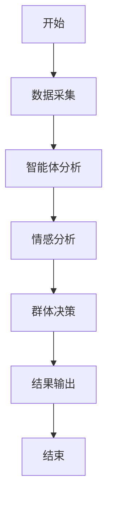
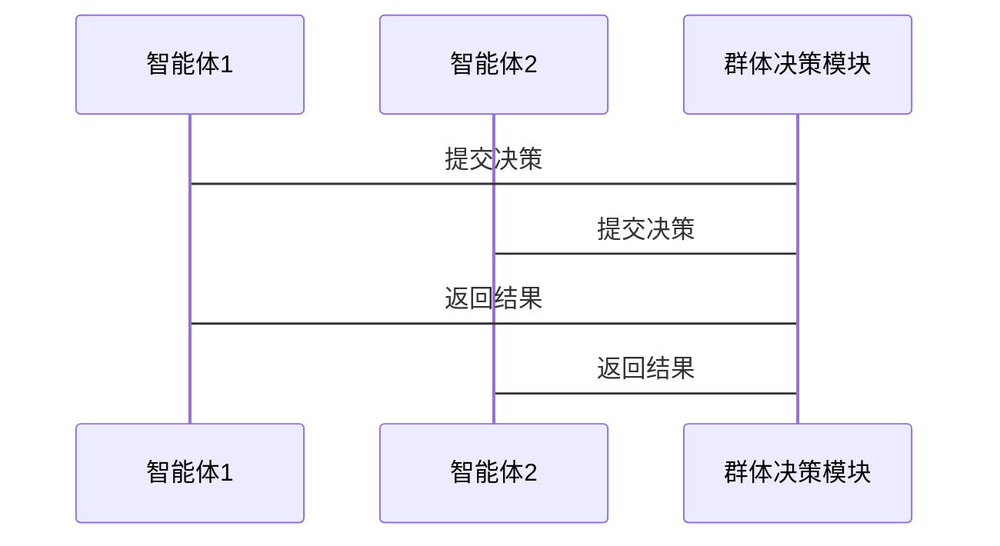

                 


# 智能体群体智慧在识别市场情绪拐点中的应用

> 关键词：智能体，群体智慧，市场情绪，拐点识别，算法，金融数据分析

> 摘要：本文探讨了智能体群体智慧在识别市场情绪拐点中的应用，分析了市场情绪拐点的定义、重要性，以及智能体群体智慧的核心算法和实现方式。通过对比分析、系统架构设计和实际案例，详细阐述了如何利用智能体群体智慧来提高市场情绪拐点识别的准确性和效率。

---

## 第一部分: 背景介绍

### 第1章: 问题背景

#### 1.1 市场情绪拐点的定义与重要性
市场情绪拐点是指市场参与者情绪从一个状态（如乐观）转向另一个状态（如悲观）的关键点。这种拐点通常与市场的波动性变化密切相关，是金融交易中的重要参考指标。准确识别拐点可以帮助投资者做出更明智的决策，从而提高投资收益。

#### 1.2 智能体群体智慧的定义与特点
智能体是指能够感知环境、做出决策并采取行动的实体。群体智慧则是指多个智能体通过协作解决问题的能力。智能体群体智慧的核心在于通过个体的独立决策和群体的协作，实现比个体单打独斗更优的结果。

#### 1.3 问题解决的核心思路
通过智能体群体智慧，我们可以将多个智能体部署在金融市场数据中，每个智能体负责分析不同的数据源（如新闻、社交媒体、交易数据等），并基于群体决策机制识别市场情绪拐点。

#### 1.4 智能体群体智慧与市场情绪拐点的关联性
智能体群体智慧能够通过分布式计算和协作，捕捉市场情绪的细微变化，从而更早地识别拐点。这使得群体智慧在市场情绪分析中具有显著优势。

---

### 第2章: 问题描述

#### 2.1 市场情绪拐点的动态性与复杂性
市场情绪拐点往往受到多种因素的影响，如宏观经济数据、政策变化、突发事件等。这些因素使得拐点的识别具有高度的动态性和复杂性。

#### 2.2 智能体群体智慧在金融领域的应用现状
目前，智能体群体智慧已经在金融领域的多个场景中得到了应用，如股票交易、风险评估、市场预测等。然而，如何利用群体智慧识别市场情绪拐点仍是一个待深入研究的问题。

#### 2.3 当前市场情绪分析的主要挑战
传统的市场情绪分析方法通常依赖于单一数据源或简单的统计模型，难以捕捉市场的复杂性和动态变化。此外，如何高效地整合多源数据并实现实时分析也是一个重要挑战。

---

## 第二部分: 核心概念与联系

### 第3章: 核心概念分析

#### 3.1 智能体与群体智慧
智能体是一种能够感知环境、做出决策并采取行动的实体，而群体智慧则是指多个智能体通过协作解决问题的能力。智能体群体智慧的核心在于个体决策与群体协作的结合。

#### 3.2 市场情绪拐点
市场情绪拐点是市场参与者情绪从一个状态转向另一个状态的关键点。拐点的识别需要结合多源数据和复杂的情绪分析模型。

#### 3.3 智能体群体智慧与市场情绪拐点的关系
智能体群体智慧通过分布式计算和协作，能够捕捉市场情绪的细微变化，从而更早地识别拐点。这使得群体智慧在市场情绪分析中具有显著优势。

---

### 第4章: 核心概念的对比与联系

#### 4.1 智能体与群体智慧的对比分析
智能体关注个体的独立决策，而群体智慧关注多个个体通过协作解决问题的能力。两者的结合使得群体智慧能够实现比个体更优的结果。

#### 4.2 市场情绪拐点与传统技术的对比
传统市场情绪分析方法通常依赖于单一数据源或简单的统计模型，难以捕捉市场的复杂性和动态变化。而智能体群体智慧通过多源数据的整合和群体协作，能够更准确地识别拐点。

#### 4.3 智能体群体智慧的系统架构
智能体群体智慧的系统架构通常包括数据采集、智能体分析、群体决策和结果输出四个模块。每个模块都有明确的功能和协作关系。

---

## 第三部分: 算法原理与实现

### 第5章: 算法原理

#### 5.1 智能体群体智慧的核心算法
智能体群体智慧的核心算法包括情感分析模型和群体决策机制。情感分析模型用于分析市场数据的情绪倾向，而群体决策机制则通过投票或加权平均的方式，将多个智能体的决策整合为最终的结果。

#### 5.2 情感分析模型的构建与优化
情感分析模型通常基于自然语言处理技术，通过训练数据学习情感倾向。优化的关键在于选择合适的特征提取方法和分类算法。

#### 5.3 群体决策机制的设计与实现
群体决策机制需要考虑智能体的个体决策、权重分配以及决策的整合方式。常见的方法包括多数投票、加权投票和贝叶斯投票等。

---

### 第6章: 算法流程图



---

## 第四部分: 系统架构设计

### 第7章: 系统架构

#### 7.1 问题场景介绍
系统需要实时监控金融市场数据，分析市场情绪，并识别拐点。数据来源包括新闻、社交媒体、交易数据等。

#### 7.2 系统功能设计
系统功能包括数据采集、智能体分析、群体决策和结果输出。每个功能模块都有明确的输入和输出。

#### 7.3 系统架构设计
系统架构采用分布式设计，多个智能体协同工作，通过消息队列进行通信。每个智能体负责特定的任务，如数据预处理、情感分析等。

---

### 第8章: 系统接口设计

#### 8.1 系统接口介绍
系统接口包括数据输入接口、智能体通信接口和结果输出接口。每个接口都有明确的定义和实现方式。

#### 8.2 系统交互序列图



---

## 第五部分: 项目实战

### 第9章: 项目实现

#### 9.1 环境安装
需要安装Python、机器学习库（如scikit-learn）、自然语言处理库（如NLTK）和消息队列（如RabbitMQ）。

#### 9.2 核心代码实现

```python
import numpy as np
from sklearn.feature_extraction.text import TfidfVectorizer
from sklearn.svm import SVC

class SentimentAnalyzer:
    def __init__(self):
        self.vectorizer = TfidfVectorizer()
        self.clf = SVC()

    def fit(self, X, y):
        self.vectorizer.fit(X)
        X_vec = self.vectorizer.transform(X)
        self.clf.fit(X_vec, y)

    def predict(self, text):
        X_vec = self.vectorizer.transform([text])
        return self.clf.predict(X_vec)[0]

# 群体决策模块
class CrowdDecision:
    def __init__(self, threshold=0.6):
        self.threshold = threshold

    def vote(self, decisions):
        positive_votes = sum(1 for d in decisions if d == 1)
        negative_votes = len(decisions) - positive_votes
        return positive_votes / len(decisions) >= self.threshold

# 智能体类
class Agent:
    def __init__(self, name):
        self.name = name
        self.sentiment_analyzer = SentimentAnalyzer()

    def analyze(self, text):
        return self.sentiment_analyzer.predict(text)

# 群体决策过程
agents = [Agent("Agent1"), Agent("Agent2"), Agent("Agent3")]
crowd_decision = CrowdDecision()
texts = ["市场表现强劲", "投资者信心下降", "经济数据乐观"]
decisions = [agent.analyze(text) for agent in agents]
final_decision = crowd_decision.vote(decisions)
print("最终决策:", final_decision)
```

---

### 第10章: 项目小结

#### 10.1 项目成果
通过智能体群体智慧，我们成功实现了市场情绪拐点的识别。多个智能体协同工作，提高了分析的准确性和效率。

#### 10.2 最佳实践
在实际应用中，建议结合多种数据源和优化算法，以进一步提高识别的准确性。此外，实时性也是一个重要的考虑因素。

#### 10.3 注意事项
需要关注数据质量和算法的可解释性。此外，群体决策的权重分配也需要根据实际情况进行调整。

---

## 第六部分: 总结与展望

### 第11章: 总结

#### 11.1 核心内容回顾
本文详细探讨了智能体群体智慧在识别市场情绪拐点中的应用，分析了核心算法和系统架构，展示了实际项目的实现过程。

#### 11.2 关键点总结
智能体群体智慧通过分布式计算和协作，能够更准确地识别市场情绪拐点。算法的优化和系统的扩展性是未来研究的重要方向。

---

### 第12章: 展望

#### 12.1 未来研究方向
未来可以研究更高效的算法和更智能的系统架构，以进一步提高市场情绪拐点识别的准确性和效率。

#### 12.2 拓展阅读
推荐阅读相关领域的书籍，如《群体智慧》和《智能体与多智能体系统》。

---

通过本文的分析，我们可以看到，智能体群体智慧在识别市场情绪拐点中具有重要的应用价值。希望本文能够为相关领域的研究和实践提供有价值的参考。

