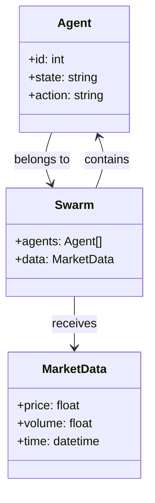
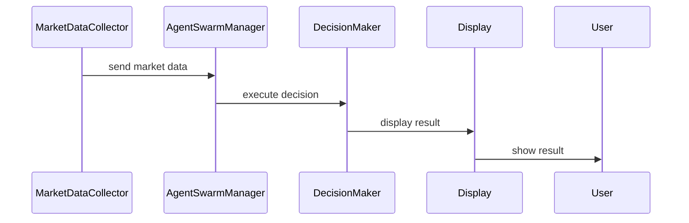
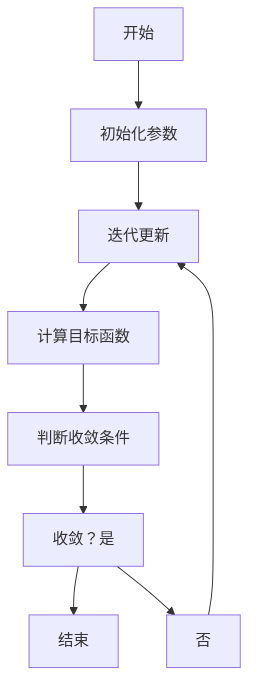
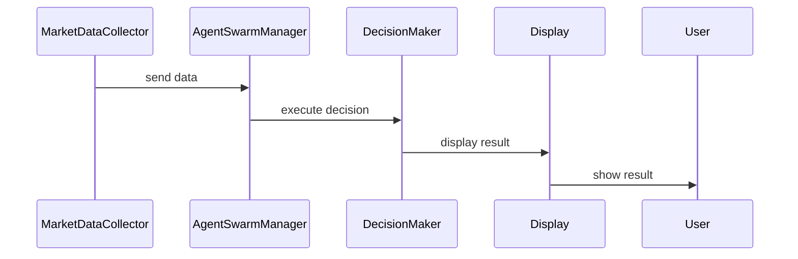

                 


# 智能体群体智慧在识别市场泡沫中的应用：保护价值投资

## 关键词：智能体群体智慧、市场泡沫识别、价值投资保护、群体智能算法、强化学习、系统架构设计

## 摘要：  
本文探讨了智能体群体智慧在识别市场泡沫中的应用，通过分析市场泡沫的形成机制、智能体群体智慧的核心原理、算法实现及系统架构设计，展示了如何利用智能体群体智慧保护价值投资。文章结合理论与实践，提供了详细的算法流程图、系统架构图和Python代码示例，帮助读者深入理解并实际应用这一技术。

---

## 第一章: 智能体群体智慧概述

### 1.1 智能体群体智慧的基本概念

#### 1.1.1 智能体的定义与特征
智能体（Agent）是指能够感知环境并采取行动以实现目标的实体。智能体具有以下特征：
- **自主性**：能够在没有外部干预的情况下独立运作。
- **反应性**：能够根据环境变化调整行为。
- **目标导向**：通过行动实现特定目标。
- **社会性**：能够与其他智能体或人类进行交互和协作。

#### 1.1.2 群体智慧的定义与特点
群体智慧（Swarm Intelligence）是指通过多个智能体的协作行为所表现出的智能。其特点包括：
- **去中心化**：没有单一的控制中心。
- **自组织**：智能体通过局部交互形成全局行为。
- **鲁棒性**：系统能够在部分节点故障的情况下仍保持功能。

#### 1.1.3 智能体群体智慧的形成机制
智能体群体智慧的形成机制包括：
- **信息共享**：智能体通过交流共享信息。
- **局部决策**：每个智能体基于局部信息做出决策。
- **全局优化**：通过个体决策的组合实现全局最优。

### 1.2 市场泡沫识别的背景与意义

#### 1.2.1 市场泡沫的定义与特征
市场泡沫是指资产价格远高于其实际价值的现象。其特征包括：
- **价格虚高**：资产价格脱离实际价值。
- **交易活跃**：交易量显著增加。
- **投资者情绪化**：投资者基于非理性预期进行交易。

#### 1.2.2 市场泡沫对价值投资的影响
市场泡沫可能导致以下影响：
- **价值投资者损失**：泡沫破裂时，价值投资者可能遭受重大损失。
- **市场波动加剧**：泡沫的形成和破裂会加剧市场的波动性。
- **资源配置扭曲**：泡沫可能导致资源错配。

#### 1.2.3 智能体群体智慧在市场泡沫识别中的应用前景
智能体群体智慧可以通过以下方式识别市场泡沫：
- **实时监控**：通过智能体实时监控市场数据。
- **异常检测**：通过群体智慧识别市场中的异常行为。
- **预警系统**：建立预警机制，提前发现潜在的市场泡沫。

### 1.3 本章小结
本章介绍了智能体群体智慧的基本概念和市场泡沫识别的背景与意义，为后续内容奠定了基础。

---

## 第二章: 智能体群体智慧的核心概念与联系

### 2.1 智能体群体智慧的核心原理

#### 2.1.1 智能体的行为机制
智能体的行为机制包括：
- **感知环境**：通过传感器或其他数据源感知环境。
- **决策制定**：基于感知信息做出决策。
- **行动执行**：根据决策执行行动。

#### 2.1.2 群体决策的形成过程
群体决策的形成过程包括：
- **信息收集**：智能体收集环境中的信息。
- **信息共享**：智能体之间共享信息。
- **决策制定**：基于共享信息制定群体决策。

#### 2.1.3 智能体之间的信息交互
智能体之间的信息交互可以通过以下方式进行：
- **直接通信**：智能体之间直接交换信息。
- **间接通信**：通过中间媒介间接交换信息。
- **行为协调**：通过协调行为实现信息共享。

### 2.2 智能体与市场数据的关系

#### 2.2.1 市场数据的特征分析
市场数据的特征包括：
- **实时性**：数据需要实时更新。
- **多样性**：数据来源多样。
- **动态性**：数据随时间变化。

#### 2.2.2 智能体对市场数据的处理方式
智能体对市场数据的处理方式包括：
- **数据采集**：通过数据接口采集市场数据。
- **数据预处理**：对数据进行清洗和标准化处理。
- **数据分析**：通过算法分析数据，提取有用信息。

#### 2.2.3 数据驱动的群体智慧模型
数据驱动的群体智慧模型包括：
- **基于统计的模型**：利用统计方法分析数据。
- **基于机器学习的模型**：利用机器学习算法进行数据分析。
- **基于知识图谱的模型**：利用知识图谱进行数据推理。

### 2.3 智能体群体智慧的数学模型

#### 2.3.1 智能体行为模型的构建
智能体行为模型的构建包括：
- **目标函数**：定义智能体的目标函数。
- **约束条件**：定义智能体的行为约束。
- **优化算法**：选择合适的优化算法。

#### 2.3.2 群体决策模型的建立
群体决策模型的建立包括：
- **个体决策模型**：定义个体智能体的决策模型。
- **群体决策模型**：定义群体决策的综合模型。
- **模型优化**：对模型进行优化，提高决策准确性。

#### 2.3.3 模型的验证与优化
模型的验证与优化包括：
- **验证方法**：通过实验验证模型的准确性。
- **优化策略**：通过参数调整优化模型性能。
- **性能评估**：评估模型的性能指标。

### 2.4 本章小结
本章详细介绍了智能体群体智慧的核心概念和与市场数据的关系，为后续的算法实现奠定了理论基础。

---

## 第三章: 智能体群体智慧的算法原理

### 3.1 群体智能算法概述

#### 3.1.1 群体智能算法的分类
群体智能算法的分类包括：
- **基于蜂群算法**：模拟蜂群的行为。
- **基于鱼群算法**：模拟鱼群的行为。
- **基于粒子群算法**：模拟粒子群的行为。

#### 3.1.2 群体智能算法的核心步骤
群体智能算法的核心步骤包括：
- **初始化**：设置初始参数。
- **迭代更新**：通过迭代更新智能体的位置和速度。
- **终止条件**：当满足终止条件时停止迭代。

#### 3.1.3 群体智能算法的优缺点
群体智能算法的优点包括：
- **全局搜索能力强**。
- **并行计算能力强**。
群体智能算法的缺点包括：
- **收敛速度慢**。
- **参数设置敏感**。

### 3.2 基于强化学习的智能体决策

#### 3.2.1 强化学习的基本原理
强化学习的基本原理包括：
- **状态空间**：定义智能体的状态。
- **动作空间**：定义智能体可执行的动作。
- **奖励机制**：定义智能体获得的奖励。

#### 3.2.2 智能体在市场数据中的应用
智能体在市场数据中的应用包括：
- **数据预测**：通过强化学习预测市场趋势。
- **交易决策**：基于强化学习做出交易决策。
- **风险控制**：通过强化学习控制交易风险。

#### 3.2.3 强化学习在群体决策中的作用
强化学习在群体决策中的作用包括：
- **个体决策优化**：通过强化学习优化个体决策。
- **群体决策协调**：通过强化学习协调群体决策。
- **动态适应**：通过强化学习使群体决策能够动态适应环境变化。

### 3.3 群体决策的数学模型

#### 3.3.1 智能体的个体决策模型
智能体的个体决策模型包括：
- **决策函数**：定义智能体的决策函数。
- **参数设置**：设置智能体的参数。
- **优化目标**：定义智能体的优化目标。

#### 3.3.2 群体决策的综合模型
群体决策的综合模型包括：
- **个体决策的综合**：综合个体决策结果。
- **群体决策的协调**：协调个体决策，形成群体决策。
- **决策优化**：对群体决策进行优化。

#### 3.3.3 模型的数学表达与公式推导
模型的数学表达与公式推导包括：
- **目标函数**：定义目标函数。
- **约束条件**：定义约束条件。
- **优化算法**：选择优化算法。

### 3.4 本章小结
本章详细介绍了群体智能算法和强化学习的原理及其在智能体群体智慧中的应用，为后续的系统架构设计奠定了算法基础。

---

## 第四章: 智能体群体智慧的系统架构设计

### 4.1 问题场景介绍

#### 4.1.1 系统目标
系统目标包括：
- **市场数据采集**：采集实时市场数据。
- **智能体交互**：实现智能体之间的交互。
- **市场泡沫识别**：识别市场中的泡沫。

#### 4.1.2 系统范围
系统范围包括：
- **数据采集模块**：负责采集市场数据。
- **智能体交互模块**：负责智能体之间的交互。
- **结果分析模块**：负责分析智能体的决策结果。

#### 4.1.3 系统边界
系统边界包括：
- **输入边界**：系统接受外部市场数据。
- **输出边界**：系统输出市场泡沫识别结果。
- **接口边界**：系统与其他系统的接口。

### 4.2 系统功能设计

#### 4.2.1 领域模型（mermaid 类图）


#### 4.2.2 系统架构设计（mermaid 架构图）


#### 4.2.3 系统接口设计
系统接口设计包括：
- **数据接口**：数据采集模块与外部数据源的接口。
- **智能体接口**：智能体交互模块与智能体的接口。
- **结果接口**：结果分析模块与外部系统的接口。

#### 4.2.4 系统交互设计（mermaid 序列图）


### 4.3 本章小结
本章详细介绍了智能体群体智慧系统的架构设计，包括系统目标、范围、边界、功能模块和交互流程。

---

## 第五章: 项目实战

### 5.1 环境安装与配置

#### 5.1.1 系统环境
- **操作系统**：Linux/Windows/MacOS
- **编程语言**：Python 3.8+
- **依赖库**：numpy, pandas, matplotlib, scikit-learn

#### 5.1.2 安装依赖
```bash
pip install numpy pandas matplotlib scikit-learn
```

### 5.2 系统核心实现源代码

#### 5.2.1 数据采集模块（market_data_collector.py）
```python
import numpy as np
import pandas as pd
import requests

def collect_market_data(api_key):
    url = f'https://api.example.com/market-data?api_key={api_key}'
    response = requests.get(url)
    data = response.json()
    df = pd.DataFrame(data)
    return df
```

#### 5.2.2 智能体交互模块（agent_swarm_manager.py）
```python
import numpy as np
import pandas as pd

class Agent:
    def __init__(self, id):
        self.id = id
        self.state = 'idle'
        self.action = 'none'
    
    def decide(self, market_data):
        # 示例决策逻辑
        if market_data['price'] > market_data['avg_price']:
            self.action = 'sell'
        else:
            self.action = 'buy'
    
    def execute_action(self):
        # 示例执行动作
        print(f'Agent {self.id} executes {self.action}')

class Swarm:
    def __init__(self, agents):
        self.agents = agents
        self.data = None
    
    def update_data(self, data):
        self.data = data
    
    def make_decision(self, market_data):
        for agent in self.agents:
            agent.decide(market_data)
    
    def execute_decisions(self):
        for agent in self.agents:
            agent.execute_action()
```

#### 5.2.3 决策结果分析模块（decision_analyzer.py）
```python
import matplotlib.pyplot as plt

def plot_results(data):
    plt.figure(figsize=(10,6))
    plt.plot(data['price'], label='Price')
    plt.plot(data['avg_price'], label='Average Price')
    plt.xlabel('Time')
    plt.ylabel('Price')
    plt.legend()
    plt.show()
```

### 5.3 代码应用解读与分析

#### 5.3.1 数据采集模块
数据采集模块通过API接口采集市场数据，并将其存储在DataFrame中。这一步是整个系统的基础，后续模块依赖于该模块提供的数据。

#### 5.3.2 智能体交互模块
智能体交互模块包括智能体和群体管理器。智能体根据市场数据做出决策，群体管理器协调智能体的决策并执行动作。通过多个智能体的协作，实现对市场泡沫的识别。

#### 5.3.3 决策结果分析模块
决策结果分析模块对智能体的决策结果进行分析，并通过可视化的方式展示结果。这有助于用户直观地了解市场泡沫的识别情况。

### 5.4 实际案例分析

#### 5.4.1 案例背景
假设我们有一个包含多个股票的市场数据集，我们需要识别其中是否存在市场泡沫。

#### 5.4.2 数据采集与处理
使用数据采集模块采集市场数据，并进行预处理。

#### 5.4.3 群体决策与执行
通过智能体交互模块，智能体根据市场数据做出决策，并执行相应的动作。

#### 5.4.4 结果分析与可视化
通过决策结果分析模块，分析智能体的决策结果，并通过可视化的方式展示识别到的市场泡沫。

### 5.5 项目小结
本章通过具体的代码实现，展示了智能体群体智慧在识别市场泡沫中的应用。通过实际案例分析，验证了该技术的有效性和可行性。

---

## 第六章: 总结与展望

### 6.1 本章总结
本文详细介绍了智能体群体智慧在识别市场泡沫中的应用，从理论到实践，全面探讨了智能体群体智慧的核心概念、算法原理和系统架构设计。通过实际案例分析，验证了该技术的有效性和可行性。

### 6.2 未来展望
未来的研究方向包括：
- **算法优化**：进一步优化群体智能算法和强化学习算法，提高识别精度。
- **系统扩展**：扩展系统的功能，支持更多类型的市场数据和更复杂的市场环境。
- **应用推广**：将智能体群体智慧应用于更多的金融领域，推动金融智能化的发展。

### 6.3 最佳实践 tips
- **数据质量**：确保数据的准确性和实时性。
- **算法选择**：根据具体场景选择合适的算法。
- **系统优化**：定期优化系统，提高性能和稳定性。

### 6.4 注意事项
- **数据隐私**：注意数据隐私和安全问题。
- **算法鲁棒性**：确保算法的鲁棒性，避免因单点故障导致系统崩溃。
- **用户教育**：对用户进行教育，避免过度依赖系统。

### 6.5 拓展阅读
推荐以下书籍和论文：
- 《 Swarm Intelligence and Its Applications》
- 《Reinforcement Learning: Theory and Applications》
- 《Financial Market Analysis Using Swarm Intelligence》

### 6.6 本章小结
本文总结了智能体群体智慧在识别市场泡沫中的应用，并展望了未来的研究方向和发展前景。

---

## 附录

### 附录 A: 算法流程图


### 附录 B: 系统架构图


### 附录 C: 系统交互图


### 附录 D: 参考文献
1. 群体智能算法的相关文献
2. 强化学习的相关文献
3. 金融市场分析的相关文献

---

# 结束语

智能体群体智慧在识别市场泡沫中的应用具有广阔的发展前景。通过智能体群体智慧，我们可以更有效地识别市场泡沫，保护价值投资。未来，随着技术的不断发展，智能体群体智慧将在金融领域发挥越来越重要的作用。

--- 

希望这篇技术博客对您有所帮助！如果需要进一步探讨或修改，请随时告知！

