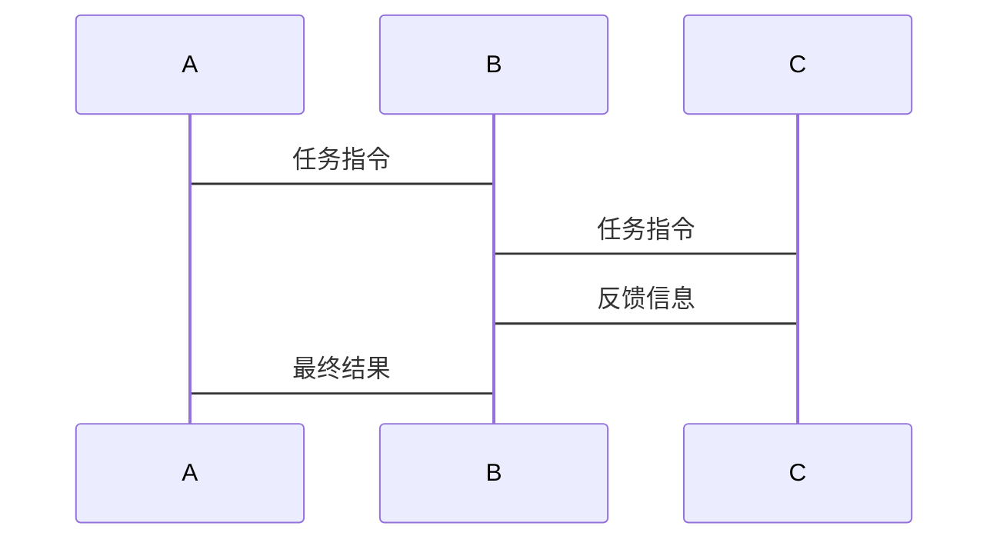

                 


# 智能体群体智慧在识别新兴产业机会中的应用：布局未来

## 关键词：智能体、群体智慧、新兴产业、机会识别、分布式计算、协同学习

## 摘要：智能体群体智慧是一种基于多智能体协同工作的技术，能够高效识别新兴产业机会。本文从背景、原理、算法、系统架构、实战案例等多个维度，详细阐述了智能体群体智慧的应用方法。通过数学模型和实际案例，探讨了如何利用智能体群体智慧的优势，发现潜在的市场机会，并为未来的企业布局提供指导。

---

# 第一部分: 智能体群体智慧的背景与概述

## 第1章: 智能体群体智慧的背景与概念

### 1.1 智能体的基本概念

#### 1.1.1 智能体的定义与特征
智能体（Agent）是指具备感知环境、自主决策、执行任务能力的实体。智能体的特征包括：
- **自主性**：无需外部干预，自主完成任务。
- **反应性**：能够感知环境并实时调整行为。
- **协作性**：多个智能体可以协同工作，形成群体智慧。
- **学习性**：通过经验优化决策模型。

#### 1.1.2 群体智能的定义与特点
群体智能（Swarm Intelligence）是指多个智能体通过局部交互，形成整体智能的现象。其特点包括：
- **涌现性**：群体行为并非单个智能体行为的简单叠加。
- **自适应性**：能够根据环境变化动态调整行为。
- **分布式性**：智能体之间通过局部交互实现全局目标。

#### 1.1.3 智能体群体智慧的核心要素
智能体群体智慧的核心要素包括：
- **个体智能体**：具备感知、决策和执行能力。
- **群体行为**：通过个体协作形成整体智慧。
- **环境交互**：智能体与环境之间不断交互，获取信息并优化决策。

### 1.2 智能体群体智慧的应用场景

#### 1.2.1 产业机会识别的背景与挑战
新兴产业机会的识别需要快速分析市场动态、技术趋势和用户需求。传统方法依赖人工调研，效率低且成本高。智能体群体智慧能够通过分布式计算和协同学习，高效识别潜在机会。

#### 1.2.2 智能体群体智慧在新兴产业中的应用
智能体群体智慧可以应用于：
- **市场预测**：通过分析海量数据，预测新兴产业发展趋势。
- **竞争分析**：识别市场中的竞争态势，优化企业布局。
- **技术评估**：评估新兴技术的可行性和市场潜力。

#### 1.2.3 产业机会识别的关键问题
产业机会识别的关键问题包括：
- **数据获取**：如何高效获取多源异构数据。
- **算法优化**：如何设计高效的群体智慧算法。
- **结果解释**：如何将智能体的输出转化为可执行的决策。

---

## 第2章: 智能体群体智慧与新兴产业机会

### 2.1 新兴产业机会的识别方法

#### 2.1.1 数据驱动的产业机会识别
数据驱动的识别方法包括：
- **数据采集**：通过爬虫、传感器等手段获取市场数据。
- **数据清洗**：去除噪声数据，提取有效信息。
- **数据分析**：通过机器学习、深度学习等技术分析数据，发现潜在机会。

#### 2.1.2 智能体群体智慧的优势
智能体群体智慧的优势包括：
- **分布式计算**：能够高效处理海量数据。
- **协同学习**：通过个体协作优化模型。
- **实时响应**：能够快速适应市场变化。

#### 2.1.3 产业机会识别的边界与外延
产业机会识别的边界包括：
- **数据范围**：明确数据采集的范围和来源。
- **目标领域**：聚焦于特定产业或技术领域。
- **时间窗口**：设定识别的时间范围和频率。

### 2.2 智能体群体智慧的核心原理

#### 2.2.1 智能体的自主性与协作性
智能体的自主性体现在：
- **自主决策**：智能体能够根据环境信息自主决策。
- **协作行为**：多个智能体通过协作实现共同目标。

#### 2.2.2 群体智慧的涌现性与复杂性
群体智慧的涌现性体现在：
- **全局优化**：通过局部交互实现全局最优。
- **复杂性管理**：通过分层架构降低系统复杂性。

#### 2.2.3 智能体群体智慧的系统架构
智能体群体智慧的系统架构包括：
- **感知层**：负责数据采集和环境感知。
- **决策层**：负责个体决策和群体协调。
- **执行层**：负责任务执行和反馈优化。

---

## 第3章: 智能体群体智慧的数学模型与算法

### 3.1 智能体群体智慧的数学模型

#### 3.1.1 智能体的个体行为模型
个体行为模型可以用以下公式表示：
$$
f(x) = \begin{cases}
1 & \text{if } x > 0.5 \\
0 & \text{otherwise}
\end{cases}
$$

#### 3.1.2 群体行为的涌现模型
群体行为的涌现模型可以用以下公式表示：
$$
F(x) = \sum_{i=1}^{n} f_i(x_i)
$$
其中，$n$ 是智能体的数量，$f_i$ 是第 $i$ 个智能体的行为函数。

#### 3.1.3 新兴产业机会识别的数学表达
新兴产业机会识别的数学表达可以用以下公式表示：
$$
O = \arg\max_{o} \sum_{i=1}^{n} w_i o_i
$$
其中，$O$ 是机会，$w_i$ 是第 $i$ 个智能体的权重，$o_i$ 是第 $i$ 个智能体的输出。

### 3.2 群体智慧算法的实现

#### 3.2.1 分布式计算与协同学习
分布式计算与协同学习的实现步骤如下：
1. 数据采集与分发。
2. 智能体独立学习，生成局部模型。
3. 模型融合，生成全局模型。
4. 反馈优化，更新个体模型。

#### 3.2.2 博弈论与多智能体决策
博弈论与多智能体决策的核心是纳什均衡：
$$
\text{纳什均衡} = \{x^*, y^*\} \quad \text{其中} \quad x^* = \arg\max_{x} u(x, y^*), \quad y^* = \arg\max_{y} v(x^*, y)
$$

#### 3.2.3 群体智慧算法的优化与改进
群体智慧算法的优化包括：
- **局部搜索**：通过局部优化提高全局性能。
- **全局搜索**：通过全局优化降低局部风险。
- **混合搜索**：结合局部和全局优化，提高算法效率。

---

## 第4章: 智能体群体智慧的系统架构与设计

### 4.1 系统架构设计

#### 4.1.1 智能体群体智慧的分层架构
智能体群体智慧的分层架构包括：
- **感知层**：负责数据采集和环境感知。
- **决策层**：负责个体决策和群体协调。
- **执行层**：负责任务执行和反馈优化。

#### 4.1.2 群体智慧系统的功能模块
群体智慧系统的功能模块包括：
- **数据采集模块**：负责数据采集和预处理。
- **个体决策模块**：负责个体智能体的决策和优化。
- **群体协调模块**：负责群体行为的协调和优化。

#### 4.1.3 系统的可扩展性与可维护性
系统的可扩展性体现在：
- **模块化设计**：通过模块化设计提高系统的可扩展性。
- **接口标准化**：通过标准化接口降低系统的耦合度。

### 4.2 系统接口与交互设计

#### 4.2.1 智能体的接口设计
智能体的接口设计包括：
- **输入接口**：接收环境信息和任务指令。
- **输出接口**：输出决策结果和反馈信息。

#### 4.2.2 群体智慧的交互流程
群体智慧的交互流程包括：
1. 智能体接收任务指令。
2. 智能体独立完成任务。
3. 智能体之间交换信息，优化决策。
4. 智能体输出最终结果。

#### 4.2.3 系统的交互流程图
系统的交互流程图如下：



---

## 第5章: 智能体群体智慧的项目实战

### 5.1 项目背景与目标

#### 5.1.1 项目背景
项目背景包括：
- **问题描述**：新兴产业机会识别的挑战。
- **目标设定**：通过智能体群体智慧技术，高效识别新兴产业机会。

#### 5.1.2 项目目标
项目目标包括：
- **技术目标**：实现智能体群体智慧系统。
- **应用目标**：应用于新兴产业机会识别。

### 5.2 项目实施

#### 5.2.1 环境安装与配置
环境安装与配置包括：
- **操作系统**：Linux/Windows/MacOS。
- **开发工具**：Python/Java/JavaScript。
- **库与框架**：TensorFlow/PyTorch/Scikit-learn。

#### 5.2.2 系统核心实现
系统核心实现包括：
1. 数据采集与预处理。
2. 智能体个体行为模型的实现。
3. 群体智慧算法的实现。
4. 系统交互与反馈优化。

#### 5.2.3 系统核心代码实现
以下是系统核心代码实现的示例：

```python
import numpy as np
from sklearn import svm

class Agent:
    def __init__(self, data):
        self.data = data
        self.model = svm.SVC()

    def train(self):
        self.model.fit(self.data)

    def predict(self, x):
        return self.model.predict(x)

# 初始化智能体
agents = [Agent(data1), Agent(data2), Agent(data3)]

# 群体协调
for agent in agents:
    agent.train()

# 集成模型
ensemble_model = svm.SVC()
ensemble_model.fit(np.concatenate([agent.model.support_vectors_ for agent in agents]))
```

---

## 第6章: 总结与展望

### 6.1 总结
智能体群体智慧是一种高效识别新兴产业机会的技术，通过分布式计算和协同学习，能够快速发现潜在的市场机会。本文从背景、原理、算法、系统架构、项目实战等多个维度，详细阐述了智能体群体智慧的应用方法。

### 6.2 展望
未来的研究方向包括：
- **算法优化**：进一步优化群体智慧算法，提高识别效率。
- **应用拓展**：将智能体群体智慧技术应用于更多领域，如金融、医疗、教育等。
- **技术融合**：将智能体群体智慧与区块链、边缘计算等技术融合，提升系统的安全性和效率。

---

通过本文的分析与实践，我们可以看到，智能体群体智慧在识别新兴产业机会中的应用前景广阔。随着技术的不断发展，智能体群体智慧将为企业布局未来提供更强大的支持。

