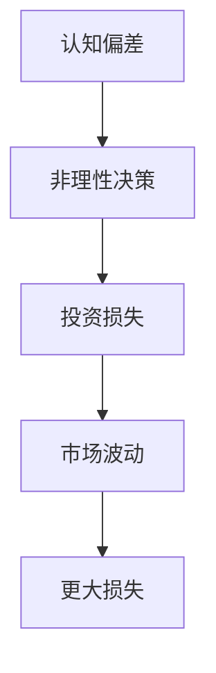
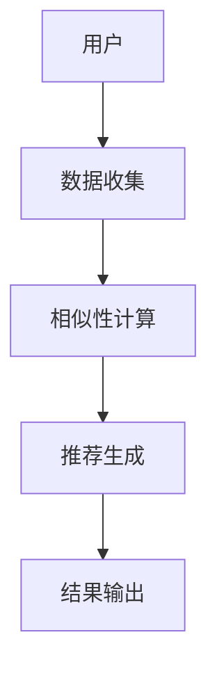
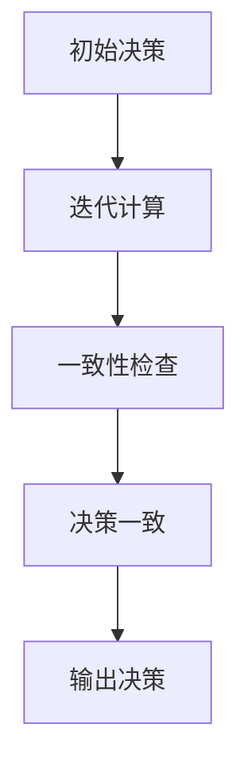
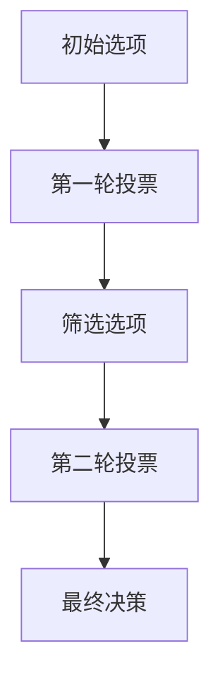
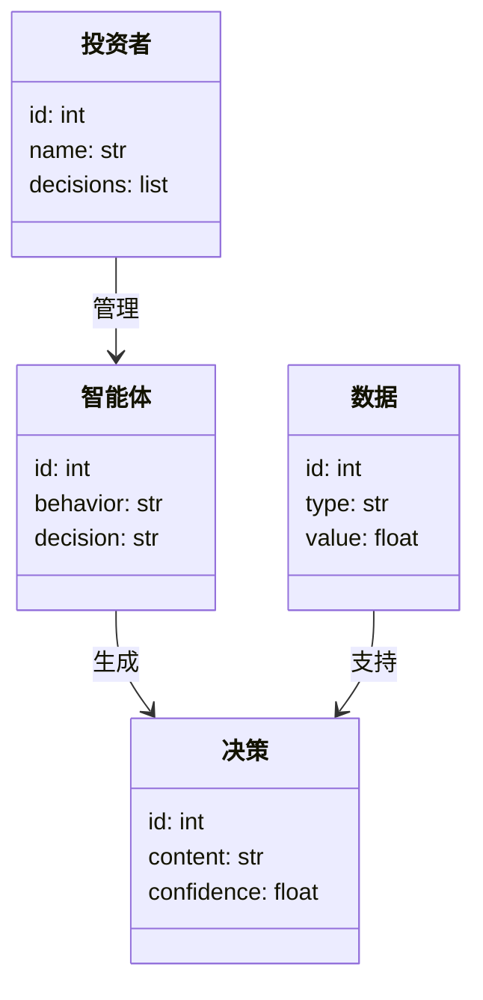
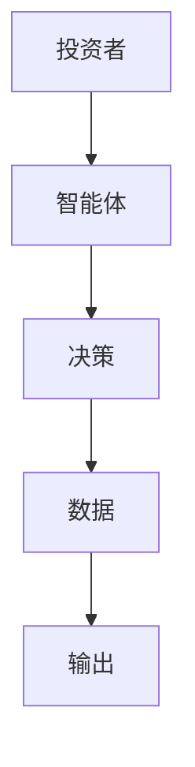
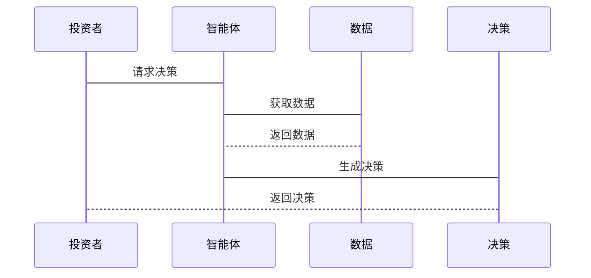

                 


# 智能体群体智慧：克服个体投资者的认知偏差

> 关键词：智能体群体智慧，认知偏差，投资决策，协同过滤，一致性算法

> 摘要：本文探讨智能体群体智慧在克服个体投资者认知偏差中的作用，通过分析群体智慧的核心概念、算法原理和系统架构，结合实际案例，展示如何利用智能体群体智慧提升投资决策的科学性和准确性。

---

## 第一部分: 智能体群体智慧的背景与概念

### 第1章: 智能体群体智慧的背景与概念

#### 1.1 个体投资者的认知偏差

##### 1.1.1 认知偏差的定义与分类
认知偏差是指个体在信息处理和决策过程中产生的系统性错误。常见的认知偏差包括确认偏差（confirmation bias）、从众偏差（herd behavior）、过度自信偏差（overconfidence bias）和可用性偏差（availability bias）。这些偏差通常源于信息不完整、情绪影响和认知限制。

##### 1.1.2 个体投资者中的典型认知偏差
在投资领域，认知偏差尤为明显。例如，投资者可能因为过度自信而过度交易，或因从众心理而跟风投资热门股票。这些偏差会导致非理性的投资决策，进而影响投资回报。

##### 1.1.3 认知偏差对投资决策的影响
认知偏差可能导致投资者做出错误的投资决策，例如高估某只股票的价值或低估市场风险。这种偏差在市场波动加剧时尤为显著，容易引发更大的投资损失。

##### 图1-1：认知偏差对投资决策的影响流程图


#### 1.2 智能体群体智慧的定义与特点

##### 1.2.1 智能体的基本概念
智能体（Agent）是指能够感知环境、自主决策并采取行动的实体。智能体可以是软件程序，也可以是物理机器人。在投资领域，智能体可以用于数据收集、分析和决策支持。

##### 1.2.2 群体智慧的定义与特征
群体智慧（Collective Intelligence）是指通过多个个体的协同合作所产生的一种整体智能。群体智慧的核心在于通过个体间的互动和信息共享，实现比个体单凭个体能力更强的决策和问题解决能力。

##### 1.2.3 智能体群体智慧的核心优势
智能体群体智慧通过分布式计算和自组织性，能够有效克服个体认知偏差。其核心优势包括：
- **分布式计算**：通过多个智能体协同工作，降低个体决策的偏差。
- **自组织性**：群体能够自主调整结构，适应环境变化。
- **涌现性**：群体智慧能够产生个体不具备的整体智能。

#### 1.3 智能体群体智慧与个体认知偏差的关系

##### 1.3.1 群体智慧如何克服个体偏差
群体智慧通过整合多个个体的信息和决策，能够有效降低个体认知偏差的影响。例如，通过协同过滤算法，群体智慧可以消除个体的过度自信偏差。

##### 1.3.2 智能体群体决策的机制
智能体群体决策机制包括信息共享、协同计算和结果整合三个阶段。通过这些机制，群体智慧能够实现比个体更优的决策。

##### 1.3.3 智能体群体智慧在投资决策中的应用前景
随着人工智能技术的不断发展，智能体群体智慧在投资领域的应用前景广阔。通过智能体的协同计算，投资者能够做出更加科学和理性的决策。

---

## 第二部分: 智能体群体智慧的核心理论

### 第2章: 智能体的协同与决策机制

#### 2.1 智能体的协同原理

##### 2.1.1 协同的基本概念
协同（Collaboration）是指多个智能体通过信息共享和协作，共同完成任务的过程。协同的核心在于信息的高效传递和整合。

##### 2.1.2 协同的实现方式
协同的实现方式包括基于信息共享的协同和基于行为协同的协同。前者通过共享数据实现，后者通过行为的协调实现。

##### 2.1.3 协同与决策的关系
协同是决策的前提，决策是协同的目标。通过协同，智能体能够整合信息，形成集体决策。

#### 2.2 智能体的决策模型

##### 2.2.1 基于群体的决策模型
基于群体的决策模型通过整合多个个体的决策，形成最终的群体决策。其核心在于如何有效地整合个体决策。

##### 2.2.2 基于个体的决策模型
基于个体的决策模型通过分析个体的决策行为，推断出群体的总体决策。这种方法适用于个体行为相对独立的场景。

##### 2.2.3 混合决策模型
混合决策模型结合了基于群体和基于个体的决策模型，能够更好地适应复杂的投资环境。

#### 2.3 智能体群体决策的数学模型

##### 2.3.1 基于概率的群体决策模型
基于概率的群体决策模型通过计算个体决策的概率分布，推断出群体的总体决策。其数学模型如下：
$$
P(\text{决策} = d) = \sum_{i=1}^{n} P_i(\text{决策} = d)
$$

##### 2.3.2 基于加权的群体决策模型
基于加权的群体决策模型通过赋予不同个体不同的权重，计算群体的总体决策。其数学模型如下：
$$
P(\text{决策} = d) = \sum_{i=1}^{n} w_i \cdot P_i(\text{决策} = d)
$$

##### 2.3.3 基于博弈论的群体决策模型
基于博弈论的群体决策模型通过分析个体的策略互动，推断出群体的总体决策。其数学模型较为复杂，通常涉及纳什均衡等概念。

---

## 第三部分: 智能体群体智慧的算法原理

### 第3章: 智能体群体决策算法

#### 3.1 协同过滤算法

##### 3.1.1 协同过滤的基本原理
协同过滤是一种基于用户行为相似性推荐的算法。通过分析用户的兴趣偏好，协同过滤能够推荐与用户兴趣相符的内容。

##### 3.1.2 基于用户的协同过滤
基于用户的协同过滤通过分析用户的行为数据，找到与目标用户行为相似的其他用户，进而推荐相似内容。

##### 3.1.3 基于物品的协同过滤
基于物品的协同过滤通过分析物品的属性，找到与目标物品属性相似的其他物品，进而推荐相似内容。

##### 图3-1：协同过滤算法流程图


##### 代码示例
```python
import numpy as np

# 假设用户行为数据矩阵为X
# 计算用户之间的相似性矩阵
similarity_matrix = np.dot(X, X.T)
```

#### 3.2 智能体一致性算法

##### 3.2.1 一致性算法的定义
一致性算法（Consensus Algorithm）是一种通过多个智能体的决策达成一致的算法。其核心在于通过多次迭代，使所有智能体的决策趋于一致。

##### 3.2.2 一致性算法的实现步骤
一致性算法的实现步骤包括：
1. 初始化智能体的初始决策
2. 迭代计算智能体的决策，直到所有智能体的决策一致
3. 输出最终的决策

##### 图3-2：一致性算法流程图


##### 代码示例
```python
def consistency_algorithm(decisions):
    while True:
        new_decisions = []
        for decision in decisions:
            new_decision = compute_consistency(decision)
            new_decisions.append(new_decision)
        if new_decisions == decisions:
            break
        decisions = new_decisions
    return decisions
```

#### 3.3 智能体投票算法

##### 3.3.1 投票算法的基本原理
投票算法是一种通过投票方式决定最终决策的算法。其核心在于通过多数决方式，选出最优的决策方案。

##### 3.3.2 多轮投票机制
多轮投票机制是一种通过多轮投票，逐步缩小决策范围的算法。其核心在于通过每轮投票，排除部分不受欢迎的选项，最终选出最优决策。

##### 图3-3：多轮投票机制流程图


##### 代码示例
```python
def majority_vote(votes):
    from collections import Counter
    count = Counter(votes)
    max_vote = max(count.values())
    winners = [key for key, value in count.items() if value == max_vote]
    return winners
```

---

## 第四部分: 智能体群体智慧的系统架构设计

### 第4章: 智能体群体智慧系统架构

#### 4.1 问题场景介绍

##### 4.1.1 投资者决策支持系统的建设目标
投资者决策支持系统的建设目标包括：
1. 提供基于群体智慧的投资决策支持
2. 降低个体认知偏差对投资决策的影响
3. 提高投资决策的科学性和准确性

##### 4.1.2 项目介绍
本项目旨在构建一个基于智能体群体智慧的投资者决策支持系统。通过智能体的协同计算，为投资者提供科学的投资建议。

#### 4.2 系统功能设计

##### 4.2.1 领域模型设计
领域模型设计包括投资者、智能体、决策、数据等核心概念。其类图如下：


##### 4.2.2 系统架构设计

###### 图4-1：系统架构设计


#### 4.3 系统接口设计

##### 4.3.1 API接口设计
系统接口设计包括：
- GET /decisions：获取所有决策
- POST /decisions：提交新的决策
- PUT /decisions：更新决策内容

##### 4.3.2 系统交互设计

###### 图4-2：系统交互序列图


---

## 第五部分: 智能体群体智慧的项目实战

### 第5章: 项目实战

#### 5.1 环境安装

##### 5.1.1 系统运行环境
系统运行环境包括：
- 操作系统：Linux/Windows/MacOS
- 开发工具：Python/Java/C++
- 数据库：MySQL/PostgreSQL

##### 5.1.2 智能体实现工具
智能体实现工具包括：
- Python库：multiprocessing/threading
- Java框架：Spring/Servlet
- C++库： pthread/boost

#### 5.2 系统核心实现源代码

##### 5.2.1 协同过滤算法实现
```python
import numpy as np

def collaborative_filtering(X):
    # 计算用户相似性矩阵
    similarity_matrix = np.dot(X, X.T)
    return similarity_matrix
```

##### 5.2.2 一致性算法实现
```python
def consistency_algorithm(decisions):
    while True:
        new_decisions = []
        for decision in decisions:
            new_decision = compute_consistency(decision)
            new_decisions.append(new_decision)
        if new_decisions == decisions:
            break
        decisions = new_decisions
    return decisions
```

##### 5.2.3 投票算法实现
```python
from collections import Counter

def majority_vote(votes):
    count = Counter(votes)
    max_vote = max(count.values())
    winners = [key for key, value in count.items() if value == max_vote]
    return winners
```

#### 5.3 代码应用解读与分析

##### 5.3.1 协同过滤算法的代码解读
协同过滤算法通过计算用户行为的相似性，推荐与用户兴趣相符的内容。代码中，用户行为数据矩阵X通过矩阵乘法计算相似性矩阵。

##### 5.3.2 一致性算法的代码解读
一致性算法通过多次迭代，使所有智能体的决策趋于一致。代码中，一致性算法不断更新决策，直到所有决策一致。

##### 5.3.3 投票算法的代码解读
投票算法通过多数决方式，选出最优的决策方案。代码中，投票结果通过计数器统计，找出得票最多的决策。

#### 5.4 实际案例分析

##### 5.4.1 投资者认知偏差案例
假设某投资者因过度自信偏差，过度投资某只股票，最终导致投资损失。通过智能体群体智慧，投资者可以参考其他智能体的决策，避免过度集中投资。

##### 5.4.2 智能体群体决策案例
假设智能体群体通过协同过滤算法，推荐出与目标用户兴趣相符的投资组合。通过一致性算法和投票算法，智能体群体能够达成一致的决策，降低个体认知偏差的影响。

#### 5.5 项目小结

##### 5.5.1 项目总结
通过智能体群体智慧，投资者能够做出更加科学和理性的决策。通过协同过滤、一致性算法和投票算法，智能体群体智慧能够有效克服个体认知偏差。

##### 5.5.2 经验与教训
在项目实施过程中，需要注意算法的效率和系统的可扩展性。通过优化算法和改进系统架构，可以进一步提高智能体群体智慧的决策能力。

---

## 第六部分: 总结与展望

### 第6章: 总结与展望

#### 6.1 全文总结

##### 6.1.1 核心观点总结
智能体群体智慧通过整合多个个体的决策，能够有效克服个体认知偏差。通过协同过滤、一致性算法和投票算法，智能体群体智慧能够实现比个体更优的决策。

##### 6.1.2 关键技术总结
关键技术包括：
- 协同过滤算法
- 一致性算法
- 投票算法

##### 6.1.3 实践价值总结
智能体群体智慧在投资领域的应用前景广阔。通过智能体群体智慧，投资者能够做出更加科学和理性的决策，提高投资收益。

#### 6.2 未来研究方向

##### 6.2.1 群体智慧算法的优化
未来研究可以进一步优化群体智慧算法，提高算法的效率和准确性。

##### 6.2.2 智能体群体决策的可解释性
未来研究可以探讨智能体群体决策的可解释性问题，提高决策的透明度和可信度。

##### 6.2.3 智能体群体智慧的应用拓展
未来研究可以进一步拓展智能体群体智慧在其他领域的应用，如社交网络、交通管理等。

#### 6.3 最佳实践 tips

##### 6.3.1 注意事项
在实际应用中，需要注意算法的效率和系统的可扩展性。同时，需要确保数据的准确性和完整性。

##### 6.3.2 小结
智能体群体智慧是一种有效的决策支持工具。通过合理设计和优化算法，可以进一步提高智能体群体智慧的决策能力。

---

## 结语

智能体群体智慧通过整合多个个体的决策，能够有效克服个体认知偏差。通过协同过滤、一致性算法和投票算法，智能体群体智慧能够在投资领域实现科学和理性的决策。未来，随着人工智能技术的不断发展，智能体群体智慧的应用前景将更加广阔。

---

通过以上内容，我们可以看到，智能体群体智慧在克服个体投资者认知偏差方面具有重要的理论和实践意义。通过合理设计和优化算法，智能体群体智慧能够帮助投资者做出更加科学和理性的决策，从而提高投资收益。

