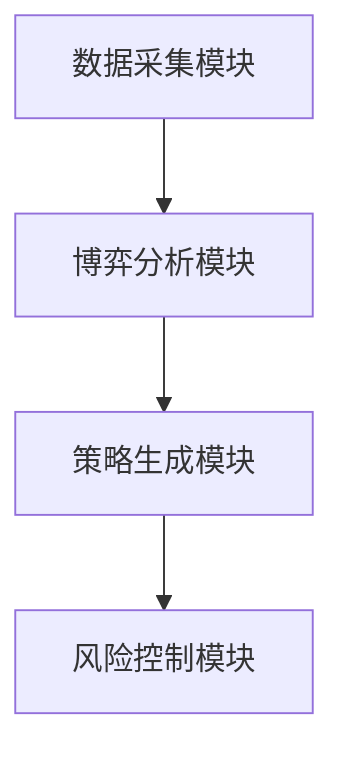
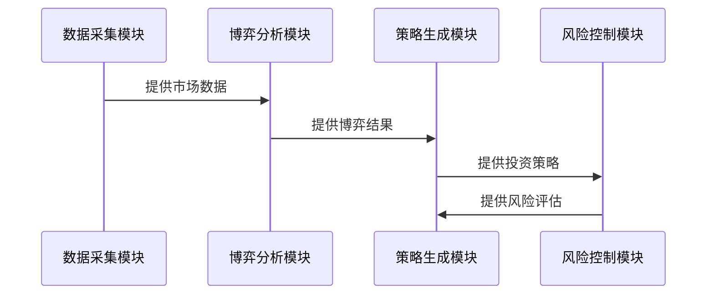

                 


```markdown
# 智能体间博弈理论在价值投资策略优化中的应用

> 关键词：智能体间博弈理论、价值投资策略、博弈论、多智能体系统、投资优化

> 摘要：本文探讨了智能体间博弈理论在价值投资策略优化中的应用，从博弈论的基本原理到智能体系统的构建，再到实际投资策略的优化，结合数学模型和系统架构设计，详细阐述了如何利用智能体间博弈理论提升投资决策的科学性和有效性。通过实际案例分析和系统实现，展示了该理论在复杂金融市场中的应用价值。

---

# 第一部分: 智能体间博弈理论基础

## 第1章: 博弈论与智能体概述

### 1.1 智能体的基本概念

#### 1.1.1 智能体的定义与特点
智能体（Agent）是指具有感知环境、自主决策、执行任务能力的实体。其特点包括：
- **自主性**：能够自主决策，无需外部干预。
- **反应性**：能够根据环境变化实时调整行为。
- **社会性**：能够与其他智能体或人类进行交互和协作。

#### 1.1.2 智能体的分类与应用场景
智能体可以分为：
- **简单反射型智能体**：基于当前输入做出反应，适用于简单任务。
- **基于模型的反射型智能体**：利用内部模型和环境信息进行决策，适用于复杂任务。
- **目标驱动型智能体**：根据目标导向进行决策，适用于复杂场景。

#### 1.1.3 智能体与传统投资策略的区别
传统投资策略依赖于历史数据和统计分析，而智能体可以通过实时市场数据和交互行为动态调整投资策略，具有更强的适应性和实时性。

### 1.2 博弈论的基本原理

#### 1.2.1 博弈论的定义与核心概念
博弈论是研究理性决策者在竞争与合作环境下的策略选择的数学理论。核心概念包括：
- **参与者**：博弈中的决策者。
- **策略**：参与者为实现目标所采取的行为方案。
- **收益**：参与者在博弈中的最终结果。

#### 1.2.2 博弈的参与者、规则与结果
- **参与者**：多个智能体和投资者。
- **规则**：市场机制和交易规则。
- **结果**：各参与者的收益或损失。

#### 1.2.3 博弈论在金融领域的应用
博弈论广泛应用于金融市场预测、投资决策优化等领域。通过模拟市场参与者的互动行为，可以更好地理解市场动态。

### 1.3 智能体间博弈的框架

#### 1.3.1 多智能体系统的定义
多智能体系统（Multi-Agent System, MAS）是由多个智能体组成的系统，智能体之间通过交互完成任务。

#### 1.3.2 智能体间的互动与博弈关系
智能体之间的博弈关系包括竞争和合作两种模式，具体取决于市场环境和个体目标。

#### 1.3.3 智能体博弈的数学模型
智能体博弈的数学模型通常包括状态空间、动作空间和收益函数三部分。

---

## 第2章: 智能体间博弈的数学模型

### 2.1 纳什均衡的定义与性质

#### 2.1.1 纳什均衡的定义
纳什均衡是博弈论中的一个关键概念，指在一个博弈中，所有参与者都采取最优策略，没有任何一方有动机单方面改变策略的状态。

#### 2.1.2 纳什均衡的稳定性分析
纳什均衡是稳定的，因为任何单方面改变策略的行为都会导致收益下降。

#### 2.1.3 纳什均衡的计算方法
纳什均衡的计算通常需要求解各参与者的策略组合，使其在给定其他参与者策略的情况下，无法通过单方面改变策略而提高收益。

### 2.2 极大极小算法与博弈树构建

#### 2.2.1 极大极小算法的基本原理
极大极小算法是一种用于求解博弈树中各节点最优策略的算法，适用于零和博弈。

#### 2.2.2 博弈树的构建与遍历
博弈树是将所有可能的决策路径以树状结构表示，每个节点代表一个决策点。

#### 2.2.3 博弈树的剪枝优化
通过剪枝技术减少不必要的计算，提高博弈树的遍历效率。

### 2.3 智能体博弈的数学公式

#### 2.3.1 博弈收益的数学表达式
收益函数表示智能体在博弈中的收益，通常为：
$$ R(a_1, a_2, ..., a_n) $$
其中，$a_i$ 表示第i个智能体选择的策略。

#### 2.3.2 纳什均衡的数学证明
在纳什均衡中，每个智能体的策略都是给定其他智能体策略下的最优反应，即：
$$ \forall i, \ R(a_i^*, a_{-i}) \geq R(a_i, a_{-i}) $$

#### 2.3.3 博弈树的数学建模
博弈树的数学建模通常涉及状态空间、动作空间和转移概率。

---

## 第3章: 价值投资策略的优化

### 3.1 传统价值投资策略的局限性

#### 3.1.1 传统价值投资的核心思想
传统价值投资注重基本面分析，寻找被市场低估的股票。

#### 3.1.2 传统策略在复杂市场中的不足
传统策略难以应对高频交易和算法交易的复杂市场环境。

#### 3.1.3 现代投资策略的多样化需求
现代投资策略需要结合多种方法，包括技术分析和大数据分析。

### 3.2 智能体间博弈对投资策略优化的启示

#### 3.2.1 博弈论在投资决策中的应用
博弈论可以帮助投资者预测市场参与者的策略行为。

#### 3.2.2 智能体间博弈对市场行为的模拟
通过模拟智能体之间的互动，可以更好地理解市场的动态变化。

#### 3.2.3 博弈论在风险控制中的作用
博弈论可以帮助投资者制定更加稳健的风险控制策略。

### 3.3 基于博弈论的价值投资策略优化模型

#### 3.3.1 模型的基本框架
模型框架包括市场环境、智能体行为、收益计算三个部分。

#### 3.3.2 模型的输入与输出
输入包括市场数据和智能体策略，输出包括投资决策和收益评估。

#### 3.3.3 模型的优化与验证
通过历史数据验证模型的有效性，并根据实际市场反馈进行优化。

---

## 第4章: 系统分析与架构设计

### 4.1 投资策略优化系统的总体架构

#### 4.1.1 系统的功能模块划分
系统主要模块包括数据采集、博弈分析、策略生成和风险控制。

#### 4.1.2 系统的输入输出设计
输入包括市场数据和智能体策略，输出包括投资决策和收益评估。

#### 4.1.3 系统的性能需求
系统需要具备高实时性和高计算能力，能够处理大量的市场数据。

### 4.2 系统的模块化设计

#### 4.2.1 数据采集模块
负责采集市场数据，包括股票价格、交易量等。

#### 4.2.2 博弈分析模块
分析智能体之间的博弈关系，计算纳什均衡。

#### 4.2.3 策略生成模块
根据博弈分析结果生成最优投资策略。

#### 4.2.4 风险控制模块
监控市场风险，调整投资策略以降低风险。

### 4.3 系统架构设计

#### 4.3.1 系统架构图


#### 4.3.2 系统接口设计
系统接口包括数据接口和策略接口，数据接口负责与数据源交互，策略接口负责与智能体交互。

#### 4.3.3 系统交互流程图


---

## 第5章: 项目实战

### 5.1 环境配置

#### 5.1.1 系统环境
需要安装Python、NumPy、Pandas、Matplotlib等库。

#### 5.1.2 数据源
使用Yahoo Finance API获取股票数据。

### 5.2 核心代码实现

#### 5.2.1 数据采集模块
```python
import pandas as pd
import numpy as np
from pandas_datareader import data as pdr
import matplotlib.pyplot as plt

def get_stock_data(ticker, start, end):
    df = pdr(ticker, 'yahoo', start, end)
    return df
```

#### 5.2.2 博弈分析模块
```python
def nash_equilibrium(payoff_matrix):
    # 计算纳什均衡
    n = len(payoff_matrix)
    strategies = [i for i in range(n)]
    for i in strategies:
        for j in strategies:
            if payoff_matrix[i][j] > payoff_matrix[k][j] for k != i:
                # 更改策略i为非最优
                pass
    return strategies
```

#### 5.2.3 策略生成模块
```python
def generate_strategy(data, equilibrium):
    # 根据纳什均衡生成投资策略
    strategy = []
    for i in range(len(data)):
        if equilibrium[i] == 'max':
            strategy.append('买入')
        else:
            strategy.append('卖出')
    return strategy
```

### 5.3 案例分析

#### 5.3.1 案例背景
选择两只股票进行分析，构建博弈模型。

#### 5.3.2 模型实现
```python
# 数据获取
data = get_stock_data('AAPL', '2020-01-01', '2023-12-31')
# 纳什均衡计算
payoff_matrix = np.array([[1, 2], [2, 1]])
equilibrium = nash_equilibrium(payoff_matrix)
# 策略生成
strategy = generate_strategy(data, equilibrium)
```

#### 5.3.3 实验结果
通过实验验证策略的有效性，展示收益与风险的对比。

---

## 第6章: 总结与展望

### 6.1 最佳实践 tips
- **数据质量**：确保数据的准确性和完整性。
- **模型优化**：根据市场变化不断优化博弈模型。
- **风险控制**：制定严格的风

