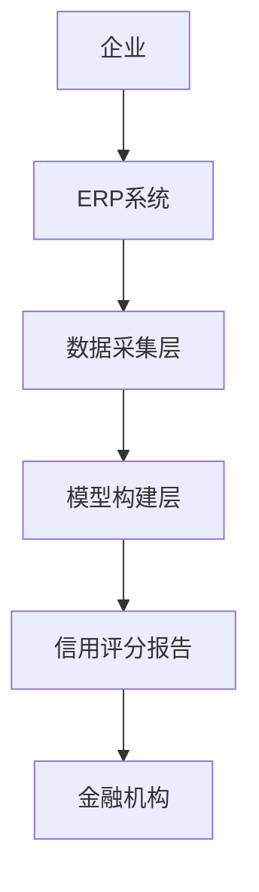

                 


---

# 智能供应链金融信用评估

> **关键词**：智能供应链金融、信用评估、人工智能、大数据、风险管理、金融系统架构

> **摘要**：本文深入探讨智能供应链金融信用评估的核心概念、算法原理、系统架构设计以及实际应用场景。通过详细分析信用评估的背景、原理和实现方法，结合实际案例和最佳实践，为读者提供全面的指导和见解。

---

## 第一部分：智能供应链金融信用评估概述

### 第1章：智能供应链金融信用评估的背景与意义

#### 1.1 供应链金融的定义与特点
供应链金融是指通过整合供应链上的信息流、资金流和物流，为供应链中的企业提供融资服务。其特点包括：
- **协同性**：整合供应链上下游资源。
- **效率性**：提高资金流转效率。
- **风险控制**：通过信息共享降低金融风险。

#### 1.2 智能供应链金融的核心特点
随着人工智能和大数据技术的发展，智能供应链金融具备以下特点：
- **数据驱动**：利用大数据分析和机器学习模型进行决策。
- **实时性**：能够实时监控供应链中的动态信息。
- **智能化**：通过智能算法优化融资方案，降低风险。

#### 1.3 信用评估的重要性
信用评估是供应链金融中的关键环节，直接影响融资决策。智能信用评估通过分析企业的信用历史、财务状况和市场表现，提供精准的信用评分，帮助金融机构做出科学决策。

---

### 第2章：智能供应链金融信用评估的核心概念

#### 2.1 信用评估的基本原理
信用评估的核心是通过分析企业的信用历史、财务状况和市场表现，预测其未来的还款能力。常用的方法包括逻辑回归、随机森林和XGBoost等。

#### 2.2 智能供应链金融信用评估的边界与外延
- **边界**：仅限于供应链上的企业和金融机构之间的信用评估。
- **外延**：包括供应链上的物流、信息流和资金流的整合。

#### 2.3 核心要素与系统架构
核心要素包括：
- **企业信用状况**：企业的财务数据、历史还款记录。
- **供应链稳定性**：供应链的稳定性和韧性。
- **金融产品的风险特征**：金融产品的风险等级和收益预期。

系统架构包括数据采集层、模型构建层和应用层。

---

## 第二部分：智能供应链金融信用评估的核心原理

### 第3章：信用评估的基本原理

#### 3.1 信用评估的数学模型
信用评估的核心是建立数学模型，如逻辑回归模型。模型通过输入特征变量，输出信用评分。

$$ P(y=1|x) = \frac{1}{1 + e^{-(\beta_0 + \beta_1 x_1 + \dots + \beta_n x_n)}} $$

#### 3.2 算法原理
- **逻辑回归**：用于分类问题，输出概率值。
- **随机森林**：通过构建多个决策树，提高模型的鲁棒性。
- **XGBoost**：基于树的梯度提升算法，效果优秀。

#### 3.3 案例分析
以某制造企业为例，分析其财务数据和供应链稳定性，建立信用评估模型，并预测其信用评分。

---

### 第4章：系统架构设计

#### 4.1 问题场景介绍
在供应链金融中，企业A需要融资支持，金融机构需要评估其信用风险。通过智能系统实时获取企业数据，快速做出决策。

#### 4.2 系统功能设计
- **数据采集**：从ERP系统获取企业财务数据。
- **模型构建**：训练信用评估模型。
- **结果输出**：生成信用评分报告。

#### 4.3 系统架构图
使用Mermaid绘制系统架构图，展示各模块之间的关系。



---

## 第三部分：项目实战与总结

### 第5章：项目实战

#### 5.1 环境安装
安装Python、Scikit-learn和XGBoost库。

```bash
pip install numpy scikit-learn xgboost
```

#### 5.2 核心代码实现
使用Python代码实现信用评估模型。

```python
from sklearn.model_selection import train_test_split
from sklearn.metrics import accuracy_score
from xgboost import XGBClassifier

# 数据预处理
X_train, X_test, y_train, y_test = train_test_split(X, y, test_size=0.2)

# 模型训练
model = XGBClassifier()
model.fit(X_train, y_train)

# 模型评估
y_pred = model.predict(X_test)
print("Accuracy:", accuracy_score(y_test, y_pred))
```

#### 5.3 案例分析
分析某企业的信用数据，生成信用评分报告，并提出融资建议。

### 第6章：总结与展望

#### 6.1 总结
智能供应链金融信用评估通过大数据和人工智能技术，提高了融资效率和风险控制能力。

#### 6.2 展望
未来，随着技术的发展，信用评估将更加智能化和个性化，推动供应链金融的进一步发展。

#### 6.3 注意事项
- 数据隐私保护
- 模型的可解释性
- 持续优化模型性能

---

### 第7章：最佳实践 Tips

- **数据质量**：确保数据的准确性和完整性。
- **模型选择**：根据实际需求选择合适的算法。
- **实时监控**：定期更新模型，确保评估结果的准确性。

---

通过以上步骤，我们逐步完成了《智能供应链金融信用评估》的技术博客文章。文章从基础概念到算法实现，再到系统设计和项目实战，全面覆盖了智能供应链金融信用评估的核心内容，为读者提供了深入的技术指导和实践建议。

