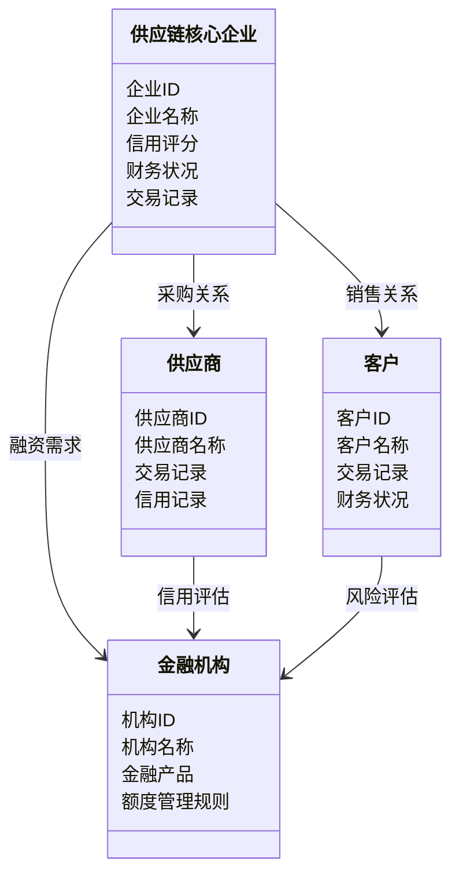
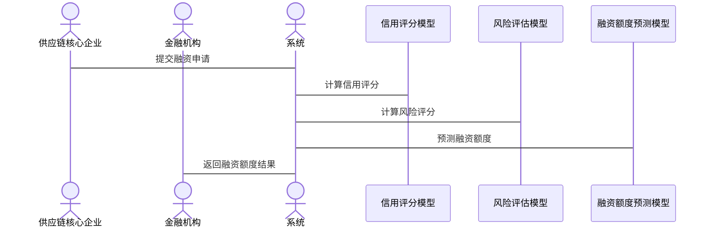

                 


# 智能供应链金融额度管理平台

> 关键词：智能供应链金融，额度管理，人工智能，大数据分析，区块链技术，金融风险管理

> 摘要：本文详细探讨了智能供应链金融额度管理平台的构建与应用，从背景、核心概念、算法原理、系统架构到项目实战，系统性地分析了该平台的设计与实现过程，结合实际案例，深入阐述了智能供应链金融额度管理平台的创新点与应用价值。

---

# 第1章: 智能供应链金融额度管理平台的背景与意义

## 1.1 供应链金融的定义与特点
### 1.1.1 供应链金融的定义
供应链金融（Supply Chain Finance，SCF）是指通过整合供应链上的企业（包括核心企业、供应商、客户等）的交易数据、信用数据和金融数据，为核心企业和其上下游企业提供融资支持的一种金融服务模式。

### 1.1.2 供应链金融的核心特点
1. **数据驱动**：依赖于供应链上的交易数据和信用数据。
2. **多方协同**：涉及核心企业、供应商、客户、金融机构等多个主体。
3. **融资灵活**：能够根据企业的实际需求提供灵活的融资方案。

### 1.1.3 供应链金融在现代经济中的作用
供应链金融通过优化资金流动，降低了企业的融资成本，提高了供应链的整体效率，是现代金融体系中不可或缺的一部分。

## 1.2 供应链金融额度管理的重要性
### 1.2.1 供应链金融额度管理的定义
供应链金融额度管理是指根据供应链上企业的信用状况、交易数据和金融数据，为其核定合适的融资额度的过程。

### 1.2.2 供应链金融额度管理的必要性
1. **风险控制**：通过科学的额度管理，降低金融风险。
2. **资源优化**：合理分配融资额度，提高资金使用效率。
3. **提升效率**：自动化、智能化的额度管理能够显著提高业务效率。

### 1.2.3 智能化管理对供应链金融的推动作用
智能化技术（如人工智能、大数据分析）的应用，使得供应链金融额度管理更加精准、高效，能够实时动态调整融资额度，满足企业的多样化需求。

## 1.3 智能供应链金融额度管理平台的提出
### 1.3.1 传统供应链金融额度管理的局限性
1. **效率低下**：依赖人工审核，耗时长且易出错。
2. **信息孤岛**：各参与方数据分散，难以有效整合。
3. **风险较高**：缺乏实时监控，难以及时发现和应对风险。

### 1.3.2 智能化技术在供应链金融中的应用前景
随着人工智能、大数据和区块链等技术的快速发展，智能化技术为供应链金融的优化提供了新的可能。

### 1.3.3 平台的核心目标与价值
智能供应链金融额度管理平台的核心目标是通过智能化技术，实现供应链金融额度管理的自动化、精准化和实时化，从而降低风险、提高效率、优化资源配置。

---

# 第2章: 智能供应链金融额度管理平台的核心概念与联系

## 2.1 核心概念解析
### 2.1.1 供应链金融的参与方
1. **核心企业**：供应链中的主导企业，通常是资金需求方。
2. **供应商**：为供应链核心企业提供原材料或服务的企业。
3. **客户**：供应链核心企业的下游买家。
4. **金融机构**：提供融资服务的银行或其他金融机构。

### 2.1.2 供应链金融额度管理的关键要素
1. **交易数据**：供应链上的交易记录。
2. **信用数据**：企业信用评分、历史违约记录等。
3. **金融数据**：企业的财务状况、资金流动情况等。

### 2.1.3 智能供应链金融的定义与特征
智能供应链金融是通过人工智能、大数据等技术，优化供应链金融流程，实现智能化决策和管理。

## 2.2 核心概念的联系与对比
### 2.2.1 供应链金融参与方的实体关系图（ER图）
```mermaid
er
  actor 供应链核心企业
  actor 金融机构
  actor 供应商
  actor 客户
  entity 供应链交易数据
  entity 企业信用数据
  entity 金融产品信息
  entity 额度管理规则
  relation 供应链核心企业-供应链交易数据
  relation 供应链核心企业-企业信用数据
  relation 供应链核心企业-金融产品信息
  relation 金融机构-金融产品信息
  relation 供应商-供应链交易数据
  relation 客户-供应链交易数据
```

### 2.2.2 核心概念的属性特征对比
| 概念 | 属性 | 特征 |
|------|------|------|
| 核心企业 | 信用评分 | 高 |
| 供应商 | 交易频率 | 高 |
| 客户 | 交易金额 | 大 |
| 金融机构 | 风险偏好 | 低 |

## 2.3 本章小结
本章通过对供应链金融参与方和关键要素的分析，构建了智能供应链金融额度管理平台的核心概念框架，为后续的算法设计和系统实现奠定了基础。

---

# 第3章: 智能供应链金融额度管理平台的算法原理

## 3.1 供应链金融额度管理的算法概述
智能供应链金融额度管理平台的核心算法包括信用评分模型、风险评估模型和融资额度预测模型。

## 3.2 信用评分模型
### 3.2.1 模型原理
信用评分模型通过对企业的历史交易数据、财务数据和信用记录进行分析，计算企业的信用评分。

### 3.2.2 模型公式
$$ \text{信用评分} = a \times \text{历史交易记录} + b \times \text{财务状况} + c \times \text{信用记录} $$

### 3.2.3 案例分析
假设某企业历史交易记录得分为80，财务状况得分为70，信用记录得分为90，则其信用评分为：
$$ \text{信用评分} = 0.3 \times 80 + 0.4 \times 70 + 0.3 \times 90 = 76 $$

## 3.3 风险评估模型
### 3.3.1 模型原理
风险评估模型通过对企业当前的财务状况、市场环境和供应链稳定性进行分析，评估企业的融资风险。

### 3.3.2 模型公式
$$ \text{风险评分} = d \times \text{财务状况} + e \times \text{市场环境} + f \times \text{供应链稳定性} $$

### 3.3.3 案例分析
假设某企业的财务状况得分为85，市场环境得分为75，供应链稳定性得分为90，则其风险评分为：
$$ \text{风险评分} = 0.4 \times 85 + 0.3 \times 75 + 0.3 \times 90 = 82.5 $$

## 3.4 融资额度预测模型
### 3.4.1 模型原理
融资额度预测模型基于企业的信用评分和风险评估结果，结合当前市场利率和企业需求，预测合理的融资额度。

### 3.4.2 模型公式
$$ \text{融资额度} = g \times \text{信用评分} + h \times \text{风险评分} + i \times \text{市场利率} $$

### 3.4.3 案例分析
假设某企业的信用评分为76，风险评分为82.5，市场利率为4.5%，则其融资额度为：
$$ \text{融资额度} = 0.5 \times 76 + 0.4 \times 82.5 + 0.1 \times 4.5 = 74.65 $$

## 3.5 算法实现流程
1. 收集企业数据。
2. 计算信用评分。
3. 评估风险评分。
4. 预测融资额度。

---

# 第4章: 智能供应链金融额度管理平台的系统分析与架构设计

## 4.1 系统功能设计
### 4.1.1 领域模型


### 4.1.2 系统架构设计


### 4.1.3 系统接口设计
1. 数据接口：与供应链核心企业、供应商、客户和金融机构的数据系统对接。
2. 用户接口：提供Web界面，供企业查询融资额度和金融机构查询企业信用状况。

### 4.1.4 系统交互流程


## 4.2 系统实现细节
### 4.2.1 数据源整合
系统需要整合供应链核心企业、供应商、客户和金融机构的多源数据，包括交易数据、信用数据和金融数据。

### 4.2.2 模型训练与优化
通过机器学习算法对信用评分模型、风险评估模型和融资额度预测模型进行训练和优化，确保模型的准确性和稳定性。

### 4.2.3 系统安全性
系统需要采用加密技术、访问控制和数据隔离等安全措施，确保数据的安全性和系统的稳定性。

---

# 第5章: 智能供应链金融额度管理平台的项目实战

## 5.1 实战背景
假设某制造企业需要为其供应链上的供应商和客户提供融资服务，希望通过智能供应链金融额度管理平台实现融资额度的自动化管理。

## 5.2 环境安装
1. 安装Python、Java、数据库（MySQL）和相关开发工具。
2. 配置API网关和云服务环境。

## 5.3 核心代码实现
### 5.3.1 信用评分模型实现
```python
def calculate_credit_score(history_transactions, financial_status, credit_history):
    return 0.3 * history_transactions + 0.4 * financial_status + 0.3 * credit_history
```

### 5.3.2 风险评估模型实现
```python
def calculate

