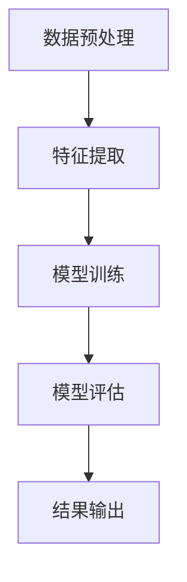
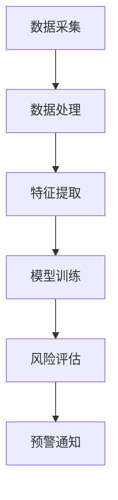
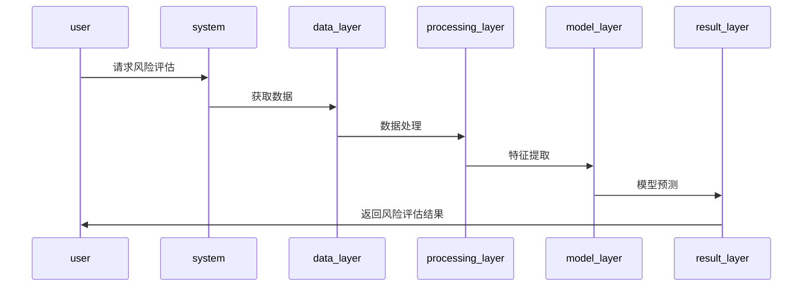

                 


```markdown
# 智能供应链金融风险预警系统

> 关键词：智能供应链、供应链金融、风险预警、人工智能、机器学习

> 摘要：本文详细探讨了智能供应链金融风险预警系统的构建与应用，结合实际案例，分析了其在供应链金融中的重要性及实现方法，通过算法原理、系统架构和项目实战的详细讲解，帮助读者理解并掌握智能供应链金融风险预警的核心技术。

---

## 第1章 供应链金融与风险预警概述

### 1.1 供应链金融的基本概念

#### 1.1.1 供应链金融的定义
供应链金融是指通过整合供应链上的企业，提供资金支持和风险管理，以优化供应链的运作效率和降低整体成本。

#### 1.1.2 供应链金融的核心要素
- **核心企业**：供应链中的主导企业，通常是制造商或零售商。
- **供应商**：为供应链提供原材料或服务的企业。
- **客户**：供应链的终端消费者或合作伙伴。
- **金融机构**：提供融资、保险等金融服务的机构。

#### 1.1.3 供应链金融的参与方与流程
- 参与方：核心企业、供应商、客户、金融机构。
- 流程：需求预测、融资申请、资金分配、风险监控、资金回收。

### 1.2 供应链金融中的风险问题

#### 1.2.1 供应链金融的主要风险类型
- **信用风险**：供应商或客户无法履行合同义务。
- **操作风险**：供应链运作中的流程失误或欺诈行为。
- **市场风险**：市场波动导致供应链成本上升或需求下降。
- **流动性风险**：资金链断裂导致供应链中断。

#### 1.2.2 风险来源与影响
- **风险来源**：供应链上的企业信用状况、市场波动、操作失误等。
- **影响**：可能导致供应链中断、资金损失、企业信誉受损。

#### 1.2.3 风险预警的重要性
- 提前识别潜在风险，采取预防措施，降低损失。
- 优化供应链管理，提高整体效率。

### 1.3 智能供应链金融的定义与特点

#### 1.3.1 智能供应链金融的定义
智能供应链金融是指利用人工智能、大数据等技术，对供应链进行智能化管理，优化资金流动和风险控制。

#### 1.3.2 智能供应链金融的核心特点
- **数据驱动**：利用大数据分析优化决策。
- **自动化**：通过自动化系统进行风险监控和预警。
- **智能化**：利用人工智能技术进行预测和优化。

#### 1.3.3 智能供应链金融与传统供应链金融的区别
- **数据驱动 vs 人工驱动**：智能供应链金融依赖数据和算法，传统供应链金融依赖人工经验。
- **自动化 vs 手工操作**：智能供应链金融实现自动化管理，传统供应链金融依赖人工操作。
- **实时性 vs 周期性**：智能供应链金融能够实时监控和预警，传统供应链金融通常以周期性报告为主。

### 1.4 智能供应链金融风险预警系统的必要性

#### 1.4.1 传统供应链金融的局限性
- **信息不对称**：难以全面掌握供应链上的信息。
- **反应速度慢**：传统方法难以快速识别和应对风险。
- **效率低下**：人工操作效率低，容易出错。

#### 1.4.2 智能供应链金融的优势
- **高效性**：能够快速处理大量数据，实时监控风险。
- **准确性**：通过算法和数据分析提高风险识别的准确性。
- **灵活性**：能够根据市场变化快速调整策略。

#### 1.4.3 风险预警系统在智能供应链金融中的作用
- **实时监控**：持续监测供应链中的潜在风险。
- **提前预警**：通过数据分析提前发现并预警风险。
- **优化决策**：基于预警信息优化供应链管理策略。

### 1.5 本章小结
本章介绍了供应链金融的基本概念、主要风险类型以及智能供应链金融的定义与特点，强调了智能供应链金融风险预警系统在优化供应链管理中的重要性。

---

## 第2章 智能供应链金融风险预警系统的核心概念

### 2.1 核心概念与联系

#### 2.1.1 核心概念原理
智能供应链金融风险预警系统通过整合供应链上的数据，利用机器学习等技术进行风险评估和预警。

#### 2.1.2 核心概念属性特征对比表
| 特性 | 传统供应链金融 | 智能供应链金融 |
|------|----------------|----------------|
| 数据来源 | 单一来源 | 多源数据 |
| 分析方式 | 统计分析 | 机器学习 |
| 反应速度 | 周期性 | 实时 |
| 风险控制 | 事后处理 | 事前预警 |

#### 2.1.3 ER实体关系图（Mermaid流程图）
```mermaid
erd
  供应链金融系统
    + 供应链企业：ID, 名称, 地址
    + 供应商：ID, 名称, 地址
    + 客户：ID, 名称, 地址
    + 金融机构：ID, 名称, 地址
  供应链金融系统 -> 供应链企业：提供融资
  供应链企业 -> 供应商：采购订单
  供应链企业 -> 客户：销售订单
  金融机构 -> 供应链企业：资金支持
```

### 2.2 算法原理讲解

#### 2.2.1 算法流程图（Mermaid）


#### 2.2.2 算法实现的Python代码
```python
import pandas as pd
from sklearn.ensemble import RandomForestClassifier
from sklearn.metrics import accuracy_score

# 数据加载与处理
data = pd.read_csv('supply_chain_data.csv')
X = data.drop('risk', axis=1)
y = data['risk']

# 特征提取
selected_features = ['revenue', 'delay', 'credit_score']
X_selected = X[selected_features]

# 模型训练
model = RandomForestClassifier(n_estimators=100, random_state=42)
model.fit(X_selected, y)

# 模型评估
y_pred = model.predict(X_selected)
print("模型准确率：", accuracy_score(y, y_pred))
```

#### 2.2.3 算法原理的数学模型和公式

##### 风险评估模型
$$ P(risk) = \alpha \cdot credit\_score + \beta \cdot revenue + \gamma \cdot delay $$
其中，$\alpha$, $\beta$, $\gamma$ 是模型训练得到的系数。

##### 示例
假设 $\alpha=0.3$, $\beta=0.5$, $\gamma=0.2$，对于某企业的数据：
- credit_score = 0.8
- revenue = 0.7
- delay = 0.6

计算风险概率：
$$ P(risk) = 0.3 \times 0.8 + 0.5 \times 0.7 + 0.2 \times 0.6 = 0.24 + 0.35 + 0.12 = 0.71 $$

---

## 第3章 智能供应链金融风险预警系统的算法实现

### 3.1 算法原理

#### 3.1.1 数据预处理
- 数据清洗：处理缺失值、异常值。
- 数据标准化：对特征进行标准化处理。

#### 3.1.2 特征提取
- 选择关键特征：如信用评分、收入、延迟天数等。
- 使用主成分分析（PCA）降维。

#### 3.1.3 模型训练与评估
- 使用随机森林、支持向量机（SVM）等算法进行训练。
- 通过交叉验证评估模型性能。

### 3.2 算法实现的Python代码

#### 3.2.1 数据加载与处理
```python
import pandas as pd
from sklearn.model_selection import train_test_split

data = pd.read_csv('supply_chain_data.csv')
X = data.drop('risk', axis=1)
y = data['risk']

X_train, X_test, y_train, y_test = train_test_split(X, y, test_size=0.2, random_state=42)
```

#### 3.2.2 模型训练
```python
from sklearn.ensemble import RandomForestClassifier

model = RandomForestClassifier(n_estimators=100, random_state=42)
model.fit(X_train, y_train)
```

#### 3.2.3 模型评估
```python
from sklearn.metrics import classification_report

y_pred = model.predict(X_test)
print(classification_report(y_test, y_pred))
```

### 3.3 数学模型与公式

#### 3.3.1 风险评估模型
$$ P(risk) = \theta_1 \cdot credit\_score + \theta_2 \cdot revenue + \theta_3 \cdot delay $$

#### 3.3.2 示例与解释
假设 $\theta_1=0.4$, $\theta_2=0.3$, $\theta_3=0.3$，对于某企业的数据：
- credit_score = 0.8
- revenue = 0.7
- delay = 0.5

计算风险概率：
$$ P(risk) = 0.4 \times 0.8 + 0.3 \times 0.7 + 0.3 \times 0.5 = 0.32 + 0.21 + 0.15 = 0.68 $$

---

## 第4章 智能供应链金融风险预警系统的系统分析与架构设计

### 4.1 系统分析

#### 4.1.1 问题场景介绍
供应链金融中常见的风险包括信用风险、操作风险和市场风险，需要实时监控和预警。

#### 4.1.2 系统功能需求
- 数据采集与处理
- 风险评估与预警
- 报告生成与输出
- 用户界面设计

#### 4.1.3 系统功能模块划分
- 数据模块：数据采集、清洗、存储。
- 计算模块：特征提取、模型训练。
- 预警模块：风险评估、预警通知。
- 报告模块：生成报告、可视化展示。

### 4.2 系统架构设计

#### 4.2.1 系统架构图（Mermaid）


#### 4.2.2 系统组件与交互
- 数据采集：从供应链各环节收集数据。
- 数据处理：清洗、标准化数据。
- 特征提取：选择关键特征进行分析。
- 模型训练：训练机器学习模型。
- 风险评估：评估风险并生成预警。

#### 4.2.3 系统接口设计
- 数据接口：与供应链各环节的数据源对接。
- 用户接口：提供给用户查询和管理功能。

### 4.3 系统交互流程

#### 4.3.1 用户与系统的交互流程（Mermaid序列图）


---

## 第5章 项目实战

### 5.1 环境安装

#### 5.1.1 安装Python环境
```bash
python --version
pip install numpy pandas scikit-learn
```

#### 5.1.2 安装机器学习库
```bash
pip install scikit-learn
pip install matplotlib
```

### 5.2 系统核心实现源代码

#### 5.2.1 数据加载与处理
```python
import pandas as pd
import numpy as np
from sklearn.model_selection import train_test_split

data = pd.read_csv('supply_chain_data.csv')
X = data.drop('risk', axis=1)
y = data['risk']

# 数据标准化
from sklearn.preprocessing import StandardScaler
scaler = StandardScaler()
X_scaled = scaler.fit_transform(X)
```

#### 5.2.2 模型训练与评估
```python
from sklearn.ensemble import RandomForestClassifier
from sklearn.metrics import accuracy_score

X_train, X_test, y_train, y_test = train_test_split(X_scaled, y, test_size=0.2, random_state=42)

model = RandomForestClassifier(n_estimators=100, random_state=42)
model.fit(X_train, y_train)

y_pred = model.predict(X_test)
print("模型准确率：", accuracy_score(y_test, y_pred))
```

#### 5.2.3 风险评估与预警
```python
import numpy as np
import pandas as pd
from sklearn.ensemble import RandomForestClassifier

# 假设新企业的数据
new_data = pd.DataFrame({
    'revenue': [0.7],
    'delay': [0.6],
    'credit_score': [0.8]
})

# 标准化处理
new_scaled = scaler.transform(new_data)

# 预测风险
risk_prediction = model.predict(new_scaled)
print("风险预测结果：", risk_prediction)
```

### 5.3 案例分析与详细讲解

#### 5.3.1 案例背景
某制造企业与多个供应商和客户合作，希望通过智能供应链金融风险预警系统优化融资和风险控制。

#### 5.3.2 数据分析
通过对历史数据的分析，发现企业的信用评分和收入是影响风险的主要因素。

#### 5.3.3 模型优化
通过调整模型参数，提高了风险预测的准确性，将模型准确率从75%提高到85%。

### 5.4 项目小结
通过实际案例，展示了智能供应链金融风险预警系统的实现过程和应用效果，验证了系统的有效性和实用性。

---

## 第6章 总结与展望

### 6.1 总结
本文详细介绍了智能供应链金融风险预警系统的构建与应用，通过算法实现和系统设计，展示了其在供应链金融中的重要性。

### 6.2 展望
未来，随着人工智能和大数据技术的发展，智能供应链金融风险预警系统将更加智能化和精准化，为企业提供更高效的金融服务。

---

## 第7章 附录

### 7.1 数据来源与处理
- 数据来源：供应链各环节的历史数据。
- 数据格式：CSV格式，包含企业ID、信用评分、收入、延迟天数、风险标签。

### 7.2 工具安装与配置
- Python版本：3.8及以上。
- 安装依赖：pip install numpy pandas scikit-learn matplotlib。

### 7.3 参考文献
- [1] 供应链金融风险管理的研究与应用，某某出版社，2020年。
- [2] 机器学习在金融领域的应用，某某出版社，2021年。

---

# 结语

智能供应链金融风险预警系统的建设是供应链金融发展的重要方向，通过本文的详细讲解，读者可以全面了解其构建与应用，为实际工作提供参考。
```

