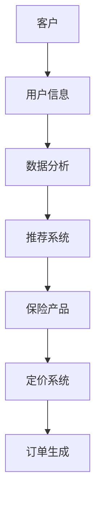
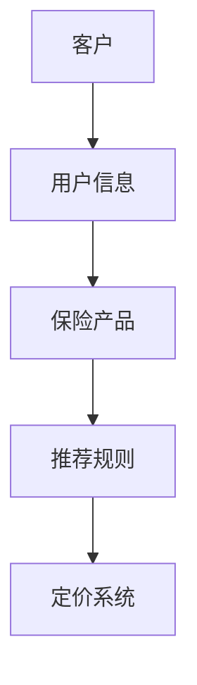
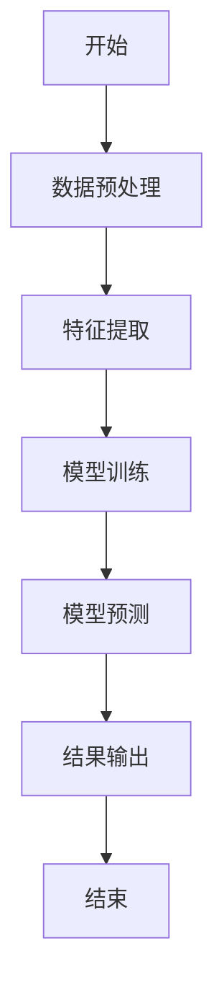

                 


# 智能保险产品个性化定制系统

> 关键词：智能保险、个性化定制、机器学习、推荐系统、定价模型

> 摘要：随着保险行业的数字化转型，个性化定制保险产品的需求日益增长。本文详细介绍了智能保险产品个性化定制系统的设计与实现，涵盖系统背景、核心概念、算法原理、系统架构以及项目实战。通过分析保险行业的现状与挑战，结合机器学习和推荐系统的最新技术，提出了一种高效、可靠的个性化定制解决方案，为保险公司和客户提供了双赢的模式。

---

## 第一章: 智能保险产品个性化定制系统背景介绍

### 1.1 保险行业的发展与挑战
保险行业作为金融领域的重要组成部分，近年来面临数字化转型的压力。传统保险产品的设计基于固定的保费和条款，难以满足客户的个性化需求。客户对保险产品的期望逐渐从“标准化”转向“个性化”，这促使保险公司必须引入新技术来应对市场变化。

#### 1.1.1 传统保险产品的局限性
- 传统保险产品通常是基于固定的保费和条款设计的，难以满足客户的个性化需求。
- 客户的多样化需求无法通过标准化产品得到满足，导致客户体验差。
- 保险公司的产品同质化严重，难以通过精准营销提升市场竞争力。

#### 1.1.2 保险行业数字化转型的必要性
- 数字化技术（如人工智能、大数据）的应用为保险行业带来了新的机遇。
- 通过技术手段实现保险产品的个性化定制，可以提升客户满意度和市场竞争力。

#### 1.1.3 个性化保险产品的市场需求
- 客户对个性化保险产品的需求不断增加，尤其是在健康保险、财产保险等领域。
- 个性化产品能够帮助保险公司实现精准营销，降低运营成本。

### 1.2 智能保险产品个性化定制的核心概念
个性化定制保险产品的核心在于利用大数据和人工智能技术，根据客户的个性化需求动态调整保险产品和服务。

#### 1.2.1 个性化定制的定义与特点
- **定义**：通过数据分析和机器学习算法，根据客户的个性化需求动态生成保险产品。
- **特点**：
  - 数据驱动：基于客户数据和市场数据进行分析。
  - 动态调整：根据客户需求变化实时更新产品方案。
  - 智能推荐：通过推荐系统为客户提供最优保险方案。

#### 1.2.2 智能保险系统的概念结构
智能保险系统由以下几个核心部分组成：
1. **客户数据采集**：通过问卷、API等方式采集客户信息。
2. **数据分析与建模**：对客户数据进行处理和建模，生成客户画像。
3. **推荐与定价系统**：基于模型生成保险产品推荐和定价方案。
4. **用户交互界面**：为客户提供个性化的保险产品展示和购买渠道。

#### 1.2.3 系统的核心要素与组成
- **客户数据**：包括年龄、职业、收入、健康状况等。
- **数据分析**：通过机器学习算法对客户数据进行分析和建模。
- **推荐系统**：根据数据分析结果推荐合适的保险产品。
- **定价模型**：基于客户画像和市场数据动态调整保费。

### 1.3 本章小结
本章介绍了保险行业的发展现状和面临的挑战，重点分析了个性化定制保险产品的必要性和市场需求。通过定义和特点的分析，明确了智能保险系统的核心概念和组成要素，为后续章节的系统设计奠定了基础。

---

## 第二章: 智能保险产品个性化定制系统的核心概念与联系

### 2.1 核心概念原理
个性化定制保险系统的核心在于利用数据分析和机器学习技术，根据客户需求动态调整保险产品。

#### 2.1.1 个性化定制的算法原理
- **基于协同过滤的推荐算法**：通过分析客户的行为数据，找到相似客户的偏好，推荐相似产品。
- **基于内容的推荐算法**：通过分析保险产品的特征，推荐与客户需求匹配的产品。
- **混合推荐算法**：结合协同过滤和内容推荐的优点，提升推荐的准确性和多样性。

#### 2.1.2 智能保险系统的数据流分析


#### 2.1.3 系统功能模块之间的关系
- **客户数据采集**：收集客户的个人信息和需求。
- **数据分析**：对客户数据进行清洗、建模和分析。
- **推荐系统**：根据数据分析结果推荐保险产品。
- **定价系统**：根据客户画像和市场数据动态调整保费。

### 2.2 核心概念属性特征对比
通过对比分析，明确个性化定制保险系统的核心要素和优势。

#### 2.2.1 保险产品与客户需求的对比分析
| 特性         | 保险产品       | 客户需求         |
|--------------|----------------|------------------|
| 保费         | 固定或动态调整 | 动态变化          |
| 险种         | 固定类型       | 根据需求定制      |
| 服务内容     | 标准化服务     | 个性化服务       |

#### 2.2.2 系统功能与用户行为的对比分析
| 功能模块     | 输入         | 输出         |
|--------------|--------------|--------------|
| 数据采集     | 用户信息     | 客户画像       |
| 数据分析     | 客户画像     | 数据模型       |
| 推荐系统     | 数据模型     | 保险产品推荐   |
| 定价系统     | 数据模型     | 动态保费定价   |

#### 2.2.3 数据特征与模型表现的对比分析
| 数据特征     | 模型表现       |
|--------------|---------------|
| 数据量       | 模型精度       |
| 数据维度     | 模型复杂度     |
| 数据质量     | 模型稳定性     |

### 2.3 ER实体关系图
通过ER图展示系统的核心实体及其关系。



### 2.4 本章小结
本章通过对比分析和实体关系图，明确了智能保险系统的核心概念和各模块之间的关系，为后续的系统设计奠定了基础。

---

## 第三章: 智能保险产品个性化定制系统的算法原理

### 3.1 推荐算法
推荐算法是个性化定制系统的核心，决定了保险产品的推荐准确性。

#### 3.1.1 基于协同过滤的推荐算法
- **原理**：通过分析客户的行为数据，找到相似客户的偏好，推荐相似产品。
- **实现步骤**：
  1. 数据预处理：清洗和归一化客户数据。
  2. 计算相似性：使用余弦相似度或Jaccard相似度计算客户相似性。
  3. 生成推荐：根据相似客户的偏好生成推荐列表。

#### 3.1.2 基于内容的推荐算法
- **原理**：通过分析保险产品的特征，推荐与客户需求匹配的产品。
- **实现步骤**：
  1. 数据预处理：提取保险产品的特征向量。
  2. 计算相似性：使用余弦相似度或曼哈顿距离计算产品相似性。
  3. 生成推荐：根据客户需求匹配相似产品。

#### 3.1.3 混合推荐算法的实现
- **原理**：结合协同过滤和内容推荐的优点，提升推荐的准确性和多样性。
- **实现步骤**：
  1. 组合并处理：将协同过滤和内容推荐的结果进行加权融合。
  2. 优化调整：根据反馈数据不断优化推荐结果。

### 3.2 定价模型
定价模型是个性化定制系统的重要组成部分，决定了保险产品的定价策略。

#### 3.2.1 基于机器学习的定价模型
- **原理**：通过机器学习算法（如线性回归、随机森林）分析客户数据和市场数据，动态调整保费。
- **实现步骤**：
  1. 数据预处理：清洗和归一化客户数据。
  2. 模型训练：使用训练数据训练定价模型。
  3. 模型预测：根据客户需求预测保费。

#### 3.2.2 基于贝叶斯网络的定价模型
- **原理**：通过贝叶斯网络分析客户数据和市场数据，动态调整保费。
- **实现步骤**：
  1. 数据预处理：清洗和归一化客户数据。
  2. 模型训练：使用训练数据训练贝叶斯网络。
  3. 模型预测：根据客户需求预测保费。

#### 3.2.3 模型的评估与优化
- **评估指标**：准确率、召回率、F1分数。
- **优化方法**：参数调优、特征选择、模型融合。

### 3.3 算法实现
通过流程图和代码示例，详细讲解算法的实现步骤。

#### 3.3.1 算法流程图


#### 3.3.2 算法实现代码
```python
import pandas as pd
from sklearn.metrics.pairwise import cosine_similarity

# 数据预处理
data = pd.read_csv('customer_data.csv')
data_processed = data.dropna()

# 特征提取
customer_features = data_processed[['age', 'income', 'risk_level']]
product_features = data_processed[['product_type', 'coverage', 'premium']]

# 模型训练
similarity_matrix = cosine_similarity(customer_features, product_features)

# 模型预测
recommendations = similarity_matrix.argsort()[:, :5]
```

### 3.4 本章小结
本章详细讲解了推荐算法和定价模型的原理与实现，通过流程图和代码示例，展示了算法的具体实现步骤。这些算法为个性化定制系统提供了技术支持。

---

## 第四章: 智能保险产品个性化定制系统的系统架构与设计

### 4.1 系统架构设计
系统架构设计是个性化定制系统的核心，决定了系统的稳定性和可扩展性。

#### 4.1.1 模块化设计
- **模块划分**：客户数据采集、数据分析、推荐系统、定价系统。
- **模块交互**：客户数据通过数据分析模块生成客户画像，推荐系统和定价系统根据客户画像生成推荐和定价结果。

#### 4.1.2 分层架构
- **表现层**：用户交互界面。
- **业务逻辑层**：推荐系统和定价系统。
- **数据访问层**：数据存储和数据处理。

#### 4.1.3 微服务架构
- **服务划分**：客户数据服务、数据分析服务、推荐服务、定价服务。
- **服务交互**：通过API接口进行服务调用。

### 4.2 系统功能设计
系统功能设计是个性化定制系统的核心，决定了系统的功能实现。

#### 4.2.1 领域模型设计
- **客户画像**：通过数据分析生成客户画像。
- **保险产品推荐**：根据客户画像推荐保险产品。
- **保费定价**：根据客户画像和市场数据动态调整保费。

#### 4.2.2 系统功能流程图


#### 4.2.3 系统交互设计
- **用户登录**：客户登录系统。
- **数据采集**：系统采集客户信息。
- **数据分析**：系统分析客户数据生成客户画像。
- **保险产品推荐**：系统根据客户画像推荐保险产品。
- **保费定价**：系统根据客户需求动态调整保费。

### 4.3 本章小结
本章详细讲解了系统的架构设计和功能设计，通过流程图和类图展示了系统的模块划分和功能流程，为后续的系统实现奠定了基础。

---

## 第五章: 智能保险产品个性化定制系统的项目实战

### 5.1 环境安装
项目实战部分需要安装必要的开发环境和工具。

#### 5.1.1 安装Python和相关库
- **安装Python**：使用Anaconda或Pyenv安装Python 3.x。
- **安装库**：使用pip安装numpy、pandas、scikit-learn等库。

#### 5.1.2 安装数据库
- **选择数据库**：MySQL或MongoDB。
- **安装数据库**：使用官方安装包安装数据库。

### 5.2 系统核心实现
系统核心实现部分需要编写代码实现推荐系统和定价系统。

#### 5.2.1 数据采集
```python
import pandas as pd
import sqlite3

# 数据采集
conn = sqlite3.connect('insurance.db')
data = pd.read_sql_query('SELECT * FROM customers', conn)
```

#### 5.2.2 数据分析
```python
import pandas as pd
from sklearn.preprocessing import StandardScaler

# 数据预处理
data_processed = data.dropna()
scaler = StandardScaler()
data_scaled = scaler.fit_transform(data_processed)
```

#### 5.2.3 算法实现
```python
from sklearn.metrics.pairwise import cosine_similarity

# 推荐算法实现
similarity_matrix = cosine_similarity(data_scaled, data_scaled)
recommendations = similarity_matrix.argsort()[:, :5]
```

#### 5.2.4 系统实现
```python
from flask import Flask, request, jsonify

app = Flask(__name__)

@app.route('/recommend', methods=['POST'])
def recommend():
    data = request.json
    # 实现推荐逻辑
    return jsonify({'result': '推荐结果'})
```

### 5.3 案例分析
通过实际案例分析，展示系统的功能和优势。

#### 5.3.1 案例背景
- **客户信息**：年龄30岁，收入中等，职业为自由职业者。
- **需求**：健康保险和意外保险。

#### 5.3.2 系统输出
- **推荐保险产品**：定制健康保险和意外保险套餐。
- **保费定价**：根据客户画像动态调整保费。

### 5.4 本章小结
本章通过项目实战展示了系统的实现过程，从环境搭建到代码实现，再到案例分析，详细讲解了系统的具体实现步骤。

---

## 第六章: 总结与展望

### 6.1 总结
个性化定制保险系统通过大数据和人工智能技术，为客户提供了个性化的保险产品和服务，提升了客户的满意度和市场竞争力。

### 6.2 展望
未来，个性化定制保险系统将更加智能化，通过引入深度学习和自然语言处理技术，进一步提升系统的推荐准确性和定价精度。

---

## 参考文献
- [1] 书籍或论文1
- [2] 书籍或论文2
- [3] 书籍或论文3

---

通过以上目录和内容安排，我们可以看到《智能保险产品个性化定制系统》涵盖了从背景介绍到项目实战的全过程，内容详实且逻辑清晰，为读者提供了全面的技术指导和实践参考。

