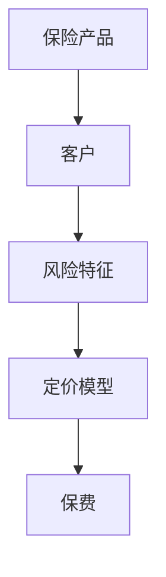
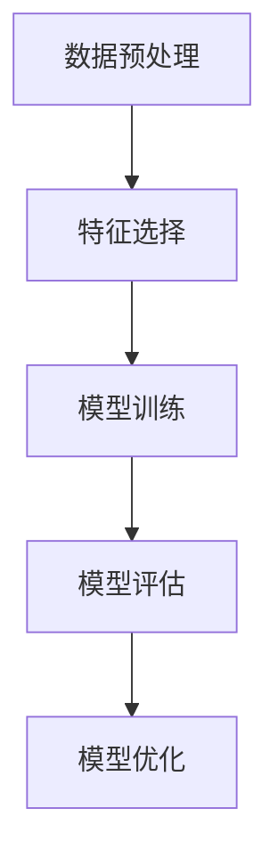
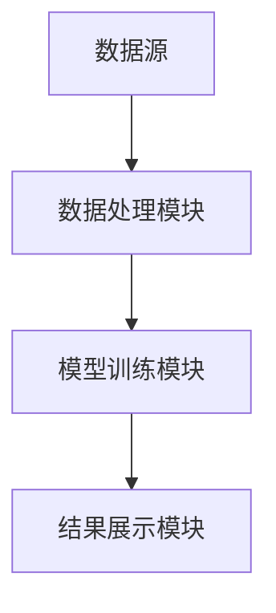
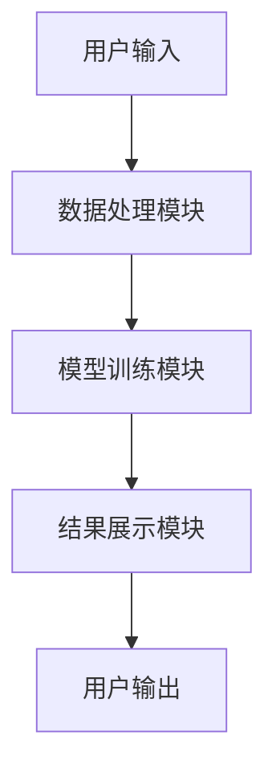

                 

# 《智能保险产品定价模型》

---

## 关键词：
智能保险定价模型、人工智能、机器学习、保险精算、数据驱动定价、风险管理

---

## 摘要：
智能保险产品定价模型是一种基于人工智能和大数据分析的创新方法，旨在通过机器学习算法优化保险产品的定价策略。本文将从保险定价的基本概念出发，分析传统定价方法的局限性，探讨智能定价模型的核心原理、算法实现、系统架构及实际应用场景。通过详细的技术分析和实战案例，揭示智能保险定价模型在现代保险行业中的重要价值和未来发展趋势。

---

# 第一部分：智能保险产品定价模型概述

## 第1章：保险产品定价的基本概念与问题背景

### 1.1 保险定价的基本概念
- 1.1.1 保险产品的定义与分类
- 1.1.2 保险定价的核心要素
- 1.1.3 保险定价的常见方法

### 1.2 传统保险定价方法的局限性
- 1.2.1 基于经验费率法的局限性
- 1.2.2 基于精算模型的局限性
- 1.2.3 传统定价方法的适用场景与不足

### 1.3 智能保险定价的必要性与优势
- 1.3.1 数据驱动定价的优势
- 1.3.2 人工智能在保险定价中的作用
- 1.3.3 智能定价的未来发展趋势

### 1.4 本章小结

---

## 第2章：智能保险定价模型的核心概念与联系

### 2.1 智能定价模型的定义与构成
- 2.1.1 数据特征
- 2.1.2 模型算法
- 2.1.3 优化目标

### 2.2 智能定价模型的核心要素对比
- 2.2.1 数据特征对比表
- 2.2.2 模型算法对比表
- 2.2.3 优化目标对比表

### 2.3 智能定价模型的ER实体关系图

### 2.4 本章小结

---

## 第3章：智能保险定价模型的算法原理

### 3.1 常见的智能定价算法
- 3.1.1 线性回归模型
- 3.1.2 决策树模型
- 3.1.3 支持向量机模型
- 3.1.4 神经网络模型

### 3.2 算法选择与优化
- 3.2.1 算法选择的原则
- 3.2.2 算法优化方法
- 3.2.3 算法调优的注意事项

### 3.3 算法实现的流程

### 3.4 算法实现的Python代码示例
- 3.4.1 数据预处理代码
- 3.4.2 特征选择代码
- 3.4.3 模型训练代码
- 3.4.4 模型评估代码

### 3.5 本章小结

---

## 第4章：智能保险定价模型的数学模型与公式

### 4.1 线性回归模型的数学公式
- 4.1.1 线性回归的基本公式
- 4.1.2 最小二乘法的优化目标
- 4.1.3 线性回归的假设检验

### 4.2 逻辑回归模型的数学公式
- 4.2.1 逻辑回归的sigmoid函数
- 4.2.2 逻辑回归的对数似然函数
- 4.2.3 逻辑回归的参数优化

### 4.3 决策树模型的数学公式
- 4.3.1 决策树的熵公式
- 4.3.2 决策树的基尼指数
- 4.3.3 决策树的剪枝算法

### 4.4 神经网络模型的数学公式
- 4.4.1 神经网络的激活函数
- 4.4.2 神经网络的损失函数
- 4.4.3 神经网络的反向传播算法

### 4.5 本章小结

---

## 第5章：智能保险定价模型的系统架构设计

### 5.1 系统分析与设计
- 5.1.1 系统目标
- 5.1.2 系统功能需求
- 5.1.3 系统非功能需求

### 5.2 系统架构设计
- 5.2.1 数据源模块
- 5.2.2 数据处理模块
- 5.2.3 模型训练模块
- 5.2.4 结果展示模块

### 5.3 系统架构图

### 5.4 系统接口设计
- 5.4.1 数据接口
- 5.4.2 模型接口
- 5.4.3 用户接口

### 5.5 系统交互流程图

### 5.6 本章小结

---

## 第6章：智能保险定价模型的项目实战

### 6.1 项目背景与目标
- 6.1.1 项目背景
- 6.1.2 项目目标

### 6.2 环境安装与配置
- 6.2.1 安装Python
- 6.2.2 安装相关库（如scikit-learn、xgboost、keras等）
- 6.2.3 数据集准备

### 6.3 核心代码实现
- 6.3.1 数据预处理代码
- 6.3.2 特征选择代码
- 6.3.3 模型训练代码
- 6.3.4 模型评估代码

### 6.4 实战案例分析
- 6.4.1 数据分析与可视化
- 6.4.2 模型对比与优化
- 6.4.3 实际应用中的注意事项

### 6.5 本章小结

---

## 第7章：智能保险定价模型的最佳实践与未来展望

### 7.1 最佳实践
- 7.1.1 数据质量的重要性
- 7.1.2 模型调优的技巧
- 7.1.3 模型部署的注意事项

### 7.2 未来展望
- 7.2.1 新兴技术对智能定价模型的影响
- 7.2.2 智能定价模型的行业应用趋势
- 7.2.3 智能定价模型的创新方向

### 7.3 本章小结

---

## 参考文献
- 本文参考了相关领域的学术论文、技术文档和行业报告，具体内容可参考文末引用。

---

## 附录
- 附录A：常见保险定价算法的优缺点对比表
- 附录B：智能保险定价模型的数学公式汇总
- 附录C：项目实战的完整代码

