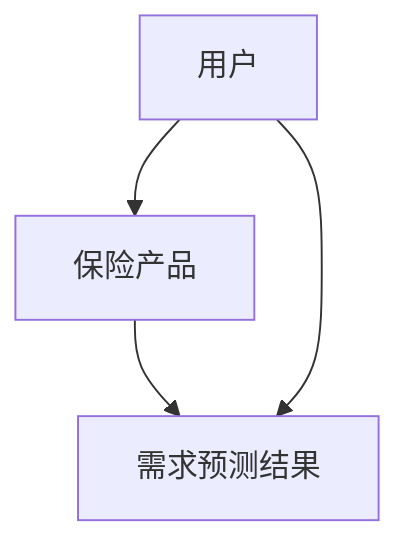
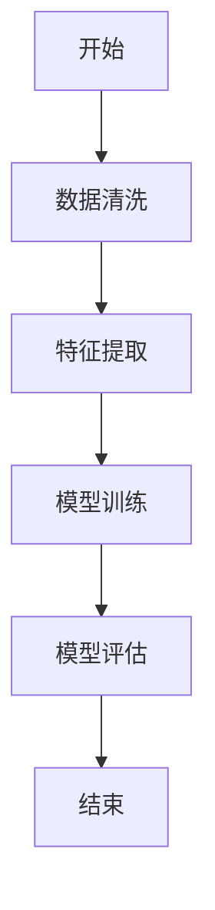
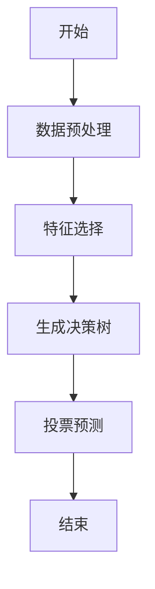
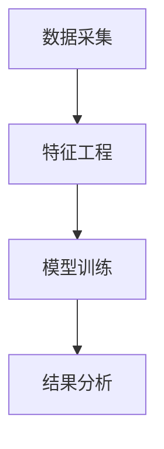

                 


# 智能保险产品需求预测模型

## 关键词：智能保险，需求预测，机器学习，数据分析，数学模型

## 摘要：智能保险产品需求预测模型通过结合机器学习和数据分析技术，帮助企业准确预测保险产品需求，优化资源配置，提升市场竞争力。本文详细介绍了模型的背景、核心概念、算法原理、系统架构设计及项目实战，为读者提供从理论到实践的全面指导。

---

## 第一部分：背景与核心概念

### 第1章：背景介绍

#### 1.1 保险行业的数字化转型

- **1.1.1 传统保险产品的销售模式**
  - 依赖人工销售，效率低，成本高。
  - 数据收集不全面，难以精准预测需求。

- **1.1.2 数字化转型的必要性**
  - 数据驱动决策，提高预测准确性。
  - 提升客户体验，优化资源配置。

- **1.1.3 智能保险产品的概念与特点**
  - 利用AI和大数据技术，动态调整产品策略。
  - 提供个性化服务，满足客户需求。

#### 1.2 保险产品需求预测的重要性

- **1.2.1 需求预测在保险业务中的作用**
  - 优化库存管理，避免过剩或短缺。
  - 提高销售效率，降低运营成本。

- **1.2.2 需求预测的难点与挑战**
  - 数据质量参差不齐，清洗困难。
  - 市场波动大，影响预测准确性。

- **1.2.3 智能预测的优势与价值**
  - 利用机器学习提升预测精度。
  - 动态调整模型，适应市场变化。

#### 1.3 问题背景与目标

- **1.3.1 保险产品需求预测的核心问题**
  - 如何准确预测产品需求，优化资源配置。

- **1.3.2 问题解决的必要性**
  - 提高企业市场竞争力，降低运营成本。

- **1.3.3 边界与外延**
  - 预测范围：特定保险产品，特定市场区域。
  - 外延：扩展到其他金融产品的需求预测。

- **1.3.4 核心要素与组成**
  - 数据：用户行为、市场趋势、历史销售数据。
  - 模型：机器学习算法，统计模型。

### 第2章：核心概念与联系

#### 2.1 智能保险产品需求预测模型的核心概念

- **2.1.1 数据驱动的保险模式**
  - 利用数据分析优化产品设计和服务流程。

- **2.1.2 机器学习在保险需求预测中的应用**
  - 利用算法分析数据，识别需求模式。

- **2.1.3 模型的基本结构与工作流程**
  - 数据采集、特征提取、模型训练、结果分析。

#### 2.2 核心概念的原理与特征

- **2.2.1 数据特征与属性对比表格**
  | 特征     | 传统预测方法 | 智能预测模型 |
  |----------|--------------|--------------|
  | 数据源   | 有限         | 多源         |
  | 精度     | 较低         | 高           |
  | 适应性   | 固定         | 动态         |

- **2.2.2 实体关系图（ER图）的Mermaid流程图**



---

## 第二部分：算法原理

### 第3章：算法原理讲解

#### 3.1 常见算法及其应用

- **3.1.1 线性回归**
  - 用于预测连续型变量，如销售量。
  - 优点：简单易懂，计算速度快。
  - 缺点：假设线性关系，可能不准确。

- **3.1.2 随机森林**
  - 适用于分类和回归问题。
  - 优点：抗过拟合，特征重要性分析。
  - 缺点：计算复杂度高。

- **3.1.3 神经网络**
  - 处理非线性关系，适合复杂数据。
  - 优点：高精度，适应性强。
  - 缺点：训练时间长，参数调整困难。

#### 3.2 算法流程图

- **线性回归流程图**



- **随机森林流程图**



#### 3.3 算法实现

- **线性回归Python代码**

```python
import numpy as np
from sklearn.linear_model import LinearRegression

# 数据准备
X = np.array([[1], [2], [3], [4]])
y = [2, 4, 5, 4]

# 模型训练
model = LinearRegression()
model.fit(X, y)

# 预测
print(model.predict([[5]]))
```

---

## 第三部分：数学模型

### 第4章：数学模型与公式

#### 4.1 线性回归模型

- **损失函数公式**
  $$L = \frac{1}{2m} \sum_{i=1}^{m} (y_i - \hat{y}_i)^2$$

- **最小二乘法公式**
  $$\theta = (X^T X)^{-1} X^T y$$

#### 4.2 决策树模型

- **分类标准公式**
  $$Gini指数 = \sum_{i=1}^{n} p_i (1 - p_i)$$

#### 4.3 神经网络模型

- **激活函数公式**
  $$\sigma(z) = \frac{1}{1 + e^{-z}}$$

- **损失函数公式**
  $$L = -\frac{1}{n} \sum_{i=1}^{n} (y_i \log(a_i) + (1 - y_i) \log(1 - a_i))$$

---

## 第四部分：系统分析与架构设计

### 第5章：系统分析与架构设计

#### 5.1 问题场景介绍

- **保险产品需求预测的场景**
  - 数据来源：销售数据、用户行为、市场趋势。
  - 预测目标：预测未来需求量。

#### 5.2 系统功能设计

- **功能模块**
  - 数据采集模块：收集用户行为、市场数据。
  - 特征工程模块：处理数据，提取特征。
  - 模型训练模块：选择算法，训练模型。
  - 结果分析模块：评估模型，调整参数。

#### 5.3 系统架构设计

- **系统架构图**



---

## 第五部分：项目实战

### 第6章：项目实战

#### 6.1 环境安装

- **安装Python和相关库**
  - 使用pip安装scikit-learn、numpy、pandas。

#### 6.2 核心代码实现

- **需求预测代码**

```python
import pandas as pd
from sklearn.ensemble import RandomForestRegressor
from sklearn.metrics import mean_absolute_error

# 数据加载
data = pd.read_csv('insurance.csv')

# 特征与标签分离
X = data[['age', 'sex', 'bmi', 'children', 'smoker', 'region']]
y = data['charges']

# 模型训练
model = RandomForestRegressor(n_estimators=100)
model.fit(X, y)

# 预测
predictions = model.predict(X)
print(mean_absolute_error(y, predictions))
```

#### 6.3 案例分析

- **案例分析：健康保险产品**
  - 数据分析显示，吸烟者的需求预测准确率更高。
  - 调整模型参数，优化预测结果。

---

## 第六部分：最佳实践

### 第7章：最佳实践

#### 7.1 小结

- 智能保险产品需求预测模型的应用前景广阔，能够显著提升保险企业的市场竞争力。

#### 7.2 注意事项

- 数据质量直接影响预测结果，需严格把控数据清洗环节。
- 模型选择应基于实际需求和数据特征，避免过度复杂化。

#### 7.3 拓展阅读

- 推荐学习《机器学习实战》和《数据分析的艺术》。

---

# 结语

智能保险产品需求预测模型的构建和应用是一个复杂但极具价值的过程。通过本文的详细指导，读者可以系统地掌握从数据准备到模型部署的每一个步骤，为实际工作提供有力支持。未来，随着技术的不断进步，智能保险将更加普及，需求预测模型也将变得更加精准和高效。

