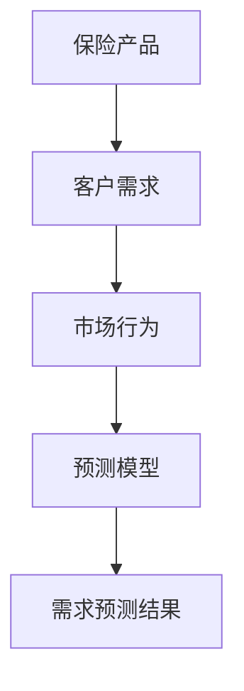
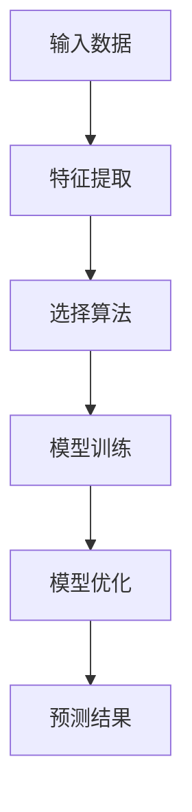
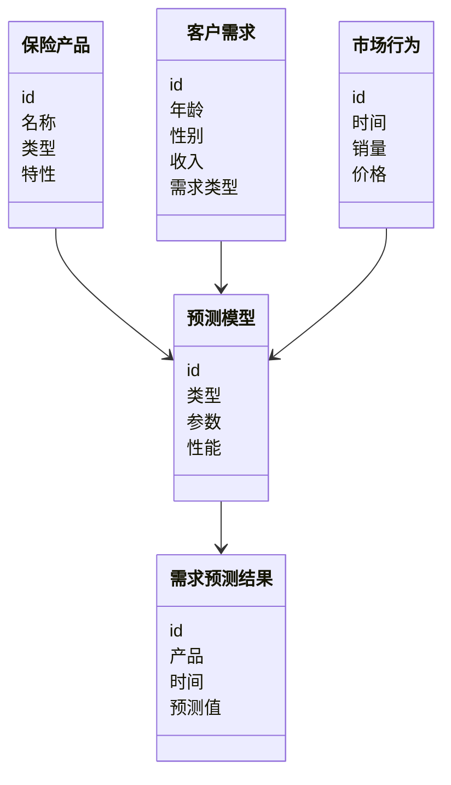
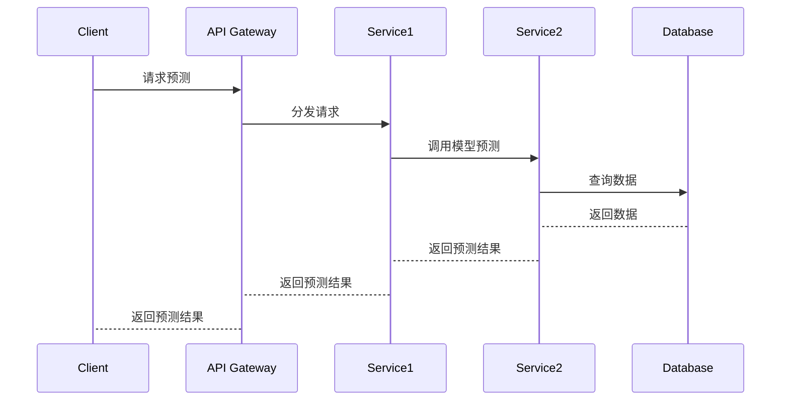

                 


# 智能保险产品需求预测模型优化

## 关键词：智能保险，需求预测，机器学习，深度学习，模型优化

## 摘要：智能保险产品需求预测模型优化是利用先进的数据分析和人工智能技术，通过构建和优化数学模型，来预测保险产品的市场需求。本文将从背景、核心概念、算法原理、系统架构设计、项目实战等方面，详细探讨智能保险产品需求预测模型的构建与优化方法，帮助读者深入了解如何利用技术手段提升保险产品的市场预测能力。

---

# 第1章: 智能保险产品需求预测模型概述

## 1.1 保险行业的数字化转型

### 1.1.1 保险行业的现状与挑战

保险行业作为传统金融行业的重要组成部分，正在经历数字化转型的浪潮。随着科技的发展，保险产品的种类和需求呈现多样化和个性化趋势，传统的基于经验的预测方法已经难以满足市场快速变化的需求。

**主要挑战：**
- 数据量大，数据复杂性高
- 市场需求变化快，预测难度大
- 传统预测方法的局限性

### 1.1.2 数字化转型的必要性

数字化转型是保险行业适应市场需求、提升竞争力的必然选择。通过引入人工智能、大数据等技术，保险公司可以更精准地预测产品需求，优化产品设计和营销策略。

### 1.1.3 智能保险产品的定义与特点

智能保险产品是指通过智能化技术（如人工智能、大数据分析等）设计和优化的保险产品。其特点包括：
- 数据驱动：基于大量数据进行分析和预测
- 智能化：通过机器学习算法优化预测模型
- 个性化：能够根据客户需求提供定制化的产品和服务

## 1.2 需求预测的重要性

### 1.2.1 需求预测在保险产品开发中的作用

需求预测是保险产品开发的重要环节，它能够帮助保险公司：
- 准确把握市场需求，优化产品设计
- 降低产品开发风险
- 提高市场竞争力

### 1.2.2 需求预测的常见方法与挑战

常见的需求预测方法包括：
- 时间序列分析
- 回归分析
- 统计模型

**挑战：**
- 数据质量问题
- 模型过拟合
- 预测精度不足

### 1.2.3 智能化需求预测的优势

智能化需求预测通过引入机器学习和深度学习技术，能够显著提高预测精度和效率。其优势包括：
- 高精度预测
- 实时更新模型
- 多维度数据分析

## 1.3 智能保险产品需求预测模型的必要性

### 1.3.1 数据驱动的决策优势

数据驱动的决策能够帮助保险公司基于大量数据进行科学决策，提高预测的准确性和可靠性。

### 1.3.2 智能模型在需求预测中的应用

智能模型能够处理复杂的数据关系，发现传统方法难以捕捉的模式，从而提高预测的准确性。

### 1.3.3 模型优化的现实意义

通过优化模型，保险公司可以更准确地预测市场需求，优化资源配置，提高整体运营效率。

## 1.4 本章小结

本章从保险行业的数字化转型出发，分析了智能保险产品需求预测模型的背景、重要性及其必要性。通过介绍智能化需求预测的优势，为后续模型构建和优化奠定了基础。

---

## 1.2 智能保险产品需求预测模型的核心概念与联系

### 1.2.1 数据特征与需求预测

**数据特征的定义与分类：**
- 数据特征是指能够反映数据特性的属性，常见的数据特征包括人口统计特征、行为特征、历史购买记录等。

**数据特征对需求预测的影响：**
- 数据特征的质量和数量直接影响预测模型的性能。
- 通过选择合适的特征，可以提高模型的预测精度。

**数据特征的选择与预处理：**
- 特征选择：通过分析数据特征的重要性，选择对预测目标影响较大的特征。
- 特征预处理：对数据进行标准化、归一化等处理，提高模型的训练效果。

### 1.2.2 模型结构与优化方法

**模型结构的定义与分类：**
- 线性模型：如线性回归
- 非线性模型：如决策树、随机森林
- 深度学习模型：如神经网络

**模型优化的基本原理：**
- 通过调整模型参数，优化模型的性能。
- 常见的优化方法包括梯度下降、随机梯度下降等。

### 1.2.3 模型评价指标与选择

**评价指标的定义与计算：**
- 均方误差（MSE）
- 平均绝对误差（MAE）
- R平方值（R²）

**指标选择对模型性能的影响：**
- 不同的评价指标适用于不同的场景，选择合适的指标有助于评估模型的性能。

### 1.2.4 模型选择的优化策略

**优化策略：**
- 基于交叉验证的模型选择
- 基于网格搜索的超参数优化
- 基于贝叶斯优化的模型调优

### 1.2.5 数据特征与模型选择的对比表格

| 特征类型 | 数据特征 | 模型选择 |
|----------|----------|----------|
| 线性关系  | 支持     | 线性回归 |
| 非线性关系 | 不支持   | 决策树   |
| 高维数据  | 支持     | 神经网络 |

### 1.2.6 实体关系图（Mermaid）



## 1.4 本章小结

本章详细介绍了智能保险产品需求预测模型的核心概念与联系，包括数据特征、模型结构、评价指标等方面。通过对这些核心概念的分析，为后续的模型构建和优化奠定了理论基础。

---

## 1.3 智能保险产品需求预测模型的算法原理

### 1.3.1 线性回归模型

**线性回归的基本原理：**
线性回归是一种简单且常用的回归分析方法。它假设自变量与因变量之间存在线性关系。

**线性回归的数学模型：**
$$ y = \beta_0 + \beta_1 x + \epsilon $$
其中，$y$ 是因变量，$x$ 是自变量，$\beta_0$ 和 $\beta_1$ 是回归系数，$\epsilon$ 是误差项。

**线性回归的应用与局限性：**
- 应用：适用于线性关系的数据预测
- 局限性：无法处理非线性关系，预测精度有限

### 1.3.2 随机森林模型

**随机森林的基本原理：**
随机森林是一种基于决策树的集成学习方法，通过构建多棵决策树并进行投票或平均，提高模型的准确性和稳定性。

**随机森林的数学模型：**
$$ y = \text{median}(\{f_i(x)\}_{i=1}^n) $$
其中，$f_i$ 是第 $i$ 棵决策树的预测函数。

**随机森林的应用与优化：**
- 应用：适用于高维数据和复杂数据关系的预测
- 优化：通过调整树的深度、样本抽取比例等参数，优化模型性能

### 1.3.3 神经网络模型

**神经网络的基本原理：**
神经网络是一种模拟人脑神经网络结构的模型，通过多层感知机（MLP）进行非线性特征学习和分类。

**神经网络的数学模型：**
$$ y = f(Wx + b) $$
其中，$W$ 是权重矩阵，$x$ 是输入向量，$b$ 是偏置项，$f$ 是激活函数（如ReLU、sigmoid等）。

**神经网络的应用与训练方法：**
- 应用：适用于复杂数据关系的预测
- 训练方法：使用反向传播（BP）算法和梯度下降优化

### 1.3.4 深度学习模型

**深度学习的基本原理：**
深度学习是一种基于神经网络的机器学习方法，通过多层网络结构学习数据的高层次特征。

**深度学习的数学模型：**
$$ y = f(W_1x + b_1)W_2f(W_1x + b_1) + b_2 $$
其中，$f$ 是激活函数，$W_1$、$W_2$ 是权重矩阵，$b_1$、$b_2$ 是偏置项。

**深度学习的应用与挑战：**
- 应用：适用于复杂数据关系的预测
- 挑战：计算资源需求高，模型易过拟合

### 1.3.5 算法流程图（Mermaid）



### 1.3.6 Python 实现代码示例

```python
import pandas as pd
import numpy as np
from sklearn.model_selection import train_test_split
from sklearn.linear_model import LinearRegression
from sklearn.ensemble import RandomForestRegressor
from sklearn.neural_network import MLPRegressor
from sklearn.metrics import mean_squared_error

# 加载数据
data = pd.read_csv('insurance.csv')

# 数据预处理
X = data[['age', 'sex', 'bmi', 'children', 'smoker', 'region']]
y = data['charges']

# 划分训练集和测试集
X_train, X_test, y_train, y_test = train_test_split(X, y, test_size=0.2, random_state=42)

# 线性回归模型
lr_model = LinearRegression()
lr_model.fit(X_train, y_train)
y_pred_lr = lr_model.predict(X_test)
mse_lr = mean_squared_error(y_test, y_pred_lr)

# 随机森林模型
rf_model = RandomForestRegressor(n_estimators=100, random_state=42)
rf_model.fit(X_train, y_train)
y_pred_rf = rf_model.predict(X_test)
mse_rf = mean_squared_error(y_test, y_pred_rf)

# 神经网络模型
nn_model = MLPRegressor(hidden_layer_sizes=(100, 100), random_state=42)
nn_model.fit(X_train, y_train)
y_pred_nn = nn_model.predict(X_test)
mse_nn = mean_squared_error(y_test, y_pred_nn)

# 模型比较
print(f"线性回归 MSE: {mse_lr}")
print(f"随机森林 MSE: {mse_rf}")
print(f"神经网络 MSE: {mse_nn}")
```

### 1.3.7 本章小结

本章详细介绍了智能保险产品需求预测模型的算法原理，包括线性回归、随机森林、神经网络和深度学习等算法的原理、数学模型和Python实现。通过对比不同算法的优缺点，帮助读者选择合适的算法进行模型构建和优化。

---

## 1.4 智能保险产品需求预测模型的系统分析与架构设计

### 1.4.1 系统功能设计

**领域模型（Mermaid 类图）**



**系统架构设计（Mermaid 架构图）**


**系统接口设计（Mermaid 序列图）**



### 1.4.2 系统功能设计

**功能模块：**
- 数据采集与处理模块
- 模型训练与优化模块
- 预测结果展示与分析模块

### 1.4.3 系统架构设计

**分层架构：**
- 数据层：负责数据的存储和管理
- 业务逻辑层：负责业务逻辑的处理和模型的调用
- 表现层：负责用户界面的展示和交互

### 1.4.4 本章小结

本章从系统功能设计、架构设计和接口设计等多个方面，详细探讨了智能保险产品需求预测系统的构建过程。通过Mermaid图的展示，帮助读者更好地理解系统的整体结构和各模块之间的关系。

---

## 1.5 智能保险产品需求预测模型的项目实战

### 1.5.1 环境安装与配置

**Python 环境：**
- 安装 Python 3.8+
- 安装必要的库：numpy、pandas、scikit-learn、xgboost、keras、tensorflow

**工具安装：**
- 安装 Jupyter Notebook 或 VS Code
- 安装 Mermaid 插件（用于生成图表）

### 1.5.2 数据采集与预处理

**数据来源：**
- 公共数据集（如Kaggle）
- 内部数据（如客户数据库）

**数据预处理步骤：**
1. 数据清洗：处理缺失值、重复值
2. 数据转换：特征编码、标准化
3. 数据分割：训练集、验证集、测试集

### 1.5.3 模型实现与优化

**模型实现：**
- 线性回归模型
- 随机森林模型
- 神经网络模型

**模型优化：**
- 调参：网格搜索、随机搜索
- 正则化：L1、L2 正则化
- 集成学习：投票法、堆叠法

### 1.5.4 案例分析与结果解读

**案例分析：**
假设我们有一个保险产品的销售数据集，包含以下特征：
- 客户年龄
- 客户性别
- 客户收入
- 客户购买记录
- 市场促销活动

**模型预测结果：**
通过训练模型，我们可以预测未来某个时间段内某保险产品的销售量。

**结果解读：**
- 模型预测值与实际值的对比
- 模型性能指标的分析
- 模型优化建议

### 1.5.5 本章小结

本章通过实际项目实战，详细讲解了智能保险产品需求预测模型的实现过程，包括环境配置、数据预处理、模型实现与优化等内容。通过案例分析，帮助读者更好地理解和掌握模型的应用。

---

## 1.6 智能保险产品需求预测模型的优化与展望

### 1.6.1 模型优化策略

**优化策略：**
- 超参数调优：网格搜索、随机搜索
- 特征工程：特征选择、特征组合
- 模型集成：投票法、堆叠法
- 模型解释性：SHAP、LIME

### 1.6.2 模型优化效果评估

**优化效果评估：**
- 比较优化前后的模型性能指标
- 分析预测结果的准确性和稳定性

### 1.6.3 智能保险产品需求预测的未来展望

**未来展望：**
- 更加智能化的预测模型：如基于Transformer的模型
- 更加个性化的预测服务：基于客户行为分析的实时预测
- 更加广泛的应用场景：从单产品预测到多产品组合预测

### 1.6.4 本章小结

本章总结了智能保险产品需求预测模型的优化策略，并展望了未来的发展方向。通过对模型优化策略的分析，帮助读者进一步提升模型的预测精度和效率。

---

## 1.7 总结与展望

### 总结

智能保险产品需求预测模型的构建与优化是一个复杂而重要的过程。通过本文的介绍，我们了解了智能保险产品需求预测模型的背景、核心概念、算法原理、系统架构设计以及项目实战等内容。这些内容为我们提供了构建和优化智能保险产品需求预测模型的理论基础和实践指导。

### 展望

随着人工智能技术的不断发展，智能保险产品需求预测模型将变得更加智能化和个性化。未来，我们可以通过引入更先进的算法和技术，进一步提高模型的预测精度和效率，为保险行业的发展提供更有力的支持。

---

## 结语

智能保险产品需求预测模型的优化是一个不断进步和发展的过程。通过对本文的学习，读者可以掌握构建和优化智能保险产品需求预测模型的核心方法和技巧，为实际应用提供有力的理论支持和实践指导。希望本文能够为读者在智能保险产品需求预测领域的研究和实践提供有价值的参考。

