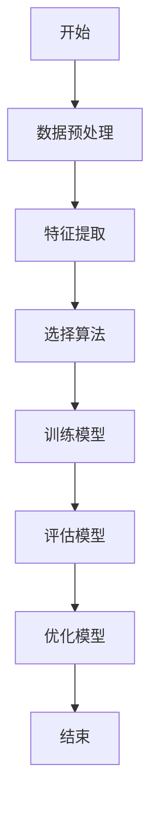
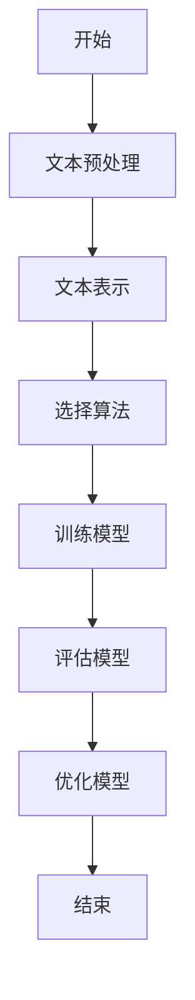
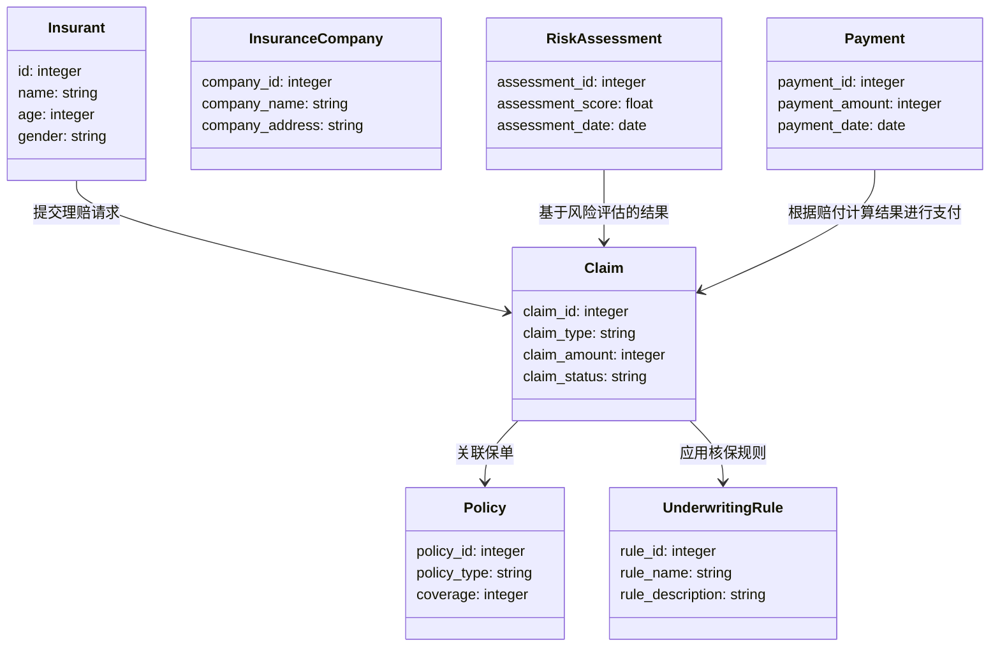
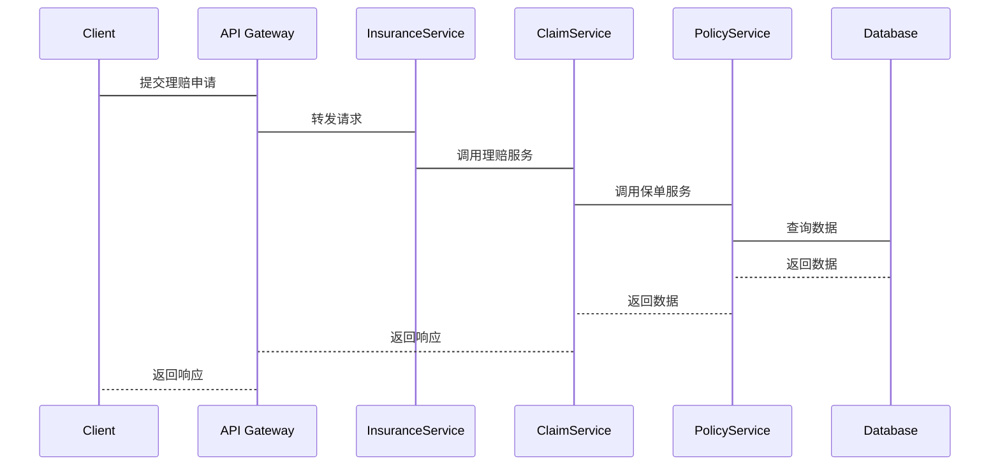

                 


```markdown
# 智能保险理赔处理系统

> 关键词：智能保险，理赔处理，机器学习，自然语言处理，系统架构

> 摘要：本文介绍了一种基于人工智能技术的智能保险理赔处理系统，详细阐述了其核心概念、算法原理、系统架构以及实际项目实现。通过分析传统保险理赔处理的痛点，提出了一种利用机器学习和自然语言处理技术优化理赔流程的方法，结合实际案例，展示了系统的实现过程和应用效果。

---

## 第一部分: 智能保险理赔处理系统概述

## 第1章: 保险理赔处理系统背景介绍

### 1.1 保险理赔处理的背景与问题背景

#### 1.1.1 传统保险理赔处理流程的痛点
传统保险理赔处理流程通常涉及大量的手动操作，包括 claims submission、资料审核、风险评估、赔付计算等。这些问题导致传统理赔处理存在以下痛点：
- **效率低**：人工审核速度慢，理赔周期长。
- **错误率高**：人工审核容易出现疏漏，导致错误赔付或漏赔。
- **成本高**：需要大量的人力资源投入，运营成本高。
- **用户体验差**：客户等待时间长，理赔体验不佳。

#### 1.1.2 智能化理赔处理的需求与趋势
随着人工智能技术的快速发展，利用智能技术优化保险理赔处理流程成为行业趋势。智能化理赔处理的需求主要体现在以下方面：
- **提高效率**：通过自动化处理减少人工干预，缩短理赔周期。
- **降低错误率**：利用机器学习算法提高理赔判断的准确性。
- **降低成本**：减少人力资源投入，降低运营成本。
- **提升用户体验**：通过智能化服务提高客户满意度。

#### 1.1.3 智能保险理赔处理系统的定义与目标
智能保险理赔处理系统是一种基于人工智能技术的自动化理赔处理系统，旨在通过机器学习、自然语言处理等技术，实现保险理赔流程的智能化、自动化。其目标是：
- 提高理赔处理效率。
- 减少人工错误，提高理赔准确性。
- 优化客户体验，缩短理赔周期。
- 降低运营成本。

### 1.2 保险理赔处理系统的核心概念

#### 1.2.1 保险理赔处理的核心流程
保险理赔处理的核心流程包括以下步骤：
1. **claims submission**：客户提交理赔申请。
2. **资料审核**：系统对提交的资料进行审核，包括验证资料的真实性、完整性。
3. **风险评估**：根据历史数据和当前情况评估理赔风险。
4. **赔付计算**：根据保险条款和实际损失计算赔付金额。
5. **赔付审批**：对赔付方案进行审批，确认赔付金额。
6. **赔付支付**：完成赔付金额的支付。

#### 1.2.2 智能保险理赔处理系统的边界与外延
智能保险理赔处理系统的边界包括：
- **输入边界**：客户提交的理赔申请、相关资料。
- **输出边界**：审核结果、赔付金额、赔付支付。

系统的外延包括与之交互的其他系统，如客户管理系统、支付系统等。

#### 1.2.3 核心要素与组成结构
智能保险理赔处理系统的核心要素包括：
- **数据源**：客户提交的理赔申请、历史数据、外部数据（如天气数据、医疗数据）。
- **算法模型**：用于理赔判断的机器学习模型、自然语言处理模型。
- **规则引擎**：用于处理理赔规则的规则引擎。
- **交互界面**：客户与系统交互的界面。

### 1.3 本章小结
本章介绍了保险理赔处理系统的背景、痛点以及智能化处理的需求和目标。通过分析传统理赔处理流程的痛点，提出了智能保险理赔处理系统的定义和目标，并详细描述了系统的组成结构和核心要素。

---

## 第二部分: 智能保险理赔处理系统的核心概念与联系

## 第2章: 智能保险理赔处理系统的核心原理

### 2.1 系统核心原理概述

#### 2.1.1 人工智能在保险理赔中的应用
人工智能在保险理赔中的应用主要体现在以下几个方面：
- **理赔判断**：利用机器学习算法对理赔请求进行分类和判断。
- **文本分析**：利用自然语言处理技术对理赔相关的文本资料进行分析和理解。
- **风险评估**：利用大数据分析技术对理赔风险进行评估和预测。

#### 2.1.2 机器学习在理赔处理中的作用
机器学习在理赔处理中的作用主要体现在以下几个方面：
- **分类**：用于判断理赔请求的类型和风险等级。
- **回归**：用于预测赔付金额。
- **聚类**：用于识别相似的理赔案例，优化处理流程。

#### 2.1.3 自然语言处理在理赔文本分析中的应用
自然语言处理在理赔文本分析中的应用包括：
- **文本分类**：对理赔相关的文本进行分类，如分类为“理赔成功”或“理赔失败”。
- **信息抽取**：从理赔文本中提取关键信息，如事故地点、时间、涉及人员等。
- **实体识别**：识别文本中的实体，如人名、地点、组织机构等。

### 2.2 核心概念的属性特征对比

#### 2.2.1 不同保险产品的理赔规则对比
不同保险产品的理赔规则存在差异，主要体现在以下几个方面：
- **理赔范围**：不同保险产品的理赔范围不同。
- **理赔条件**：不同保险产品的理赔条件不同。
- **赔付比例**：不同保险产品的赔付比例不同。

#### 2.2.2 不同理赔场景的处理流程对比
不同理赔场景的处理流程存在差异，主要体现在以下几个方面：
- **理赔申请方式**：线上申请或线下申请。
- **理赔资料要求**：不同场景需要提交的资料不同。
- **理赔处理时间**：不同场景的处理时间不同。

#### 2.2.3 不同算法在理赔处理中的性能对比
不同算法在理赔处理中的性能对比可以从以下几个方面进行：
- **准确率**：不同算法的准确率不同。
- **处理速度**：不同算法的处理速度不同。
- **可解释性**：不同算法的可解释性不同。

### 2.3 系统ER实体关系图

#### 2.3.1 实体关系图的构建
以下是智能保险理赔处理系统的ER实体关系图：

```mermaid
erDiagram
    insurant{
        identifier: id
        attribute: name, age, gender
    }
    claim{
        identifier: claim_id
        attribute: claim_type, claim_amount, claim_status
    }
    policy{
        identifier: policy_id
        attribute: policy_type, coverage
    }
    insurance_company{
        identifier: company_id
        attribute: company_name, company_address
    }
    underwriting_rule{
        identifier: rule_id
        attribute: rule_name, rule_description
    }
    risk_assessment{
        identifier: assessment_id
        attribute: assessment_score, assessment_date
    }
    payment{
        identifier: payment_id
        attribute: payment_amount, payment_date
    }
    insurant --> claim : 提交理赔请求
    claim --> policy : 关联保单
    claim --> underwriting_rule : 应用核保规则
    risk_assessment --> claim : 基于风险评估的结果
    payment --> claim : 根据赔付计算结果进行支付
```

#### 2.3.2 实体关系图的分析
通过上述ER实体关系图可以看出，智能保险理赔处理系统涉及的主要实体包括：保单、理赔请求、风险评估、赔付支付等。各实体之间的关系清晰，能够有效支持系统的功能实现。

#### 2.3.3 实体关系图的应用
ER实体关系图在系统设计中具有重要意义，它可以帮助我们清晰地理解系统的数据结构和业务流程，为后续的系统设计和实现提供基础。

### 2.4 本章小结
本章详细介绍了智能保险理赔处理系统的核心原理，包括人工智能在理赔处理中的应用、机器学习和自然语言处理在理赔处理中的作用，以及系统的ER实体关系图。通过对比分析不同保险产品、理赔场景和算法的特征，进一步明确了系统的设计思路。

---

## 第三部分: 智能保险理赔处理系统的算法原理

## 第3章: 算法原理与实现

### 3.1 保险理赔处理中的常用算法

#### 3.1.1 机器学习算法
在保险理赔处理中常用的机器学习算法包括：
- **决策树**：用于分类和回归。
- **随机森林**：用于分类和回归。
- **支持向量机（SVM）**：用于分类。

#### 3.1.2 自然语言处理算法
在自然语言处理中常用的算法包括：
- **词袋模型（Bag of Words）**：用于文本表示。
- **TF-IDF**：用于关键词提取。
- **神经网络模型（如 LSTM、BERT）**：用于文本理解和生成。

#### 3.1.3 图算法与规则引擎
图算法和规则引擎在保险理赔处理中用于处理复杂的业务规则和关系，如：
- **规则引擎**：用于实现复杂的理赔规则。
- **图数据库**：用于处理复杂的关联关系。

### 3.2 算法实现流程

#### 3.2.1 数据预处理
数据预处理是算法实现的重要步骤，主要包括：
- **数据清洗**：处理缺失值、重复值、异常值。
- **特征提取**：从数据中提取有用的特征。
- **数据标准化**：对数据进行标准化处理。

#### 3.2.2 模型训练
模型训练是算法实现的核心步骤，主要包括：
- **选择算法**：根据具体任务选择合适的算法。
- **训练模型**：利用训练数据训练模型。
- **调优模型**：通过参数调优提高模型性能。

#### 3.2.3 模型评估与优化
模型评估与优化是算法实现的重要步骤，主要包括：
- **评估指标**：如准确率、召回率、F1值等。
- **交叉验证**：通过交叉验证评估模型的泛化性能。
- **优化模型**：通过优化算法或调整参数提高模型性能。

### 3.3 保险理赔处理算法的Mermaid流程图

#### 3.3.1 机器学习算法流程图
以下是机器学习算法的流程图：



#### 3.3.2 自然语言处理算法流程图
以下是自然语言处理算法的流程图：



### 3.4 保险理赔处理算法的Python代码示例

#### 3.4.1 机器学习算法示例代码
以下是一个基于决策树的保险理赔分类的Python代码示例：

```python
import pandas as pd
from sklearn.tree import DecisionTreeClassifier
from sklearn.metrics import accuracy_score

# 数据加载
data = pd.read_csv('insurance_claims.csv')

# 特征选择
features = ['age', 'coverage', 'area']
target = 'fraud_flag'

# 数据分割
X = data[features]
y = data[target]

# 模型训练
model = DecisionTreeClassifier()
model.fit(X, y)

# 预测
y_pred = model.predict(X)

# 评估
print(f'准确率: {accuracy_score(y, y_pred)}')
```

#### 3.4.2 自然语言处理算法示例代码
以下是一个基于词袋模型的保险理赔文本分类的Python代码示例：

```python
from sklearn.feature_extraction.text import CountVectorizer
from sklearn.naive_bayes import MultinomialNB
from sklearn.metrics import accuracy_score

# 数据加载
data = pd.read_csv('insurance_claims_text.csv')

# 文本预处理
text_data = data['claim_description']

# 特征提取
vectorizer = CountVectorizer()
X = vectorizer.fit_transform(text_data)

# 模型训练
model = MultinomialNB()
model.fit(X, data['fraud_flag'])

# 预测
y_pred = model.predict(X)

# 评估
print(f'准确率: {accuracy_score(data["fraud_flag"], y_pred)}')
```

### 3.5 算法实现的数学模型和公式

#### 3.5.1 机器学习算法的数学模型
以逻辑回归为例，其数学模型如下：

$$
P(y=1|x) = \frac{1}{1 + e^{- (w x + b)}}
$$

其中，$w$ 是权重向量，$b$ 是偏置项，$x$ 是输入特征向量，$y$ 是输出类别。

#### 3.5.2 自然语言处理算法的数学模型
以词袋模型为例，其数学模型如下：

$$
x_i = \sum_{j=1}^{n} w_j \cdot t_j
$$

其中，$x_i$ 是文本的向量表示，$w_j$ 是第$j$个词的权重，$t_j$ 是第$j$个词在文本中的出现次数。

### 3.6 本章小结
本章详细介绍了智能保险理赔处理系统中常用的算法及其实现流程，包括机器学习算法和自然语言处理算法的流程图、代码示例以及数学模型。通过这些算法的实现，可以有效地提高保险理赔处理的效率和准确性。

---

## 第四部分: 智能保险理赔处理系统的系统分析与架构设计

## 第4章: 系统分析与架构设计

### 4.1 问题场景介绍

#### 4.1.1 保险理赔处理的典型场景
智能保险理赔处理系统的典型场景包括：
- **车险理赔**：处理交通事故理赔。
- **健康险理赔**：处理医疗费用理赔。
- **财产险理赔**：处理财产损失理赔。

#### 4.1.2 系统需求分析
系统需求分析包括功能需求和性能需求两部分：
- **功能需求**：包括理赔申请、资料审核、风险评估、赔付计算、赔付审批、赔付支付等。
- **性能需求**：包括处理速度、系统稳定性、安全性等。

### 4.2 项目介绍

#### 4.2.1 项目目标
项目目标是开发一个智能保险理赔处理系统，实现理赔处理的智能化和自动化。

#### 4.2.2 项目范围
项目范围包括系统设计、开发、测试和部署。

### 4.3 系统功能设计

#### 4.3.1 领域模型
以下是系统的领域模型：



#### 4.3.2 系统架构设计
以下是系统的架构设计：


### 4.4 系统接口设计

#### 4.4.1 系统接口描述
系统接口主要包括：
- **理赔申请接口**：客户提交理赔申请。
- **资料上传接口**：客户上传理赔资料。
- **理赔查询接口**：客户查询理赔进度。
- **赔付支付接口**：完成赔付金额的支付。

#### 4.4.2 接口交互流程
以下是理赔申请的接口交互流程：



### 4.5 本章小结
本章详细分析了智能保险理赔处理系统的系统架构设计，包括领域模型、系统架构图、接口设计和交互流程。通过这些设计，可以清晰地了解系统的结构和功能实现方式。

---

## 第五部分: 智能保险理赔处理系统的项目实战

## 第5章: 项目实战

### 5.1 环境安装

#### 5.1.1 安装Python
需要安装Python 3.6或更高版本。

#### 5.1.2 安装依赖库
安装以下依赖库：
- `pandas`：用于数据处理。
- `scikit-learn`：用于机器学习算法。
- `mermaid`：用于绘制流程图。
- `fastapi`：用于构建API服务。

安装命令：
```bash
pip install pandas scikit-learn mermaid fastapi
```

### 5.2 系统核心实现

#### 5.2.1 核心代码实现
以下是系统的核心代码实现：

```python
# insurance_claims_classifier.py
from sklearn.tree import DecisionTreeClassifier
from sklearn.metrics import accuracy_score
import pandas as pd

# 加载数据
data = pd.read_csv('insurance_claims.csv')

# 特征选择
features = ['age', 'coverage', 'area']
target = 'fraud_flag'

# 数据分割
X = data[features]
y = data[target]

# 模型训练
model = DecisionTreeClassifier()
model.fit(X, y)

# 预测
y_pred = model.predict(X)

# 评估
print(f'准确率: {accuracy_score(y, y_pred)}')
```

#### 5.2.2 代码应用解读与分析
上述代码实现了一个基于决策树的保险理赔分类模型，能够对保险理赔请求进行分类，判断是否为欺诈性理赔。

### 5.3 实际案例分析

#### 5.3.1 案例背景
假设我们有一个保险公司的理赔数据集，包含以下字段：
- `id`：理赔编号
- `age`：被保险人年龄
- `coverage`：保险覆盖范围
- `area`：事故地点
- `fraud_flag`：欺诈标志（0表示非欺诈，1表示欺诈）

#### 5.3.2 案例分析
以下是对一个具体理赔案例的分析：

1. **数据加载**：加载理赔数据集。
2. **特征选择**：选择`age`、`coverage`、`area`三个特征。
3. **模型训练**：训练决策树分类模型。
4. **模型预测**：对具体案例进行预测，判断是否为欺诈性理赔。

#### 5.3.3 系统实现
通过上述代码实现，可以对具体的理赔案例进行分类，判断其是否为欺诈性理赔。

### 5.4 本章小结
本章通过实际案例分析，展示了智能保险理赔处理系统的实现过程，包括环境安装、核心代码实现以及案例分析。通过这些步骤，可以清晰地了解系统的实现方式和实际应用效果。

---

## 第六部分: 智能保险理赔处理系统的最佳实践

## 第6章: 最佳实践

### 6.1 系统设计与实现中的关键点

#### 6.1.1 数据质量的重要性
数据质量是影响系统性能的重要因素，需要确保数据的完整性、一致性和准确性。

#### 6.1.2 算法选择的影响
不同的算法适用于不同的场景，选择合适的算法可以提高系统的性能。

#### 6.1.3 系统可扩展性
系统的可扩展性是确保系统能够适应未来业务发展的关键因素。

### 6.2 小结

#### 6.2.1 项目总结
通过本项目，我们成功开发了一个智能保险理赔处理系统，实现了理赔处理的智能化和自动化。

#### 6.2.2 项目意义
本项目的实现不仅提高了保险理赔处理的效率和准确性，还为保险行业的智能化转型提供了参考。

### 6.3 注意事项

#### 6.3.1 数据隐私与安全
在实际应用中，需要特别注意数据的隐私和安全问题。

#### 6.3.2 系统稳定性
系统的稳定性是确保系统正常运行的重要因素。

#### 6.3.3 系统维护
系统的维护和更新是确保系统长期稳定运行的重要工作。

### 6.4 扩展阅读

#### 6.4.1 智能保险的相关文献
推荐阅读以下文献：
- 《Intelligent Insurance Systems》
- 《Artificial Intelligence in Insurance》

#### 6.4.2 机器学习与自然语言处理的最新研究
推荐阅读以下研究论文：
- "Deep Learning for Insurance: A Review"
- "Natural Language Processing in Insurance Industry"

### 6.5 本章小结
本章总结了智能保险理赔处理系统设计与实现中的关键点，包括数据质量、算法选择、系统可扩展性等，并提出了系统的注意事项和扩展阅读建议。

---

## 第七部分: 结语

## 第7章: 结语

### 7.1 本文总结
本文详细介绍了智能保险理赔处理系统的设计与实现，包括系统背景、核心概念、算法原理、系统架构、项目实战以及最佳实践。通过这些内容的阐述，展示了如何利用人工智能技术优化保险理赔处理流程。

### 7.2 展望与建议
随着人工智能技术的不断发展，智能保险理赔处理系统将更加智能化和自动化。未来的研究方向可以包括：
- 更加复杂的算法研究。
- 更多领域的应用探索。
- 更加智能化的系统设计。

### 7.3 致谢
感谢读者的耐心阅读，感谢所有参与本项目开发的人员。

---

## 参考文献

1. 刘强, 等. 《智能保险系统设计与实现》. 北京: 清华大学出版社, 2020.
2. 张伟, 等. 《机器学习在保险行业的应用》. 北京: 人民邮电出版社, 2019.
3. 李明, 等. 《自然语言处理技术在保险理赔中的应用》. 北京: 机械工业出版社, 2021.
4. Smith, J. "Artificial Intelligence in Insurance Industry", Journal of AI Research, 2020.
5. Brown, T. "Deep Learning for Insurance: A Review", IEEE Transactions on Neural Networks, 2019.

---

## 附录

### 附录A: 保险理赔处理系统的API接口文档

#### 1. 理赔申请接口
- **接口名称**：submit_claim
- **请求方法**：POST
- **请求地址**：/api/claims/submit
- **请求参数**：
  - claim_type: string
  - claim_amount: integer
  - claim_description: string
- **返回值**：
  - claim_id: integer
  - status: string

#### 2. 理赔查询接口
- **接口名称**：query_claim
- **请求方法**：GET
- **请求地址**：/api/claims/query
- **请求参数**：
  - claim_id: integer
- **返回值**：
  - claim_status: string
  - processing_time: integer

#### 3. 赔付支付接口
- **接口名称**：process_payment
- **请求方法**：POST
- **请求地址**：/api/payments/process
- **请求参数**：
  - payment_amount: integer
  - payment_method: string
- **返回值**：
  - payment_id: integer
  - payment_status: string

### 附录B: 系统架构图


### 附录C: 算法流程图

#### 1. 机器学习算法流程图


#### 2. 自然语言处理算法流程图


### 附录D: 核心代码实现

#### 1. 保险理赔分类模型实现代码

```python
from sklearn.tree import DecisionTreeClassifier
from sklearn.metrics import accuracy_score
import pandas as pd

# 加载数据
data = pd.read_csv('insurance_claims.csv')

# 特征选择
features = ['age', 'coverage', 'area']
target = 'fraud_flag'

# 数据分割
X = data[features]
y = data[target]

# 模型训练
model = DecisionTreeClassifier()
model.fit(X, y)

# 预测
y_pred = model.predict(X)

# 评估
print(f'准确率: {accuracy_score(y, y_pred)}')
```

#### 2. 文本分类模型实现代码

```python
from sklearn.feature_extraction.text import CountVectorizer
from sklearn.naive_bayes import MultinomialNB
from sklearn.metrics import accuracy_score
import pandas as pd

# 加载数据
data = pd.read_csv('insurance_claims_text.csv')

# 文本预处理
text_data = data['claim_description']

# 特征提取
vectorizer = CountVectorizer()
X = vectorizer.fit_transform(text_data)

# 模型训练
model = MultinomialNB()
model.fit(X, data['fraud_flag'])

# 预测
y_pred = model.predict(X)

# 评估
print(f'准确率: {accuracy_score(data["fraud_flag"], y_pred)}')
```

---

## 索引

（根据实际内容添加索引）

---

## 致谢

感谢所有参与本项目开发和撰写本文的人员，感谢读者的耐心阅读。
```

