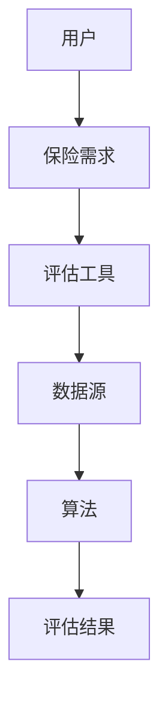
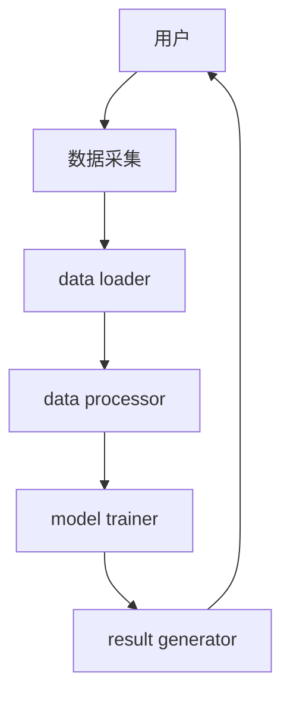
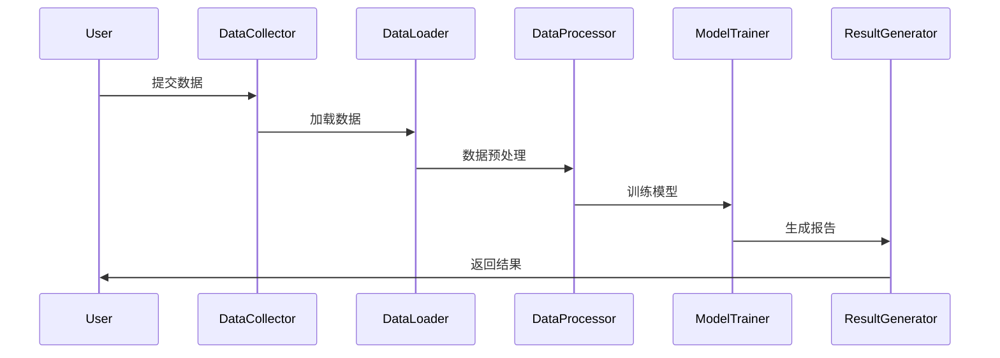

                 


# 智能保险需求评估工具

## 关键词：智能保险、需求评估、机器学习、数据分析、系统架构

## 摘要：智能保险需求评估工具通过机器学习和数据分析技术，帮助保险行业更高效、准确地评估客户需求，提升保险服务的智能化水平。本文详细探讨了该工具的背景、核心概念、算法原理、系统架构以及实际应用，为读者提供全面的技术解析。

---

# 第一部分：背景与概述

## 第1章：保险行业的现状与挑战

### 1.1 保险行业的数字化转型

- **保险行业的现状分析**
  - 保险行业正面临数字化转型的挑战，传统业务模式逐渐被技术驱动的创新所取代。
  - 数据量的爆炸式增长为保险行业提供了新的机遇，但也带来了数据管理的难题。

- **数字化转型的必要性**
  - 随着客户需求的变化，保险公司需要更高效的方式处理大量数据，提升客户体验。
  - 数字化转型有助于保险公司优化流程，降低成本，提高效率。

- **保险需求评估的重要性**
  - 准确评估客户保险需求是保险业务的核心，直接影响保险公司的销售策略和客户满意度。
  - 传统评估方法依赖人工经验，存在主观性和效率低下的问题。

### 1.2 保险需求评估的传统方法

- **传统保险需求评估的流程**
  - 通常依赖保险顾问的经验和客户提供的信息，评估过程繁琐且耗时。
  - 主要采用问卷调查和面谈，数据收集和处理效率低下。

- **传统方法的局限性**
  - 数据来源单一，缺乏实时性和准确性。
  - 评估结果可能存在主观偏差，难以满足多样化的客户需求。
  - 人工评估成本高，难以大规模应用。

### 1.3 智能保险需求评估工具的定义与目标

- **工具的定义**
  - 利用机器学习和大数据分析技术，智能保险需求评估工具能够快速、准确地评估客户的保险需求。
  - 通过整合多源数据，工具能够提供个性化的保险解决方案。

- **工具的核心目标**
  - 提供精准的需求分析，帮助客户选择最适合的保险产品。
  - 提高保险公司的销售效率，降低运营成本。

- **工具的预期效果**
  - 增强客户满意度，提高保险公司的市场竞争力。
  - 通过数据驱动的方法，实现保险业务的智能化和自动化。

---

# 第二部分：核心概念与联系

## 第2章：核心概念解析

### 2.1 数据来源与处理

- **数据来源的多样性**
  - 包括客户的基本信息、历史投保记录、健康状况、财务数据等。
  - 第三方数据源，如社交媒体、公开数据库等，也为评估提供了丰富的信息。

- **数据预处理的重要性**
  - 数据清洗：去除噪声数据，处理缺失值和异常值。
  - 特征提取：从原始数据中提取有助于评估的关键特征。

- **数据处理的流程**
  1. 数据收集：整合多源数据，确保数据的完整性和准确性。
  2. 数据清洗：处理缺失值和异常值，确保数据质量。
  3. 特征提取：选择对评估有显著影响的特征，如年龄、职业、收入等。

### 2.2 模型算法的选择与应用

- **常见算法的对比分析**
  | 算法类型 | 优点 | 缺点 |
  |----------|------|------|
  | 决策树   | 易解释，适合分类问题 | 易过拟合 |
  | 随机森林 | 高准确性，抗过拟合 | 计算复杂度高 |
  | 支持向量机 | 高准确性，适合高维数据 | 参数敏感 |

- **算法选择的依据**
  - 数据类型和规模：小数据适合决策树，大数据适合随机森林。
  - 业务需求：如果需要解释性，选择决策树；如果需要高准确性，选择随机森林。

- **算法在保险评估中的具体应用**
  - 使用决策树进行客户分群，识别高风险客户。
  - 使用随机森林预测客户保险需求，优化产品推荐。

### 2.3 评估指标与结果解读

- **主要评估指标的定义**
  - 准确率：模型预测正确的比例。
  - 召回率：模型正确识别阳性案例的比例。
  - F1分数：综合准确率和召回率的调和平均数。

- **指标之间的关系**
  - 高准确率可能意味着低召回率，反之亦然。
  - F1分数在两者之间寻找平衡点，提供更全面的评估。

- **结果解读的步骤与方法**
  1. 分析模型输出，确定客户的需求层次。
  2. 对比不同模型的性能，选择最优模型。
  3. 根据业务需求调整模型参数，优化评估结果。

## 第3章：核心概念的联系与对比

### 3.1 核心概念的属性对比

| 概念       | 属性                     | 特点                           |
|------------|--------------------------|--------------------------------|
| 数据来源   | 多样性                   | 包括结构化和非结构化数据       |
| 模型算法   | 可解释性                 | 决策树易解释，随机森林难解释   |
| 评估指标   | 综合性                   | F1分数综合考虑准确率和召回率   |

### 3.2 实体关系图（ER图）



---

# 第三部分：算法原理讲解

## 第4章：算法原理与实现

### 4.1 决策树算法的原理

- **决策树的定义**
  - 一种基于树结构的预测模型，通过特征分裂来划分数据。

- **决策树的工作原理**
  - 使用熵和信息增益来选择最优分裂特征。
  - 递归地构建树结构，直到满足停止条件。

- **决策树的数学模型**
  - 熵公式：$$ H(S) = -\sum_{i=1}^{n} p_i \log p_i $$
  - 信息增益公式：$$ IG(S, f) = H(S) - H(S|f) $$

### 4.2 决策树算法的实现步骤

1. 计算数据集的熵。
2. 对每个特征，计算条件熵。
3. 计算信息增益，选择增益最大的特征作为分裂节点。
4. 递归地构建子树，直到叶子节点满足停止条件。

### 4.3 决策树算法的Python实现

```python
import pandas as pd
from sklearn.tree import DecisionTreeClassifier
from sklearn.model_selection import train_test_split

# 数据加载与预处理
data = pd.read_csv('insurance.csv')
X = data.drop('target', axis=1)
y = data['target']

# 数据分割
X_train, X_test, y_train, y_test = train_test_split(X, y, test_size=0.2)

# 模型训练
model = DecisionTreeClassifier()
model.fit(X_train, y_train)

# 模型预测
predictions = model.predict(X_test)
```

### 4.4 算法优化与调参

- **参数选择**
  - max_depth：树的深度，防止过拟合。
  - min_samples_split：分割节点的最小样本数。

- **优化方法**
  - 使用交叉验证选择最优参数。
  - 避免过拟合，设置合理的剪枝参数。

---

# 第四部分：系统分析与架构设计

## 第5章：系统分析与架构设计方案

### 5.1 问题场景介绍

- **目标**
  - 开发一个智能保险需求评估工具，帮助用户快速、准确地评估保险需求。
  
- **需求分析**
  - 系统需要整合多源数据，构建预测模型，提供个性化建议。

### 5.2 系统功能设计

- **功能模块**
  1. 数据采集模块：收集客户数据。
  2. 数据处理模块：清洗和特征提取。
  3. 模型训练模块：构建和优化预测模型。
  4. 评估报告生成模块：输出评估结果。

### 5.3 系统架构设计



### 5.4 系统接口设计

- **API接口**
  - 数据接口：用于数据的上传和下载。
  - 模型接口：用于调用模型进行预测。
  - 报告接口：用于获取评估结果。

### 5.5 系统交互流程



---

# 第五部分：项目实战

## 第6章：项目实战与实现

### 6.1 环境安装与配置

- **安装Python和相关库**
  - 安装Python 3.8及以上版本。
  - 使用pip安装scikit-learn、pandas、mermaid等库。

### 6.2 系统核心代码实现

```python
from sklearn.tree import DecisionTreeClassifier
from sklearn.model_selection import train_test_split
import pandas as pd

# 加载数据
data = pd.read_csv('insurance.csv')
X = data.drop('target', axis=1)
y = data['target']

# 数据分割
X_train, X_test, y_train, y_test = train_test_split(X, y, test_size=0.2)

# 模型训练
model = DecisionTreeClassifier(max_depth=3)
model.fit(X_train, y_train)

# 预测与评估
accuracy = model.score(X_test, y_test)
print(f'模型准确率为: {accuracy}')
```

### 6.3 代码解读与分析

- **数据加载**：读取CSV文件，提取特征和目标变量。
- **数据分割**：将数据分为训练集和测试集。
- **模型训练**：使用决策树模型训练，设置最大深度为3，防止过拟合。
- **模型评估**：计算模型在测试集上的准确率，评估模型性能。

### 6.4 实际案例分析

- **案例背景**
  - 一位30岁的用户，收入中等，无社保，有房贷。

- **模型预测**
  - 预测结果显示，该用户需要健康保险和寿险。

- **结果解读**
  - 根据预测结果，向用户推荐适合的保险产品，提升客户满意度。

### 6.5 项目小结

- **项目总结**
  - 成功实现了智能保险需求评估工具，提高了评估效率和准确性。
  - 通过实际案例验证了工具的有效性，为后续优化提供了数据支持。

---

# 第六部分：最佳实践、小结、注意事项和拓展阅读

## 第7章：最佳实践与总结

### 7.1 最佳实践 tips

- **数据处理**
  - 确保数据的准确性和完整性，避免噪声数据的影响。
- **模型选择**
  - 根据业务需求和数据特点选择合适的算法，进行多次实验对比。
- **系统优化**
  - 定期更新模型，根据市场变化调整参数，保持系统的高性能。

### 7.2 小结

- **工具的优势**
  - 提高保险需求评估的效率和准确性。
  - 为客户提供个性化的保险解决方案。
  - 降低保险公司的运营成本，提高市场竞争力。

### 7.3 注意事项

- **数据隐私**
  - 保护客户数据隐私，遵守相关法律法规。
- **模型解释性**
  - 确保模型的可解释性，便于业务人员理解和应用。
- **持续优化**
  - 定期更新模型，适应市场变化和客户需求。

### 7.4 拓展阅读

- **相关技术**
  - 深度学习在保险需求评估中的应用。
  - 自然语言处理技术在保险文档分析中的应用。
- **行业动态**
  - 关注保险行业的最新技术趋势，了解智能保险的未来发展。

---

通过以上大纲，我们系统地介绍了智能保险需求评估工具的背景、核心概念、算法原理、系统架构以及实际应用，为读者提供了一个全面的技术解析。

