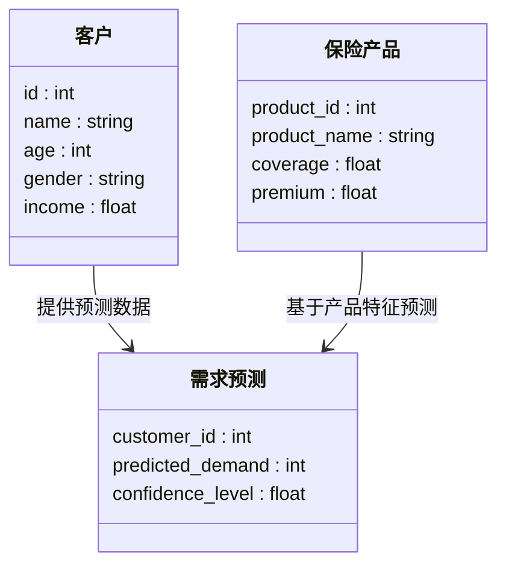

                 


# 智能保险需求预测与产品设计优化系统

## 关键词：智能保险，需求预测，产品设计优化，机器学习，大数据分析

## 摘要：本文详细探讨了智能保险需求预测与产品设计优化系统的核心原理、算法实现、系统架构及实际应用。通过分析传统保险业的局限性，结合人工智能和大数据技术，提出了一种基于机器学习的智能预测模型，并设计了优化的产品推荐系统。文章还通过实际案例展示了该系统的应用场景和效果，为保险公司提供了科学的决策支持。

---

## 第1章: 智能保险需求预测与产品设计优化系统背景介绍

### 1.1 问题背景与问题描述

保险行业作为金融领域的重要组成部分，传统的产品设计和需求预测方法存在诸多局限性：

1. **传统保险产品设计的局限性**  
   - 传统保险产品设计依赖经验丰富的精算师和市场研究人员，但这种方法耗时长、成本高，且难以覆盖所有潜在客户群体。  
   - 缺乏实时数据反馈，导致产品设计无法及时响应市场变化和客户需求。

2. **智能保险需求预测的必要性**  
   - 随着大数据和人工智能技术的快速发展，保险公司可以通过智能系统实时收集和分析客户数据，预测需求并优化产品设计。  
   - 智能保险需求预测能够帮助保险公司更精准地定位客户群体，降低产品设计风险，提高客户满意度。

3. **保险行业数字化转型的现状与趋势**  
   - 当前，保险行业正经历数字化转型，越来越多的保险公司开始采用人工智能技术来提升运营效率和客户体验。  
   - 数字化转型的核心之一是通过智能系统实现客户需求的精准预测和产品设计的自动化优化。

### 1.2 问题解决方法与边界

1. **问题解决方法**  
   - 通过构建智能保险需求预测系统，利用机器学习算法分析客户数据，预测不同客户群体的需求偏好。  
   - 基于预测结果，优化保险产品的设计，例如调整保费、保障范围和赔付比例，以满足客户需求。

2. **系统的边界与外延**  
   - 该系统仅关注保险产品的需求预测和设计优化，不涉及产品销售和售后服务。  
   - 数据范围限定在客户基本信息、历史投保记录和市场数据，不包含敏感的客户隐私信息。

3. **核心要素与组成结构**  
   - **数据采集模块**：收集客户信息、市场数据和历史投保记录。  
   - **需求预测模块**：基于机器学习算法预测客户需求。  
   - **产品设计优化模块**：根据预测结果优化保险产品的设计参数。

### 1.3 核心概念与联系

1. **智能保险需求预测的核心原理**  
   - 系统通过分析客户数据，识别潜在需求，并结合市场趋势预测未来的需求变化。

2. **概念属性特征对比表格**  
   | 概念       | 属性                   | 特征描述                       |
   |------------|------------------------|----------------------------|
   | 客户       | 基本信息、历史行为       | 年龄、性别、收入、投保记录     |
   | 保险产品   | 产品ID、产品名称、保障范围 | 保费、赔付比例                 |
   | 需求预测   | 预测值、置信度           | 预测结果、预测准确度           |

3. **ER实体关系图架构**  
```mermaid
erDiagram
    customer[客户] {
        <属性>
        id : int
        name : string
        age : int
        gender : string
        income : float
    }
    policy[保险产品] {
        <属性>
        product_id : int
        product_name : string
        coverage : float
        premium : float
    }
    prediction[需求预测] {
        <属性>
        customer_id : int
        predicted_demand : int
        confidence_level : float
    }
    customer --> prediction : 提供需求预测数据
    policy --> prediction : 基于保险产品进行预测
```

---

## 第2章: 智能保险需求预测的核心算法与实现

### 2.1 算法原理

1. **机器学习算法选择**  
   - 采用随机森林（Random Forest）算法进行需求预测，因为其具有较强的特征重要性分析能力和抗过拟合能力。

2. **算法实现流程**  
   ```mermaid
   graph TD
       A[数据预处理] --> B[特征选择]
       B --> C[训练随机森林模型]
       C --> D[预测需求]
       D --> E[输出预测结果]
   ```

3. **数学模型与公式**  
   - 随机森林的预测公式可以通过集成多个决策树的结果来表示：  
     $$ y = \frac{1}{N} \sum_{i=1}^{N} \text{Tree}_i(x) $$  
     其中，\( N \) 是决策树的数量，\( \text{Tree}_i(x) \) 是第 \( i \) 棵树的预测结果。

4. **Python代码实现**  
   ```python
   import pandas as pd
   from sklearn.ensemble import RandomForestRegressor
   from sklearn.metrics import mean_absolute_error

   # 数据加载与预处理
   data = pd.read_csv('insurance_data.csv')
   features = ['age', 'gender', 'income', 'policy_type']
   target = 'demand'

   # 特征选择与训练
   model = RandomForestRegressor(n_estimators=100, random_state=42)
   model.fit(data[features], data[target])

   # 模型预测
   predicted_demand = model.predict(data[features])
   print('预测准确率:', 1 - mean_absolute_error(data[target], predicted_demand))
   ```

---

### 2.2 算法优化与效果评估

1. **超参数调优**  
   - 使用网格搜索（Grid Search）优化随机森林的超参数，例如 `n_estimators` 和 `max_depth`。

2. **模型评估指标**  
   - 使用均方误差（MSE）和准确率（Accuracy）评估模型性能：  
     $$ \text{MSE} = \frac{1}{n} \sum_{i=1}^{n} (y_i - \hat{y}_i)^2 $$  
     其中，\( y_i \) 是真实值，\( \hat{y}_i \) 是预测值。

3. **实际案例分析**  
   - 通过分析某保险公司客户数据，验证模型的预测效果。例如，客户群体分为年轻人和中老年人，模型能够准确预测不同群体的需求偏好。

---

## 第3章: 智能保险产品设计优化系统架构

### 3.1 系统功能设计

1. **功能模块划分**  
   - **数据采集模块**：收集客户信息、市场数据和历史记录。  
   - **需求预测模块**：基于机器学习模型预测客户需求。  
   - **产品设计优化模块**：根据预测结果调整产品参数。

2. **领域模型类图**  


### 3.2 系统架构设计

1. **系统架构图**  


2. **接口设计与交互流程**  
   - **接口设计**：定义RESTful API接口，例如 `POST /predict/demand` 和 `GET /optimize/product`。  
   - **交互流程**：  
     1. 客户端发送请求，API网关接收并转发到分析模块。  
     2. 分析模块基于机器学习模型生成预测结果。  
     3. 推荐模块根据预测结果优化产品设计，并返回给客户端。

3. **数据库设计与交互序列图**  
   ```mermaid
   sequenceDiagram
       客户端 ->> 数据库: 查询客户信息
       数据库 --> 客户端: 返回客户信息
       客户端 ->> 分析模块: 发送预测请求
       分析模块 --> 数据库: 查询保险产品数据
       数据库 --> 分析模块: 返回产品数据
       分析模块 --> 客户端: 返回预测结果
   ```

---

## 第4章: 项目实战与案例分析

### 4.1 项目背景

1. **项目目标**  
   - 构建智能保险需求预测与产品设计优化系统，提高保险公司运营效率和客户满意度。

2. **项目环境搭建**  
   - 安装Python、Pandas、Scikit-learn和Flask框架。  
   - 数据库选择MySQL或MongoDB，根据需求选择合适的数据存储方案。

### 4.2 核心代码实现

1. **数据预处理与特征工程**  
   ```python
   import pandas as pd
   import numpy as np

   # 数据加载与预处理
   data = pd.read_csv('insurance_data.csv')
   data = data.dropna()  # 删除缺失值
   data['gender'] = data['gender'].map({'男': 1, '女': 0})  # 特征编码
   ```

2. **模型训练与部署**  
   ```python
   from sklearn.ensemble import RandomForestRegressor
   from flask import Flask, request, jsonify

   app = Flask(__name__)
   model = RandomForestRegressor(n_estimators=100, random_state=42)

   # 训练模型
   features = ['age', 'gender', 'income', 'policy_type']
   target = 'demand'
   model.fit(data[features], data[target])

   @app.route('/predict/demand', methods=['POST'])
   def predict_demand():
       data = request.json
       prediction = model.predict([[data['age'], data['gender'], data['income'], data['policy_type']]])
       return jsonify({'predicted_demand': int(prediction[0])})
   ```

3. **实际案例分析**  
   - 以某保险公司为例，通过系统预测客户对不同保险产品的需求，优化产品设计并提高销售转化率。

---

## 第5章: 最佳实践与小结

### 5.1 最佳实践

1. **数据质量的重要性**  
   - 确保数据的完整性和准确性，避免因数据质量问题导致模型预测误差。

2. **模型调优与评估**  
   - 使用交叉验证和网格搜索优化模型参数，定期更新模型以适应市场变化。

3. **系统安全性与稳定性**  
   - 确保系统数据的安全性，防止数据泄露和网络攻击。  
   - 采用容错设计和高可用性架构，保证系统的稳定运行。

### 5.2 小结

智能保险需求预测与产品设计优化系统通过结合人工智能和大数据技术，显著提升了保险行业的运营效率和客户满意度。该系统不仅能够精准预测客户需求，还能优化产品设计，降低保险公司运营成本，提高市场竞争力。

### 5.3 注意事项

- 在实际应用中，需遵守相关法律法规，确保客户数据的合法使用和保护。  
- 系统上线前，需进行全面的功能测试和性能优化，确保系统的稳定性和高效性。

### 5.4 拓展阅读

- 《机器学习实战》  
- 《数据分析的art of data》  
- 《微服务架构设计》  

---

以上就是《智能保险需求预测与产品设计优化系统》的完整目录大纲和内容概述。通过系统化的分析和实践，该系统为保险公司提供了科学的决策支持，推动了保险行业的智能化发展。

