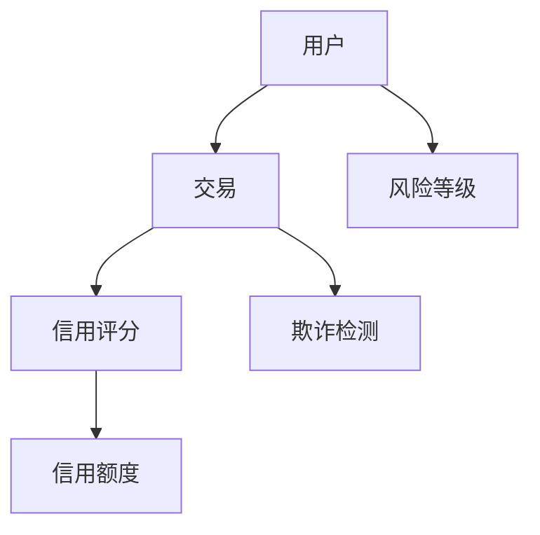
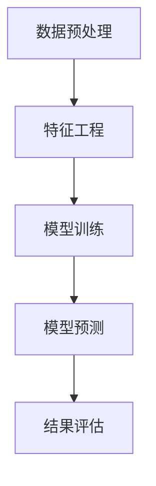
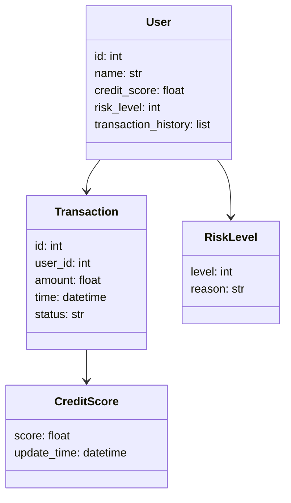
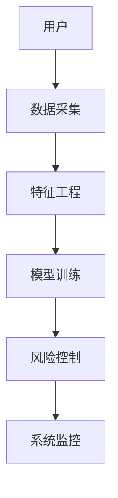
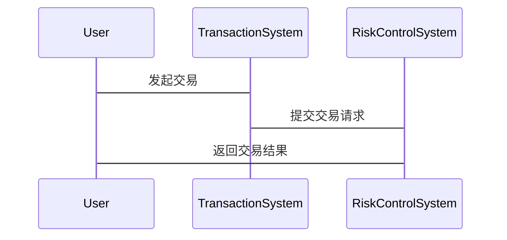

                 


# 智能信用卡额度优化与风险控制系统

> 关键词：智能信用卡、额度优化、风险控制、人工智能、机器学习、系统架构

> 摘要：本文系统地探讨了智能信用卡额度优化与风险控制系统的构建与应用。通过结合人工智能和大数据分析技术，本文提出了基于机器学习的智能信用卡额度优化方法，并设计了高效的风险控制系统。文章从背景介绍、核心概念、算法原理、系统架构到项目实战，全面解析了智能信用卡额度优化与风险控制的实现过程。

---

# 第一部分: 背景介绍

## 第1章: 智能信用卡额度优化与风险控制系统概述

### 1.1 问题背景与问题描述
#### 1.1.1 传统信用卡额度优化的局限性
传统的信用卡额度优化方法依赖于简单的统计分析和规则引擎，存在以下问题：
- **规则僵化**：固定的规则难以适应复杂多变的用户行为和市场环境。
- **效率低下**：人工审核流程繁琐，难以快速响应用户需求。
- **风险控制不足**：传统方法难以捕捉复杂的欺诈行为和信用风险。

#### 1.1.2 风险控制中的痛点
信用卡风险控制是金融机构的核心任务之一，但传统方法存在以下痛点：
- **欺诈检测不精准**：基于规则的系统难以识别新型欺诈模式。
- **信用评估滞后**：信用评分模型更新周期长，难以及时反映用户信用状况的变化。
- **风险评估片面**：仅依赖单一维度的数据，无法全面评估风险。

#### 1.1.3 智能化优化的必要性
随着人工智能和大数据技术的快速发展，智能化优化成为信用卡额度管理和风险控制的必然选择：
- **实时性**：通过实时数据分析，快速调整额度并识别风险。
- **精准性**：基于机器学习的模型能够捕捉复杂特征，提升预测精度。
- **适应性**：智能系统能够动态适应市场变化和用户行为的改变。

### 1.2 问题解决思路
#### 1.2.1 数据驱动的优化方法
通过收集和分析大量用户行为数据、交易数据和信用数据，利用数据驱动的方法优化信用卡额度。

#### 1.2.2 人工智能在风险控制中的应用
采用机器学习算法（如随机森林、梯度提升树、神经网络等）进行风险评估和欺诈检测。

#### 1.2.3 智能系统的设计目标
- 实现信用卡额度的动态优化。
- 提升风险控制的准确性和实时性。
- 降低运营成本，提高用户满意度。

### 1.3 系统的边界与外延
#### 1.3.1 系统边界定义
智能信用卡额度优化与风险控制系统的核心功能包括：
- 用户信用评估。
- 交易风险检测。
- 动态额度调整。
- 系统监控与反馈。

#### 1.3.2 系统外延与扩展性分析
- **扩展性**：系统支持模块化设计，便于后续功能扩展（如引入新的数据源、算法优化等）。
- **兼容性**：支持与其他金融系统（如支付网关、信用评分机构）的无缝对接。

#### 1.3.3 系统与外部环境的交互
智能信用卡系统需要与以下外部系统交互：
- **用户端**：通过移动应用或网页与用户交互。
- **交易系统**：实时获取交易数据。
- **信用评分机构**：获取用户信用报告。
- **欺诈数据库**：比对已知欺诈行为。

### 1.4 核心概念与组成要素
#### 1.4.1 核心概念解析
- **用户行为分析**：通过分析用户的交易行为、消费习惯等数据，评估用户的信用风险。
- **实时数据分析**：利用流数据处理技术，实时监控用户的交易行为，快速识别风险。
- **动态额度调整**：根据用户的信用评分和交易行为，实时调整信用额度。

#### 1.4.2 组成要素与功能模块
- **数据采集模块**：收集用户交易数据、信用数据等。
- **特征工程模块**：提取和处理特征，为模型提供输入数据。
- **模型训练模块**：训练机器学习模型，用于风险评估和额度优化。
- **风险控制模块**：基于模型预测结果，进行风险控制和额度调整。
- **系统监控模块**：实时监控系统运行状态，及时发现和解决问题。

---

## 第2章: 核心概念与联系

### 2.1 核心概念原理
#### 2.1.1 智能信用卡额度优化的原理
智能信用卡额度优化的核心是基于机器学习模型，通过分析用户的历史交易数据和信用数据，预测用户的信用风险，并动态调整信用额度。

#### 2.1.2 风险控制的核心机制
风险控制通过实时监控用户的交易行为，结合用户信用评分和市场环境，评估交易风险，并采取相应的控制措施（如拒绝交易、降低额度等）。

#### 2.1.3 人工智能在系统中的作用
人工智能技术（如机器学习、深度学习）在智能信用卡系统中的作用包括：
- **数据挖掘**：从海量数据中提取有价值的信息。
- **模式识别**：识别用户行为中的异常模式。
- **预测与决策**：基于历史数据和模型预测未来风险和额度需求。

### 2.2 核心概念对比分析
#### 2.2.1 不同模型的对比表格

| 模型类型         | 优点                           | 缺点                           |
|------------------|-------------------------------|-------------------------------|
| 传统线性回归     | 简单易懂，计算速度快           | 预测精度低，难以捕捉复杂关系   |
| 随机森林         | 预测精度高，适合处理非线性问题 | 对特征工程依赖较大             |
| 梯度提升树（如LightGBM） | 预测精度高，训练速度快         | 对超参数敏感                   |
| 神经网络         | 预测精度最高，适合复杂场景     | 计算资源消耗大，难解释性       |

#### 2.2.2 传统模型与机器学习模型的对比
- **传统模型**：基于统计分析和规则引擎，适用于简单场景，但难以应对复杂和动态变化的环境。
- **机器学习模型**：基于数据驱动，能够捕捉复杂特征，适用于动态和复杂的场景。

#### 2.2.3 算法性能与适用场景的对比
- **线性回归**：适用于线性关系明显的场景。
- **随机森林**：适用于特征较多、非线性关系复杂的场景。
- **梯度提升树**：适用于分类和回归问题，预测精度高，训练速度快。

### 2.3 ER实体关系图


---

## 第3章: 算法原理与数学模型

### 3.1 算法原理
#### 3.1.1 梯度提升树（如LightGBM）的原理
梯度提升树是一种基于树的集成算法，通过多棵决策树的组合来提高模型的预测精度。其核心思想是通过迭代地优化损失函数，逐步构建弱分类器（树），最终形成强大的预测模型。

#### 3.1.2 神经网络在风险评估中的应用
神经网络通过多层感知机（MLP）结构，能够捕捉数据中的非线性关系，适用于复杂的信用评分和欺诈检测任务。

#### 3.1.3 时间序列分析在额度优化中的作用
时间序列分析通过分析历史数据的变化趋势，预测未来的信用额度需求，帮助银行动态调整用户的信用额度。

### 3.2 数学模型与公式
#### 3.2.1 损失函数的定义
$$ \text{损失函数} = \sum_{i=1}^{n} (y_i - \hat{y}_i)^2 $$

其中：
- \( y_i \) 表示真实值。
- \( \hat{y}_i \) 表示预测值。

#### 3.2.2 模型的目标函数
$$ \text{目标函数} = \text{损失函数} + \text{正则化项} $$

其中：
- 正则化项用于防止过拟合，常用的有L1正则化和L2正则化。

#### 3.2.3 梯度提升树的训练过程
梯度提升树的训练过程可以用以下步骤表示：
1. 初始化基学习器（如决策树）。
2. 计算当前模型的残差。
3. 增加一棵树来拟合残差，降低损失。
4. 重复步骤2和3，直到达到预设的树的数量。

### 3.3 算法流程图


### 3.4 Python实现代码
```python
import numpy as np
import lightgbm as lgb

# 示例数据
X_train = np.array([[1, 2], [3, 4], [5, 6]])
y_train = np.array([0, 1, 0])

# 训练模型
model = lgb.LGBMClassifier()
model.fit(X_train, y_train)

# 预测
X_test = np.array([[2, 3], [4, 5]])
y_pred = model.predict(X_test)

# 输出结果
print("预测结果:", y_pred)
```

---

## 第4章: 系统分析与架构设计

### 4.1 系统功能设计
#### 4.1.1 领域模型


#### 4.1.2 系统架构设计


### 4.2 接口设计与交互流程图


---

## 第5章: 项目实战

### 5.1 环境安装
- **Python**：安装Python 3.8及以上版本。
- **库依赖**：安装以下库：
  ```
  pip install numpy pandas lightgbm scikit-learn
  ```

### 5.2 核心代码实现
#### 5.2.1 数据预处理
```python
import pandas as pd
from sklearn.model_selection import train_test_split

# 加载数据
data = pd.read_csv('credit_data.csv')

# 划分训练集和测试集
X_train, X_test, y_train, y_test = train_test_split(data.drop('target', axis=1), data['target'], test_size=0.2)
```

#### 5.2.2 模型训练
```python
from lightgbm import LGBMClassifier

# 训练模型
model = LGBMClassifier()
model.fit(X_train, y_train)
```

#### 5.2.3 模型预测
```python
# 预测
y_pred = model.predict(X_test)

# 输出结果
print("预测结果:", y_pred)
```

### 5.3 代码解读与分析
- **数据预处理**：将原始数据进行清洗、特征提取和格式转换，为模型训练提供干净的数据。
- **模型训练**：使用LightGBM模型进行训练，优化模型参数以提高预测精度。
- **模型预测**：基于训练好的模型，对测试数据进行预测，并评估模型性能。

### 5.4 实际案例分析
假设我们有一个用户，其交易数据如下：
- 近期交易频繁，且金额较大。
- 信用评分为750。
- 过去曾有过逾期记录。

通过模型预测，系统可能会判断该用户的交易存在较高风险，并自动调整信用额度或拒绝交易。

---

## 第6章: 总结与展望

### 6.1 最佳实践 tips
- 数据质量是模型性能的关键，需重视数据清洗和特征工程。
- 模型部署后需持续监控，及时调整参数和优化模型。
- 系统需具备良好的扩展性，方便后续功能的添加和升级。

### 6.2 小结
智能信用卡额度优化与风险控制系统通过结合人工智能和大数据技术，能够显著提升信用卡管理的效率和准确性。本文从理论到实践，详细解析了系统的构建过程，为实际应用提供了参考。

### 6.3 注意事项
- 数据隐私和安全是系统设计中的重要考虑因素。
- 模型解释性是用户信任的关键，需选择适合业务场景的模型。
- 系统需具备良好的容错性和恢复能力，确保在异常情况下的稳定运行。

### 6.4 拓展阅读
- 推荐阅读《机器学习实战》和《深入浅出人工智能》。
- 关注最新的研究成果，如图神经网络在金融领域的应用。

---

通过以上目录和内容，您可以开始撰写完整的文章了。

