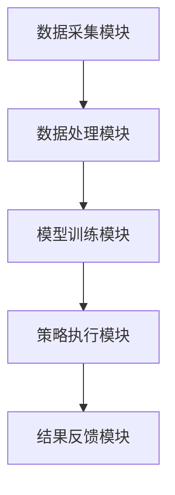
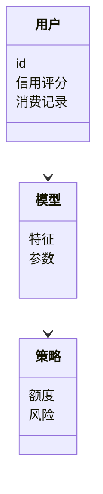
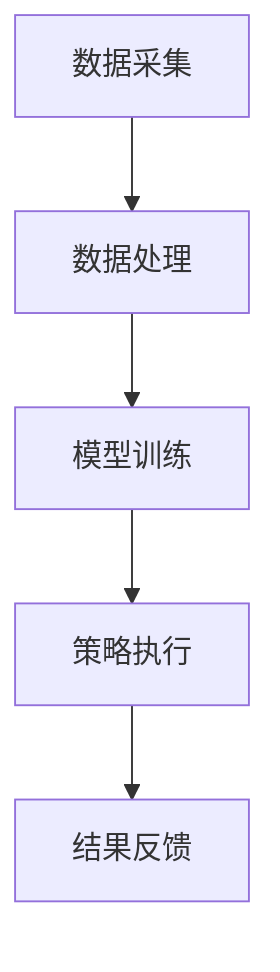
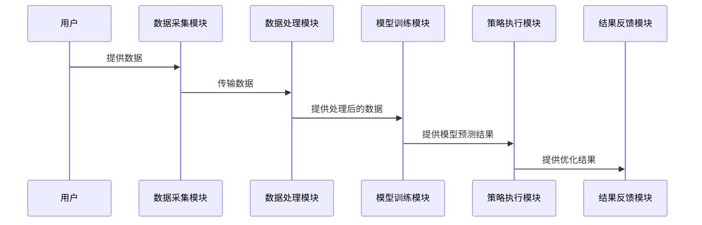

                 


# 智能信用卡额度优化管理系统

> 关键词：智能信用卡、额度优化、机器学习、系统架构、项目实战

> 摘要：本文深入探讨智能信用卡额度优化管理系统的构建与实现，从背景与问题描述、核心算法原理、系统架构设计到项目实战，详细分析系统的各个组成部分，结合实际案例，提供完整的解决方案与实现步骤。

---

# 第一部分：智能信用卡额度优化管理系统的背景与概述

## 第1章：智能信用卡额度优化管理系统的背景与问题描述

### 1.1 信用卡额度管理的重要性

#### 1.1.1 信用卡额度管理的定义与作用
信用卡额度管理是指根据用户的信用评分、消费习惯、收入水平等多维度数据，动态调整用户的信用额度，以降低风险、提高收益。其作用包括风险控制、客户满意度提升和收益最大化。

#### 1.1.2 传统信用卡额度管理的局限性
传统额度管理方式依赖人工经验，存在效率低、主观性强、难以实时调整等问题，难以适应大数据时代的复杂需求。

#### 1.1.3 智能化管理的必要性
随着人工智能和大数据技术的发展，智能信用卡额度优化管理系统能够实时分析用户数据，动态调整额度，提升管理效率和精准度。

### 1.2 问题背景与目标

#### 1.2.1 信用卡额度管理的核心问题
- 如何高效、准确地评估用户的信用风险？
- 如何动态调整额度以平衡风险与收益？
- 如何实现系统的实时性与可扩展性？

#### 1.2.2 智能优化的目标与意义
目标是通过智能算法实现信用卡额度的动态优化，意义在于提高银行收益、降低风险、提升用户体验。

#### 1.2.3 系统边界与外延
系统边界包括用户数据采集、模型训练、策略执行等模块；外延则涉及数据来源、模型更新、结果反馈等。

### 1.3 核心概念与系统架构

#### 1.3.1 核心概念的定义与属性
- 用户信用评分：基于历史数据的评分，用于评估用户的信用风险。
- 消费行为分析：用户的消费频率、金额等，用于判断用户的信用需求。
- 风险控制：通过模型预测潜在风险，动态调整额度。

#### 1.3.2 系统架构的初步框架
初步框架包括数据采集模块、数据处理模块、模型训练模块、策略执行模块和结果反馈模块。

#### 1.3.3 系统功能的初步划分
- 数据采集：收集用户信息、交易记录等数据。
- 数据处理：清洗、特征提取和数据预处理。
- 模型训练：训练机器学习模型，用于预测和优化。
- 策略执行：根据模型结果调整额度。
- 结果反馈：监控和评估优化效果。

### 1.4 本章小结
本章介绍了智能信用卡额度优化管理系统的背景、核心问题、目标和初步架构，为后续章节奠定了基础。

---

# 第二部分：智能信用卡额度优化管理系统的算法与模型

## 第2章：信用卡额度优化的核心算法原理

### 2.1 优化算法概述

#### 2.1.1 线性回归模型
线性回归是一种简单而有效的回归算法，适用于线性关系的数据。其数学公式为：
$$ y = \beta_0 + \beta_1x + \epsilon $$

#### 2.1.2 决策树算法
决策树是一种基于树结构的分类算法，适用于非线性关系的数据。其核心思想是通过特征分裂来构建分类树。

#### 2.1.3 神经网络模型
神经网络是一种模拟人脑结构的深度学习算法，适用于复杂非线性关系的数据。其数学模型为：
$$ f(x) = \sigma(wx + b) $$

### 2.2 优化模型的数学推导

#### 2.2.1 线性回归的数学公式
线性回归的目标是最小化预测值与实际值的平方差之和：
$$ \text{损失函数} = \sum_{i=1}^n (y_i - (\beta_0 + \beta_1x_i))^2 $$

#### 2.2.2 决策树的分类原理
决策树通过特征分裂构建树结构，最终将数据分为不同的叶子节点，每个叶子节点对应一个类别。

#### 2.2.3 神经网络的数学模型
神经网络通过多层感知机对数据进行非线性变换，其输出层的激活函数决定了最终的分类结果。

### 2.3 算法实现与代码示例

#### 2.3.1 线性回归的Python实现
```python
import numpy as np

def linear_regression(X, y):
    # 计算系数
    coefficients = np.linalg.inv(X.T @ X) @ X.T @ y
    return coefficients
```

### 2.4 算法优缺点分析

#### 2.4.1 各算法的优缺点对比
| 算法 | 优点 | 缺点 |
|------|------|------|
| 线性回归 | 简单高效 | 仅适用于线性关系 |
| 决策树 | 非线性能力强 | �易过拟合 |
| 神经网络 | 复杂非线性能力强 | 训练时间长 |

#### 2.4.2 算法选择的依据与策略
根据数据特性、问题类型和计算资源选择合适的算法，通常采用组合模型提升性能。

### 2.5 本章小结
本章详细介绍了智能信用卡额度优化系统中常用的算法，包括线性回归、决策树和神经网络的原理、实现和优缺点。

---

# 第三部分：智能信用卡额度优化管理系统的系统架构与设计

## 第3章：系统架构设计与实现

### 3.1 系统功能模块划分

#### 3.1.1 数据采集模块
负责收集用户的信用记录、交易记录等数据，数据来源包括银行数据库和外部征信机构。

#### 3.1.2 数据处理模块
对采集到的数据进行清洗、特征提取和数据预处理，确保数据质量。

#### 3.1.3 模型训练模块
基于处理后的数据，训练机器学习模型，用于预测用户的信用评分和消费行为。

#### 3.1.4 策略执行模块
根据模型预测结果，动态调整用户的信用额度，优化风险和收益的平衡。

#### 3.1.5 结果反馈模块
监控和评估优化效果，收集用户反馈，持续优化系统。

### 3.2 系统架构的Mermaid图


### 3.3 系统功能设计

#### 3.3.1 领域模型的Mermaid类图


#### 3.3.2 系统架构设计的Mermaid图


#### 3.3.3 系统接口设计
系统接口包括数据接口、模型接口和策略接口，采用RESTful API设计，确保系统的可扩展性和可维护性。

#### 3.3.4 系统交互的Mermaid序列图


### 3.4 本章小结
本章详细描述了智能信用卡额度优化管理系统的架构设计，包括功能模块划分、系统架构图和接口设计，为后续的实现奠定了基础。

---

# 第四部分：智能信用卡额度优化管理系统的项目实战

## 第4章：项目实战与案例分析

### 4.1 环境安装与配置

#### 4.1.1 Python环境配置
安装Python 3.8及以上版本，安装必要的库，如NumPy、Pandas、Scikit-learn和XGBoost。

#### 4.1.2 数据集准备
收集信用卡用户的信用评分、消费记录等数据，数据格式为CSV。

### 4.2 数据预处理与特征工程

#### 4.2.1 数据清洗
处理缺失值、异常值和重复数据，确保数据质量。

#### 4.2.2 特征提取
从原始数据中提取有用的特征，如信用评分、消费频率、收入水平等。

#### 4.2.3 数据标准化
对特征进行标准化或归一化处理，确保模型输入一致。

### 4.3 模型训练与优化

#### 4.3.1 模型训练
使用训练数据训练机器学习模型，如XGBoost或神经网络。

#### 4.3.2 模型调优
通过网格搜索或贝叶斯优化调整模型参数，提升模型性能。

#### 4.3.3 模型评估
使用测试数据评估模型的准确率、召回率和F1值，确保模型的有效性。

### 4.4 策略执行与结果分析

#### 4.4.1 额度调整
根据模型预测结果，动态调整用户的信用额度。

#### 4.4.2 风险控制
监控用户的消费行为，及时发现潜在风险，采取相应的措施。

#### 4.4.3 效果评估
评估额度优化的效果，包括收益增加、风险降低和用户满意度提升。

### 4.5 代码实现与解读

#### 4.5.1 数据预处理代码
```python
import pandas as pd
import numpy as np

# 读取数据
data = pd.read_csv('credit_card.csv')

# 处理缺失值
data = data.dropna()

# 特征提取
features = data[['credit_score', 'transaction_amount', 'income']]
```

#### 4.5.2 模型训练代码
```python
from sklearn.ensemble import RandomForestClassifier

# 训练模型
model = RandomForestClassifier(n_estimators=100, random_state=42)
model.fit(features, labels)
```

### 4.6 实际案例分析

#### 4.6.1 案例背景
某银行信用卡用户数据，包括信用评分、消费金额、收入等特征。

#### 4.6.2 模型预测
通过模型预测用户的信用评分，动态调整额度。

#### 4.6.3 结果分析
分析调整后的额度对银行收益和用户满意度的影响。

### 4.7 本章小结
本章通过实际案例展示了智能信用卡额度优化管理系统的实现过程，从数据准备、模型训练到策略执行，详细解读了每一步的操作和注意事项。

---

# 第五部分：总结与展望

## 第5章：总结与展望

### 5.1 本章总结
总结全文，回顾智能信用卡额度优化管理系统的构建过程，强调其在风险控制和收益最大化中的作用。

### 5.2 未来展望
展望未来的发展方向，包括更复杂的算法、实时性优化和多维度数据的融合。

### 5.3 最佳实践 Tips

#### 5.3.1 数据的重要性
高质量的数据是模型性能的基础，数据清洗和特征工程至关重要。

#### 5.3.2 模型选择的策略
根据数据特性和问题类型选择合适的模型，避免盲目追求复杂算法。

#### 5.3.3 系统的可扩展性
设计模块化的系统架构，方便未来的功能扩展和性能优化。

### 5.4 本章小结
本章对智能信用卡额度优化管理系统进行了总结，并对未来的发展提出了展望和建议。

---

# 结语

智能信用卡额度优化管理系统通过人工智能和大数据技术的结合，实现了信用卡额度的动态优化，提升了银行的收益和风险控制能力，同时也为用户提供了更好的服务体验。随着技术的不断发展，智能信用卡管理系统的功能和性能将不断提升，为金融行业带来更多价值。

---

通过以上目录和内容设计，可以清晰地看到《智能信用卡额度优化管理系统》这本书的结构和内容安排。每一章都紧扣主题，既有理论分析，又有实际案例和代码实现，确保读者能够全面理解和掌握智能信用卡额度优化管理的核心技术与实现方法。

