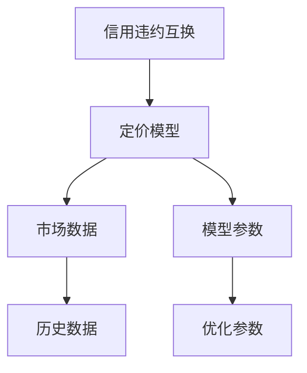
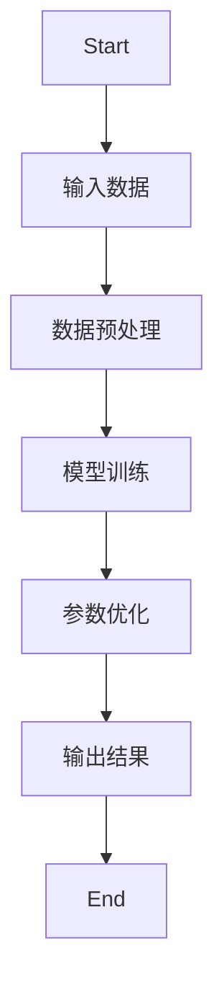
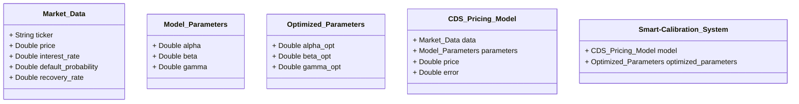
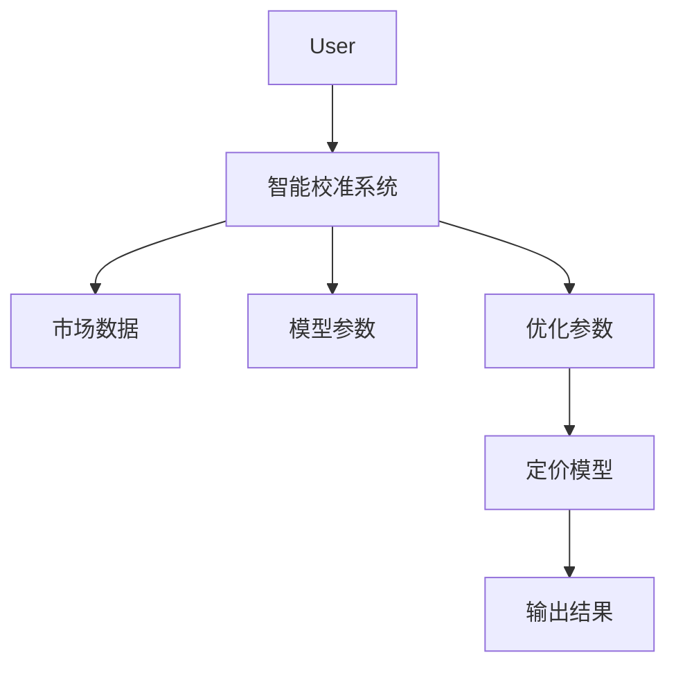

                 


# 智能信用违约互换定价模型校准

## 关键词：智能校准、信用违约互换、定价模型、机器学习、风险管理

## 摘要：  
信用违约互换（CDS）作为重要的信用风险管理工具，其定价模型的准确性和实时性直接影响金融市场参与者的决策。传统的定价模型在面对复杂市场环境和大数据时代的需求时，存在参数估计不准确、计算效率低下等问题。智能校准作为一种新兴的技术，通过引入机器学习算法和大数据处理技术，为信用违约互换的定价提供了更精确、更高效的解决方案。本文将从背景、理论、算法、系统架构、项目实战等多个角度，全面探讨智能信用违约互换定价模型校准的核心内容和实现方法。

---

# 第一部分: 智能信用违约互换定价模型校准背景与基础

## 第1章: 信用违约互换与智能校准概述

### 1.1 信用违约互换的基本概念

#### 1.1.1 信用违约互换的定义与基本结构  
信用违约互换（Credit Default Swap，CDS）是一种金融衍生工具，用于对冲债券发行人违约的风险。其基本结构包括以下几个部分：  
1. **参考债务**：即债券发行人发行的债务工具，作为互换的参考资产。  
2. **保护买方**：购买信用保护的一方，支付定期的保费，以获得在债务违约时的赔偿。  
3. **保护卖方**：出售信用保护的一方，负责在债务违约时向买方支付损失。  
4. **违约事件**：包括发行人破产、重组、支付违约等。  
5. **结算方式**：通常以债券面值的一定比例进行结算。  

#### 1.1.2 信用违约互换的市场与应用背景  
CDS在金融市场中被广泛用于信用风险管理，帮助机构降低债券投资的违约风险。随着全球金融市场的复杂化，CDS的需求量不断增加，但传统的定价模型在面对大数据和复杂市场环境时，难以满足实时性和准确性要求。  

#### 1.1.3 信用违约互换的定价问题与挑战  
CDS的定价依赖于多个因素，包括债券发行人的信用评级、市场利率、违约概率等。传统定价模型通常假设市场参数不变，但在实际市场中，这些参数会受到宏观经济波动、市场情绪等多种因素的影响，导致定价误差。此外，传统模型的计算效率较低，难以应对高频交易和大数据场景的需求。  

---

### 1.2 智能校准的必要性

#### 1.2.1 传统信用违约互换定价模型的局限性  
传统的CDS定价模型通常基于Merton模型或KMV模型，这些模型假设市场参数稳定且独立，但在实际市场中，这些假设往往不成立。例如，Merton模型假设违约概率与资产波动率相关，但在实际中，资产波动率可能受到市场整体波动的影响，导致模型误差。  

#### 1.2.2 智能校准的核心概念与优势  
智能校准通过引入机器学习算法（如神经网络、支持向量机等），利用历史市场数据和实时数据，对CDS定价模型的参数进行动态优化。这种方法能够有效捕捉市场波动，提高定价模型的准确性和适应性。  

#### 1.2.3 智能校准在信用风险定价中的重要性  
在大数据和人工智能技术的推动下，智能校准能够帮助金融机构更准确地评估信用风险，优化投资组合，降低损失。特别是在金融危机和市场波动加剧的情况下，智能校准能够提供更可靠的定价支持，帮助机构更好地应对市场风险。  

---

### 1.3 本书的核心内容与目标

#### 1.3.1 本书的研究目标  
本文旨在探讨如何通过智能校准技术，优化信用违约互换定价模型的参数估计，提高定价模型的准确性和计算效率。  

#### 1.3.2 本书的主要内容框架  
本文将从CDS的基本概念、传统定价模型的局限性、智能校准的核心原理、机器学习算法在CDS定价中的应用、系统架构设计、项目实战等多个角度，全面探讨智能校准技术在信用违约互换定价中的应用。  

#### 1.3.3 本书的读者对象与应用场景  
本书主要面向金融行业的专业人员、数据科学家、风险管理工程师以及对智能校准技术感兴趣的学术研究人员。应用场景包括信用风险管理、金融衍生品定价、高频交易等领域。  

---

## 第2章: 信用违约互换定价模型的理论基础

### 2.1 信用违约互换的定价原理

#### 2.1.1 信用违约互换的定价公式  
CDS的定价公式通常基于Merton模型的扩展，假设违约概率与资产波动率相关。其基本公式为：  
$$ CDS\ Price = \frac{N(d_1) \cdot D - N(d_2) \cdot K}{\tau} $$  
其中，$N(d)$为标准正态分布的累积分布函数，$D$为债务的市场价值，$K$为违约回收率，$\tau$为时间跨度。  

#### 2.1.2 信用曲线与违约概率的关系  
信用曲线反映了不同期限内债券的违约概率，是CDS定价的重要输入。通常，信用曲线通过历史违约数据和市场利率数据进行拟合。  

#### 2.1.3 模型假设与简化条件  
传统CDS定价模型通常假设市场参数不变、资产波动率独立等，这些假设在实际市场中往往不成立，导致模型误差。  

---

### 2.2 传统信用违约互换定价模型

#### 2.2.1 Merton模型的扩展  
Merton模型通过将违约概率与资产波动率相关联，扩展了CDS的定价公式，但其假设条件在实际中难以满足。  

#### 2.2.2 KMV模型的原理与应用  
KMV模型基于市场价值和资产波动率，计算债券的违约概率，其核心公式为：  
$$ PD = N\left( \frac{\ln\left(\frac{M}{D}\right) + \sigma \sqrt{\tau} - 0.5 \sigma^2 \tau}{\sigma \sqrt{\tau}} \right) $$  
其中，$PD$为违约概率，$M$为债券面值，$D$为当前市场价值，$\sigma$为资产波动率，$\tau$为时间跨度。  

#### 2.2.3 其他传统定价模型的优缺点  
除了Merton和KMV模型，还有其他传统定价模型，但它们在面对复杂市场环境时，往往表现出计算效率低、模型误差大等问题。  

---

### 2.3 智能校准的基本原理

#### 2.3.1 机器学习在信用风险定价中的应用  
智能校准通过引入机器学习算法，利用历史市场数据和实时数据，对CDS定价模型的参数进行动态优化，提高定价模型的准确性和适应性。  

#### 2.3.2 智能校准的核心算法与实现  
智能校准的核心算法包括神经网络、支持向量机等，其实现过程包括数据预处理、模型训练、参数优化等步骤。  

#### 2.3.3 智能校准的优势与局限性  
智能校准的优势在于其能够动态适应市场环境，提高定价模型的准确性和计算效率。但其局限性在于需要大量的历史数据和计算资源，且算法的复杂性可能增加模型的不透明性。  

---

## 第3章: 核心概念与联系

### 3.1 核心概念原理

#### 3.1.1 智能校准的输入与输出  
智能校准的输入包括市场数据（如利率、违约率等）、历史数据、模型参数等，输出为优化后的模型参数和定价结果。  

#### 3.1.2 模型参数与市场数据的关系  
模型参数与市场数据密切相关，智能校准通过动态调整参数，使模型更准确地反映市场情况。  

#### 3.1.3 校准过程中的误差分析  
智能校准需要对校准过程中的误差进行分析，以优化模型参数，提高定价准确性。  

---

### 3.2 核心概念属性特征对比

#### 3.2.1 传统校准方法与智能校准方法的对比  
| 对比维度       | 传统校准方法                     | 智能校准方法                     |
|----------------|----------------------------------|----------------------------------|
| 数据需求       | 数据需求较低，依赖假设条件       | 数据需求较高，依赖历史数据       |
| 计算效率       | 计算效率较低，适用于静态场景     | 计算效率较高，适用于动态场景     |
| 模型复杂性     | 模型复杂性较低，假设条件较多     | 模型复杂性较高，适应性强         |
| 定价准确性     | 定价准确性较低，依赖假设条件     | 定价准确性较高，动态调整参数     |

---

### 3.3 ER实体关系图架构



---

## 第4章: 算法原理讲解

### 4.1 机器学习算法在智能校准中的应用

#### 4.1.1 神经网络算法
神经网络是一种常用的智能校准算法，其基本结构包括输入层、隐藏层和输出层。神经网络能够通过反向传播算法，调整权重和偏置，优化模型参数。  

#### 4.1.2 支持向量机算法
支持向量机（SVM）是一种监督学习算法，适用于分类和回归问题。在智能校准中，SVM可以用于预测违约概率和优化模型参数。  

---

### 4.2 算法流程图



---

### 4.3 算法实现代码

#### 4.3.1 神经网络算法实现

```python
import numpy as np
import tensorflow as tf

# 定义神经网络模型
model = tf.keras.Sequential([
    tf.keras.layers.Dense(64, activation='relu'),
    tf.keras.layers.Dense(1, activation='sigmoid')
])

# 编译模型
model.compile(optimizer='adam', loss='binary_crossentropy', metrics=['accuracy'])

# 训练模型
model.fit(x_train, y_train, epochs=10, batch_size=32)
```

---

### 4.4 数学公式与详细讲解

#### 4.4.1 神经网络的损失函数
神经网络的损失函数通常采用交叉熵损失函数：  
$$ L = -\frac{1}{n} \sum_{i=1}^{n} [y_i \log(p_i) + (1 - y_i) \log(1 - p_i)] $$  
其中，$y_i$为真实标签，$p_i$为模型预测概率，$n$为样本数量。  

---

## 第5章: 系统分析与架构设计

### 5.1 问题场景介绍

#### 5.1.1 系统需求分析
智能信用违约互换定价模型校准系统需要满足以下需求：  
1. 实时处理市场数据，动态调整模型参数。  
2. 支持多种机器学习算法，提供灵活的校准方案。  
3. 提供友好的用户界面，方便用户查看和分析校准结果。  

#### 5.1.2 项目介绍
本项目旨在开发一个基于机器学习的智能信用违约互换定价模型校准系统，帮助金融机构提高信用风险管理能力。  

---

### 5.2 系统功能设计

#### 5.2.1 领域模型类图



---

### 5.3 系统架构设计

#### 5.3.1 系统架构图



---

### 5.4 系统接口设计

#### 5.4.1 输入接口
系统提供以下输入接口：  
1. 市场数据接口：接收实时市场数据，包括利率、违约率等。  
2. 模型参数接口：接收初始模型参数，包括alpha、beta、gamma等。  

#### 5.4.2 输出接口
系统提供以下输出接口：  
1. 优化参数接口：输出优化后的模型参数。  
2. 定价结果接口：输出CDS的定价结果。  

---

## 第6章: 项目实战

### 6.1 环境安装与配置

#### 6.1.1 环境需求
1. Python 3.6及以上版本  
2. TensorFlow 2.0及以上版本  
3. NumPy 1.20及以上版本  
4. Pandas 1.3及以上版本  

#### 6.1.2 安装依赖
```bash
pip install numpy pandas tensorflow scikit-learn
```

---

### 6.2 核心代码实现

#### 6.2.1 数据预处理
```python
import pandas as pd
import numpy as np

# 读取数据
data = pd.read_csv('market_data.csv')

# 数据预处理
data = data.dropna()
data = (data - data.mean()) / data.std()
```

#### 6.2.2 模型训练
```python
from sklearn.model_selection import train_test_split
from sklearn.neural_network import MLPRegressor

# 划分训练集和测试集
x_train, x_test, y_train, y_test = train_test_split(data.drop('target', axis=1), data['target'], test_size=0.2)

# 训练模型
model = MLPRegressor(hidden_layer_sizes=(64,), max_iter=1000)
model.fit(x_train, y_train)
```

#### 6.2.3 参数优化
```python
from sklearn.model_selection import GridSearchCV

# 参数优化
param_grid = {
    'hidden_layer_sizes': [(64,)],
    'max_iter': [1000]
}

grid_search = GridSearchCV(MLPRegressor(), param_grid, cv=5)
grid_search.fit(x_train, y_train)
best_model = grid_search.best_estimator_
```

---

### 6.3 实际案例分析

#### 6.3.1 数据来源与预处理
假设我们有以下市场数据：  
- 利率：5%  
- 违约概率：2%  
- 回收率：80%  

通过数据预处理，我们可以将这些数据标准化，用于模型训练。  

#### 6.3.2 模型训练与优化
通过神经网络模型，我们可以对CDS的定价进行预测和优化。训练完成后，模型能够根据输入的市场数据，输出优化后的定价结果。  

#### 6.3.3 定价结果与分析
假设模型预测CDS的定价为100个基点，而实际市场价格为110个基点，说明模型预测结果与市场存在一定的误差。通过参数优化，我们可以进一步提高模型的准确性。  

---

## 第7章: 总结与展望

### 7.1 总结

#### 7.1.1 核心内容回顾
智能校准通过引入机器学习算法，优化信用违约互换定价模型的参数估计，提高定价模型的准确性和计算效率。  

#### 7.1.2 项目成果与意义
本项目开发了一个基于机器学习的智能校准系统，能够实时处理市场数据，动态调整模型参数，为信用风险管理提供了新的解决方案。  

---

### 7.2 未来展望

#### 7.2.1 技术优化方向
未来，可以进一步优化智能校准算法，引入更复杂的深度学习模型，如LSTM和Transformer，以提高模型的时序预测能力和非线性拟合能力。  

#### 7.2.2 应用场景拓展
智能校准技术可以进一步拓展到其他金融衍生品的定价和风险管理领域，如信用期权、利率互换等。  

---

## 参考文献  
（此处可根据实际需要添加相关文献和资料）  

---

通过以上思考过程，我们可以系统地了解智能信用违约互换定价模型校准的核心内容和实现方法，为实际应用提供理论支持和实践指导。

