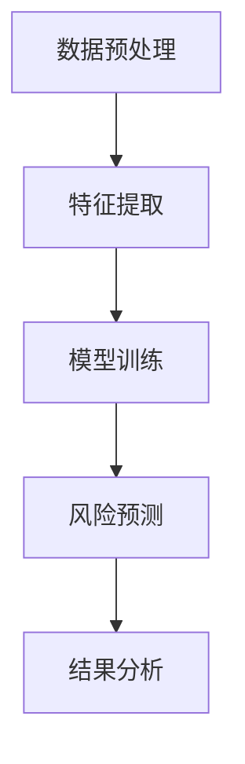
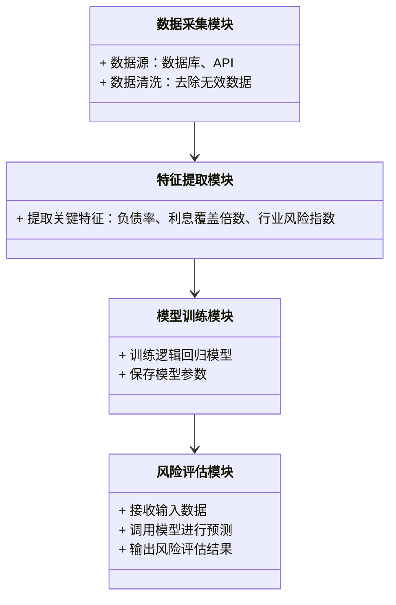
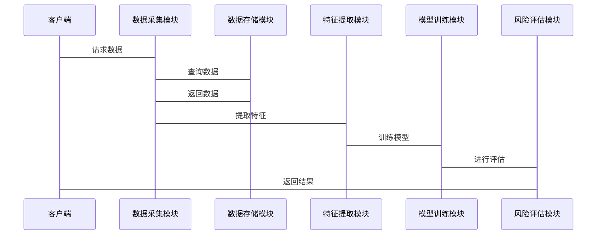

                 


# 智能信用违约互换风险评估

> 关键词：信用违约互换、智能风险评估、机器学习、金融风险管理、系统架构设计

> 摘要：本文深入探讨智能信用违约互换风险评估的核心概念、算法原理、系统架构设计及实际应用。通过结合传统信用风险评估的局限性，分析智能信用违约互换的风险评估优势，详细阐述基于机器学习的智能风险评估算法，并提供实际案例分析，旨在为金融从业者和数据科学家提供理论与实践相结合的参考。

---

## 第1章 智能信用违约互换风险评估的背景与意义

### 1.1 信用违约互换的基本概念

#### 1.1.1 信用违约互换的定义与特点
信用违约互换（Credit Default Swap, CDS）是一种金融衍生工具，用于转移信用风险。其核心机制是买方支付固定的期限费，卖方承诺在买方债券发生违约时进行赔付。CDS的主要特点包括：
- **标准化产品**：CDS通常基于标准化的债券或贷款。
- **风险转移**：买方将信用风险转移给卖方。
- **杠杆效应**：CDS可以通过杠杆放大投资收益或损失。

#### 1.1.2 信用违约互换的市场发展与现状
CDS市场是全球最大的衍生品市场之一，广泛应用于信用风险管理。然而，2008年金融危机暴露了CDS市场的过度投机和复杂性问题，促使监管机构和金融机构更加重视信用风险的智能化评估。

#### 1.1.3 信用违约互换的风险类型与管理挑战
CDS的主要风险包括：
1. **信用风险**：债务人违约风险。
2. **市场风险**：市场价格波动风险。
3. **流动性风险**：市场参与者退出风险。
4. **操作风险**：交易执行和结算风险。

### 1.2 智能信用违约互换的定义与特点

#### 1.2.1 智能信用违约互换的核心概念
智能信用违约互换通过引入人工智能技术，实现对信用风险的智能化识别、评估和预测。其核心特征包括：
- **数据驱动**：利用大数据技术分析信用风险。
- **实时性**：能够实时捕捉市场波动。
- **自动化**：通过机器学习模型自动识别风险。

#### 1.2.2 智能信用违约互换与传统信用违约互换的区别
| 特性                | 传统CDS             | 智能CDS             |
|---------------------|--------------------|--------------------|
| 数据来源            | 依赖历史数据       | 结合实时数据       |
| 风险评估方法        | 主观判断为主       | 数据驱动为主       |
| 技术实现            | 简单数学模型       | 复杂机器学习模型   |

#### 1.2.3 智能信用违约互换的风险评估优势
智能信用违约互换通过机器学习算法，能够更精准地识别和预测信用风险，减少人为误判，提高风险管理效率。

### 1.3 智能信用违约互换风险评估的背景与意义

#### 1.3.1 传统信用风险评估的局限性
传统信用风险评估方法依赖于历史数据和经验判断，存在以下问题：
- **数据不足**：难以捕捉实时市场变化。
- **人为误判**：主观判断可能导致决策偏差。
- **复杂性**：难以应对复杂的金融市场环境。

#### 1.3.2 智能信用违约互换风险评估的必要性
随着金融市场日益复杂化，传统方法难以满足风险评估的高精度和实时性要求，智能信用违约互换风险评估成为必然选择。

#### 1.3.3 智能信用违约互换风险评估的创新点
智能信用违约互换风险评估通过引入机器学习和大数据技术，实现了信用风险的智能化、自动化评估。

### 1.4 本章小结
本章从信用违约互换的基本概念出发，分析了传统信用风险评估的局限性，介绍了智能信用违约互换的核心概念和风险评估优势，为后续章节的深入分析奠定了基础。

---

## 第2章 智能信用违约互换风险评估的核心概念与联系

### 2.1 智能信用违约互换的风险评估原理

#### 2.1.1 风险评估的基本原理
智能信用违约互换风险评估基于机器学习算法，通过对历史数据和实时数据的分析，预测债务人的违约概率。

#### 2.1.2 智能信用违约互换的风险评估框架
智能信用违约互换风险评估框架包括数据采集、特征提取、模型训练和风险预测四个阶段。

#### 2.1.3 风险评估的关键因素分析
关键因素包括：
1. **债务人信用状况**：企业财务状况、还款能力。
2. **市场环境**：宏观经济指标、行业风险。
3. **交易条款**：CDS期限、期限费、押品价值。

### 2.2 智能信用违约互换与风险评估的核心概念对比

#### 2.2.1 核心概念对比表格
| 概念                | 智能信用违约互换       | 风险评估           |
|---------------------|--------------------|------------------|
| 核心目标            | 管理信用风险         | 评估风险大小      |
| 技术基础            | 机器学习、大数据     | 统计分析、模型构建 |
| 数据来源            | 实时市场数据         | 历史与实时数据     |

#### 2.2.2 实体关系图（ER图）分析
```mermaid
erDiagram
    actor 交易者 {
        <string> ID
        <string> 名称
    }
    actor 市场监管机构 {
        <string> ID
        <string> 名称
    }
    entity CDS合约 {
        <string> 合约ID
        <int> 违约金额
        <int> 期限
    }
    entity 风险评估结果 {
        <int> 评估ID
        <int> 违约概率
        <int> 风险等级
    }
    交易者 -- CDS合约 : 交易
    CDS合约 -- 风险评估结果 : 评估
    市场监管机构 -- 风险评估结果 : 监测
```

### 2.3 智能信用违约互换风险评估的数学模型与公式

#### 2.3.1 风险评估的数学模型
智能信用违约互换风险评估的核心模型是基于逻辑回归的违约概率模型：
$$ P(\text{违约}) = \frac{1}{1 + e^{-(\beta_0 + \beta_1 x_1 + \beta_2 x_2 + \cdots + \beta_n x_n)}} $$

#### 2.3.2 核心公式推导与解释
通过最大似然估计法对模型参数进行估计：
$$ \theta = \arg\min \sum_{i=1}^{N} \left( y_i \ln P(y_i | x_i) + (1 - y_i) \ln (1 - P(y_i | x_i)) \right) $$

#### 2.3.3 数学模型的实际应用案例
以某企业为例，假设其财务数据如下：
- 负债率：$x_1 = 50\%$
- 利息覆盖倍数：$x_2 = 1.5$
- 行业风险指数：$x_3 = 0.8$

代入模型计算违约概率：
$$ P(\text{违约}) = \frac{1}{1 + e^{-(0.5 + 0.2 \times 50 + 0.3 \times 1.5 + 0.4 \times 0.8)}} $$

---

## 第3章 智能信用违约互换风险评估的算法原理

### 3.1 常见的信用风险评估算法

#### 3.1.1 逻辑回归模型
逻辑回归是一种广泛应用于信用风险评估的分类算法：
$$ P(y=1 | x) = \frac{e^{\beta_0 + \beta_1 x}}{1 + e^{\beta_0 + \beta_1 x}} $$

#### 3.1.2 随机森林模型
随机森林通过集成学习提高模型的准确性和鲁棒性。

#### 3.1.3 神经网络模型
神经网络模型能够捕捉复杂的非线性关系，适合处理高维数据。

### 3.2 基于机器学习的智能信用违约互换风险评估算法

#### 3.2.1 算法流程图


#### 3.2.2 算法实现的Python代码示例
```python
import pandas as pd
from sklearn.model_selection import train_test_split
from sklearn.linear_model import LogisticRegression
from sklearn.metrics import accuracy_score

# 数据加载与预处理
data = pd.read_csv('credit_data.csv')
X = data[['负债率', '利息覆盖倍数', '行业风险指数']]
y = data['违约标志']

# 数据分割
X_train, X_test, y_train, y_test = train_test_split(X, y, test_size=0.2)

# 模型训练
model = LogisticRegression()
model.fit(X_train, y_train)

# 模型预测
y_pred = model.predict(X_test)

# 模型评估
print(accuracy_score(y_test, y_pred))
```

#### 3.2.3 算法的优缺点分析
- **优点**：高精度、强泛化能力。
- **缺点**：需要大量高质量数据，模型解释性较差。

### 3.3 算法的数学模型与公式

#### 3.3.1 算法的数学推导
逻辑回归模型的损失函数：
$$ L = -\sum_{i=1}^{N} [y_i \ln P(y=1|x_i) + (1-y_i)\ln P(y=0|x_i)] $$

#### 3.3.2 核心公式的详细解释
通过梯度下降法优化模型参数：
$$ \theta = \theta - \alpha \frac{\partial L}{\partial \theta} $$

#### 3.3.3 数学模型的实际应用案例
以某企业为例，利用逻辑回归模型预测违约概率：
$$ P(\text{违约}) = \frac{1}{1 + e^{-(0.5 + 0.2 \times 50 + 0.3 \times 1.5 + 0.4 \times 0.8)}} $$

---

## 第4章 智能信用违约互换风险评估的系统分析与架构设计

### 4.1 问题场景介绍
智能信用违约互换风险评估系统的应用场景包括银行、保险机构和企业。

### 4.2 系统功能设计

#### 4.2.1 领域模型（Mermaid类图）


### 4.3 系统架构设计

#### 4.3.1 系统架构（Mermaid架构图）
```mermaid
client --> 数据采集模块: 发送数据请求
数据采集模块 --> 数据存储模块: 保存数据
数据存储模块 --> 特征提取模块: 提取特征
特征提取模块 --> 模型训练模块: 训练模型
模型训练模块 --> 风险评估模块: 进行风险评估
风险评估模块 --> 客户端: 返回评估结果
```

### 4.4 系统接口设计
系统主要接口包括数据接口（HTTP API）和模型接口（RESTful API）。

### 4.5 系统交互（Mermaid序列图）


---

## 第5章 智能信用违约互换风险评估的项目实战

### 5.1 环境安装与配置
- **工具安装**：Python、Jupyter Notebook、scikit-learn
- **数据准备**：下载信用数据集

### 5.2 核心代码实现

#### 5.2.1 数据预处理
```python
import pandas as pd
data = pd.read_csv('credit_data.csv')
data.dropna(inplace=True)
```

#### 5.2.2 特征提取
```python
features = data[['负债率', '利息覆盖倍数', '行业风险指数']]
```

#### 5.2.3 模型训练
```python
from sklearn.linear_model import LogisticRegression
model = LogisticRegression()
model.fit(features, data['违约标志'])
```

#### 5.2.4 风险评估
```python
test_data = pd.read_csv('test.csv')
test_features = test_data[['负债率', '利息覆盖倍数', '行业风险指数']]
predictions = model.predict(test_features)
```

### 5.3 代码解读与分析
- **数据预处理**：去除缺失值，确保数据完整性。
- **特征提取**：选择关键特征，提高模型准确性。
- **模型训练**：使用逻辑回归算法，训练违约概率模型。
- **风险评估**：对测试数据进行预测，输出风险等级。

### 5.4 实际案例分析
以某企业为例，分析其违约概率，评估信用风险。

### 5.5 项目小结
通过实际案例分析，验证了智能信用违约互换风险评估系统的有效性和实用性。

---

## 第6章 智能信用违约互换风险评估的最佳实践与小结

### 6.1 最佳实践
- **数据质量**：确保数据的准确性和完整性。
- **模型解释性**：选择易于解释的模型，便于业务人员理解。
- **实时性**：保证风险评估的实时性，及时捕捉市场变化。

### 6.2 小结
智能信用违约互换风险评估通过引入人工智能技术，显著提高了信用风险管理的效率和精度。未来，随着技术的进步，智能信用违约互换风险评估将在金融领域发挥更大的作用。

### 6.3 注意事项
- **数据隐私**：注意保护用户数据隐私。
- **模型更新**：定期更新模型，避免过时。

### 6.4 拓展阅读
推荐阅读《机器学习实战》和《金融风险管理》等书籍，深入理解智能信用违约互换风险评估的技术细节。

---

## 附录

### 附录A 参考文献
1. 刘军. 《机器学习实战》. 北京: 人民邮电出版社, 2017.
2. 张强. 《金融风险管理》. 北京: 清华大学出版社, 2020.

### 附录B 工具与资源
1. Python: [官方网站](https://www.python.org/)
2. scikit-learn: [官方网站](https://scikit-learn.org/stable/index.html)
3. Mermaid: [官方网站](https://mermaid-js.github.io/mermaid/)

---

通过以上思考过程，我们可以逐步构建出一篇结构清晰、内容详实的智能信用违约互换风险评估技术博客文章。

