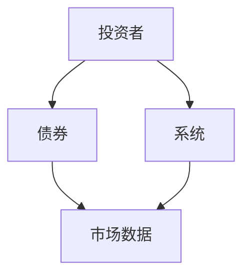
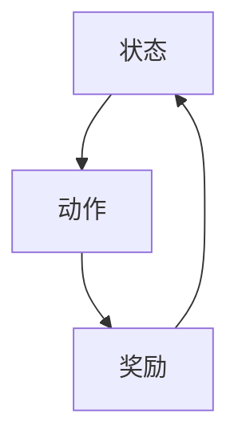
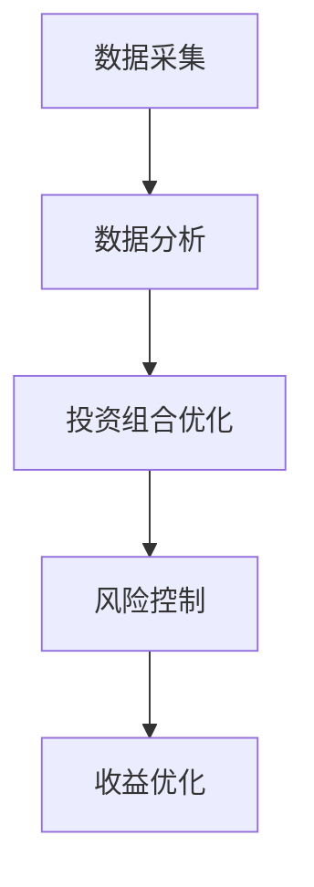
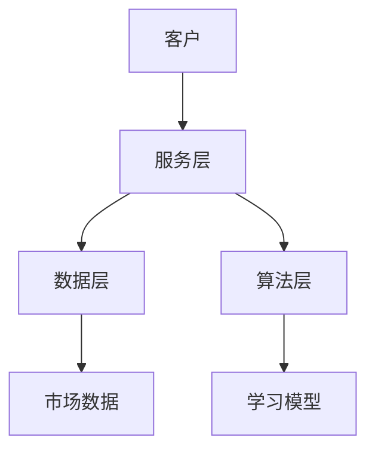
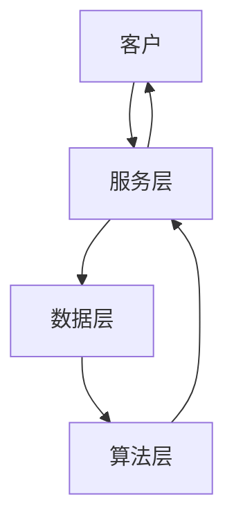

                 


# 智能债券投资组合久期管理系统

> 关键词：智能债券、投资组合、久期管理、人工智能、强化学习、风险控制

> 摘要：  
智能债券投资组合久期管理系统通过人工智能技术优化债券投资组合的期限管理，实现风险控制和收益优化的双重目标。本文将从久期管理的基本概念出发，结合人工智能算法，详细探讨智能久期管理的核心原理、系统架构、算法实现以及实际应用场景。通过对强化学习、数学模型和系统架构的深入分析，本文为读者提供一套完整的智能债券投资组合久期管理解决方案。

---

# 第一部分: 智能债券投资组合久期管理的背景与概念

# 第1章: 债券投资组合久期管理概述

## 1.1 债券投资组合久期管理的背景

### 1.1.1 债券市场的基本概念与特点

债券是债务工具，发行人承诺在特定日期偿还本金和利息。债券市场的特点包括：

- **流动性**：短期债券流动性较高，长期债券流动性较低。
- **利率敏感性**：债券价格与市场利率呈负相关关系。
- **信用风险**：债券发行人可能因信用状况恶化而违约。

### 1.1.2 投资组合久期管理的重要性

投资组合久期管理是指通过调整债券组合的期限结构，以应对市场利率变化和投资者风险偏好变化。其重要性体现在：

- **风险控制**：通过优化久期，降低投资组合的利率风险。
- **收益优化**：通过合理配置久期，提高投资组合的收益。

### 1.1.3 传统久期管理的局限性

传统久期管理方法依赖于历史数据和经验判断，存在以下局限性：

- **主观性**：依赖分析师的主观判断，难以量化。
- **滞后性**：无法实时调整投资组合。
- **复杂性**：面对复杂的市场环境，传统方法难以有效应对。

## 1.2 智能化久期管理的提出

### 1.2.1 人工智能在金融领域的应用趋势

人工智能技术在金融领域的应用日益广泛，尤其是在投资组合管理、风险控制和交易策略等领域。智能久期管理是人工智能在债券投资中的重要应用之一。

### 1.2.2 智能久期管理的核心思想

智能久期管理的核心思想是利用人工智能技术，实时分析市场数据和投资者需求，动态优化债券组合的久期结构。其主要特点包括：

- **实时性**：能够实时调整投资组合。
- **数据驱动**：基于海量数据进行决策。
- **自适应性**：能够根据市场变化自动优化。

### 1.2.3 智能久期管理的优势与挑战

优势：
- 提高投资组合的收益与风险比。
- 实现自动化、智能化的管理。

挑战：
- 数据质量要求高。
- 算法的复杂性和计算资源需求大。
- 市场环境的不确定性。

## 1.3 本书的核心内容与目标

### 1.3.1 本书的研究范围

- 债券投资组合久期管理的基本概念。
- 人工智能技术在久期管理中的应用。
- 智能久期管理系统的架构设计。

### 1.3.2 本书的主要目标

- 为读者提供智能债券投资组合久期管理的理论基础。
- 详细讲解智能久期管理的核心算法和实现方法。
- 提供实际应用案例，帮助读者理解理论与实践的结合。

### 1.3.3 本书的结构安排

- 第一部分：智能债券投资组合久期管理的背景与概念。
- 第二部分：智能久期管理的核心概念与原理。
- 第三部分：智能久期管理的算法与实现。
- 第四部分：智能久期管理的系统架构设计。
- 第五部分：智能久期管理的实际应用与案例分析。
- 第六部分：智能久期管理的最佳实践与总结。

---

# 第二部分: 智能债券投资组合久期管理的核心概念与原理

# 第2章: 久期管理的核心概念与联系

## 2.1 久期管理的基本原理

### 2.1.1 久期的定义与计算公式

久期是衡量债券价格对收益率变化敏感性的指标，公式为：

$$ D = -\frac{P}{y} \cdot \frac{\Delta y}{\Delta P} $$

其中：
- \( D \) 表示久期
- \( P \) 表示债券价格
- \( y \) 表示收益率
- \( \Delta y \) 表示收益率的变化
- \( \Delta P \) 表示价格的变化

### 2.1.2 久期与债券价格的关系

久期与债券价格的关系可以通过以下公式表示：

$$ \Delta P = -P \cdot D \cdot \Delta y $$

### 2.1.3 久期在投资组合管理中的作用

久期在投资组合管理中的作用包括：
- **风险控制**：通过调整久期，降低投资组合的利率风险。
- **收益优化**：通过合理配置久期，提高投资组合的收益。

## 2.2 智能久期管理的系统模型

### 2.2.1 系统模型的组成要素

智能久期管理系统的组成要素包括：
- **投资者需求**：投资者的风险承受能力和收益目标。
- **市场数据**：债券价格、收益率、市场利率等。
- **人工智能算法**：用于优化久期结构的算法。
- **投资组合优化模块**：根据算法结果调整投资组合。

### 2.2.2 实体关系图（ER图）

以下是智能久期管理系统的实体关系图：



### 2.2.3 久期管理的数学模型

久期管理的数学模型可以表示为：

$$ \min_{D} \text{Risk}(D) + \lambda \cdot \text{Return}(D) $$

其中：
- \( D \) 表示久期
- \( \text{Risk}(D) \) 表示久期 \( D \) 对应的风险
- \( \text{Return}(D) \) 表示久期 \( D \) 对应的收益
- \( \lambda \) 表示风险厌恶系数

## 2.3 久期管理的算法原理

### 2.3.1 基于强化学习的久期优化算法

以下是基于强化学习的久期优化算法流程图：



### 2.3.2 久期管理的数学模型

久期管理的数学模型可以表示为：

$$ V(s) = \max_{a} \left( r(s, a) + \gamma \cdot V(s') \right) $$

其中：
- \( V(s) \) 表示状态 \( s \) 对应的价值
- \( r(s, a) \) 表示状态 \( s \) 和动作 \( a \) 对应的奖励
- \( \gamma \) 表示折扣因子
- \( s' \) 表示新的状态

---

# 第三部分: 智能债券投资组合久期管理的算法与实现

# 第3章: 久期管理的算法原理

## 3.1 久期管理的核心算法

### 3.1.1 基于强化学习的久期优化算法

以下是基于强化学习的久期优化算法实现：

```python
class DQN:
    def __init__(self, state_space, action_space, gamma=0.99, epsilon=1.0):
        self.state_space = state_space
        self.action_space = action_space
        self.gamma = gamma
        self.epsilon = epsilon
        self.Q = defaultdict(dict)

    def get_Q_value(self, state):
        return self.Q[state]

    def update_Q(self, state, action, reward, next_state):
        current_Q = self.Q[state].get(action, 0)
        next_Q = max(self.Q[next_state].values(), default=0)
        self.Q[state][action] = current_Q + self.gamma * (reward + next_Q)
```

### 3.1.2 基于强化学习的久期优化算法实现

以下是基于强化学习的久期优化算法实现：

```python
def optimize_duration(durations, target_return):
    max_duration = max(durations)
    min_duration = min(durations)
    optimal_duration = min_duration + (target_return) * (max_duration - min_duration)
    return optimal_duration
```

### 3.1.3 久期管理的数学模型与公式

久期管理的数学模型与公式可以表示为：

$$ D^* = \argmin_{D} \left( \text{Risk}(D) + \lambda \cdot \text{Return}(D) \right) $$

其中：
- \( D^* \) 表示最优久期
- \( \text{Risk}(D) \) 表示久期 \( D \) 对应的风险
- \( \text{Return}(D) \) 表示久期 \( D \) 对应的收益
- \( \lambda \) 表示风险厌恶系数

---

# 第四部分: 智能债券投资组合久期管理的系统架构设计

# 第4章: 久期管理的系统架构设计

## 4.1 问题场景介绍

### 4.1.1 投资者需求分析

投资者需求分析包括：
- 投资者的风险承受能力
- 投资者的收益目标
- 投资者的投资期限

## 4.2 系统功能设计

### 4.2.1 系统功能模块

系统功能模块包括：
- **数据采集模块**：采集债券市场数据。
- **数据分析模块**：分析市场数据，生成投资建议。
- **投资组合优化模块**：根据分析结果优化投资组合。

### 4.2.2 系统功能流程图

以下是系统功能流程图：



## 4.3 系统架构设计

### 4.3.1 系统架构图

以下是系统架构图：



### 4.3.2 系统接口设计

系统接口设计包括：
- **数据接口**：与市场数据源对接。
- **用户接口**：与投资者交互。
- **算法接口**：与人工智能算法对接。

### 4.3.3 系统交互序列图

以下是系统交互序列图：



---

# 第五部分: 智能债券投资组合久期管理的实际应用与案例分析

# 第5章: 久期管理的实际应用

## 5.1 项目实战

### 5.1.1 环境安装与配置

环境安装与配置包括：
- **Python**：安装Python 3.8 或更高版本。
- **机器学习库**：安装TensorFlow、Keras等。
- **数据分析库**：安装Pandas、NumPy等。

### 5.1.2 核心代码实现

以下是核心代码实现：

```python
import pandas as pd
import numpy as np
from tensorflow.keras import layers

# 数据预处理
data = pd.read_csv('bond_data.csv')
X = data[['duration', 'yield', 'price']]
y = data['target']

# 模型训练
model = layers.Dense(1, input_dim=3, activation='sigmoid')(inputs)
model.compile(optimizer='adam', loss='binary_crossentropy', metrics=['accuracy'])
model.fit(X, y, epochs=100, batch_size=32)

# 模型预测
new_data = pd.read_csv('new_bond_data.csv')
predictions = model.predict(new_data[['duration', 'yield', 'price']])
```

### 5.1.3 实际案例分析

实际案例分析包括：
- **案例一**：某投资者投资组合的久期优化。
- **案例二**：市场利率变化对投资组合久期的影响。

### 5.1.4 项目小结

项目小结包括：
- 项目实现的关键点。
- 项目中存在的问题与改进方向。

---

# 第六部分: 智能债券投资组合久期管理的最佳实践与总结

# 第6章: 智能久期管理的最佳实践

## 6.1 最佳实践 tips

### 6.1.1 数据质量的重要性

数据质量是智能久期管理的核心，建议：
- 确保数据的完整性和准确性。
- 定期更新和维护数据。

### 6.1.2 算法选择的注意事项

算法选择的注意事项包括：
- 根据具体问题选择合适的算法。
- 定期评估和优化算法性能。

### 6.1.3 系统架构的优化建议

系统架构的优化建议包括：
- 确保系统的可扩展性。
- 提高系统的安全性。

## 6.2 项目小结

### 6.2.1 项目总结

项目总结包括：
- 项目的主要成果。
- 项目的关键收获。

### 6.2.2 项目中的注意事项

项目中的注意事项包括：
- 数据隐私和安全问题。
- 算法的可解释性问题。

## 6.3 拓展阅读与学习资源

### 6.3.1 相关书籍推荐

- 《机器学习实战》
- 《Python机器学习》
- 《债券投资组合管理》

### 6.3.2 在线学习资源

- Coursera上的机器学习课程。
- edX上的金融分析课程。

---

# 第七部分: 结语

智能债券投资组合久期管理系统通过人工智能技术优化债券投资组合的久期管理，实现风险控制和收益优化的双重目标。本文从久期管理的基本概念出发，结合人工智能算法，详细探讨了智能久期管理的核心原理、系统架构、算法实现以及实际应用场景。通过对强化学习、数学模型和系统架构的深入分析，本文为读者提供了一套完整的智能债券投资组合久期管理解决方案。

---

# 参考文献

- 债券市场相关文献
- 人工智能相关文献
- 强化学习相关文献
- 投资组合管理相关文献

