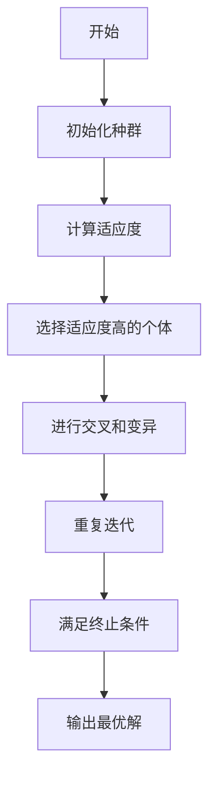

                 


# 智能债券投资组合免疫策略

> 关键词：智能债券投资、免疫策略、优化算法、系统架构、项目实战

> 摘要：智能债券投资组合免疫策略是一种利用先进的算法和优化技术来构建和管理债券投资组合的方法，旨在有效降低市场风险并提高收益。本文将详细探讨智能免疫策略的背景、核心概念、算法原理、系统架构以及实际应用案例，为读者提供全面的理论与实践指导。

---

## 目录

### 第一章：债券投资组合免疫策略的背景

#### 1.1 债券投资的基本概念
- 1.1.1 债券的定义与基本属性
- 1.1.2 债券投资的目标与风险
- 1.1.3 债券组合管理的必要性

#### 1.2 智能免疫策略的背景
- 1.2.1 传统债券免疫策略的局限性
- 1.2.2 智能免疫策略的提出背景
- 1.2.3 智能免疫策略的优势与应用场景

### 第二章：智能债券投资组合免疫策略的核心概念

#### 2.1 智能免疫策略的定义与特点
- 2.1.1 智能免疫策略的定义
- 2.1.2 智能免疫策略的核心特点
- 2.1.3 智能免疫策略与传统免疫策略的对比

#### 2.2 智能免疫策略的原理
- 2.2.1 算法优化的基本原理
- 2.2.2 智能免疫策略的数学模型
- 2.2.3 智能免疫策略的实现步骤

#### 2.3 智能免疫策略的核心要素
- 2.3.1 债券组合的风险度量
- 2.3.2 债券组合的收益目标
- 2.3.3 市场环境的动态变化

### 第三章：智能免疫策略的算法原理

#### 3.1 免疫算法的基本原理
- 3.1.1 免疫算法的定义
- 3.1.2 免疫算法的核心思想
- 3.1.3 免疫算法的优化目标

#### 3.2 免疫算法的流程图


### 第四章：智能免疫策略的数学模型

#### 4.1 优化目标
$$ \text{最小化风险} \quad \text{或} \quad \text{最大化收益} $$

#### 4.2 约束条件
$$ \sum_{i=1}^{n} w_i = 1 $$
$$ w_i \geq 0 \quad \text{对于所有} \quad i $$

#### 4.3 求解过程
- 使用拉格朗日乘数法求解优化问题
- 讨论如何处理约束条件

### 第五章：智能免疫策略的系统架构

#### 5.1 系统功能模块
- 数据采集模块
- 算法计算模块
- 结果展示模块

#### 5.2 系统架构图


### 第六章：项目实战

#### 6.1 环境安装
- 安装Python和必要的库（如NumPy、Pandas、Scipy）

#### 6.2 核心代码实现
```python
import numpy as np
from scipy.optimize import minimize

# 定义目标函数
def objective(x, *args):
    # 目标函数的具体实现
    pass

# 定义约束条件
def constraint(x, *args):
    # 约束条件的具体实现
    pass

# 初始化参数
x0 = np.array([0.5, 0.5])

# 使用scipy.optimize.minimize进行优化
result = minimize(objective, x0, constraints=constraint)

# 输出结果
print(result)
```

#### 6.3 案例分析与结果解读
- 解释优化后的债券组合
- 讨论实际投资中的应用

### 第七章：总结与展望

#### 7.1 总结
- 回顾文章的主要内容
- 强调智能免疫策略的优势

#### 7.2 最佳实践 tips
- 建议在实际应用中结合市场变化调整策略
- 注意数据质量和模型的实时性

#### 7.3 未来展望
- 探讨更高级的算法在债券投资中的应用
- 提出进一步研究的方向

### 第八章：扩展阅读

#### 8.1 推荐书籍
- 《算法导论》
- 《投资学原理》

#### 8.2 相关技术博客
- 推荐几篇关于免疫算法和债券投资的博客链接

---

通过以上目录结构，文章将系统地介绍智能债券投资组合免疫策略的各个方面，从理论到实践，为读者提供全面而深入的指导。

