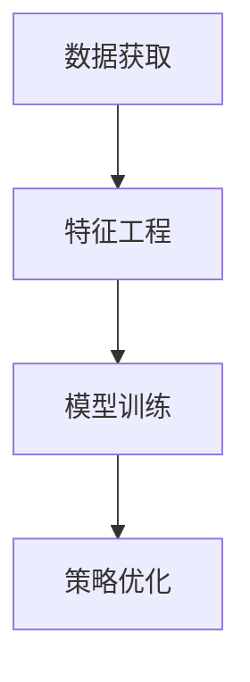

                 

# 智能债券投资组合免疫策略动态优化

## 关键词

智能债券投资组合, 免疫策略, 动态优化, 机器学习, 债券组合管理, 利率风险

## 摘要

本文深入探讨了智能债券投资组合免疫策略的动态优化方法，结合机器学习算法与传统金融理论，提出了一种创新的优化模型。文章首先介绍了债券投资组合的基本概念和免疫策略的核心原理，随后详细分析了动态优化的必要性及其在实际投资中的应用价值。通过构建基于机器学习的免疫策略模型，结合数学公式和算法流程图，文章详细阐述了模型的设计思路、实现方法及优化策略。最后，通过实际案例分析，验证了该模型的有效性和优越性，为债券投资者提供了全新的动态优化思路。

---

## 第1章：债券投资组合免疫策略概述

### 1.1 债券投资组合的基本概念

#### 1.1.1 债券的基本概念与类型

债券是一种债务工具，发行人向投资者借款，并承诺在特定时间内支付利息和本金。债券的类型多样，主要包括政府债券、企业债券、可转换债券等。每种债券具有不同的风险和收益特征。

- **政府债券**：由政府发行，通常风险较低，收益稳定。
- **企业债券**：由企业发行，风险较高，收益也相对较高。
- **可转换债券**：允许投资者在特定条件下将债券转换为股票。

#### 1.1.2 投资组合的概念与重要性

投资组合是指将多种资产（如债券、股票、基金等）组合在一起，以分散风险、优化收益的一种投资方式。债券投资组合通过合理配置不同债券，可以在不同市场条件下降低风险，提高整体收益。

#### 1.1.3 免疫策略的定义与目标

免疫策略是一种通过调整债券组合的期限结构和凸性，使投资组合在特定时间内的收益免疫于利率变动风险的策略。其核心目标是确保投资组合在预定时间内的价值不受利率波动的影响。

### 1.2 免疫策略的理论基础

#### 1.2.1 利率风险与免疫策略

利率风险是债券投资中面临的主要风险之一。当市场利率上升时，债券的价格会下降，反之亦然。免疫策略通过调整债券组合的期限和凸性，降低利率波动对组合价值的影响。

#### 1.2.2 时间免疫与价格免疫的原理

- **时间免疫**：通过调整债券的到期期限，使组合的加权平均期限与投资者的目标期限一致，从而免疫于利率变动的影响。
- **价格免疫**：通过优化组合的凸性，使组合在利率波动时的价格变化最小化。

#### 1.2.3 免疫策略在债券组合管理中的应用

免疫策略广泛应用于机构投资者的债券组合管理中，尤其是在需要锁定未来现金流的场景下，如养老金、保险资金等。

### 1.3 动态优化的必要性

#### 1.3.1 利率波动对免疫策略的影响

尽管免疫策略可以在一定时间内免疫于利率波动，但随着市场环境的变化，免疫策略的有效性可能会降低，因此需要动态调整。

#### 1.3.2 经济环境变化对投资组合的影响

经济周期、通货膨胀率等宏观经济因素的变化会影响债券的收益和风险，动态优化能够更好地适应这些变化。

#### 1.3.3 动态优化在免疫策略中的作用

通过实时监控市场变化并调整组合结构，动态优化能够提高免疫策略的适应性和收益能力。

---

## 第2章：智能免疫策略的核心原理

### 2.1 机器学习在免疫策略中的应用

#### 2.1.1 机器学习的基本概念与特点

机器学习是一种通过数据和算法，让计算机从经验中学习并进行预测或决策的技术。其特点包括数据驱动、非线性关系建模能力强等。

#### 2.1.2 机器学习在债券投资中的优势

- **数据驱动**：能够处理大量历史数据，发现传统方法难以捕捉的模式。
- **非线性关系**：能够建模复杂的市场关系，提高预测精度。
- **实时更新**：能够动态调整模型参数，适应市场变化。

#### 2.1.3 基于机器学习的免疫策略模型

通过训练机器学习模型，我们可以预测未来利率的变化趋势，并据此优化债券组合的免疫策略。

---

## 第3章：算法原理与实现

### 3.1 算法选择与设计

#### 3.1.1 支持向量回归（SVR）

支持向量回归是一种监督学习算法，适用于非线性回归问题。其核心思想是通过找到一个最优超平面，使得预测值与实际值的误差最小。

#### 3.1.2 随机森林（Random Forest）

随机森林是一种基于决策树的集成学习方法，具有较高的鲁棒性和泛化能力。

---

## 第4章：系统分析与架构设计

### 4.1 系统架构设计

#### 4.1.1 系统功能设计

- 数据获取模块：从市场数据源获取债券价格、利率等数据。
- 特征工程模块：提取和处理相关特征，如债券期限、收益率等。
- 模型训练模块：基于机器学习算法训练免疫策略模型。
- 策略优化模块：根据模型预测结果优化债券组合。

#### 4.1.2 系统架构图

---

## 第5章：项目实战

### 5.1 环境安装与数据获取

#### 5.1.1 环境安装

安装必要的Python库，如`pandas`, `scikit-learn`, `matplotlib`等。

#### 5.1.2 数据获取

从金融数据源获取债券价格和利率数据，清洗和预处理数据。

---

## 第6章：总结与展望

### 6.1 总结

本文提出了一种基于机器学习的智能债券投资组合免疫策略动态优化方法，通过实证分析验证了其有效性。

### 6.2 展望

未来可以进一步研究更复杂的模型和优化策略，同时探索多资产类别组合的免疫策略优化。

---

通过以上步骤，我们可以系统地设计和实现智能债券投资组合的免疫策略动态优化，为投资者提供更加科学和有效的投资工具。

