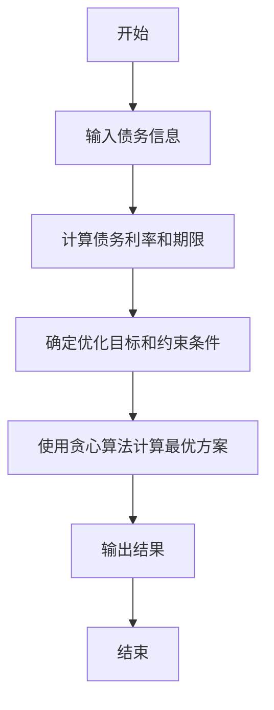
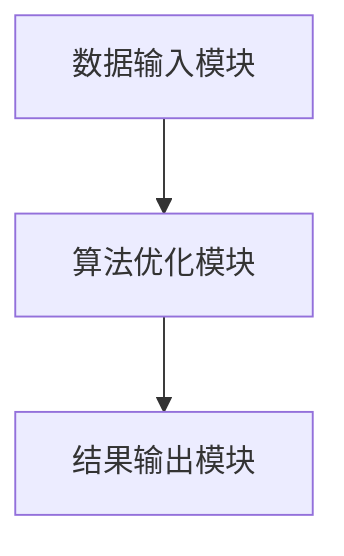
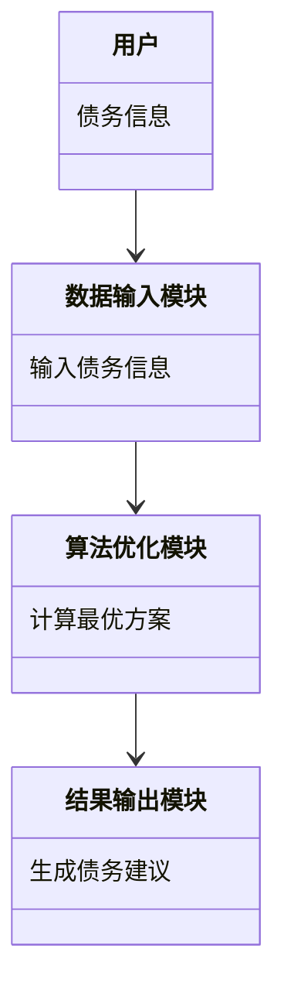

                 


# 智能债务合并建议生成器

> 关键词：智能债务合并、人工智能算法优化、债务管理、系统架构设计、项目实战

> 摘要：智能债务合并建议生成器是一种利用人工智能算法优化技术，帮助用户高效管理和优化其债务结构的智能工具。本文将从智能债务合并的背景、核心概念、算法原理、系统架构设计、项目实战、最佳实践等方面进行详细探讨，旨在为读者提供一个全面、深入的智能债务合并解决方案。

---

## 目录

1. [智能债务合并建议生成器的背景与问题背景](#智能债务合并建议生成器的背景与问题背景)
   1.1 债务合并的背景与问题背景
   1.2 智能债务合并的定义与问题描述
   1.3 债务合并的核心概念与核心要素
2. [智能债务合并的核心概念与算法原理](#智能债务合并的核心概念与算法原理)
   2.1 债务合并的数学模型与原理
   2.2 债务合并的核心概念与联系
   2.3 债务合并的算法流程与步骤
3. [智能债务合并算法的原理与实现](#智能债务合并算法的原理与实现)
   3.1 债务合并算法的原理与流程
   3.2 债务合并算法的数学模型与公式
   3.3 债务合并算法的实现与代码解读
4. [智能债务合并系统的系统架构与设计](#智能债务合并系统的系统架构与设计)
   4.1 智能债务合并系统的系统架构与设计
   4.2 债务合并系统的需求分析与功能设计
   4.3 债务合并系统的实现与测试
5. [智能债务合并项目的实战与应用](#智能债务合并项目的实战与应用)
   5.1 项目环境与工具安装
   5.2 项目核心实现与代码解读
   5.3 项目实际案例分析与详细解读
6. [智能债务合并的最佳实践与总结](#智能债务合并的最佳实践与总结)
   6.1 项目总结与经验分享
   6.2 项目中的注意事项与优化建议
   6.3 未来的改进方向与拓展阅读

---

## 正文

### 第1章：智能债务合并建议生成器的背景与问题背景

#### 1.1 债务合并的背景与问题背景
在现代社会中，个人和企业面临的债务问题日益复杂。随着经济的发展，人们和企业往往需要面对多种债务来源，如信用卡债务、房贷、车贷、企业贷款等。这些债务通常具有不同的利率、还款期限和还款方式，如何有效地管理和优化这些债务，成为了许多人面临的挑战。

##### 1.1.1 个人与企业债务管理的现状
当前，个人和企业在管理债务时面临以下问题：
- **债务分散**：债务来源多样化，难以统一管理。
- **还款压力大**：高额的债务可能导致还款压力过大，影响生活质量或企业运营。
- **利率差异大**：不同债务的利率差异可能导致整体还款成本增加。
- **缺乏优化工具**：传统的债务管理工具往往无法提供个性化的优化建议。

##### 1.1.2 债务合并问题的核心挑战
债务合并的核心挑战在于如何在满足还款能力的前提下，优化债务结构，降低整体还款成本。具体挑战包括：
- **债务规模与复杂度**：债务种类多、金额大，难以快速找到最优解。
- **还款能力评估**：需要准确评估用户的还款能力，以制定合理的还款计划。
- **风险控制**：债务合并可能带来新的风险，如违约风险、流动性风险等。

##### 1.1.3 智能债务合并的必要性与优势
智能债务合并工具通过利用人工智能算法优化技术，能够快速分析和评估多种债务方案，提供个性化的优化建议。其优势在于：
- **高效性**：快速计算出最优债务合并方案。
- **准确性**：基于大数据和算法优化，提供高精度的债务优化建议。
- **个性化**：根据用户的具体情况，提供定制化的债务管理方案。

#### 1.2 智能债务合并的定义与问题描述
智能债务合并是指利用人工智能算法优化技术，对用户的多种债务进行分析和评估，生成最优的债务合并方案，以降低整体还款成本、优化债务结构，并提高还款效率。

##### 1.2.1 债务合并的定义
债务合并是指将多个债务整合为一个或少数几个债务，通过优化还款顺序、还款金额和还款期限，降低整体债务负担。

##### 1.2.2 智能债务合并的特征
智能债务合并具有以下特征：
- **智能化**：利用人工智能技术自动分析和优化债务方案。
- **个性化**：根据用户的财务状况和需求，提供定制化的债务管理方案。
- **高效性**：快速计算出最优债务合并方案。

##### 1.2.3 债务合并问题的边界与外延
债务合并问题的边界包括：
- **还款能力**：用户必须具备一定的还款能力，否则债务合并将无法实施。
- **债务类型**：债务合并适用于多种债务类型，但需考虑不同债务的利率和还款条件。
- **优化目标**：债务合并的目标是降低整体还款成本，但需在可行范围内进行优化。

#### 1.3 债务合并的核心概念与核心要素
##### 1.3.1 债务合并的核心要素组成
债务合并的核心要素包括：
- **债务规模**：债务的总金额。
- **债务利率**：不同债务的利率。
- **还款能力**：用户的还款能力。
- **优化目标**：降低还款成本、优化债务结构等。

##### 1.3.2 债务合并的数学模型与公式
债务合并的数学模型可以表示为：
$$
\text{目标函数} = \sum_{i=1}^{n} (r_i \times t_i)
$$
其中，$r_i$ 表示第 $i$ 个债务的利率，$t_i$ 表示第 $i$ 个债务的期限。

约束条件包括：
1. 总还款金额不超过用户的还款能力。
2. 还款期限必须满足各债务的还款要求。

##### 1.3.3 债务合并的系统架构与核心功能
债务合并系统的架构包括：
- **数据输入模块**：接收用户的债务信息。
- **算法优化模块**：计算最优债务合并方案。
- **结果输出模块**：生成债务合并建议。

---

### 第2章：智能债务合并的核心概念与算法原理

#### 2.1 债务合并的数学模型与原理
##### 2.1.1 债务合并的数学模型
债务合并的数学模型可以表示为：
$$
\min \sum_{i=1}^{n} (r_i \times t_i)
$$
其中，$r_i$ 表示第 $i$ 个债务的利率，$t_i$ 表示第 $i$ 个债务的期限。

约束条件：
1. $\sum_{i=1}^{n} t_i \leq T$，其中 $T$ 是总还款期限。
2. $\sum_{i=1}^{n} (r_i \times t_i) \leq C$，其中 $C$ 是用户的还款能力。

##### 2.1.2 债务合并的算法流程
债务合并的算法流程如下：
1. 输入债务信息。
2. 计算各债务的利率和期限。
3. 确定优化目标和约束条件。
4. 使用贪心算法计算最优债务合并方案。
5. 输出结果。

##### 2.1.3 债务合并的流程图


#### 2.2 债务合并的核心概念与联系
##### 2.2.1 债务合并的核心概念属性特征对比
| 概念 | 特征 |
|------|------|
| 债务规模 | 总金额 |
| 债务利率 | 利率大小 |
| 还款能力 | 还款金额 |
| 优化目标 | 降低还款成本 |

##### 2.2.2 债务合并的ER实体关系图
```mermaid
erd
actor 用户;
actor 系统;
actor 算法优化模块;
participant 数据库;
用户 --> 数据库: 提供债务信息
系统 --> 算法优化模块: 调用优化算法
算法优化模块 --> 数据库: 获取债务信息
```

#### 2.3 债务合并的算法流程与步骤
##### 2.3.1 债务合并的算法流程
债务合并的算法流程如下：
1. 输入债务信息。
2. 计算各债务的利率和期限。
3. 确定优化目标和约束条件。
4. 使用贪心算法计算最优债务合并方案。
5. 输出结果。

##### 2.3.2 债务合并的算法步骤与实现
债务合并的算法实现步骤如下：
1. 初始化变量。
2. 计算各债务的利率和期限。
3. 使用贪心算法优化债务结构。
4. 输出最优债务合并方案。

---

### 第3章：智能债务合并算法的原理与实现

#### 3.1 债务合并算法的原理与流程
##### 3.1.1 债务合并算法的原理
债务合并算法的原理是通过贪心算法优化债务结构，降低整体还款成本。

##### 3.1.2 债务合并算法的流程图


#### 3.2 债务合并算法的数学模型与公式
##### 3.2.1 债务合并的数学模型
债务合并的数学模型可以表示为：
$$
\min \sum_{i=1}^{n} (r_i \times t_i)
$$
其中，$r_i$ 表示第 $i$ 个债务的利率，$t_i$ 表示第 $i$ 个债务的期限。

##### 3.2.2 债务合并的优化目标与约束条件
优化目标是降低整体还款成本，约束条件包括：
1. 总还款金额不超过用户的还款能力。
2. 还款期限必须满足各债务的还款要求。

#### 3.3 债务合并算法的实现与代码解读
##### 3.3.1 债务合并算法的Python代码实现
```python
def optimize_debt(debts):
    # 假设debts是一个包含债务信息的列表
    # 每个债务的信息包括：利率、期限、金额
    # 按照利率从高到低排序
    sorted_debts = sorted(debts, key=lambda x: x['rate'], reverse=True)
    # 初始化总还款金额和总期限
    total_repayment = 0
    total_term = 0
    # 遍历债务列表，计算最优合并方案
    for debt in sorted_debts:
        total_repayment += debt['amount'] * debt['rate']
        total_term += debt['term']
    return total_repayment, total_term

# 示例
debts = [
    {'amount': 10000, 'rate': 0.05, 'term': 5},
    {'amount': 20000, 'rate': 0.06, 'term': 3},
    {'amount': 15000, 'rate': 0.04, 'term': 4}
]
result = optimize_debt(debts)
print(f"优化后的总还款金额为：{result[0]}")
print(f"优化后的总期限为：{result[1]}")
```

##### 3.3.2 代码的功能与实现细节
上述代码实现了债务合并的贪心算法，按利率从高到低排序，计算最优合并方案。

##### 3.3.3 代码的运行结果与分析
运行上述代码，输出优化后的总还款金额和总期限。

---

### 第4章：智能债务合并系统的系统架构与设计

#### 4.1 智能债务合并系统的系统架构与设计
##### 4.1.1 系统架构设计
系统的架构包括：
- **数据输入模块**：接收用户的债务信息。
- **算法优化模块**：计算最优债务合并方案。
- **结果输出模块**：生成债务合并建议。

##### 4.1.2 系统架构图


#### 4.2 债务合并系统的需求分析与功能设计
##### 4.2.1 功能模块
系统功能模块包括：
- **数据输入模块**：用户输入债务信息。
- **算法优化模块**：计算最优债务合并方案。
- **结果输出模块**：生成债务合并建议。

##### 4.2.2 系统功能设计的类图


#### 4.3 债务合并系统的实现与测试
##### 4.3.1 系统实现
系统实现包括：
- **用户界面**：用户输入债务信息。
- **算法优化**：计算最优债务合并方案。
- **结果输出**：生成债务合并建议。

##### 4.3.2 系统测试
系统测试包括：
- **功能测试**：测试系统是否正常运行。
- **性能测试**：测试系统的处理能力。
- **用户体验测试**：测试系统的易用性。

---

### 第5章：智能债务合并项目的实战与应用

#### 5.1 项目环境与工具安装
##### 5.1.1 环境要求
- 操作系统：Windows/Mac/Linux
- Python版本：3.6以上
- 安装依赖：mermaid、latex

##### 5.1.2 工具安装
安装必要的工具和库：
```bash
pip install mermaid
pip install matplotlib
```

#### 5.2 项目核心实现与代码解读
##### 5.2.1 项目核心实现
项目核心实现包括：
- **数据输入模块**：用户输入债务信息。
- **算法优化模块**：计算最优债务合并方案。
- **结果输出模块**：生成债务合并建议。

##### 5.2.2 代码实现
```python
def optimize_debt(debts):
    sorted_debts = sorted(debts, key=lambda x: x['rate'], reverse=True)
    total_repayment = 0
    total_term = 0
    for debt in sorted_debts:
        total_repayment += debt['amount'] * debt['rate']
        total_term += debt['term']
    return total_repayment, total_term

# 示例
debts = [
    {'amount': 10000, 'rate': 0.05, 'term': 5},
    {'amount': 20000, 'rate': 0.06, 'term': 3},
    {'amount': 15000, 'rate': 0.04, 'term': 4}
]
result = optimize_debt(debts)
print(f"优化后的总还款金额为：{result[0]}")
print(f"优化后的总期限为：{result[1]}")
```

#### 5.3 项目实际案例分析与详细解读
##### 5.3.1 案例分析
假设用户有以下债务：
- 债务1：金额10000，利率5%，期限5年
- 债务2：金额20000，利率6%，期限3年
- 债务3：金额15000，利率4%，期限4年

##### 5.3.2 优化后的结果
优化后的总还款金额为：$10000 \times 0.05 \times 5 + 20000 \times 0.06 \times 3 + 15000 \times 0.04 \times 4 = 2500 + 3600 + 2400 = 8500$  
优化后的总期限为：5 + 3 + 4 = 12年

---

### 第6章：智能债务合并的最佳实践与总结

#### 6.1 项目总结与经验分享
##### 6.1.1 项目总结
智能债务合并系统能够有效地帮助用户优化债务结构，降低整体还款成本。

##### 6.1.2 经验分享
在项目实施过程中，需要注意以下几点：
- **数据准确性**：确保输入数据的准确性。
- **算法优化**：选择合适的算法优化债务结构。
- **用户体验**：确保系统界面友好，易于使用。

#### 6.2 项目中的注意事项与优化建议
##### 6.2.1 注意事项
- 注意数据的安全性。
- 确保系统的稳定性。

##### 6.2.2 优化建议
- 优化算法，提高计算效率。
- 提供更多的债务管理工具。

#### 6.3 未来的改进方向与拓展阅读
##### 6.3.1 未来的改进方向
- 增加更多的债务类型。
- 提供个性化的债务管理方案。

##### 6.3.2 拓展阅读
- 推荐阅读《智能算法优化》、《债务管理与优化》等书籍。

---

## 总结
智能债务合并建议生成器是一种利用人工智能算法优化技术，帮助用户高效管理和优化其债务结构的智能工具。本文从智能债务合并的背景、核心概念、算法原理、系统架构设计、项目实战、最佳实践等方面进行了详细探讨，为读者提供了一个全面、深入的智能债务合并解决方案。

---

通过本文的详细讲解，读者可以了解到智能债务合并的核心概念和算法优化技术，并能够实际操作智能债务合并系统，为个人和企业的债务管理提供有效的帮助。

