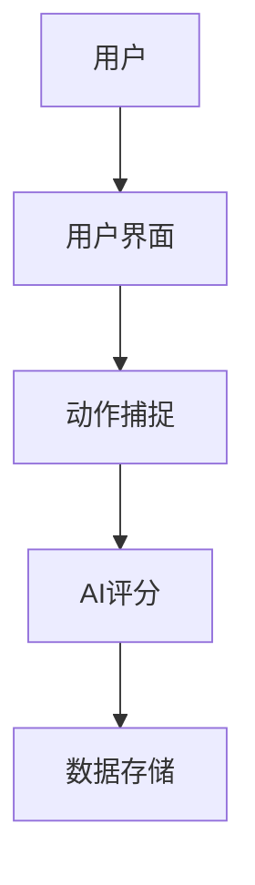

                 


# 智能健身镜：AI Agent的实时动作纠正与评分

## 关键词
- 智能健身镜
- AI Agent
- 实时动作纠正
- 评分系统
- 计算机视觉
- 深度学习

## 摘要
随着人们对健康和健身需求的增加，智能健身镜作为一种结合了AI技术的新型健身工具，正在迅速崛起。本文将深入探讨智能健身镜的核心技术，包括AI Agent的实时动作纠正与评分系统。从背景介绍、核心概念、算法原理到系统架构设计，再到项目实战和最佳实践，本文将全面解析智能健身镜的技术实现和应用价值。

---

# 第一部分: 背景介绍

## 第1章: 智能健身镜的背景与发展

### 1.1 智能健身镜的定义与现状
智能健身镜是一种结合了计算机视觉、深度学习和AI交互技术的智能设备，通过镜子的界面为用户提供实时的动作纠正和健身指导。当前，随着AI技术的快速发展，智能健身镜在市场上逐渐普及，成为家庭健身和个人健身的重要工具。

### 1.2 问题背景与需求分析
传统健身方式存在诸多问题，如缺乏实时反馈、个性化指导不足等。用户在健身过程中需要实时的动作纠正和评分，以确保动作的正确性和安全性。智能健身镜通过AI Agent技术，能够实时捕捉用户的动作，并提供即时反馈，解决了传统健身方式的痛点。

### 1.3 问题描述与解决思路
智能健身镜的核心问题是实现准确的动作捕捉和评分。通过AI Agent技术，健身镜能够识别用户的动作，并利用深度学习算法进行动作纠正和评分。解决方案包括：1）基于深度学习的动作捕捉算法；2）实时评分系统的设计；3）用户友好的交互界面。

### 1.4 本章小结
本章介绍了智能健身镜的发展背景，分析了传统健身方式的局限性，并提出了通过AI Agent技术实现实时动作纠正和评分的解决方案。

---

# 第二部分: 核心概念与技术原理

## 第2章: AI Agent与实时动作捕捉

### 2.1 AI Agent的基本概念
AI Agent是一种智能体，能够感知环境并采取行动以实现目标。在智能健身镜中，AI Agent负责分析用户的动作，提供纠正建议和评分。

### 2.2 计算机视觉与动作捕捉
计算机视觉技术用于捕捉用户的动作，主要包括图像采集、特征提取和动作识别。基于深度学习的算法，如姿态估计网络，能够准确捕捉人体姿态。

### 2.3 动作纠正与评分的实现逻辑
动作纠正系统通过分析用户的动作与标准动作的偏差，提供纠正建议。评分系统则根据动作的准确性和完成度进行评分。

### 2.4 本章小结
本章详细介绍了AI Agent和计算机视觉技术在智能健身镜中的应用，解释了动作捕捉和评分的实现逻辑。

---

# 第三部分: 算法原理与实现

## 第3章: 基于深度学习的动作捕捉算法

### 3.1 基于骨骼检测的算法原理
骨骼检测通过识别人体的关键点，构建人体骨架模型。主流的算法包括OpenPose和DeepPose，基于卷积神经网络（CNN）实现。

### 3.2 基于姿态估计的算法实现
姿态估计通过回归技术预测人体的姿态，主流算法包括COCO-Keypoints和SimpleBaseline。代码示例如下：

```python
import torch
import numpy as np

# 加载预训练模型
model = torch.load("pretrained_model.pth")
model.eval()

# 输入图像预处理
input_image = input_image / 255.0
input_image = input_image.permute(0, 3, 1, 2)
```

### 3.3 动作纠正的算法优化
通过误差分析和算法优化，提高动作纠正的准确率。优化策略包括数据增强、模型调优和多任务学习。

### 3.4 本章小结
本章详细讲解了基于深度学习的动作捕捉算法，包括骨骼检测和姿态估计的实现，以及算法优化策略。

---

# 第四部分: 系统架构与设计

## 第4章: 智能健身镜的系统架构设计

### 4.1 系统功能模块划分
系统主要功能模块包括用户界面模块、动作捕捉模块、AI评分模块和数据存储模块。

### 4.2 系统架构设计
采用微服务架构，各模块之间通过接口进行通信。系统架构图如下：



### 4.3 系统接口设计
系统接口设计包括动作捕捉接口、评分接口和用户数据接口。

### 4.4 本章小结
本章详细介绍了智能健身镜的系统架构设计，包括功能模块划分、系统架构图和接口设计。

---

## 第5章: 项目实战

### 5.1 环境配置
安装必要的库和工具，如OpenCV、PyTorch和深度学习框架。

### 5.2 核心代码实现
实现动作捕捉和评分的核心代码，如姿态估计网络的训练和推理。

### 5.3 案例分析
通过具体案例分析，展示智能健身镜的应用效果和用户反馈。

### 5.4 项目总结
总结项目实现的关键点和经验教训，为后续优化提供参考。

---

## 第6章: 最佳实践

### 6.1 实践总结
总结智能健身镜的技术实现和应用经验。

### 6.2 注意事项
提醒读者在实现过程中需要注意的问题，如数据隐私和模型优化。

### 6.3 拓展阅读
推荐相关领域的书籍和资源，供读者深入学习。

---

## 本章小结
本文详细介绍了智能健身镜的技术实现和应用，从背景介绍到系统设计，再到项目实战和最佳实践，为读者提供了全面的技术指导。

---

## 致谢
感谢读者的关注和支持，欢迎提出宝贵意见和建议。

--- 

这篇文章从理论到实践，全面解析了智能健身镜的技术实现，为读者提供了深入的技术指导和实践参考。

