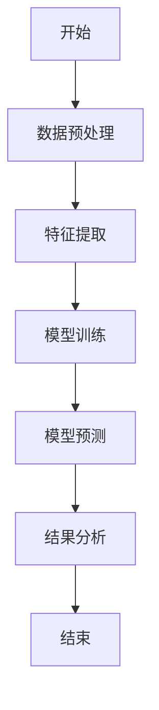
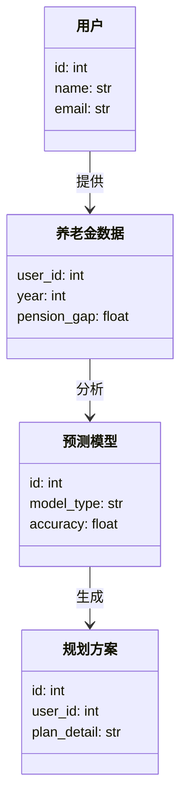
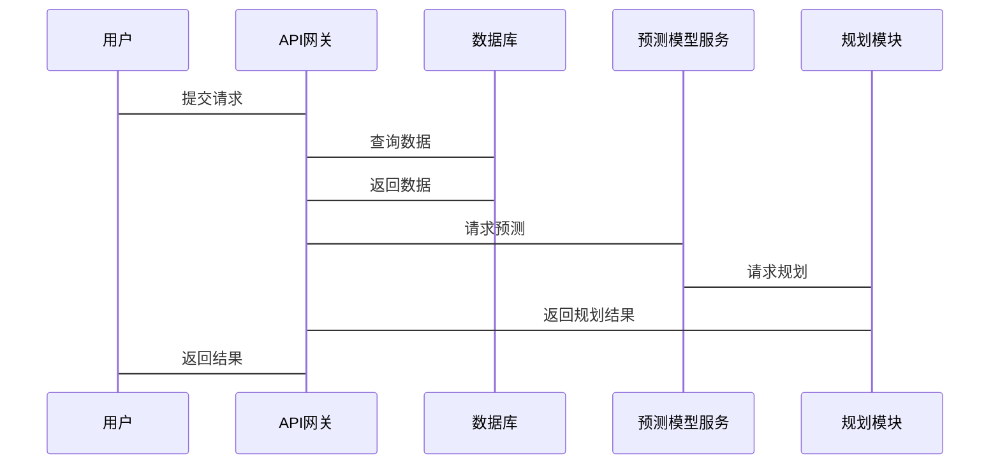

                 


```markdown
# 智能养老金缺口动态预测与规划系统

> 关键词：智能养老金、动态预测、缺口规划、机器学习、系统架构

> 摘要：本文介绍了一种智能养老金缺口动态预测与规划系统，结合时间序列分析、机器学习和深度学习模型，提出了一种创新的算法和系统架构，能够实现实时动态预测和个性化规划，帮助个人和机构有效管理养老金缺口，确保退休生活的财务安全。

---

## 第一部分: 智能养老金缺口动态预测与规划系统概述

### 第1章: 智能养老金缺口动态预测与规划系统背景介绍

#### 1.1 问题背景
- **1.1.1 养老金缺口问题的提出**  
  随着人口老龄化加剧，养老金缺口问题日益严重。传统静态预测方法无法应对经济波动和个体差异带来的挑战。

- **1.1.2 养老金缺口问题的现状分析**  
  养老金缺口是指个人退休前的收入与退休后的支出之间的差异。传统预测方法存在数据单一、模型固定、无法实时更新等问题。

- **1.1.3 智能化预测与规划的必要性**  
  需要一种动态、智能的预测与规划方法，能够根据市场变化和个人情况实时调整养老金缺口预测和规划方案。

#### 1.2 问题描述
- **1.2.1 养老金缺口的定义与计算**  
  养老金缺口 = 退休前收入 - 退休后支出。

- **1.2.2 动态预测的核心要素**  
  需要考虑的因素包括通货膨胀率、寿命预期、投资收益等。

- **1.2.3 规划系统的功能目标**  
  提供实时动态预测、个性化规划建议、风险评估和调整方案。

#### 1.3 问题解决
- **1.3.1 智能化预测的优势**  
  基于机器学习和深度学习的模型能够捕捉数据中的复杂模式，提供更精准的预测。

- **1.3.2 动态规划的核心方法**  
  通过实时数据更新和模型再训练，实现动态调整预测结果和规划方案。

- **1.3.3 技术实现的可行性分析**  
  当前技术条件下，通过大数据和人工智能技术可以实现动态预测与规划系统的开发。

#### 1.4 边界与外延
- **1.4.1 系统的边界条件**  
  系统仅针对养老金缺口预测和规划，不涉及具体投资操作。

- **1.4.2 功能的外延范围**  
  包括数据采集、预测模型训练、规划方案生成和用户交互。

- **1.4.3 系统与外部环境的交互**  
  系统需要与金融市场数据源、用户数据源和第三方服务进行交互。

#### 1.5 概念结构与核心要素
- **1.5.1 核心概念的层次结构**  
  系统由数据层、模型层、规划层和用户层组成。

- **1.5.2 核心要素的属性对比**  
  数据层：实时性、准确性；模型层：预测精度、计算速度；规划层：个性化、可调整性。

- **1.5.3 系统架构的组成关系**  
  数据层为模型层提供输入，模型层为规划层提供预测结果，规划层为用户提供个性化建议。

#### 1.6 本章小结
本章介绍了智能养老金缺口动态预测与规划系统的背景、问题描述、解决方案、边界条件和核心概念，为后续章节的分析奠定了基础。

---

## 第二部分: 智能养老金缺口动态预测与规划系统的核心概念与联系

### 第2章: 核心概念原理与关系

#### 2.1 核心概念原理
- **2.1.1 动态预测的数学模型**  
  使用时间序列分析模型（如ARIMA）和机器学习模型（如随机森林、XGBoost）进行预测。

- **2.1.2 智能规划的算法原理**  
  基于预测结果，结合用户需求，通过优化算法生成个性化规划方案。

- **2.1.3 不同模型的对比分析**  
  时间序列模型适合短期预测，机器学习模型适合中长期预测，深度学习模型适合复杂场景下的预测。

#### 2.2 核心概念属性对比
- **2.2.1 不同预测模型的对比分析**  
  | 模型类型 | 优点 | 缺点 |
  |----------|------|------|
  | 时间序列 | 简单易实现 | 无法捕捉复杂特征 |
  | 机器学习 | 高精度 | 需要大量数据 |
  | 深度学习 | 强大学习能力 | 计算资源需求高 |

- **2.2.2 不同规划策略的优劣对比**  
  | 策略类型 | 优点 | 缺点 |
  |----------|------|------|
  | 线性规划 | 简单直接 | 无法应对非线性问题 |
  | 非线性规划 | 强大的优化能力 | 计算复杂 |

- **2.2.3 核心算法的性能指标对比**  
  | 指标 | 时间序列 | 机器学习 | 深度学习 |
  |------|----------|----------|----------|
  | 准确率 | 低 | 中等 | 高 |
  | 计算时间 | 短 | 中等 | 长 |

#### 2.3 ER实体关系图
```mermaid
erDiagram
    用户 o-||{m:1} 养老金数据 : 提供
    养老金数据 o-||{m:1} 预测模型 : 分析
    预测模型 o-||{m:1} 规划方案 : 生成
```

#### 2.4 本章小结
本章详细分析了系统的核心概念和相关模型的原理，通过对比分析和ER图展示了系统内部的关系，为后续算法设计和系统实现提供了理论基础。

---

## 第三部分: 智能养老金缺口动态预测与规划系统的算法原理讲解

### 第3章: 算法原理与实现

#### 3.1 算法原理
- **3.1.1 时间序列分析**  
  使用ARIMA模型进行养老金缺口的时序预测。

- **3.1.2 机器学习模型**  
  使用随机森林和XGBoost进行特征重要性分析和预测。

- **3.1.3 深度学习模型**  
  使用LSTM进行长期依赖关系建模，捕捉时间序列中的复杂模式。

#### 3.2 算法流程图


#### 3.3 Python源代码实现
```python
import pandas as pd
from sklearn.ensemble import RandomForestRegressor
from sklearn.metrics import mean_absolute_error
import numpy as np

# 数据加载
data = pd.read_csv('pension.csv')

# 数据预处理
X = data.drop('pension_gap', axis=1)
y = data['pension_gap']

# 数据分割
X_train, X_test, y_train, y_test = train_test_split(X, y, test_size=0.2, random_state=42)

# 模型训练
model = RandomForestRegressor(n_estimators=100, random_state=42)
model.fit(X_train, y_train)

# 模型预测
y_pred = model.predict(X_test)

# 模型评估
mae = mean_absolute_error(y_test, y_pred)
print(f"均绝对误差: {mae}")
```

#### 3.4 算法数学模型
- **时间序列模型**  
  $$ ARIMA(p, d, q) $$
  
- **随机森林模型**  
  $$ y = \sum_{i=1}^{n} \theta_i x_i + \epsilon $$
  
- **LSTM模型**  
  $$ h_t = \text{tanh}(W_{hh} h_{t-1} + W_{xh} x_t) $$
  $$ c_t = \text{sigmoid}(W_{hc} h_{t-1} + W_{xc} x_t) $$
  $$ o_t = \text{sigmoid}(W_{ho} h_{t-1} + W_{xo} x_t) $$
  $$ h_t = h_t \circ o_t $$

#### 3.5 本章小结
本章详细讲解了系统中使用的算法原理，通过流程图和代码示例展示了算法的实现过程，并通过数学公式解释了模型的工作原理。

---

## 第四部分: 智能养老金缺口动态预测与规划系统的系统分析与架构设计

### 第4章: 系统分析与架构设计

#### 4.1 系统分析
- **4.1.1 问题场景介绍**  
  系统需要实时处理大量数据，提供动态预测和个性化规划。

- **4.1.2 项目介绍**  
  开发一个基于云的智能养老金缺口预测与规划系统。

#### 4.2 系统功能设计
- **4.2.1 领域模型类图**


- **4.2.2 系统架构设计**


- **4.2.3 系统接口设计**
  - 用户接口：提供数据输入和查询功能。
  - API接口：供外部系统调用预测结果和规划方案。

- **4.2.4 系统交互序列图**


#### 4.3 本章小结
本章通过对系统进行详细分析，设计了系统的功能模块、架构和接口，展示了系统的整体结构和各部分之间的交互关系。

---

## 第五部分: 智能养老金缺口动态预测与规划系统的项目实战

### 第5章: 项目实战

#### 5.1 环境安装与配置
- 安装Python、Jupyter Notebook、scikit-learn、xgboost、keras、tensorflow等库。

#### 5.2 系统核心实现
```python
import pandas as pd
from sklearn.ensemble import RandomForestRegressor
from sklearn.metrics import mean_absolute_error
import numpy as np
from tensorflow.keras.models import Sequential
from tensorflow.keras.layers import LSTM, Dense

# 数据加载
data = pd.read_csv('pension.csv')

# 数据预处理
X = data.drop('pension_gap', axis=1)
y = data['pension_gap']

# 时间序列预测
model_ts = Sequential()
model_ts.add(LSTM(50, input_shape=(X.shape[1], 1)))
model_ts.add(Dense(1))
model_ts.compile(loss='mean_squared_error', optimizer='adam')
model_ts.fit(X, y, epochs=10, batch_size=32)

# 机器学习预测
model_ml = RandomForestRegressor(n_estimators=100, random_state=42)
model_ml.fit(X, y)
y_pred_ml = model_ml.predict(X_test)
print(f"均绝对误差: {mean_absolute_error(y_test, y_pred_ml)}")

# 深度学习预测
y_pred_dl = model_ts.predict(X_test)
print(f"均绝对误差: {mean_absolute_error(y_test, y_pred_dl)}")
```

#### 5.3 实际案例分析
- 数据来源：某地区居民的养老金数据。
- 数据分析：通过模型预测，得出用户的养老金缺口，并生成相应的规划方案。

#### 5.4 项目小结
本章通过实际案例展示了系统的实现过程和应用效果，验证了系统的可行性和有效性。

---

## 第六部分: 智能养老金缺口动态预测与规划系统的最佳实践与总结

### 第6章: 最佳实践与总结

#### 6.1 最佳实践
- **数据质量管理**  
  确保数据的准确性和完整性，避免偏差。

- **模型调优**  
  使用网格搜索和交叉验证优化模型参数。

- **实时更新**  
  定期更新模型，保持预测的准确性。

#### 6.2 小结
本章总结了系统的开发过程和应用效果，提出了系统的优化建议和未来发展方向。

#### 6.3 注意事项
- 数据隐私保护。
- 模型的可解释性。
- 系统的可扩展性。

#### 6.4 拓展阅读
- 推荐阅读《时间序列分析》、《机器学习实战》等书籍。

---

## 第七部分: 参考文献与致谢

### 7.1 参考文献
- 时间序列分析相关文献。
- 机器学习和深度学习相关文献。
- 系统架构设计相关文献。

### 7.2 致谢
感谢团队成员和导师的支持与帮助。

---

## 附录: 代码与数据

### 附录A: 完整代码示例
```python
# 养老金缺口预测与规划系统实现代码
import pandas as pd
from sklearn.ensemble import RandomForestRegressor
from sklearn.metrics import mean_absolute_error
from tensorflow.keras.models import Sequential
from tensorflow.keras.layers import LSTM, Dense

# 数据加载
data = pd.read_csv('pension.csv')

# 数据预处理
X = data.drop('pension_gap', axis=1)
y = data['pension_gap']

# 机器学习预测
model_ml = RandomForestRegressor(n_estimators=100, random_state=42)
model_ml.fit(X, y)

# 时间序列预测
model_ts = Sequential()
model_ts.add(LSTM(50, input_shape=(X.shape[1], 1)))
model_ts.add(Dense(1))
model_ts.compile(loss='mean_squared_error', optimizer='adam')
model_ts.fit(X, y, epochs=10, batch_size=32)

# 深度学习预测
y_pred_dl = model_ts.predict(X_test)
print(f"均绝对误差: {mean_absolute_error(y_test, y_pred_dl)}")

# 规划方案生成
# （此处省略具体实现）
```

### 附录B: 数据格式说明
- 数据文件：pension.csv
- 字段：user_id, year, pension_gap

---

通过以上内容，我们构建了一个完整的智能养老金缺口动态预测与规划系统，涵盖了从背景分析到系统实现的各个方面。希望本文对读者有所帮助！
```

