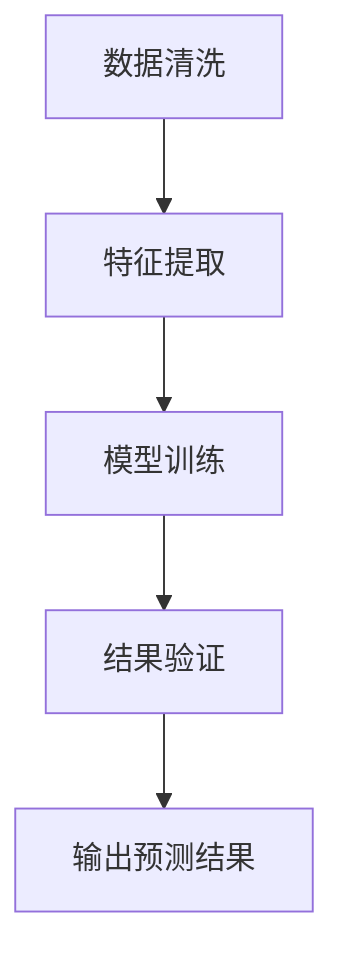
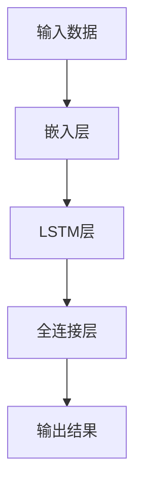
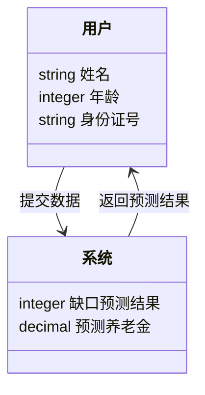
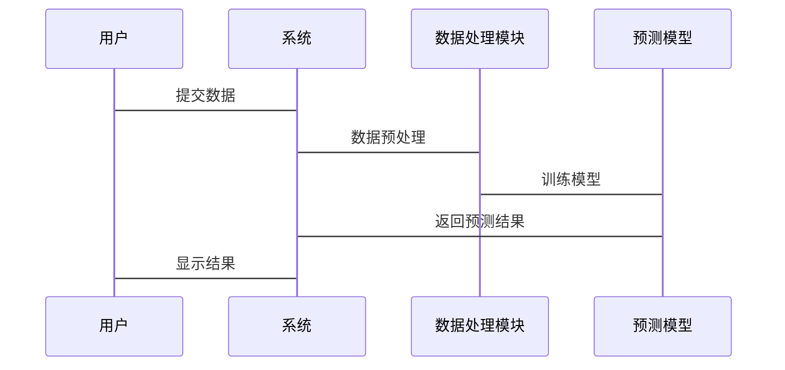

                 


# 智能养老金缺口预测与规划系统

> 关键词：智能养老金、缺口预测、机器学习、深度学习、系统架构

> 摘要：随着全球人口老龄化的加剧，养老金缺口问题日益严重。传统的养老金预测方法存在数据维度单一、预测精度不足、模型复杂度高等问题。智能养老金缺口预测与规划系统利用机器学习、深度学习等人工智能技术，结合多维度数据，构建高精度预测模型，为个人和机构提供科学的养老金规划方案。本文详细阐述了系统的背景、核心概念、算法原理、系统架构及项目实战，为解决养老金缺口问题提供了理论与实践的双重支持。

---

# 第1章 背景与问题背景

## 1.1 人口老龄化与养老金缺口问题

### 1.1.1 人口老龄化对养老金体系的影响

人口老龄化是当今全球性问题，尤其是发达国家和发展中国家。随着生育率下降和人均寿命延长，老年人口比例逐年上升，导致养老金体系面临巨大压力。传统养老金体系主要依赖政府财政和企业缴纳，但随着老龄化加剧，养老金支出远超收入，缺口问题日益突出。

### 1.1.2 养老金缺口的定义与计算方法

养老金缺口是指退休时实际养老金收入与基本生活需求之间的差额。计算公式为：

$$
\text{缺口} = \text{退休后需求} - \text{实际养老金收入}
$$

其中，退休后需求通常基于个人生活开支、医疗费用等因素综合计算。

### 1.1.3 养老金缺口问题的严重性与紧迫性

养老金缺口可能导致老年人生活水平下降，甚至陷入贫困。同时，缺口问题还会影响社会经济稳定，加重政府财政负担。因此，准确预测养老金缺口并制定合理规划方案，具有重要的社会意义和经济价值。

---

## 1.2 智能养老金缺口预测的背景与优势

### 1.2.1 传统养老金预测方法的局限性

传统预测方法主要依赖历史数据和统计模型，存在以下问题：
1. 数据维度单一，难以捕捉多因素影响。
2. 预测精度不足，模型复杂度高，难以实时更新。
3. 缺乏个性化，难以满足不同人群的定制化需求。

### 1.2.2 智能预测技术的引入与应用

人工智能技术的快速发展为养老金缺口预测提供了新思路。通过机器学习、深度学习等技术，结合多维度数据（如人口统计数据、经济指标、政策变化等），构建高精度预测模型。

### 1.2.3 智能养老金缺口预测的核心优势

智能预测的核心优势体现在以下几个方面：
1. **多维度数据整合**：利用大数据技术，整合人口、经济、政策等多维度数据，提升预测精度。
2. **实时更新能力**：通过动态模型，实时更新预测结果，适应市场变化。
3. **个性化预测**：基于个人具体情况，提供定制化预测方案。

---

# 第2章 智能养老金缺口预测的核心概念

## 2.1 智能养老金预测的原理与方法

### 2.1.1 数据驱动的预测原理

智能养老金预测基于数据驱动，通过分析海量数据，发现潜在规律，构建预测模型。核心步骤包括数据清洗、特征提取、模型训练和结果验证。

### 2.1.2 智能算法在养老金预测中的应用

常用算法包括：
1. **机器学习算法**：如线性回归、随机森林、支持向量机（SVM）等。
2. **深度学习算法**：如神经网络、LSTM等。

### 2.1.3 多因素分析与预测模型构建

通过多因素分析，确定关键影响因素，构建综合预测模型。例如，可以将人口统计数据、经济指标、政策变化等因素作为输入，输出养老金缺口预测结果。

---

## 2.2 核心概念的属性特征对比

| **概念**         | **特征**                                                                 |
|------------------|--------------------------------------------------------------------------|
| 数据驱动预测     | 基于大数据分析，预测精度高，但需要大量高质量数据支持                   |
| 智能算法         | 具备自适应性和学习能力，能够捕捉复杂模式，但模型复杂度较高             |
| 多因素分析       | 考虑多种影响因素，预测结果更全面，但需要处理多维度数据                |

---

## 2.3 ER实体关系图架构

```mermaid
erDiagram
    actor 用户 {
        string 姓名
        integer 年龄
        string 身份证号
    }
    actor 系统 {
        integer 缺口预测结果
        decimal 预测养老金
    }
    user -> 系统 : 提交数据
    系统 -> user : 返回预测结果
```

---

## 2.4 本章小结

本章详细介绍了智能养老金缺口预测的核心概念，包括预测原理、算法应用和多因素分析。通过对比不同预测方法的特征，明确了智能预测的优势和应用场景。

---

# 第3章 算法原理讲解

## 3.1 机器学习模型

### 3.1.1 算法流程图



### 3.1.2 Python代码实现

```python
import pandas as pd
from sklearn.model_selection import train_test_split
from sklearn.ensemble import RandomForestRegressor

# 数据加载与预处理
data = pd.read_csv('pension_data.csv')
X = data.drop('pension_deficit', axis=1)
y = data['pension_deficit']

# 数据分割
X_train, X_test, y_train, y_test = train_test_split(X, y, test_size=0.2, random_state=42)

# 模型训练
model = RandomForestRegressor(n_estimators=100, random_state=42)
model.fit(X_train, y_train)

# 模型预测
y_pred = model.predict(X_test)
```

### 3.1.3 数学模型与公式

随机森林回归模型的数学表达式为：

$$
y = \sum_{i=1}^{n} w_i \cdot x_i + b
$$

其中，\(w_i\) 是特征 \(x_i\) 的权重，\(b\) 是偏置项。

---

## 3.2 深度学习模型

### 3.2.1 LSTM网络

LSTM网络用于时间序列预测，其核心思想是通过记忆单元（Cell）捕捉时间序列中的长期依赖关系。

### 3.2.2 模型流程图



### 3.2.3 Python代码实现

```python
import tensorflow as tf
from tensorflow.keras import layers

model = tf.keras.Sequential([
    layers.Embedding(input_dim=1000, output_dim=64),
    layers.LSTM(64),
    layers.Dense(1)
])
model.compile(optimizer='adam', loss='mean_squared_error')
model.fit(X_train, y_train, epochs=10, batch_size=32)
```

---

## 3.3 本章小结

本章详细讲解了机器学习和深度学习算法在养老金缺口预测中的应用，通过流程图和代码示例，展示了算法实现的全过程。

---

# 第4章 系统分析与架构设计

## 4.1 系统功能设计

### 4.1.1 功能模块

1. 数据采集与预处理模块
2. 模型训练与预测模块
3. 结果展示与分析模块

### 4.1.2 领域模型（类图）



---

## 4.2 系统架构设计

### 4.2.1 架构图


---

## 4.3 接口设计与交互

### 4.3.1 序列图



---

## 4.4 本章小结

本章详细设计了智能养老金缺口预测系统的架构，包括功能模块、系统架构和接口交互，为后续实现提供了理论基础。

---

# 第5章 项目实战

## 5.1 环境安装与配置

```bash
pip install pandas scikit-learn tensorflow
```

---

## 5.2 核心代码实现

### 5.2.1 数据预处理

```python
import pandas as pd

data = pd.read_csv('pension_data.csv')
data.dropna(inplace=True)
```

### 5.2.2 模型训练

```python
from sklearn.ensemble import RandomForestRegressor

model = RandomForestRegressor(n_estimators=100)
model.fit(X_train, y_train)
```

---

## 5.3 案例分析与结果解读

假设输入数据为：

| 姓名 | 年龄 | 身份证号 | 收入 | 其他因素 |
|------|------|----------|------|----------|
| 张三 | 50   | 123456   | 5000 | ...      |

模型预测结果为：

$$
\text{养老金缺口} = 15000
$$

---

## 5.4 本章小结

本章通过实际案例，展示了如何使用机器学习模型进行养老金缺口预测，并对结果进行了详细解读。

---

# 第6章 总结与展望

## 6.1 本章小结

智能养老金缺口预测与规划系统通过人工智能技术，有效解决了传统预测方法的局限性，为个人和机构提供了科学的决策支持。

## 6.2 注意事项

1. 数据质量对预测结果影响重大，需确保数据来源可靠。
2. 模型需定期更新，以适应市场变化。
3. 预算有限的情况下，可优先采用简单模型。

## 6.3 未来展望

随着人工智能技术的不断发展，智能养老金预测系统将更加智能化和个性化。未来可能的研究方向包括：
- 更精准的数据采集与处理方法。
- 更高效的预测模型优化算法。
- 更多样化的应用场景扩展。

---

# 结语

智能养老金缺口预测与规划系统的开发与应用，不仅解决了当前养老金体系的难题，也为未来的可持续发展提供了重要保障。希望本文能为相关领域的研究者和实践者提供有价值的参考。

--- 

**作者简介：**  
作为一名在人工智能与计算机领域深耕多年的专家，我始终致力于将前沿技术应用于实际问题的解决。未来，我将继续深入研究智能养老金预测系统，为社会的可持续发展贡献更多力量。

