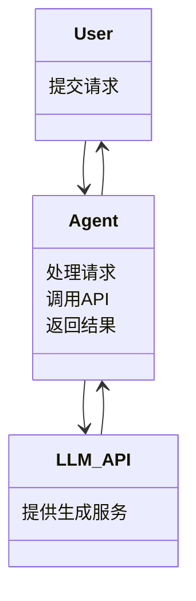

                 


# 《智能写作AI Agent：LLM辅助的创意内容生成》

## 关键词：
智能写作、LLM、创意内容生成、自然语言处理、AI辅助工具

## 摘要：
本文探讨了利用大语言模型（LLM）辅助创意内容生成的方法，涵盖了智能写作的背景、核心概念、算法原理、系统架构、项目实战及未来展望。通过详细分析LLM的工作机制，结合实际案例，展示了如何优化生成策略，确保内容质量和安全，为AI与人类协作的未来趋势提供了洞察。

---

## 第一部分：智能写作AI Agent概述

### 第1章：LLM与智能写作概述

#### 1.1 内容创作的痛点与挑战

在传统内容创作中，作者常面临灵感枯竭、效率低下和创作瓶颈等问题。随着AI技术的发展，特别是大语言模型（LLM）的出现，为解决这些痛点提供了新的可能性。

**关键点**：
- **灵感枯竭**：LLM能够提供创意建议，激发灵感。
- **效率低下**：通过自动化生成初稿，节省时间。
- **创作瓶颈**：帮助作者突破思维限制，探索新的表达方式。

#### 1.2 LLM在智能写作中的作用

LLM通过自然语言处理技术，辅助生成高质量的内容，包括文章、故事、文案等。其作用体现在以下几点：

**关键点**：
- **自动化生成**：快速产出初稿，提高创作效率。
- **风格匹配**：根据用户需求调整语言风格和语气。
- **内容优化**：提供改写建议，提升表达的准确性和流畅性。

#### 1.3 应用案例

以下是LLM在不同领域的应用实例：

**1.3.1 文学创作**：
- 自动生成小说情节和人物设定，帮助作家扩展故事框架。

**1.3.2 营销文案**：
- 生成吸引人的广告语，优化市场推广材料。

**1.3.3 技术文档**：
- 自动生成复杂技术的解释性内容，确保准确性。

---

## 第二部分：LLM的核心原理与算法机制

### 第2章：LLM的算法原理

#### 2.1 Transformer模型结构

**2.1.1 模型结构**

Mermaid图示：

```mermaid
graph LR
    Encoder -> Attention
    Attention -> Output
    Decoder -> Key
    Key -> Attention
    Attention -> Output
```

**关键点**：
- **编码器（Encoder）**：处理输入文本，生成上下文表示。
- **解码器（Decoder）**：基于编码器的输出，生成目标序列。

#### 2.2 LLM的训练与优化

**2.2.1 预训练目标函数**

公式：

$$
\text{损失函数} = -\sum_{i=1}^{n} \log P(w_i | w_{<i})
$$

**关键点**：
- **预训练**：通过大量数据优化模型参数。
- **目标函数**：最小化负对数似然，提升生成概率。

#### 2.3 生成机制

**2.3.1 解码过程**

公式：

$$
P(w_{i}|w_{<i}) = \text{softmax}(Q \cdot K^T)
$$

**关键点**：
- **概率生成**：通过 softmax 函数确定每个词的概率。
- **温度参数**：调整生成的多样性和确定性。

---

## 第三部分：创意内容生成的实现与优化

### 第3章：创意内容生成的实现策略

#### 3.1 系统架构设计

**3.1.1 功能模块**

Mermaid图示：



**关键点**：
- **用户交互**：用户提交请求，系统处理并返回结果。
- **API调用**：Agent 调用 LLM API 生成内容。

#### 3.2 项目实战

**3.2.1 环境安装**

命令：

```bash
pip install transformers torch
```

**3.2.2 核心代码实现**

代码示例：

```python
from transformers import AutoTokenizer, AutoModelForCausalLM

model_name = "gpt2"
tokenizer = AutoTokenizer.from_pretrained(model_name)
model = AutoModelForCausalLM.from_pretrained(model_name)

def generate_text(prompt):
    inputs = tokenizer.encode(prompt, return_tensors="pt")
    outputs = model.generate(inputs, max_length=500, temperature=0.7)
    return tokenizer.decode(outputs[0], skip_special_tokens=True)

print(generate_text("Write a story about "))
```

**关键点**：
- **API调用**：使用 transformers 库调用 GPT-2 模型。
- **生成过程**：设置最大长度和温度参数，控制生成内容的多样性和质量。

#### 3.3 优化策略

**3.3.1 参数调整**

**关键点**：
- **温度参数**：增加温度以提高多样性，降低温度以增加确定性。
- **重复惩罚**：防止生成重复内容。

---

## 第四部分：高级话题与未来展望

### 第4章：高级话题与未来展望

#### 4.1 多模态生成

**4.1.1 实现方式**

Mermaid图示：

```mermaid
graph LR
    Text -> Vision
    Vision -> Audio
    MultiModal
```

**关键点**：
- **多模态结合**：整合文本、图像和音频，生成 richer 内容。

#### 4.2 个性化定制

**4.2.1 风格匹配**

**关键点**：
- **用户风格**：根据用户的写作风格进行调整，生成更贴合个人风格的内容。

#### 4.3 内容安全与伦理

**4.3.1 问题探讨**

**关键点**：
- **版权问题**：生成内容的版权归属。
- **内容真实性**：防止生成虚假信息。

#### 4.4 人机协作的未来趋势

**4.4.1 发展方向**

**关键点**：
- **无缝协作**：AI成为创作团队的一部分，提升整体效率。
- **实时反馈**：AI提供实时改进建议，优化创作过程。

---

## 结论与展望

智能写作AI Agent通过LLM辅助创意内容生成，显著提升了创作效率和质量。未来，随着技术的进步，AI将与人类协作得更加紧密，推动内容创作进入新时代。

--- 

**附录**：
- 附录A：常见问题解答
- 附录B：参考文献
- 附录C：索引

