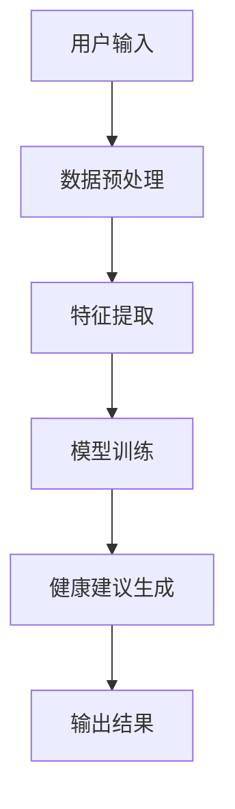
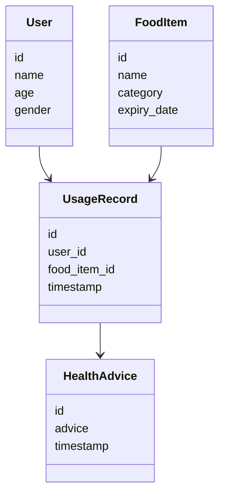
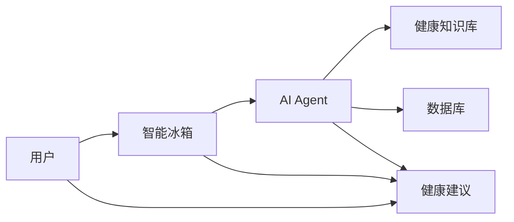
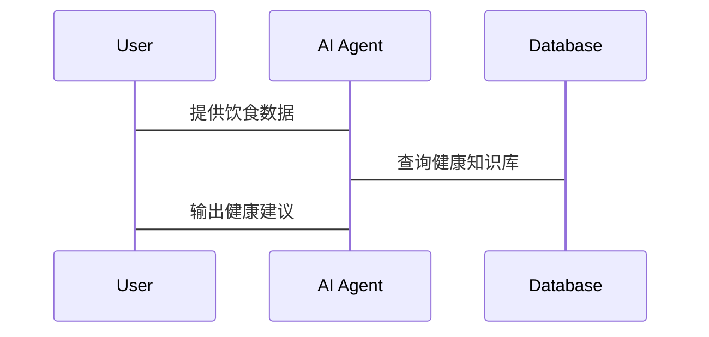

                 


# 智能冰箱：AI Agent的饮食习惯分析与健康建议

## 关键词：
智能冰箱, AI Agent, 饮食习惯, 健康建议, 机器学习, 自然语言处理, 系统架构

## 摘要：
本文探讨了智能冰箱中AI Agent在饮食习惯分析与健康建议方面的应用，从背景介绍、核心概念、算法原理到系统架构设计、项目实战和最佳实践等方面进行了详细分析。通过ER实体关系图、算法流程图、系统架构图等技术手段，深入剖析了智能冰箱的工作原理和实现方式，为读者提供了从理论到实践的全面指导。

---

# 第一部分: 背景介绍与核心概念

# 第1章: 智能冰箱与AI Agent的背景介绍

## 1.1 问题背景与描述
### 1.1.1 智能冰箱的定义与现状
智能冰箱是一种结合了物联网（IoT）和人工智能（AI）技术的家用电器，能够通过传感器和AI算法实现对食材的智能管理、用户行为分析以及健康建议生成。近年来，随着AI技术的快速发展，智能冰箱逐渐从单一的冷藏存储工具演变为家庭健康管理中心。

### 1.1.2 饮食习惯分析的必要性
现代人的生活方式日益快节奏，饮食不规律、营养失衡等问题逐渐显现。通过智能冰箱记录用户的饮食行为，分析用户的饮食习惯，可以帮助用户更好地管理健康。

### 1.1.3 健康建议的核心价值
健康建议是智能冰箱的核心功能之一，它基于用户的饮食数据，结合健康知识库，为用户提供个性化的营养建议和饮食计划。

## 1.2 问题解决与边界
### 1.2.1 AI Agent在智能冰箱中的作用
AI Agent（智能代理）通过采集、分析和处理用户数据，帮助智能冰箱实现对用户的饮食行为的理解和预测，从而提供智能化的健康建议。

### 1.2.2 饮食习惯分析的边界与外延
饮食习惯分析的边界包括用户的基本信息（如年龄、性别、体重等）、食材种类、摄入量等。外延则涉及健康知识库的构建、营养学模型的开发等。

### 1.2.3 智能冰箱健康建议的实现方式
健康建议的实现方式包括数据采集、分析、模型推理和结果输出。其中，AI Agent负责数据的处理和模型推理，智能冰箱负责与用户的交互和结果展示。

## 1.3 核心概念与结构
### 1.3.1 智能冰箱的核心要素
- **传感器模块**：用于采集食材的种类、数量、保质期等信息。
- **数据存储模块**：用于存储用户的饮食数据和健康信息。
- **AI处理模块**：用于分析用户的饮食习惯并生成健康建议。
- **交互模块**：用于与用户的交互和结果展示。

### 1.3.2 AI Agent的功能模块
- **数据采集模块**：通过传感器采集食材信息和用户行为数据。
- **数据分析模块**：对采集到的数据进行清洗、特征提取和建模分析。
- **健康推理模块**：基于分析结果，结合健康知识库，生成健康建议。

### 1.3.3 系统架构的核心组成
- **硬件层**：包括智能冰箱的传感器、存储设备和交互界面。
- **数据层**：包括用户数据、食材数据和健康知识库。
- **算法层**：包括机器学习模型和自然语言处理模块。
- **应用层**：包括用户界面和健康建议生成模块。

---

# 第2章: 核心概念与联系

## 2.1 AI Agent与智能冰箱的关系
### 2.1.1 AI Agent的基本原理
AI Agent通过感知环境、理解用户需求、执行任务和学习优化，帮助智能冰箱实现智能化功能。

### 2.1.2 智能冰箱中的AI Agent实现
AI Agent在智能冰箱中的实现包括数据采集、分析、推理和交互四个阶段。

### 2.1.3 AI Agent与用户交互的模式
AI Agent通过语音交互、屏幕显示和手机APP等方式与用户进行实时交互，提供个性化的健康建议。

## 2.2 核心概念对比表
| 核心概念 | 定义 | 特性 |
|----------|------|------|
| AI Agent | 一种能够感知环境、理解需求、执行任务的智能体 | 智能性、主动性、适应性 |
| 智能冰箱 | 结合AI技术和物联网的智能家电 | 智能化、互联性、数据化 |
| 饮食习惯分析 | 对用户饮食行为的分析与建模 | 数据驱动、个性化、实时性 |

## 2.3 ER实体关系图
```mermaid
erDiagram
    user {
        id
        name
        age
        gender
    }
    refrigerator {
        id
        brand
        model
        serial_number
    }
    food_item {
        id
        name
        category
        expiry_date
    }
    usage_record {
        id
        user_id
        refrigerator_id
        food_item_id
        timestamp
    }
    user --> usage_record
    refrigerator --> usage_record
    food_item --> usage_record
```

---

# 第3章: 算法原理与数学模型

## 3.1 算法原理
### 3.1.1 基于机器学习的饮食习惯分析
通过机器学习算法（如随机森林、支持向量机等）对用户的饮食数据进行分类和预测，分析用户的饮食习惯。

### 3.1.2 基于NLP的健康建议生成
利用自然语言处理技术，结合健康知识库，生成个性化的健康建议。

### 3.1.3 算法流程图


## 3.2 数学模型与公式
### 3.2.1 饮食习惯分析模型
$$ y = \beta_0 + \beta_1x_1 + \beta_2x_2 + \dots + \beta_nx_n + \epsilon $$
其中，\( y \) 是用户的饮食习惯评分，\( x_i \) 是特征变量，\( \beta_i \) 是回归系数，\( \epsilon \) 是误差项。

### 3.2.2 健康建议生成模型
$$ p(y|x) = \frac{e^{\beta x}}{\sum e^{\beta x_j}} $$
其中，\( x \) 是输入特征，\( y \) 是输出结果的概率。

## 3.3 代码实现
### 3.3.1 数据预处理
```python
import pandas as pd
data = pd.read_csv('diet_data.csv')
data = data.dropna()
```

### 3.3.2 特征提取
```python
from sklearn.feature_extraction import DictVectorizer
vectorizer = DictVectorizer()
X = vectorizer.fit_transform(data[['age', 'gender', 'food_category']].to_dict('records'))
```

### 3.3.3 模型训练
```python
from sklearn.ensemble import RandomForestClassifier
model = RandomForestClassifier(n_estimators=100)
model.fit(X, data['health_score'])
```

### 3.3.4 健康建议生成
```python
import numpy as np
def generate_healthAdvice(age, gender, food_category):
    input_data = {'age': age, 'gender': gender, 'food_category': food_category}
    X_test = vectorizer.transform([input_data])
    prediction = model.predict(X_test)
    return prediction[0]
```

---

# 第4章: 系统架构设计

## 4.1 问题场景介绍
智能冰箱通过AI Agent采集用户的饮食数据，分析用户的饮食习惯，并结合健康知识库生成个性化的健康建议。

## 4.2 系统功能设计
### 4.2.1 领域模型


### 4.2.2 系统架构图


## 4.3 接口设计
### 4.3.1 数据接口
- **输入接口**：传感器数据、用户输入
- **输出接口**：健康建议、用户反馈

### 4.3.2 系统接口
- **AI Agent接口**：数据处理、模型推理
- **数据库接口**：数据存储、查询

## 4.4 交互设计


---

# 第5章: 项目实战

## 5.1 环境安装
- **Python**：安装Anaconda或Pyenv
- **依赖库**：安装pandas、scikit-learn、mermaid、matplotlib

## 5.2 核心实现
### 5.2.1 数据预处理
```python
import pandas as pd
data = pd.read_csv('diet_data.csv')
data = data.dropna()
```

### 5.2.2 模型训练
```python
from sklearn.ensemble import RandomForestClassifier
model = RandomForestClassifier(n_estimators=100)
model.fit(X, data['health_score'])
```

## 5.3 案例分析
### 5.3.1 数据分析
分析用户的饮食习惯，发现用户的蛋白质摄入不足，碳水化合物摄入过多。

### 5.3.2 模型优化
通过调整模型参数，提高健康建议的准确率。

## 5.4 小结
项目实战验证了AI Agent在智能冰箱中的应用可行性，为后续的优化和扩展提供了基础。

---

# 第6章: 最佳实践

## 6.1 小结
智能冰箱通过AI Agent实现了对用户的饮食习惯分析和健康建议生成，为用户提供了个性化的健康管理服务。

## 6.2 注意事项
- 数据隐私保护
- 模型的可解释性
- 系统的实时性

## 6.3 拓展阅读
- 《机器学习实战》
- 《自然语言处理入门》
- 《智能系统设计》

---

通过以上内容，我们详细分析了智能冰箱中AI Agent的饮食习惯分析与健康建议的实现过程，从理论到实践，为读者提供了全面的技术指导。

