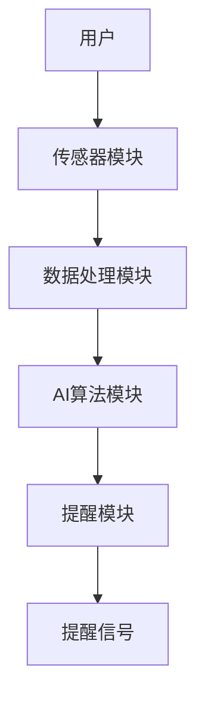
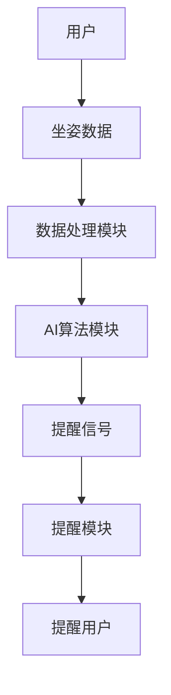
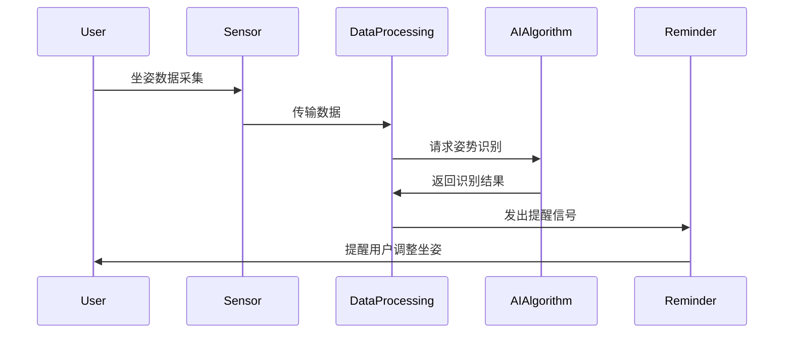

                 


# 智能办公椅：AI Agent的姿势矫正提醒

> 关键词：智能办公椅，AI Agent，姿势矫正，传感器技术，物联网，用户体验

> 摘要：本文探讨了智能办公椅在AI Agent辅助下的姿势矫正提醒系统，分析其技术原理、系统架构、算法实现及实际应用，旨在为办公健康提供智能化解决方案。

---

# 第一部分: 智能办公椅的背景与问题背景

## 第1章: 智能办公椅的背景与问题背景

### 1.1 办公环境与健康问题

#### 1.1.1 现代办公环境的现状
现代办公环境中，员工长时间坐在办公椅上工作已成为常态。由于工作压力大、久坐不动，许多员工出现了颈椎病、腰椎病等健康问题。

#### 1.1.2 长时间坐姿不当的危害
长时间坐姿不当会导致脊柱变形、肌肉疲劳、血液循环不畅等问题，甚至可能引发严重的健康问题，如椎间盘突出、心脏病等。

#### 1.1.3 姿势矫正的必要性
姿势矫正可以有效预防和缓解上述健康问题，帮助员工保持良好的身体状态，提高工作效率。

### 1.2 AI Agent的引入

#### 1.2.1 AI Agent的基本概念
AI Agent（智能代理）是一种能够感知环境、自主决策并执行任务的智能系统。它可以基于传感器数据和用户行为，主动提供服务。

#### 1.2.2 AI Agent在办公环境中的应用
AI Agent可以应用于办公环境中的多种场景，如智能日历管理、会议提醒、任务分配等。在姿势矫正提醒方面，AI Agent可以通过传感器实时监测用户坐姿，并在需要时发出提醒。

#### 1.2.3 姿势矫正提醒的需求分析
姿势矫正提醒的需求主要集中在以下方面：
- 实时监测用户坐姿，识别不良姿势。
- 在不良姿势出现时，通过震动或声音提醒用户调整坐姿。
- 提供个性化的矫正建议，帮助用户养成良好的坐姿习惯。

### 1.3 智能办公椅的定义与特点

#### 1.3.1 智能办公椅的定义
智能办公椅是一种结合了传感器技术、AI算法和物联网技术的办公椅，能够实时监测用户的坐姿，并通过AI Agent主动提醒用户矫正坐姿。

#### 1.3.2 智能办公椅的核心功能
智能办公椅的核心功能包括：
- 实时监测用户的坐姿。
- 识别不良姿势并发出提醒。
- 提供个性化的矫正建议。

#### 1.3.3 智能办公椅与传统办公椅的区别
智能办公椅与传统办公椅的主要区别在于其智能化功能。传统办公椅仅具备基本的支撑功能，而智能办公椅可以通过传感器和AI算法实现姿势监测和提醒功能。

### 1.4 问题背景与解决思路

#### 1.4.1 坐姿矫正的痛点分析
- 用户容易因工作繁忙而忽视坐姿。
- 传统姿势矫正工具（如背挺直器）使用不便，难以长期坚持。
- 缺乏智能化的解决方案，无法实时监测和提醒。

#### 1.4.2 AI Agent在姿势矫正中的作用
AI Agent可以通过传感器实时监测用户坐姿，并在需要时发出提醒，帮助用户保持良好的坐姿习惯。

#### 1.4.3 智能办公椅的设计目标
智能办公椅的设计目标是通过AI Agent实现姿势矫正提醒功能，帮助用户预防和缓解因坐姿不当导致的健康问题。

### 1.5 本章小结
本章介绍了智能办公椅的背景与问题背景，分析了坐姿不当的危害、AI Agent在姿势矫正中的作用，以及智能办公椅的设计目标。

---

# 第二部分: AI Agent与姿势矫正技术基础

## 第2章: AI Agent的基本原理

### 2.1 AI Agent的核心概念

#### 2.1.1 AI Agent的定义与分类
AI Agent是一种能够感知环境、自主决策并执行任务的智能系统。根据应用场景的不同，AI Agent可以分为任务型AI Agent和交互型AI Agent。

#### 2.1.2 AI Agent的基本功能模块
AI Agent的基本功能模块包括：
- 感知模块：通过传感器获取环境数据。
- 决策模块：基于感知数据进行决策。
- 执行模块：根据决策结果执行相应操作。

#### 2.1.3 AI Agent的工作流程
AI Agent的工作流程包括：
1. 感知环境数据。
2. 分析数据，识别不良姿势。
3. 发出提醒或执行矫正操作。

### 2.2 姿势矫正技术的实现原理

#### 2.2.1 姿势检测的基本原理
姿势检测可以通过传感器（如加速度计、陀螺仪）获取用户的坐姿数据，结合AI算法进行姿势识别。

#### 2.2.2 姿势识别的算法实现
姿势识别算法可以通过机器学习模型（如支持向量机、神经网络）对坐姿数据进行分类，识别不良姿势。

#### 2.2.3 姿势矫正的提醒机制
当AI Agent识别到不良姿势时，会通过震动或声音提醒用户调整坐姿。

### 2.3 AI Agent与姿势矫正的结合

#### 2.3.1 AI Agent在姿势矫正中的角色
AI Agent在姿势矫正中主要负责数据采集、姿势识别和提醒触发。

#### 2.3.2 姿势矫正提醒的触发条件
姿势矫正提醒的触发条件包括：
- 坐姿数据异常。
- 用户坐姿长时间保持不良状态。

#### 2.3.3 姿势矫正提醒的实现方式
姿势矫正提醒可以通过震动、声音或屏幕提示等方式实现。

### 2.4 本章小结
本章详细讲解了AI Agent的基本原理，分析了姿势矫正技术的实现原理，并探讨了AI Agent与姿势矫正的结合方式。

---

# 第三部分: 智能办公椅的系统架构与实现

## 第3章: 智能办公椅的系统架构设计

### 3.1 系统组成模块

#### 3.1.1 传感器模块
传感器模块用于采集用户的坐姿数据，包括加速度、角度等。

#### 3.1.2 AI算法模块
AI算法模块负责对坐姿数据进行分析和识别，判断用户是否处于不良姿势。

#### 3.1.3 提醒模块
提醒模块负责在识别到不良姿势时，通过震动或声音提醒用户调整坐姿。

### 3.2 系统功能设计

#### 3.2.1 系统功能模块
系统功能模块包括：
- 数据采集模块：采集用户的坐姿数据。
- 数据分析模块：分析坐姿数据，识别不良姿势。
- 提醒模块：发出提醒信号。

#### 3.2.2 系统功能流程
系统功能流程包括：
1. 传感器采集坐姿数据。
2. AI算法分析数据，识别不良姿势。
3. 系统发出提醒信号。

### 3.3 系统架构设计

#### 3.3.1 系统架构图


#### 3.3.2 数据流图


### 3.4 系统接口设计

#### 3.4.1 系统接口
系统接口包括：
- 传感器接口：连接传感器模块。
- AI算法接口：连接AI算法模块。
- 提醒接口：连接提醒模块。

#### 3.4.2 系统接口设计
系统接口设计需要考虑模块之间的数据传递和控制逻辑，确保各模块协同工作。

### 3.5 系统交互设计

#### 3.5.1 系统交互流程
系统交互流程包括：
1. 用户坐姿数据被传感器采集。
2. 数据被传输到数据处理模块。
3. 数据处理模块将数据传递给AI算法模块。
4. AI算法模块分析数据，识别不良姿势。
5. 系统发出提醒信号。
6. 提醒模块执行提醒操作。

#### 3.5.2 系统交互图


### 3.6 本章小结
本章详细讲解了智能办公椅的系统架构设计，包括系统组成模块、功能设计、架构图、数据流图和系统交互图。

---

## 第4章: 姿势矫正算法的实现

### 4.1 姿势检测算法

#### 4.1.1 姿势检测的基本原理
姿势检测算法通过传感器数据，结合AI算法，识别用户的坐姿状态。

#### 4.1.2 姿势检测的实现步骤
姿势检测的实现步骤包括：
1. 采集坐姿数据。
2. 数据预处理。
3. 姿势识别。
4. 状态判断。

#### 4.1.3 姿势检测的数学模型
姿势检测的数学模型可以表示为：
$$
\text{姿势状态} = f(\text{坐姿数据})
$$
其中，$f$ 是AI算法模型。

### 4.2 姿势矫正提醒算法

#### 4.2.1 姿势矫正提醒的基本原理
姿势矫正提醒算法通过判断用户的坐姿状态，触发提醒信号。

#### 4.2.2 姿势矫正提醒的实现步骤
姿势矫正提醒的实现步骤包括：
1. 数据采集。
2. 数据分析。
3. 状态判断。
4. 提醒触发。

#### 4.2.3 姿势矫正提醒的数学模型
姿势矫正提醒的数学模型可以表示为：
$$
\text{提醒信号} = g(\text{姿势状态})
$$
其中，$g$ 是提醒触发函数。

### 4.3 算法优化与实现

#### 4.3.1 算法优化
算法优化可以通过改进数据处理方法、优化AI算法模型等方式实现。

#### 4.3.2 算法实现
算法实现可以通过Python代码实现，例如：
```python
import numpy as np
from sklearn.svm import SVC

# 数据预处理
def preprocess_data(data):
    # 数据标准化
    return (data - np.mean(data)) / np.std(data)

# 姿势识别
def pose_recognition(data):
    model = SVC()
    model.fit(preprocess_data(data), labels)
    return model.predict(preprocess_data(new_data))
```

### 4.4 本章小结
本章详细讲解了姿势矫正算法的实现，包括姿势检测、提醒算法、优化与实现等内容。

---

## 第5章: 项目实战——智能办公椅的实现

### 5.1 环境搭建

#### 5.1.1 硬件环境
硬件环境包括：
- 传感器模块：用于采集坐姿数据。
- 控制器模块：用于控制提醒模块。

#### 5.1.2 软件环境
软件环境包括：
- Python编程环境。
- AI算法库（如TensorFlow、Scikit-learn）。

### 5.2 核心代码实现

#### 5.2.1 数据采集代码
```python
import serial

# 传感器数据采集
def get_pose_data():
    ser = serial.Serial('COM3', 9600)
    data = ser.readline().decode().strip()
    ser.close()
    return data
```

#### 5.2.2 数据处理代码
```python
import numpy as np

# 数据预处理
def preprocess_data(data):
    return (data - np.mean(data)) / np.std(data)
```

#### 5.2.3 姿势识别代码
```python
from sklearn.svm import SVC

# 姿势识别
def pose_recognition(data):
    model = SVC()
    model.fit(preprocess_data(train_data), train_labels)
    return model.predict(preprocess_data(test_data))
```

### 5.3 功能实现与测试

#### 5.3.1 功能实现
功能实现包括：
- 数据采集模块。
- 数据处理模块。
- 姿势识别模块。
- 提醒模块。

#### 5.3.2 功能测试
功能测试包括：
- 传感器数据采集测试。
- 数据处理模块测试。
- 姿势识别模块测试。
- 提醒模块测试。

### 5.4 本章小结
本章详细讲解了智能办公椅的项目实战，包括环境搭建、核心代码实现、功能实现与测试等内容。

---

## 第6章: 实际案例分析与优化

### 6.1 实际案例分析

#### 6.1.1 应用场景分析
应用场景包括：
- 办公室环境。
- 家庭办公环境。

#### 6.1.2 用户反馈
用户反馈包括：
- 提醒频率是否合适。
- 提醒方式是否舒适。
- 系统稳定性是否可靠。

### 6.2 系统优化

#### 6.2.1 系统优化方案
系统优化方案包括：
- 提高传感器精度。
- 优化AI算法模型。
- 改进提醒模块设计。

#### 6.2.2 优化效果评估
优化效果评估包括：
- 系统运行效率提升。
- 用户反馈改善。

### 6.3 本章小结
本章通过实际案例分析，探讨了智能办公椅的应用场景、用户反馈及系统优化方案。

---

## 第7章: 总结与展望

### 7.1 总结
智能办公椅通过AI Agent实现了姿势矫正提醒功能，帮助用户预防和缓解因坐姿不当导致的健康问题。

### 7.2 展望
未来，智能办公椅可以通过以下方式进一步优化：
- 提高传感器精度。
- 优化AI算法模型。
- 增加更多智能化功能，如健康数据分析、个性化矫正建议等。

### 7.3 本章小结
本章总结了智能办公椅的应用价值，并展望了未来的发展方向。

---

# 结语

智能办公椅作为AI技术在办公健康领域的重要应用，通过姿势矫正提醒功能，帮助用户保持良好的坐姿习惯，预防和缓解健康问题。未来，随着AI技术的不断发展，智能办公椅将具备更多智能化功能，为用户提供更优质的服务。

---

