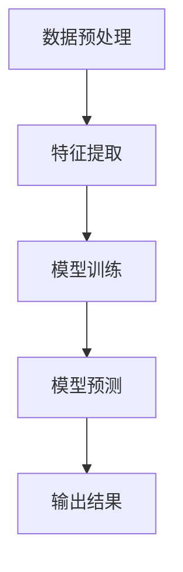
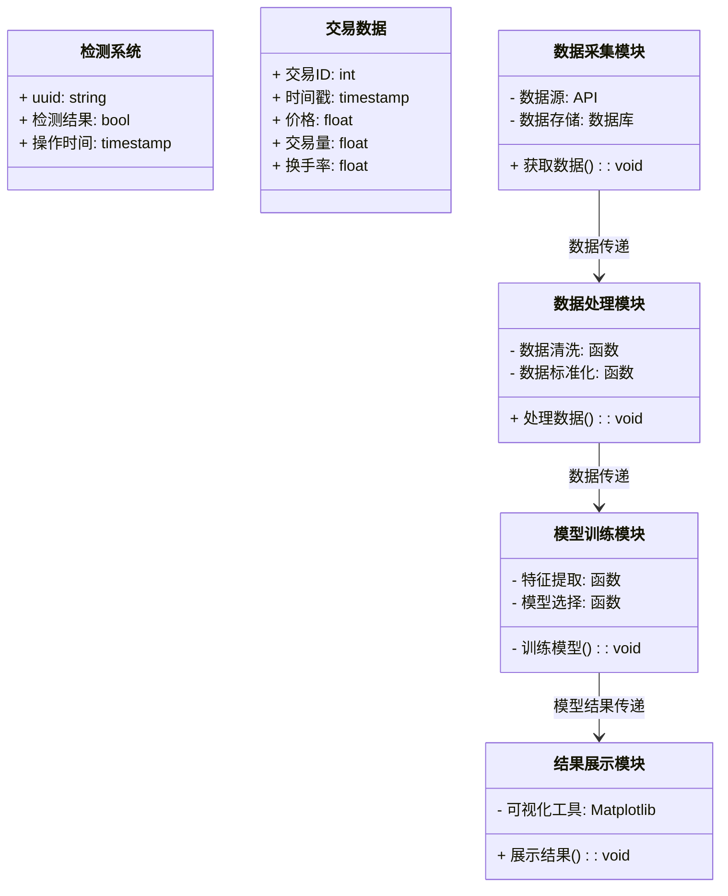

                 


# 智能加密货币市场操纵检测

---

## 关键词
- 加密货币市场
- 市场操纵
- 机器学习
- 数据分析
- 检测算法

---

## 摘要
本文将详细探讨如何利用智能技术检测加密货币市场中的操纵行为。通过分析市场数据特征、设计检测指标、选择合适的机器学习模型，并结合系统架构设计，构建一个高效可靠的市场操纵检测系统。文章从背景介绍到项目实战，逐步深入，为读者提供全面的技术解析。

---

# 第一部分: 加密货币市场与市场操纵概述

## 第1章: 加密货币市场的基本概念与运作机制

### 1.1 加密货币市场的基本概念
#### 1.1.1 加密货币的定义与特点
加密货币是一种基于区块链技术的数字资产，具有去中心化、匿名性和不可篡改等特点。与传统货币不同，加密货币的交易通过区块链网络进行，无需中央机构的干预。

#### 1.1.2 加密货币市场的运作机制
加密货币市场由多个交易所组成，交易者通过订单簿进行买卖操作。市场价格由供需关系决定，但容易受到市场操纵行为的影响。

#### 1.1.3 加密货币市场的参与者
- 投资者：普通交易者和机构投资者。
- 交易机器人：自动执行交易的程序。
- 市场操纵者：通过操纵价格获利的个人或团体。

### 1.2 市场操纵的定义与分类
#### 1.2.1 市场操纵的定义
市场操纵是指通过虚假交易、传播虚假信息或其他手段，人为制造市场供需失衡，影响市场价格的行为。

#### 1.2.2 市场操纵的主要类型
- **洗盘操作**：通过大量小额交易制造市场活跃假象。
- **拉盘操作**：通过大量买入推高价格，吸引跟风者。
- **抛盘操作**：通过大量卖出制造价格下跌趋势。

#### 1.2.3 加密货币市场中操纵行为的特点
- **隐蔽性**：操纵行为通常通过复杂交易策略掩盖。
- **快速性**：由于加密货币市场的高波动性，操纵行为往往迅速完成。
- **技术性**：操纵者可能利用技术手段，如交易机器人进行操作。

### 1.3 市场操纵的危害与检测的重要性
#### 1.3.1 市场操纵对市场的危害
- 破坏市场公平性，损害投资者利益。
- 影响市场价格的准确性，导致市场资源配置失衡。
- 降低市场信心，阻碍市场健康发展。

#### 1.3.2 检测市场操纵的意义
- 维护市场公平，保护投资者权益。
- 提高市场透明度，增强市场信任。
- 为监管机构提供有效的执法工具。

#### 1.3.3 检测市场操纵的技术挑战
- 数据量大：加密货币市场交易数据庞大，处理难度高。
- 行为复杂：操纵行为多样化，难以识别。
- 模型选择：需要选择合适的算法，提高检测准确率。

## 第2章: 加密货币市场的数据特征与操纵行为分析

### 2.1 加密货币市场的数据特征
#### 2.1.1 市场数据的构成
- 开盘价、收盘价、最高价、最低价。
- 交易量、换手率、市场深度。
- 时间戳、交易频率。

#### 2.1.2 市场数据的获取与处理
- 数据源：加密货币交易所的API。
- 数据清洗：处理缺失值、异常值。
- 数据预处理：标准化、归一化。

#### 2.1.3 市场数据的可视化分析
- 使用工具如Matplotlib、Pandas进行数据可视化。
- 通过图表分析价格走势、交易量变化。

### 2.2 市场操纵行为的特征分析
#### 2.2.1 操纵行为的主要模式
- **短期波动**：价格在短时间内剧烈波动。
- **交易集中**：短时间内交易量异常集中。
- **异常交易**：交易行为不符合市场规律。

#### 2.2.2 操纵行为的识别特征
- 交易量突增：短时间内交易量急剧增加。
- 价格跳变：价格在短时间内迅速上涨或下跌。
- 换手率异常：交易活跃度远超正常水平。

#### 2.2.3 操纵行为与正常交易行为的对比
| 特性         | 操纵行为         | 正常交易行为     |
|--------------|------------------|------------------|
| 交易量       | 突增             | 平稳或逐步变化   |
| 价格变化     | 快速波动         | 缓慢波动或稳定   |
| 时间分布     | 集中             | 分散             |
| 换手率       | 高               | 中等或低         |

### 2.3 加密货币市场中常见操纵手法
#### 2.3.1 洗盘操作
洗盘操作通过大量小额交易制造市场活跃假象，吸引投资者参与，随后迅速反转价格走势。

#### 2.3.2 拉盘操作
拉盘操作通过大量买入推高价格，吸引跟风者大量买入，随后高位抛售获利。

#### 2.3.3 抛盘操作
抛盘操作通过大量卖出制造价格下跌趋势，引发恐慌性抛售，进一步推动价格下跌。

## 第3章: 市场操纵检测的核心概念与联系

### 3.1 核心概念原理
#### 3.1.1 市场操纵检测的基本原理
通过分析交易数据的特征，识别异常交易模式，判断是否存在市场操纵行为。

#### 3.1.2 数据特征在检测中的作用
- 交易量突增：可能是洗盘或拉盘的信号。
- 价格跳变：可能是洗盘或拉盘的结果。
- 换手率异常：可能是洗盘或抛盘的特征。

#### 3.1.3 模型选择与优化策略
- 特征选择：选择与操纵行为相关的特征。
- 模型选择：选择适合的算法，如随机森林、支持向量机、神经网络等。
- 超参数调优：通过网格搜索等方法优化模型性能。

### 3.2 检测指标对比表格
| 检测指标       | 洗盘操作       | 拉盘操作       | 抛盘操作       |
|----------------|----------------|----------------|----------------|
| 交易量突增     | 是            | 是            | 否            |
| 价格跳变       | 是            | 是            | 是            |
| 换手率异常     | 是            | 是            | 是            |
| 交易时间集中   | 是            | 是            | 是            |
| 价格波动幅度   | 小            | 大            | 大            |

### 3.3 ER实体关系图
```mermaid
erDiagram
    actor 检测系统 {
        uuid
        检测结果
        操作时间
    }
    actor 交易数据 {
        交易ID
        时间戳
        价格
        交易量
        换手率
    }
    检测系统 --> 交易数据 : 获取数据
    检测系统 --> 检测结果 : 生成结果
```

---

## 第四部分: 算法原理

### 第4章: 算法原理

#### 4.1 算法选择与优化
##### 4.1.1 算法选择
根据检测任务的特点，选择合适的算法。机器学习算法如随机森林、支持向量机、神经网络等均可用于市场操纵检测。

##### 4.1.2 算法优化
通过特征选择、超参数调优等方法提高模型性能。

#### 4.2 算法实现步骤
##### 4.2.1 数据预处理
- 数据清洗：处理缺失值、异常值。
- 数据标准化：将数据归一化，便于模型训练。

##### 4.2.2 特征提取
- 从原始数据中提取交易量、价格、时间等特征。
- 使用主成分分析（PCA）降维。

##### 4.2.3 模型训练
- 使用训练数据训练模型。
- 通过交叉验证评估模型性能。

##### 4.2.4 模型预测
- 使用训练好的模型对测试数据进行预测。
- 输出检测结果。

#### 4.3 算法流程图


#### 4.4 算法实现代码
```python
import pandas as pd
from sklearn.ensemble import RandomForestClassifier
from sklearn.metrics import accuracy_score

# 数据加载与预处理
data = pd.read_csv('交易数据.csv')
data = data.dropna()
data = (data - data.mean()) / data.std()

# 特征选择
features = ['交易量', '价格', '时间']
target = '是否操纵'

# 模型训练
model = RandomForestClassifier()
model.fit(data[features], data[target])

# 模型预测
predictions = model.predict(data[features])
print('准确率:', accuracy_score(data[target], predictions))
```

---

## 第五部分: 数学模型

### 第5章: 数学模型

#### 5.1 时间序列分析
##### 5.1.1 时间序列模型
- ARIMA模型：用于预测未来价格走势。
- LSTM模型：用于捕捉时间序列中的复杂模式。

#### 5.2 异常检测模型
##### 5.2.1 基于统计的异常检测
- 使用Z-score或IQR方法检测异常值。

##### 5.2.2 基于机器学习的异常检测
- 使用孤立森林（Isolation Forest）等算法检测异常交易。

#### 5.3 数学公式
##### 5.3.1 Z-score计算公式
$$ Z = \frac{X - \mu}{\sigma} $$

其中，X是观测值，μ是均值，σ是标准差。

##### 5.3.2 Isolation Forest算法
使用随机特征和隔离树结构，通过计算异常分数检测异常点。

---

## 第六部分: 系统分析与架构设计

### 第6章: 系统分析与架构设计

#### 6.1 系统功能模块
- 数据采集模块：从交易所获取交易数据。
- 数据处理模块：清洗、标准化数据。
- 模型训练模块：训练市场操纵检测模型。
- 结果展示模块：可视化检测结果。

#### 6.2 系统架构设计


#### 6.3 系统接口设计
- 数据采集接口：从交易所API获取数据。
- 数据处理接口：清洗和标准化数据。
- 模型训练接口：训练检测模型。
- 结果展示接口：显示检测结果。

---

## 第七部分: 项目实战

### 第7章: 项目实战

#### 7.1 环境安装
- 安装Python和必要的库：pandas、scikit-learn、mermaid、matplotlib。
- 安装加密货币交易所的API客户端。

#### 7.2 核心代码实现
```python
import pandas as pd
from sklearn.ensemble import RandomForestClassifier
from sklearn.metrics import accuracy_score

# 数据加载与预处理
data = pd.read_csv('交易数据.csv')
data = data.dropna()
data = (data - data.mean()) / data.std()

# 特征选择
features = ['交易量', '价格', '时间']
target = '是否操纵'

# 模型训练
model = RandomForestClassifier()
model.fit(data[features], data[target])

# 模型预测
predictions = model.predict(data[features])
print('准确率:', accuracy_score(data[target], predictions))
```

#### 7.3 代码解读与分析
- 数据加载：从CSV文件加载交易数据。
- 数据预处理：删除缺失值，标准化数据。
- 特征选择：选择交易量、价格、时间作为特征。
- 模型训练：使用随机森林分类器训练模型。
- 模型预测：对测试数据进行预测，输出准确率。

#### 7.4 实际案例分析
以比特币价格为例，分析市场操纵行为。
- 数据获取：从CoinMarketCap API获取比特币交易数据。
- 数据处理：清洗和标准化数据。
- 模型训练：训练市场操纵检测模型。
- 结果展示：可视化检测结果。

#### 7.5 项目小结
通过实际案例，验证模型的有效性，分析检测结果，总结经验教训。

---

## 第八部分: 最佳实践、小结与注意事项

### 第8章: 最佳实践与小结

#### 8.1 最佳实践
- 数据预处理：确保数据的完整性和准确性。
- 特征选择：选择与操纵行为相关的特征。
- 模型选择：根据任务特点选择合适的算法。
- 系统设计：模块化设计，便于维护和扩展。

#### 8.2 小结
本文详细探讨了智能加密货币市场操纵检测的技术与方法，从背景介绍到项目实战，为读者提供了全面的技术解析。

#### 8.3 注意事项
- 数据隐私：确保数据处理符合隐私保护法规。
- 模型优化：持续优化模型性能，提高检测准确率。
- 系统维护：定期更新数据和模型，适应市场变化。

---

## 第九部分: 拓展阅读与进一步思考

### 9.1 拓展阅读
- 《加密货币数据分析实战》
- 《机器学习在金融中的应用》
- 《区块链技术与市场操纵检测》

### 9.2 进一步思考
- 如何提高模型的检测准确率？
- 如何应对市场操纵者的对抗策略？
- 如何实现多币种的市场操纵检测？

---

# 结语

智能加密货币市场操纵检测是一个复杂的任务，需要结合数据分析、机器学习和系统设计等多方面的知识。通过本文的详细解析，读者可以掌握市场操纵检测的核心技术，为实际应用提供参考。

