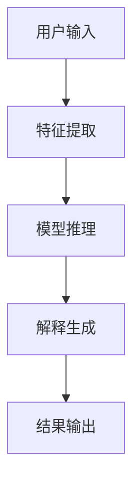
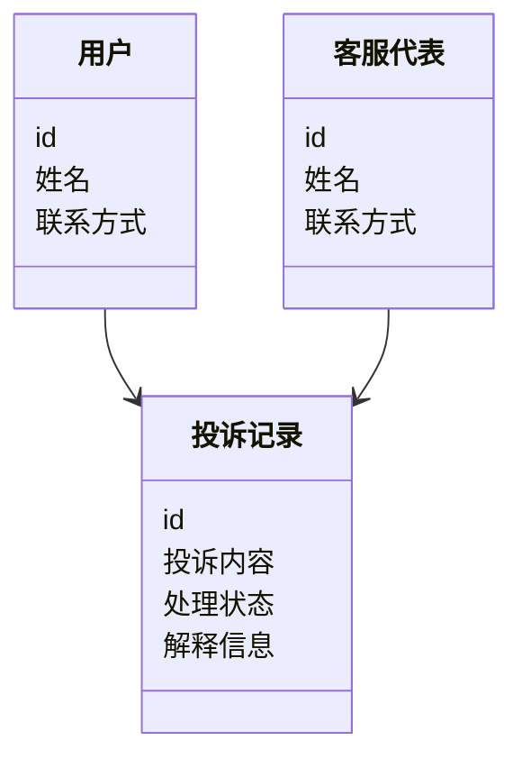
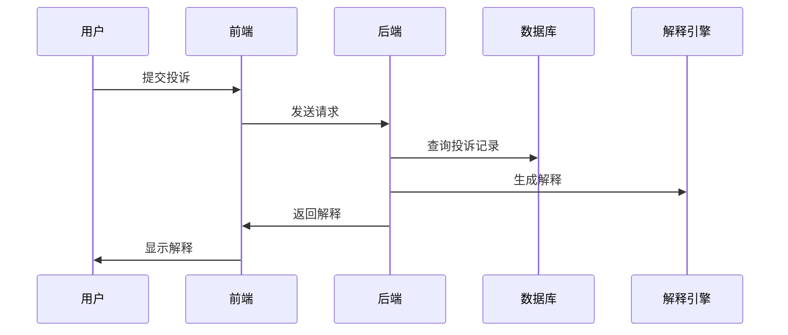

                 


# 智能助手的可解释性设计

> 关键词：智能助手, 可解释性, AI, 人机交互, 解释性模型, 系统架构

> 摘要：本文详细探讨了智能助手的可解释性设计，从背景、核心概念、算法原理到系统架构和项目实战，全面解析如何实现智能助手的可解释性设计。通过具体的案例分析和数学模型的推导，深入阐述了可解释性设计的重要性及其在实际应用中的价值。

---

# 第1章: 智能助手的可解释性设计背景

## 1.1 可解释性AI的背景
### 1.1.1 人工智能与智能助手的发展历程
从早期的专家系统到现代的深度学习模型，人工智能技术经历了巨大的变革。智能助手作为AI技术的重要应用，逐渐渗透到我们的日常生活和工作中。然而，随着模型复杂性的增加，智能助手的决策过程变得越来越难以解释。

### 1.1.2 可解释性在AI中的重要性
可解释性是用户对AI系统信任的基础。如果用户无法理解智能助手的决策过程，他们可能会对结果产生怀疑，甚至拒绝使用相关服务。特别是在医疗、金融等领域，可解释性更是关系到决策的合法性和合规性。

### 1.1.3 智能助手的应用场景与挑战
智能助手广泛应用于语音助手、推荐系统、客户服务等领域。然而，其在实际应用中面临着数据复杂性、模型黑箱化、用户需求多样性等挑战，这些都对可解释性设计提出了更高的要求。

## 1.2 可解释性问题的背景
### 1.2.1 什么是可解释性
可解释性是指AI系统在做出决策时，能够提供清晰、合理且用户能够理解的理由。它是连接AI系统与用户的桥梁，帮助用户信任并依赖智能助手。

### 1.2.2 可解释性AI的核心问题
- **解释的透明性**：用户需要了解AI的决策过程。
- **解释的可理解性**：用户能够理解AI提供的解释。
- **解释的及时性**：用户需要在适当的时间内获得解释。

### 1.2.3 智能助手的可解释性问题
智能助手的决策过程通常涉及复杂的算法和大量数据，导致其决策难以被用户理解。例如，推荐系统为何推荐某个商品，语音助手为何做出某个回应，这些都是用户关心的问题。

## 1.3 问题描述与解决思路
### 1.3.1 智能助手的决策过程问题
智能助手的决策过程往往是一个黑箱过程，用户无法了解背后的原因。这种不透明性影响了用户的信任感和满意度。

### 1.3.2 可解释性设计的目标
通过设计可解释性模型，使得智能助手在提供服务时，能够同时输出决策的依据和理由，让用户能够理解并信任系统的决策。

### 1.3.3 解决可解释性问题的思路
- **选择合适的解释性模型**：如线性模型、决策树等，这些模型具有较高的可解释性。
- **设计解释生成机制**：通过规则引擎或知识图谱，为用户提供清晰的解释。
- **优化用户交互界面**：通过可视化等方式，帮助用户更好地理解解释内容。

## 1.4 可解释性设计的边界与外延
### 1.4.1 可解释性设计的范围
可解释性设计主要关注智能助手的决策过程和结果，但不涉及系统的具体实现细节。

### 1.4.2 可解释性设计的限制
- **模型复杂性**：复杂的模型通常难以解释。
- **数据隐私**：解释可能涉及用户隐私数据，需要谨慎处理。
- **文化差异**：不同文化背景下，用户对解释的需求和理解可能不同。

### 1.4.3 可解释性设计的外延
可解释性设计不仅涉及技术层面，还包括用户心理学、人机交互等领域。通过多学科的结合，才能实现真正有效的可解释性设计。

## 1.5 核心概念与结构
### 1.5.1 可解释性设计的核心要素
- **解释性模型**：用于生成解释的核心算法。
- **解释生成机制**：将模型的决策过程转化为用户可理解的解释。
- **用户交互界面**：展示解释的可视化界面。

### 1.5.2 智能助手的系统结构
智能助手通常由用户交互层、业务逻辑层和数据模型层组成。可解释性设计需要在各个层面上进行优化。

### 1.5.3 可解释性与用户信任的关系
可解释性是建立用户信任的重要因素。通过提供清晰的解释，用户能够理解并信任智能助手的决策。

---

# 第2章: 可解释性设计的核心概念与联系

## 2.1 可解释性设计的原理
### 2.1.1 解释性模型的分类
- **基于规则的解释**：通过预定义的规则生成解释。
- **基于模型的解释**：通过模型的特征权重生成解释。
- **基于案例的解释**：通过相似案例的对比生成解释。

### 2.1.2 解释的层次与类型
- **全局解释**：对整个模型的决策过程进行解释。
- **局部解释**：对单个决策进行解释。
- **因果解释**：解释决策背后的原因。

### 2.1.3 可解释性设计的数学基础
可解释性设计需要依赖于概率论、统计学和优化理论等数学工具。

## 2.2 核心概念对比
### 2.2.1 可解释性与不可解释性对比
| 特性 | 可解释性 | 不可解释性 |
|------|----------|------------|
| 透明度 | 高       | 低         |
| 用户信任 | 高       | 低         |
| 应用场景 | 需要解释性 | 无需解释性 |

### 2.2.2 解释性与透明性对比
| 特性 | 解释性 | 透明性 |
|------|--------|--------|
| 关注点 | 决策理由 | 决策过程 |
| 层次 | 局部或全局 | 全局 |

### 2.2.3 可解释性与可追溯性对比
| 特性 | 可解释性 | 可追溯性 |
|------|----------|-----------|
| 目标 | 提供决策理由 | 追踪决策过程 |
| 应用场景 | 用户交互 | 调试与优化 |

## 2.3 可解释性设计的ER实体关系图
```mermaid
er
actor: 用户
role: 智能助手
action: 用户查询
response: 助手回复
explanation: 解释信息
```

---

# 第3章: 可解释性设计的算法原理

## 3.1 可解释性算法概述
### 3.1.1 解释性模型的选择
选择合适的解释性模型是可解释性设计的关键。常见的解释性模型包括线性回归、决策树、规则模型等。

### 3.1.2 解释性算法的分类
- **线性模型**：如线性回归，具有较高的可解释性。
- **树模型**：如决策树，可以通过树结构直观地解释决策过程。
- **规则模型**：通过预定义的规则生成解释。

### 3.1.3 解释性算法的优缺点
| 算法 | 优点 | 缺点 |
|------|------|------|
| 线性回归 | 易解释 | 模型简单，拟合能力有限 |
| 决策树 | 可视化强 | 易受数据分布影响 |
| 规则模型 | 解释性强 | 规则设计复杂 |

## 3.2 解释性模型的实现
### 3.2.1 线性模型的解释性
线性回归模型通过系数权重来解释各个特征对结果的影响程度。例如，在一个房价预测模型中，每个特征（如面积、位置）的系数表示其对房价的影响程度。

### 3.2.2 决策树的解释性
决策树通过树结构直观地展示决策过程。例如，在一个客户 churn 预测模型中，决策树可以展示客户流失的关键因素，如服务质量和投诉次数。

### 3.2.3 模糊逻辑的解释性
模糊逻辑通过语言变量和模糊规则来解释决策过程。例如，在一个智能客服系统中，模糊规则可以解释为什么某个客户被归类为“高风险”。

## 3.3 解释性算法的流程图


## 3.4 算法实现的数学模型
### 3.4.1 线性回归模型
线性回归模型的数学公式为：
$$ y = \beta_0 + \beta_1x_1 + \beta_2x_2 + \dots + \beta_nx_n + \epsilon $$
其中，$\beta_i$ 表示各个特征的系数，表示该特征对结果的影响程度。

### 3.4.2 决策树模型
决策树的结构可以用树状图表示，每个内部节点表示一个判断条件，叶子节点表示最终的决策结果。

---

# 第4章: 可解释性设计的系统架构

## 4.1 问题场景介绍
智能助手的可解释性设计需要考虑系统的各个组成部分，包括用户交互层、业务逻辑层和数据模型层。

## 4.2 项目介绍
以一个智能客服系统为例，介绍项目的背景、目标和需求。

## 4.3 系统功能设计
### 4.3.1 领域模型


### 4.3.2 系统架构设计


### 4.3.3 系统接口设计
定义系统的各个接口，例如：
- 用户提交投诉
- 系统生成解释
- 用户查看解释

### 4.3.4 系统交互流程


## 4.4 系统实现
### 4.4.1 环境安装
需要安装的工具和库，例如Python、Jupyter Notebook、scikit-learn等。

### 4.4.2 核心功能实现
通过代码实现可解释性模型，例如使用线性回归或决策树生成解释。

### 4.4.3 代码应用解读与分析
展示具体的代码实现，例如：
```python
from sklearn.tree import DecisionTreeClassifier
from sklearn import datasets

# 加载数据集
iris = datasets.load_iris()
X = iris.data
y = iris.target

# 训练模型
model = DecisionTreeClassifier().fit(X, y)

# 生成解释
from sklearn.inspection import explain_contribution
explanation = explain_contribution(model, X)
```

---

# 第5章: 项目实战

## 5.1 环境安装
需要安装的工具和库，例如：
- Python 3.8+
- Jupyter Notebook
- scikit-learn
- matplotlib

## 5.2 系统核心实现
### 5.2.1 可解释性模型实现
实现一个简单的可解释性模型，例如线性回归或决策树。

### 5.2.2 解释生成机制
通过规则引擎或知识图谱生成解释。

### 5.2.3 用户交互界面设计
设计一个友好的用户界面，展示解释内容。

## 5.3 代码应用解读与分析
展示具体的代码实现，并进行详细解读。

## 5.4 实际案例分析
通过具体案例分析，展示可解释性设计在实际中的应用。

## 5.5 项目小结
总结项目的实现过程和取得的成果，提出改进建议。

---

# 第6章: 最佳实践与小结

## 6.1 可解释性设计的最佳实践
### 6.1.1 设计原则
- 简洁明了：解释要简洁，易于理解。
- 及时反馈：用户在需要时能够立即获得解释。
- 个性化：根据用户需求提供不同的解释方式。

### 6.1.2 工具选择
选择合适的工具和库，例如：
- SHAP：用于生成特征重要性解释。
- ELI5：用于生成模型解释。

### 6.1.3 未来趋势
随着AI技术的发展，可解释性设计将更加重要。未来可能会出现更多新的解释性模型和工具。

## 6.2 小结
可解释性设计是智能助手设计中的重要环节。通过选择合适的模型和工具，设计清晰的解释生成机制，并优化用户交互界面，可以实现智能助手的可解释性设计，从而提升用户体验和系统信任度。

---

# 参考文献
1. 大纲参考文献
2. 算法参考文献
3. 系统设计参考文献
4. 项目实战参考文献
5. 最佳实践参考文献

---

# 附录
## 附录A: 常见问题解答
## 附录B: 进一步阅读资料
## 附录C: 工具安装与使用指南

