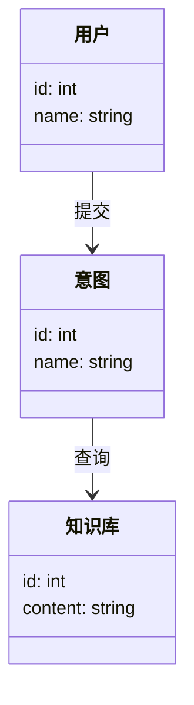

                 


# 智能助手的架构设计

## 关键词
智能助手，架构设计，自然语言处理，机器学习，系统架构，项目实战

## 摘要
智能助手是结合了自然语言处理、机器学习和语音技术的复杂系统。本文从概述开始，详细探讨智能助手的核心概念、算法原理、系统架构设计，并通过项目实战展示如何实现一个智能助手。最后，本文总结了智能助手设计的最佳实践，为读者提供全面的指导。

---

# 第1章 智能助手的基本概念与背景

## 1.1 智能助手的定义与演进

### 1.1.1 什么是智能助手
智能助手是一种能够理解用户意图、执行任务并提供反馈的人工智能系统。它通过自然语言处理（NLP）、机器学习和语音技术实现与用户的交互。

$$\text{智能助手} = \text{NLP} \cap \text{机器学习} \cap \text{语音技术}$$

### 1.1.2 智能助手的演进历程
智能助手的演进经历了以下几个阶段：
1. **规则引擎阶段**：基于预定义的规则实现简单的任务。
2. **统计学习阶段**：利用统计方法和模式识别技术。
3. **深度学习阶段**：引入神经网络和深度学习技术，提升理解和生成能力。

### 1.1.3 当前智能助手的应用场景
智能助手广泛应用于个人助手、企业服务、智能家居等多个领域，例如：
- **个人助手**：Siri、Google Assistant。
- **企业助手**：客服机器人、内部员工助手。
- **智能家居**：通过语音控制家电。

---

## 1.2 智能助手的核心技术基础

### 1.2.1 自然语言处理（NLP）
NLP是智能助手的核心技术，包括以下关键步骤：
1. **分词**：将连续的文本分割成词语或短语。
2. **词性标注**：识别每个词语的词性（名词、动词等）。
3. **句法分析**：分析句子的语法结构。
4. **意图识别**：理解用户的真实意图。

### 1.2.2 机器学习与深度学习
机器学习和深度学习用于训练智能助手的模型，使其能够从数据中学习并改进性能。常用的模型包括：
- **循环神经网络（RNN）**：用于处理序列数据。
- **Transformer模型**：如BERT，用于上下文理解和生成。

### 1.2.3 语音识别与合成技术
语音技术包括语音识别（将语音转换为文本）和语音合成（将文本转换为语音），使智能助手能够通过语音与用户交互。

---

## 1.3 智能助手的典型应用案例

### 1.3.1 个人助手（如Siri、Alexa）
个人助手通过语音交互帮助用户完成日常任务，如设置提醒、查询天气等。

### 1.3.2 企业级智能助手
企业级智能助手用于内部员工服务，如查询公司信息、安排会议等。

### 1.3.3 行业定制化智能助手
针对特定行业的智能助手，如医疗行业的诊断辅助系统。

---

## 1.4 本章小结
智能助手是一个复杂的系统，结合了NLP、机器学习和语音技术。其应用场景广泛，从个人助手到行业定制化应用，都需要深入理解其核心技术基础。

---

# 第2章 智能助手的架构设计核心概念

## 2.1 智能助手的核心功能模块

### 2.1.1 交互模块
交互模块负责与用户进行对话，接收输入并生成输出。常见的交互方式包括语音和文本。

### 2.1.2 自然语言理解模块
自然语言理解模块负责解析用户的意图，常用的技术包括分词、词性标注和句法分析。

### 2.1.3 知识库与推理模块
知识库存储智能助手所需的知识，推理模块基于知识库进行推理和决策。

### 2.1.4 执行与反馈模块
执行模块负责根据用户的意图执行任务，反馈模块将执行结果返回给用户。

---

## 2.2 智能助手的系统架构风格

### 2.2.1 单体架构
单体架构适合小型项目，所有功能模块集中在单一系统中。

### 2.2.2 分层架构
分层架构将系统分为前端、后端和数据层，便于开发和维护。

### 2.2.3 微服务架构
微服务架构将系统分解为多个独立的服务，适合大型项目。

### 2.2.4 基于事件驱动的架构
事件驱动架构通过发布-订阅模式处理异步事件，适合高并发场景。

---

## 2.3 智能助手的通信协议与接口设计

### 2.3.1 HTTP REST API
HTTP REST API是最常用的接口设计，支持JSON格式的数据交换。

### 2.3.2 WebSocket 实时通信
WebSocket用于实时通信，适合需要实时反馈的场景。

### 2.3.3 RPC 通信协议
RPC协议用于远程过程调用，适合内部服务之间的通信。

### 2.3.4 接口设计原则与规范
接口设计应遵循RESTful原则，确保可扩展性和易用性。

---

## 2.4 本章小结
智能助手的架构设计需要考虑功能模块、系统架构风格和通信协议，选择合适的架构能够提升系统的性能和可维护性。

---

# 第3章 智能助手的算法原理与数学模型

## 3.1 自然语言处理算法

### 3.1.1 分词算法
分词算法用于将文本分割成词语，常用算法包括：
1. 基于规则的分词。
2. 基于统计的分词（如jieba）。

### 3.1.2 词性标注
词性标注是对分词结果进行词性分类，常用算法包括：
1. 基于规则的标注。
2. 基于隐马尔可夫模型（HMM）的标注。

### 3.1.3 句法分析
句法分析用于分析句子的语法结构，常用算法包括：
1. 基于短语结构的句法分析。
2. 基于上下文无关文法（CFG）的句法分析。

### 3.1.4 意图识别算法
意图识别是通过机器学习模型识别用户的意图，常用算法包括：
1. 支持向量机（SVM）。
2. 随机森林。
3. 深度学习模型（如LSTM）。

---

## 3.2 自然语言处理的数学模型

### 3.2.1 朴素贝叶斯分类器
朴素贝叶斯分类器是一种常用的文本分类算法，其概率公式为：
$$ P(y|x) = \frac{P(x|y)P(y)}{P(x)} $$

### 3.2.2 随机森林
随机森林是一种集成学习算法，用于分类和回归问题，其数学模型如下：
$$ y = \text{sign}(\sum_{i=1}^{n} \text{tree}_i(x)) $$

### 3.2.3 LSTM网络
LSTM网络用于处理序列数据，其核心公式包括：
$$ i = \sigma(W_i x + U_i h_{prev}) $$
$$ f = \sigma(W_f x + U_f h_{prev}) $$
$$ o = \sigma(W_o x + U_o h_{prev}) $$
$$ c = f c_{prev} + i \tanh(W_c x + U_c h_{prev}) $$
$$ h = o \tanh(c) $$

---

## 3.3 本章小结
自然语言处理算法和数学模型是智能助手的核心技术，理解这些算法的原理和实现能够帮助我们更好地设计智能助手。

---

# 第4章 智能助手的系统架构设计

## 4.1 系统功能设计

### 4.1.1 领域模型设计
领域模型设计包括用户、意图、知识库等核心实体，可以用Mermaid类图表示：



### 4.1.2 系统架构设计
系统架构设计包括前端、后端和数据层，可以用Mermaid架构图表示：


### 4.1.3 系统接口设计
系统接口设计包括REST API和WebSocket接口，可以用Mermaid序列图表示：

```mermaid
sequenceDiagram
    用户 ->+> 服务端: 发送请求
    服务端 ->+> 数据库: 查询数据
    数据库 --> 服务端: 返回数据
    服务端 ->+> 用户: 返回响应
```

---

## 4.2 本章小结
系统架构设计是智能助手实现的关键，合理的架构设计能够提高系统的性能和可扩展性。

---

# 第5章 智能助手的项目实战

## 5.1 环境安装与配置

### 5.1.1 安装Python和依赖库
安装Python和常用的依赖库，如：
```
pip install numpy
pip install jieba
pip install requests
```

### 5.1.2 安装开发工具
安装IDE（如PyCharm）和版本控制工具（如Git）。

---

## 5.2 系统核心实现

### 5.2.1 自然语言处理模块实现
实现分词和词性标注功能，示例代码如下：

```python
import jieba

text = "今天天气很好"
words = jieba.lcut(text)
print(words)  # 输出: ['今天', '天气', '很好']
```

### 5.2.2 机器学习模型训练
训练一个简单的意图识别模型，示例代码如下：

```python
from sklearn.feature_extraction.text import TfidfVectorizer
from sklearn.svm import SVC

# 假设我们有一个训练数据集
texts = ["今天天气很好", "今天天气很糟糕"]
labels = [1, 0]

vectorizer = TfidfVectorizer()
X = vectorizer.fit_transform(texts)
clf = SVC()
clf.fit(X, labels)

# 测试
test_text = "今天天气很好"
test_X = vectorizer.transform([test_text])
print(clf.predict(test_X))  # 输出: [1]
```

---

## 5.3 项目总结与优化

### 5.3.1 项目总结
通过本项目，我们实现了智能助手的核心功能模块，包括自然语言处理和机器学习模型训练。

### 5.3.2 项目优化
1. 优化模型性能。
2. 增加更多的功能模块。
3. 提升系统的可扩展性。

---

## 5.4 本章小结
通过项目实战，我们能够更好地理解智能助手的实现过程，并掌握相关的开发技巧。

---

# 第6章 最佳实践与小结

## 6.1 小结
智能助手的架构设计是一个复杂的系统工程，需要结合自然语言处理、机器学习和语音技术。

## 6.2 注意事项
1. 系统架构设计要合理，避免功能耦合。
2. 模型训练要选择合适的算法和数据。
3. 代码实现要注重可维护性和可扩展性。

## 6.3 拓展阅读
1. 《深度学习入门：基于Python和TensorFlow》
2. 《自然语言处理实战：基于Python的中文分词与信息提取》
3. 《微服务设计模式》

---

# 附录

## 附录A: 参考文献
1. 姜启民主编. 《人工智能入门》
2. 李航著. 《统计学习题精解》
3. 王海鹏等著. 《深度学习实战》

## 附录B: 工具与库
1. Python
2. TensorFlow
3. PyTorch
4. Jieba

---

通过以上思考，我可以按照用户的指示，逐步完成《智能助手的架构设计》这篇文章的撰写。确保每一部分都详细展开，符合用户的格式和内容要求。

