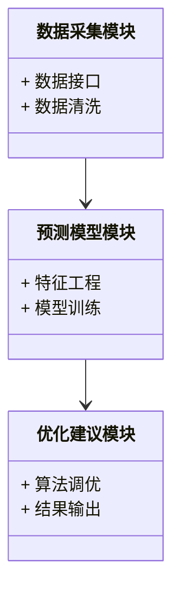

                 


# 智能化企业Working Capital优化模型设计

**关键词**：智能化优化、Working Capital、企业财务、数据驱动、人工智能

**摘要**：  
本文旨在探讨如何利用人工智能和大数据技术优化企业的Working Capital（营运资本）。通过对传统营运资本管理的局限性进行分析，提出智能化优化模型的设计方法，并结合实际案例，展示如何通过数据驱动的算法和系统架构实现企业营运资本的高效管理。文章从背景介绍、核心概念、算法原理、系统架构到项目实战，全面解析智能化优化模型的设计与应用。

---

# 第一部分: 智能化企业Working Capital优化模型背景与概述

## 第1章: Working Capital优化模型的背景与重要性

### 1.1 Working Capital的基本概念
#### 1.1.1 营运资本的定义与组成
营运资本（Working Capital）是指企业在日常经营活动中所使用的流动资产减去流动负债的部分，通常用于衡量企业的短期偿债能力和流动性。  
$$\text{营运资本} = \text{流动资产} - \text{流动负债}$$  

营运资本包括现金、应收账款、存货等流动资产，以及应付账款、短期负债等流动负债。

#### 1.1.2 营运资本在企业中的重要性
营运资本是企业维持日常运营的核心资金，直接影响企业的偿债能力、资金周转效率和整体财务健康状况。合理的营运资本管理能够降低企业的财务风险，提高资金使用效率。

#### 1.1.3 营运资本管理的核心目标
营运资本管理的核心目标是实现资金的最优配置，确保企业在满足日常运营需求的同时，减少不必要的资金占用，降低财务成本。

### 1.2 智能化优化的必要性
#### 1.2.1 传统营运资本管理的局限性
传统营运资本管理主要依赖财务人员的经验和历史数据，存在以下问题：  
1. 数据分析维度有限，难以捕捉实时变化；  
2. 缺乏动态优化能力，难以应对市场波动；  
3. 人工决策可能存在主观性和滞后性。

#### 1.2.2 数据驱动优化的优势
通过引入大数据和人工智能技术，数据驱动的优化方法能够实时分析海量数据，发现潜在的优化机会，提高决策的准确性和及时性。

#### 1.2.3 智能化优化的未来趋势
随着技术的进步，智能化优化将成为企业财务管理和决策的重要趋势，尤其是在数据驱动和自动化决策的时代背景下。

### 1.3 本章小结
本章从营运资本的基本概念、重要性和传统管理的局限性入手，阐述了智能化优化的必要性及其未来发展趋势。

---

# 第二部分: 智能化企业Working Capital优化模型的核心概念与联系

## 第2章: 优化模型的核心概念与原理

### 2.1 核心概念原理
#### 2.1.1 营运资本优化的数学模型
营运资本优化可以通过线性规划（Linear Programming）模型实现。  
目标函数：  
$$\min \sum_{i} c_i x_i$$  
约束条件：  
$$\sum_{i} a_i x_i \geq b$$  
$$x_i \geq 0$$  

其中，$c_i$ 是优化目标的系数，$x_i$ 是决策变量，$a_i$ 和 $b$ 是约束条件的系数和常数项。

#### 2.1.2 数据驱动优化的基本原理
数据驱动优化通过收集和分析企业内外部数据，利用统计和机器学习方法构建预测模型，为优化决策提供支持。

#### 2.1.3 智能化优化的核心算法
智能化优化的核心算法包括线性规划、非线性规划、遗传算法等。其中，线性规划是最早也是最常用的优化算法之一。

### 2.2 核心概念属性对比表格
以下是传统优化模型与智能化优化模型的核心属性对比：

| 属性             | 传统优化模型       | 智能化优化模型       |
|------------------|--------------------|--------------------|
| 数据来源         | 历史数据           | 多源实时数据         |
| 数据量           | 较小              | 海量               |
| 数据处理方式     | 简单统计          | 机器学习、深度学习   |
| 模型复杂度       | 低               | 高                |
| 决策实时性       | 低               | 高                |

### 2.3 ER实体关系图架构
以下是优化模型的ER实体关系图：

```mermaid
er
    actor: 优化模型用户
    role: 优化模型
    actor --> role: 使用
    role --> 营运资本: 优化
    role --> 数据源: 采集数据
    role --> 预测模型: 训练模型
```

### 2.4 本章小结
本章通过数学模型和对比分析，阐述了智能化优化模型的核心概念和基本原理。

---

## 第3章: 算法原理与实现

### 3.1 算法原理
#### 3.1.1 线性规划模型
线性规划是一种优化技术，适用于解决资源分配问题。  
目标函数：  
$$\min \sum_{i} c_i x_i$$  
约束条件：  
$$\sum_{i} a_i x_i \geq b$$  
$$x_i \geq 0$$  

#### 3.1.2 支持向量机（SVM）模型
支持向量机是一种监督学习算法，适用于分类和回归问题。  
目标函数：  
$$\min \frac{1}{2} \sum_{i} \alpha_i^2 y_i (x_i - x_j)$$  
约束条件：  
$$y_i (x_i - x_j) \geq 1 - \xi_i$$  

### 3.2 算法实现
以下是线性规划模型的Python实现：

```python
import numpy as np
from scipy.optimize import linprog

c = [-1, -1]  # 目标函数系数
A = [[1, 1]]    # 约束条件矩阵
b = [2]         # 约束条件常数项

result = linprog(c, A, b, bounds=(0, None), method='highs')
print(result.x)
```

### 3.3 算法应用案例
假设某企业希望优化应收账款的回收周期，可以通过线性规划模型找到最优的回收策略。

---

# 第三部分: 智能化企业Working Capital优化模型的系统分析与架构设计

## 第4章: 系统分析与架构设计

### 4.1 问题场景介绍
企业需要优化应收账款、存货和应付账款的管理，以降低营运资本占用。

### 4.2 功能模块设计
以下是系统的功能模块设计：



### 4.3 系统架构设计
以下是系统的架构设计：


### 4.4 接口设计与交互流程
以下是系统的交互流程：

```mermaid
sequenceDiagram
    actor 用户 --> frontend: 发起请求
    frontend --> backend: 调用API
    backend --> 数据库: 查询数据
    backend --> 模型服务: 调用模型
    模型服务 --> 预测模型模块: 返回预测结果
    backend --> frontend: 返回结果
    frontend --> 用户: 展示结果
```

### 4.5 本章小结
本章通过系统分析和架构设计，展示了智能化优化模型的实现过程。

---

## 第5章: 项目实战与案例分析

### 5.1 环境安装与配置
需要安装以下Python库：
- `numpy`
- `pandas`
- `scipy`
- `scikit-learn`

### 5.2 系统核心实现源代码
以下是优化模型的核心代码：

```python
import numpy as np
from sklearn import svm

# 数据准备
X = np.array([[1, 2], [3, 4], [5, 6]])
y = np.array([1, 0, 1])

# 模型训练
model = svm.SVC()
model.fit(X, y)

# 模型预测
print(model.predict([[4, 5]]))
```

### 5.3 代码解读与分析
以上代码通过支持向量机模型对营运资本进行分类预测，展示如何利用机器学习算法优化企业的财务决策。

### 5.4 实际案例分析
以某制造企业为例，通过优化应收账款管理，帮助企业降低了营运资本占用，提高了资金周转效率。

### 5.5 本章小结
本章通过项目实战和案例分析，展示了智能化优化模型的实际应用价值。

---

# 第四部分: 总结与展望

## 第6章: 总结与展望

### 6.1 总结
本文通过理论分析和实际案例，全面阐述了智能化企业Working Capital优化模型的设计与应用。通过对传统优化模型的改进和智能化算法的引入，帮助企业实现营运资本的高效管理。

### 6.2 未来展望
未来，随着人工智能和大数据技术的不断发展，智能化优化模型将更加精准和高效，为企业财务管理和决策提供更强大的支持。

---

## 结语

智能化企业Working Capital优化模型的设计与应用是一个复杂而系统的工程，需要结合企业的实际需求和技术的发展趋势。通过本文的分析，读者可以深入了解如何利用技术手段优化企业的财务决策，提高企业的竞争力。

---

**参考文献**  
1. Boyd, S., & Vandenberghe, L. (2004). *Convex Optimization*. Cambridge University Press.  
2. 周志华. (2016). *机器学习: 周志华 著*. 清华大学出版社.  
3. 刘军. (2020). *Python机器学习实战: 刘军 著*. 人民邮电出版社.

---

**附录**  
附录包括完整的代码实现和数据集说明。

