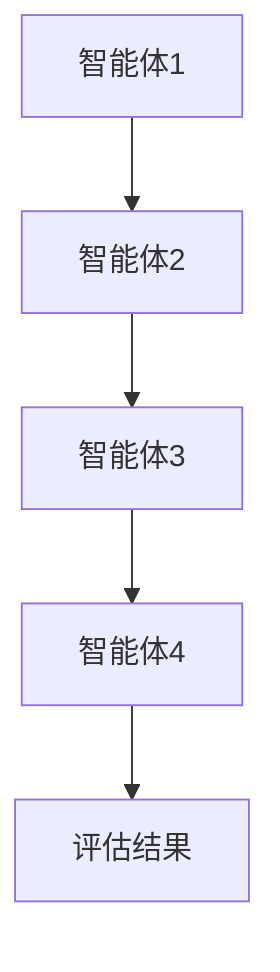
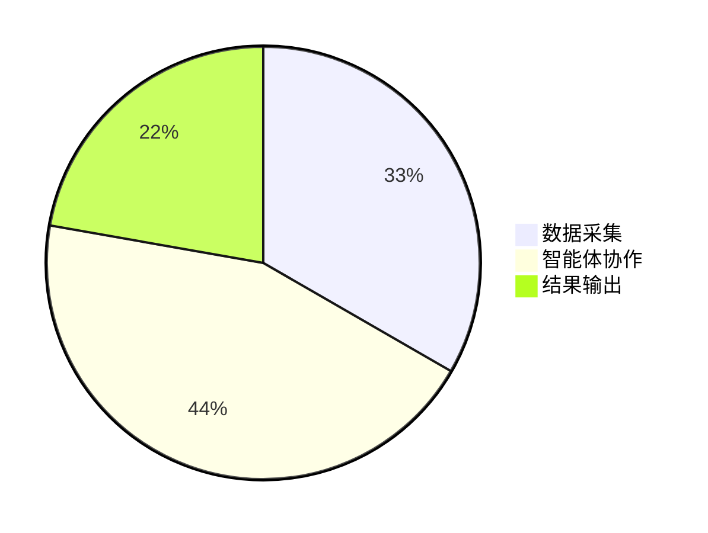

                 


# 智能化企业价值计算：多智能体AI在价值投资中的新方法

> 关键词：企业价值计算，多智能体AI，价值投资，AI算法，系统架构

> 摘要：本文探讨了多智能体AI在企业价值计算中的应用，分析了传统方法的局限性，提出了多智能体AI的新方法，并详细讲解了算法原理、系统架构和实际案例，展示了其在价值投资中的潜力。

---

## 第一部分: 背景与概念

### 第1章: 智能化企业价值计算的背景与意义

#### 1.1 问题背景

- **传统企业价值计算的局限性**  
  传统方法依赖财务指标和简单模型，难以捕捉企业动态和复杂因素，导致结果片面。

- **价值投资的挑战与机遇**  
  随着市场的复杂化，价值投资需要更精准的工具和方法。

- **多智能体AI的引入与价值**  
  多智能体AI通过协作和分布式计算，提升企业价值评估的准确性和全面性。

#### 1.2 问题描述

- **企业价值计算的核心要素**  
  包括财务指标、市场表现、管理质量等多维度因素。

- **传统方法的不足**  
  传统方法忽视企业动态和外部环境的影响，难以应对复杂市场。

- **新方法的需求与目标**  
  引入多智能体AI，构建动态模型，实现更精准的评估。

#### 1.3 问题解决

- **多智能体AI的基本概念**  
  由多个智能体协作完成任务，具备分布式计算和自主决策的特点。

- **多智能体AI在价值计算中的应用**  
  智能体分别分析财务、市场、管理等数据，协同生成评估结果。

- **新方法的优势与创新**  
  提升计算维度和准确性，提供更全面的分析。

#### 1.4 边界与外延

- **适用范围与限制**  
  适用于复杂市场环境，但需处理数据质量和模型准确性问题。

- **相关领域的影响**  
  金融分析、投资决策等领域均可受益。

- **未来发展的可能性**  
  随着技术进步，多智能体AI在价值计算中的应用将更加广泛。

#### 1.5 概念结构与核心要素

- **核心概念的组成**  
  包括多智能体系统、价值评估模型、动态数据分析等。

- **概念之间的关系**  
  智能体协同工作，各模型相互补充，提供全面评估。

- **核心要素的详细说明**  
  每个智能体负责特定领域分析，协同生成最终结果。

### 第2章: 多智能体AI的核心概念与联系

#### 2.1 多智能体AI的定义与特点

- **多智能体系统的定义**  
  由多个智能体组成的系统，协作完成复杂任务。

- **多智能体AI的核心特点**  
  分布式计算、自主决策、协作能力强。

- **与传统AI的区别**  
  传统AI依赖中心化处理，而多智能体AI具备分布式和协作特点。

#### 2.2 核心概念的原理

- **多智能体系统的通信机制**  
  智能体之间通过消息传递进行通信，确保信息共享。

- **协作机制**  
  利用协商协议，实现任务分配和协作。

- **学习机制**  
  通过强化学习，提升决策能力和适应性。

#### 2.3 概念属性特征对比表格

| 概念         | 传统AI                | 多智能体AI            |
|--------------|-----------------------|-----------------------|
| 结构         | 单点计算              | 分布式协作            |
| 决策         | 中央控制              | 分散决策              |
| 适应性       | 较低                  | 较高                  |
| 应用场景     | 简单任务              | 复杂任务              |

#### 2.4 ER实体关系图架构

```mermaid
er
  entity 企业价值计算 {
    <属性> 计算结果
    <属性> 评估维度
    <关系> 组合评估模型
  }
  entity 多智能体AI {
    <属性> 智能体数量
    <属性> 分工模块
    <关系> 评估结果
  }
  企业价值计算 -[1..n]-> 多智能体AI
```

---

## 第二部分: 算法原理

### 第3章: 多智能体AI的算法原理

#### 3.1 算法原理概述

- **多智能体协作算法**  
  各智能体分别处理数据，协同生成评估结果。

- **通信协议设计**  
  定义智能体间消息传递的格式和内容。

- **协商与任务分配**  
  利用协商算法，动态分配任务。

#### 3.2 算法流程图



#### 3.3 算法实现

- **智能体分工**  
  每个智能体负责特定领域的分析，如财务指标、市场趋势。

- **信息整合**  
  各智能体将分析结果整合，生成最终评估报告。

- **动态调整**  
  根据市场变化，动态调整各智能体的任务权重。

#### 3.4 数学模型

- **评估模型**  
  $$ V = \sum_{i=1}^{n} w_i x_i $$
  其中，$w_i$ 是权重，$x_i$ 是各维度的评估值。

- **权重调整**  
  利用强化学习，动态调整权重：
  $$ w_i^{new} = w_i + \alpha (r - w_i) $$

---

## 第三部分: 系统架构设计

### 第4章: 系统架构设计

#### 4.1 系统功能设计

- **模块化设计**  
  包括数据采集、智能体协作、结果输出等功能模块。

- **领域模型**  
  $$ class \ 企业价值计算 {
    <属性> 计算结果
    <操作> 评估(value)
  } $$

- **系统架构图**



#### 4.2 系统架构实现

- **分层架构**  
  包括数据层、智能体层和管理层。

- **接口设计**  
  提供RESTful API，便于与其他系统集成。

- **交互流程**

```mermaid
sequence
    用户 --> 数据采集层
    数据采集层 --> 智能体协作层
    智能体协作层 --> 结果输出层
    结果输出层 --> 用户
```

---

## 第四部分: 项目实战

### 第5章: 项目实战

#### 5.1 环境搭建

- **工具安装**  
  安装Python、TensorFlow、Keras等工具。

- **数据准备**  
  收集企业财务数据、市场数据等。

#### 5.2 系统核心实现

- **智能体协作代码**

```python
class Agent:
    def __init__(self, role):
        self.role = role
        self.data = {}

    def analyze(self):
        # 数据分析逻辑
        pass

    def communicate(self, other_agent):
        # 通信逻辑
        pass
```

- **评估结果输出**

```python
agents = [Agent('finance'), Agent('market')]
results = [agent.analyze() for agent in agents]
final_result = sum(results)
```

#### 5.3 代码应用解读

- **智能体分工**  
  每个智能体负责特定领域的分析，确保数据全面。

- **通信机制**  
  智能体间通过共享数据，确保信息一致。

- **动态调整**  
  根据市场变化，动态调整各智能体的权重。

#### 5.4 案例分析

- **案例背景**  
  某公司面临市场波动，需评估其价值。

- **分析过程**  
  智能体分别分析财务、市场、管理数据，协同生成评估结果。

- **结果解读**  
  综合分析得出公司价值，为投资决策提供依据。

---

## 第五部分: 案例分析与总结

### 第6章: 案例分析与总结

#### 6.1 案例分析

- **案例背景**  
  某企业面临市场波动，需评估其价值。

- **分析过程**  
  多智能体AI分别分析财务、市场、管理数据，协同生成评估结果。

- **结果解读**  
  综合分析得出公司价值，为投资决策提供依据。

#### 6.2 总结与展望

- **总结**  
  多智能体AI在企业价值计算中表现出显著优势，提高了评估的准确性和全面性。

- **展望**  
  随着技术进步，多智能体AI在金融领域的应用将更加广泛，推动价值投资进入新阶段。

---

## 结语

通过本文的详细分析，可以清晰地看到多智能体AI在企业价值计算中的巨大潜力。未来，随着技术的不断进步，这一方法将在价值投资中发挥越来越重要的作用，为企业和投资者带来更精准的决策支持。

---

**参考文献**  
[此处列出相关文献和资源]

---

**附录**  
[包括代码示例、数据表格等补充材料]

---

**感谢**  
感谢读者的耐心阅读，希望本文对您有所帮助。

