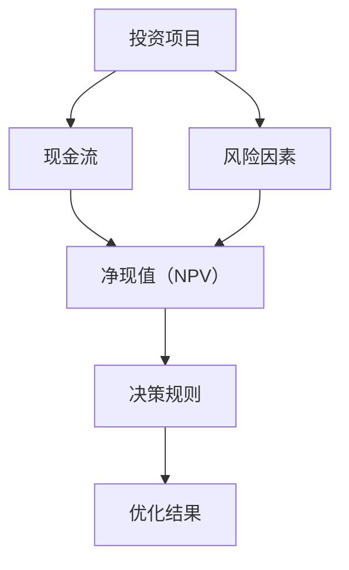
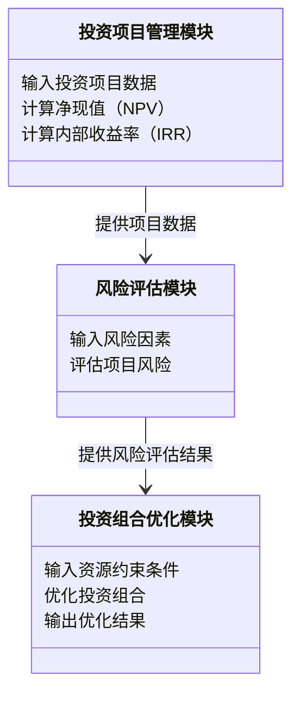

                 


# 《智能化企业资本支出优化决策模型设计》

## 关键词：资本支出优化、人工智能、决策模型、动态规划、机器学习、系统架构

## 摘要：本文详细探讨了智能化企业资本支出优化决策模型的设计与实现。通过分析企业资本支出管理中的关键问题，提出了一种基于人工智能和大数据分析的优化模型。该模型结合了动态规划算法和机器学习方法，能够有效识别和评估投资项目的风险与回报，从而帮助企业做出更明智的资本支出决策。本文还提供了系统的架构设计、算法实现细节以及实际案例分析，为企业的资本支出优化提供了理论支持和实践指导。

---

# 第一部分：资本支出优化决策模型背景与核心概念

## 第1章：资本支出优化决策模型概述

### 1.1 问题背景与问题描述

#### 1.1.1 企业资本支出管理的挑战
在现代企业中，资本支出（Capex）是企业战略决策中的核心部分，涉及大量的资金投入。然而，企业在资本支出管理中面临以下挑战：
- **复杂性**：投资项目涉及多部门协作，需要考虑财务、市场、技术等多方面的因素。
- **不确定性**：市场波动、政策变化等因素可能导致投资回报低于预期。
- **决策时间压力**：企业需要在有限的时间内做出决策，以抓住市场机会。
- **资源分配**：如何在多个项目中合理分配有限的资金资源是关键问题。

#### 1.1.2 资本支出优化的必要性
资本支出优化的目标是通过科学的决策方法，最大化投资回报率（ROI），同时降低投资风险。传统的资本预算方法依赖于财务人员的经验判断，存在主观性强、计算复杂度高、难以量化风险等问题。因此，引入智能化的决策模型是必然趋势。

#### 1.1.3 传统资本支出管理的局限性
传统的资本支出管理方法存在以下局限性：
- **数据处理能力有限**：难以处理海量数据，尤其是非结构化数据。
- **决策周期长**：从数据收集到决策制定的时间较长，难以应对快速变化的市场环境。
- **缺乏动态调整能力**：无法实时跟踪项目进展并根据新的信息调整决策。

### 1.2 问题解决与边界外延

#### 1.2.1 资本支出优化的目标与范围
资本支出优化的目标包括：
- **最大化投资回报**：通过科学的决策方法，选择最优的投资项目。
- **降低投资风险**：通过风险评估和预测模型，减少投资失败的可能性。
- **提高决策效率**：通过自动化和智能化的工具，缩短决策周期。

资本支出优化的范围包括：
- **项目筛选**：从多个投资项目中筛选出具有较高回报潜力的项目。
- **风险评估**：评估投资项目的风险，包括市场风险、技术风险、财务风险等。
- **资源分配**：在多个项目之间分配有限的资金资源。

#### 1.2.2 模型的边界条件与假设
资本支出优化模型的边界条件和假设包括：
- **数据假设**：模型假设企业能够提供完整、准确的投资项目数据，包括投资金额、预期收益、项目周期等。
- **市场假设**：模型假设市场环境稳定，或者能够通过历史数据分析预测未来的市场变化。
- **决策目标**：模型假设企业的决策目标是以最大化投资回报率为首要目标，同时考虑风险因素。

#### 1.2.3 与相关问题的区分与联系
资本支出优化与相关问题（如成本控制、资本预算）的区别与联系：
- **区别**：资本支出优化更注重投资项目的筛选和资源分配，而成本控制更关注日常运营成本的管理。
- **联系**：资本支出优化是资本预算的重要组成部分，而资本预算是企业财务管理的核心内容之一。

### 1.3 概念结构与核心要素

#### 1.3.1 资本支出优化的核心要素
资本支出优化的核心要素包括：
- **投资项目**：包括项目的名称、投资金额、项目周期、预期收益等。
- **现金流**：项目的现金流预测，包括初始投资、年现金流、净现值（NPV）等。
- **风险因素**：影响项目成功的各种风险因素，如市场需求、技术风险、政策风险等。
- **决策规则**：基于模型的决策规则，用于筛选和评估投资项目。

#### 1.3.2 各要素之间的关系
各要素之间的关系可以通过以下关系图表示：



#### 1.3.3 模型的输入与输出
模型的输入包括：
- **投资项目数据**：包括项目的名称、投资金额、项目周期、预期收益等。
- **现金流预测**：项目的初始投资、年现金流等。
- **风险因素**：影响项目成功的各种风险因素。

模型的输出包括：
- **项目评估结果**：包括项目的净现值（NPV）、内部收益率（IRR）等。
- **投资组合优化结果**：基于模型的决策规则，输出最优的投资组合。

### 1.4 本章小结
本章介绍了资本支出优化决策模型的背景、核心概念、问题解决方法以及模型的边界条件和假设。通过分析传统资本支出管理的局限性，提出了智能化资本支出优化模型的必要性。

---

## 第2章：资本支出优化的核心概念与联系

### 2.1 核心概念原理

#### 2.1.1 资本预算模型的基本原理
资本预算模型的基本原理包括以下几个步骤：
1. **项目识别**：识别潜在的投资项目。
2. **现金流预测**：预测项目的现金流，包括初始投资、年现金流等。
3. **评估项目价值**：通过净现值（NPV）、内部收益率（IRR）等指标评估项目的价值。
4. **项目排序**：根据项目的评估结果对项目进行排序，选择最优的投资组合。

#### 2.1.2 现金流折现法与资本预算的关系
现金流折现法是资本预算的核心方法之一，通过将未来现金流按适当折现率折现，计算项目的净现值（NPV）。公式如下：

$$ NPV = \sum_{t=1}^{n} \frac{CF_t}{(1 + r)^t} $$

其中，$CF_t$ 是第 $t$ 年的现金流，$r$ 是折现率，$n$ 是项目周期。

#### 2.1.3 智能化决策的核心算法
智能化资本支出优化模型的核心算法包括：
- **动态规划算法**：用于多项目组合优化问题。
- **机器学习算法**：用于风险预测和项目价值评估。

### 2.2 核心概念对比分析

#### 2.2.1 财务指标与AI模型的对比
以下是财务指标与AI模型的对比分析：

| 对比维度 | 财务指标 | AI模型 |
|----------|----------|--------|
| 输入数据 | 数值型数据 | 多类型数据（数值、文本、图像等） |
| 计算复杂度 | 较低 | 较高 |
| 预测能力 | 基于历史数据的预测 | 基于历史数据和特征的预测 |
| 灵活性 | 较低 | 较高 |

#### 2.2.2 不同资本支出模型的优缺点
以下是不同资本支出模型的优缺点对比：

| 模型类型 | 优点 | 缺点 |
|----------|------|-----|
| 简单净现值法 | 计算简单 | 无法处理多项目组合优化 |
| 动态规划模型 | 能够处理多项目组合优化 | 计算复杂度高 |
| 机器学习模型 | 高度灵活，能够处理复杂数据 | 需要大量数据和计算资源 |

#### 2.2.3 模型适用场景的对比分析
以下是资本支出模型适用场景的对比分析：

| 模型类型 | 适用场景 |
|----------|----------|
| 简单净现值法 | 单个项目评估 |
| 动态规划模型 | 多项目组合优化 |
| 机器学习模型 | 需要考虑复杂因素的项目评估 |

### 2.3 ER实体关系图

以下是资本支出优化模型的ER实体关系图：

```mermaid
erDiagram
    投资项目(投资项目) {
        <属性> 项目名称
        <属性> 投资金额
        <属性> 项目周期
        <属性> 预期收益
        <属性> 风险因素
    }
    投资者(投资者) {
        <属性> 投资者ID
        <属性> 投资金额
        <属性> 投资期限
    }
    项目(项目) {
        <属性> 项目ID
        <属性> 项目成本
        <属性> 项目收益
        <属性> 项目风险
    }
    投资者 --> 项目 : 提供资金
    项目 --> 投资者 : 提供数据
```

### 2.4 本章小结
本章详细讲解了资本支出优化模型的核心概念，包括资本预算模型的基本原理、现金流折现法与资本预算的关系、智能化决策的核心算法等。同时，通过对比分析，展示了不同模型的优缺点和适用场景，并通过ER实体关系图展示了模型的数据结构。

---

## 第3章：资本支出优化算法原理

### 3.1 算法原理概述

#### 3.1.1 动态规划算法
动态规划算法是一种用于解决多项目组合优化问题的经典算法。其基本思路是将问题分解为子问题，逐步求解，最终得到最优解。动态规划算法的步骤如下：

1. **问题分解**：将问题分解为子问题。
2. **子问题求解**：逐个求解子问题。
3. **合并子问题结果**：将子问题的结果合并，得到最终的最优解。

动态规划算法的伪代码如下：

```python
def dynamic_programming():
    # 初始化
    dp = [0] * (n + 1)
    for i in range(1, n + 1):
        # 计算子问题
        dp[i] = max(dp[i-1], current_project_value)
    return dp[n]
```

#### 3.1.2 机器学习算法
机器学习算法在资本支出优化中的应用主要集中在风险预测和项目价值评估方面。常用的算法包括：
- **线性回归**：用于预测项目的现金流。
- **决策树**：用于分类项目的风险等级。
- **随机森林**：用于集成学习，提高预测精度。

### 3.2 算法实现细节

#### 3.2.1 动态规划算法实现
以下是动态规划算法的Python实现代码：

```python
def calculate_NPV(projects, discount_rate):
    # 计算净现值
    NPV = 0
    for project in projects:
        NPV += project['cash_flow'] / (1 + discount_rate) ** project['period']
    return NPV
```

#### 3.2.2 机器学习算法实现
以下是机器学习算法的Python实现代码：

```python
from sklearn.tree import DecisionTreeRegressor

# 训练数据
X_train = ...
y_train = ...

# 训练模型
model = DecisionTreeRegressor()
model.fit(X_train, y_train)

# 预测
X_new = ...
y_pred = model.predict(X_new)
```

#### 3.2.3 数学模型和公式
以下是资本支出优化模型的数学公式：

$$ NPV = \sum_{t=1}^{n} \frac{CF_t}{(1 + r)^t} $$

其中，$CF_t$ 是第 $t$ 年的现金流，$r$ 是折现率，$n$ 是项目周期。

### 3.3 算法对比分析

#### 3.3.1 动态规划算法与机器学习算法的对比
以下是动态规划算法与机器学习算法的对比：

| 对比维度 | 动态规划算法 | 机器学习算法 |
|----------|--------------|--------------|
| 计算复杂度 | 较低 | 较高 |
| 灵活性 | 较低 | 较高 |
| 适用场景 | 多项目组合优化 | 风险预测和项目价值评估 |

### 3.4 本章小结
本章详细讲解了资本支出优化模型的核心算法，包括动态规划算法和机器学习算法的实现细节，并通过对比分析，展示了不同算法的优缺点和适用场景。

---

## 第4章：资本支出优化系统的分析与设计

### 4.1 系统分析

#### 4.1.1 问题场景介绍
资本支出优化系统的目标是帮助企业做出更明智的投资决策。系统需要处理大量的投资项目数据，评估项目的净现值（NPV）、内部收益率（IRR）等指标，并根据企业的资源约束条件，优化投资组合。

#### 4.1.2 系统需求分析
系统需求包括：
- **数据输入**：支持多种格式的投资项目数据输入。
- **模型计算**：能够运行动态规划算法和机器学习算法。
- **结果输出**：生成优化的投资组合报告。

### 4.2 系统设计

#### 4.2.1 系统功能设计
以下是系统功能模块划分：



#### 4.2.2 系统架构设计
以下是系统的整体架构图：


#### 4.2.3 系统接口设计
以下是系统接口设计：

```mermaid
sequenceDiagram
    投资者 --> 系统：提交投资项目数据
    系统 --> 数据库：存储数据
    投资者 --> 系统：发起优化请求
    系统 --> 算法模块：运行算法
    算法模块 --> 系统：返回优化结果
    系统 --> 投资者：显示优化结果
```

### 4.3 本章小结
本章详细分析了资本支出优化系统的功能需求和系统架构，展示了系统的整体设计和接口设计。

---

## 第5章：资本支出优化系统实战

### 5.1 环境安装与配置

#### 5.1.1 Python环境安装
安装Python和必要的库：

```bash
pip install numpy pandas scikit-learn
```

#### 5.1.2 数据库安装
安装MySQL或MongoDB等数据库。

### 5.2 系统核心代码实现

#### 5.2.1 投资项目管理模块
以下是投资项目管理模块的代码：

```python
import numpy as np
import pandas as pd

def calculate_NPV(projects, discount_rate):
    NPV = 0
    for project in projects:
        NPV += project['cash_flow'] / (1 + discount_rate) ** project['period']
    return NPV

# 示例数据
projects = [
    {'name': '项目1', 'cash_flow': 100, 'period': 1},
    {'name': '项目2', 'cash_flow': 200, 'period': 2}
]
discount_rate = 0.1

print("NPV:", calculate_NPV(projects, discount_rate))
```

#### 5.2.2 风险评估模块
以下是风险评估模块的代码：

```python
from sklearn.tree import DecisionTreeRegressor

# 示例数据
X_train = [[1, 2], [3, 4]]
y_train = [5, 6]

model = DecisionTreeRegressor()
model.fit(X_train, y_train)

# 预测
X_new = [[2, 3]]
print("预测值:", model.predict(X_new))
```

#### 5.2.3 投资组合优化模块
以下是投资组合优化模块的代码：

```python
import numpy as np

def optimize_portfolio(projects, weights):
    # 计算净现值
    NPV = np.sum(projects['cash_flow'] * weights / (1 + discount_rate) ** projects['period'])
    return NPV

# 示例数据
projects = pd.DataFrame({
    '项目': ['项目1', '项目2'],
    '投资金额': [100, 200],
    '项目周期': [1, 2]
})
weights = [0.5, 0.5]
discount_rate = 0.1

print("优化后的NPV:", optimize_portfolio(projects, weights))
```

### 5.3 代码实现与解读

#### 5.3.1 投资项目管理模块代码解读
上述代码实现了净现值（NPV）的计算。通过遍历每个项目，计算其净现值，并将所有项目的净现值相加，得到总的净现值。

#### 5.3.2 风险评估模块代码解读
上述代码使用决策树回归模型，对项目风险进行预测。通过训练数据，模型能够预测新项目的风险等级。

#### 5.3.3 投资组合优化模块代码解读
上述代码实现了投资组合优化的计算。通过给定项目的投资金额和权重，计算出优化后的净现值。

### 5.4 实际案例分析

#### 5.4.1 案例背景
某企业有两个投资项目，项目1的投资金额为100万元，项目周期为1年，预期收益为150万元；项目2的投资金额为200万元，项目周期为2年，预期收益为300万元。企业的可用资金为250万元，投资期限为2年，折现率为10%。

#### 5.4.2 案例分析
1. **计算项目1的净现值**：
   $$ NPV_1 = \frac{150}{1.1} = 136.36 \text{万元} $$

2. **计算项目2的净现值**：
   $$ NPV_2 = \frac{300}{(1.1)^2} = 247.62 \text{万元} $$

3. **优化投资组合**：
   由于企业的可用资金为250万元，无法同时投资两个项目。因此，选择净现值较高的项目2，投资金额为200万元，剩余资金50万元无法利用。

4. **结果分析**：
   选择项目2的投资组合净现值为247.62万元，高于选择项目1的净现值136.36万元。因此，企业应选择项目2进行投资。

### 5.5 项目小结
通过上述案例分析，展示了资本支出优化模型的实际应用。模型能够帮助企业做出更明智的投资决策，优化投资组合，提高投资回报率。

---

## 第6章：资本支出优化系统的最佳实践

### 6.1 小结
本章通过实际案例分析，展示了资本支出优化模型的应用过程，包括数据输入、模型计算和结果输出。通过案例分析，验证了模型的有效性和实用性。

### 6.2 注意事项
在实际应用中，需要注意以下几点：
- **数据质量**：确保输入数据的准确性和完整性。
- **模型选择**：根据具体需求选择合适的算法。
- **模型更新**：定期更新模型参数，以适应市场环境的变化。

### 6.3 拓展阅读
以下是拓展阅读的建议：
- **动态规划算法**：深入学习动态规划算法的原理和应用。
- **机器学习在金融中的应用**：研究机器学习在金融领域的其他应用，如股票预测、风险管理等。
- **资本预算理论**：学习资本预算理论的经典文献，了解不同学者的研究成果。

### 6.4 本章小结
本章总结了资本支出优化模型的应用过程，并提出了实际应用中的注意事项和拓展阅读的方向。

---

## 第7章：总结与展望

### 7.1 总结
资本支出优化决策模型是一种基于人工智能和大数据分析的智能化决策工具，能够帮助企业做出更明智的投资决策。本文详细探讨了模型的设计与实现，包括背景介绍、核心概念、算法原理、系统架构、项目实战等部分。通过实际案例分析，验证了模型的有效性和实用性。

### 7.2 展望
未来，资本支出优化决策模型将朝着以下几个方向发展：
- **模型优化**：进一步优化算法，提高模型的预测精度。
- **数据驱动**：利用大数据技术，提高模型的数据处理能力。
- **多目标优化**：在投资决策中考虑更多的目标，如社会责任、可持续发展等。

### 7.3 结束语
资本支出优化决策模型的应用将为企业带来更高效的投资决策，提高企业的整体竞争力。希望本文能够为企业的资本支出优化提供理论支持和实践指导。

---

# 结束语

以上是《智能化企业资本支出优化决策模型设计》的完整目录大纲，涵盖背景介绍、核心概念、算法原理、系统架构、项目实战等部分。通过本文的详细讲解，读者可以全面了解资本支出优化决策模型的设计与实现，并能够将其应用于实际的企业管理中。

