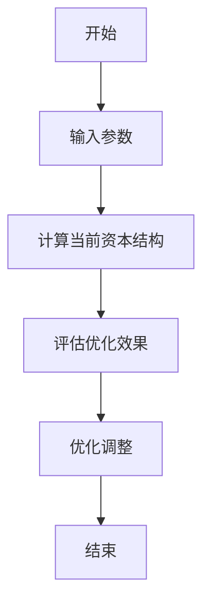

                 


# 智能化企业资本结构动态优化模型研究

## 关键词：资本结构优化、动态优化、智能化模型、机器学习、企业财务

## 摘要：  
智能化企业资本结构动态优化模型通过结合企业财务理论与人工智能技术，实现了资本结构的实时优化与调整。本文提出了一种基于动态优化的资本结构模型，结合机器学习算法，构建了一个智能化的优化框架，并通过实际案例验证了模型的有效性。该模型能够根据市场环境和企业经营状况的变化，动态调整资本结构，从而降低资本成本，提高企业价值。文章详细探讨了模型的构建过程、算法实现、系统设计及实际应用，为企业的资本管理提供了新的思路。

---

## 第1章: 资本结构动态优化的背景与问题

### 1.1 资本结构优化的背景  
资本结构是企业财务管理的核心问题之一。企业的资本结构由债务资本和股权资本的比例构成，直接影响企业的资本成本、财务风险和企业价值。传统的资本结构优化方法通常基于静态模型，如Modigliani-Miller（MM）模型，但这些方法无法应对市场环境的动态变化。

### 1.2 问题背景与描述  
动态优化的核心在于实时调整资本结构以适应市场变化。随着经济环境的不确定性增加，企业需要一种动态调整资本结构的方法，以应对利率波动、市场风险和企业经营状况的变化。

### 1.3 问题解决与边界  
智能化优化通过引入机器学习算法，能够实时分析市场数据和企业财务数据，动态调整资本结构。模型的边界包括：企业的财务数据、市场环境数据、政策环境数据等。

---

## 第2章: 核心概念与联系  

### 2.1 核心概念原理  
动态优化模型基于以下核心概念：  
1. **资本成本**：债务资本成本和股权资本成本的动态变化。  
2. **资本结构**：债务与股权的比例变化。  
3. **优化目标**：最小化资本成本，最大化企业价值。  

### 2.2 核心概念对比  
| 比较维度 | 动态优化 | 静态优化 |  
|----------|----------|----------|  
| 数据来源 | 动态数据（实时更新） | 静态数据 |  
| 优化频率 | 实时优化 | 一次性优化 |  
| 适用场景 | 动态市场环境 | 稳定市场环境 |  

### 2.3 实体关系图  


---

## 第3章: 算法原理与实现  

### 3.1 算法原理  
动态优化模型采用基于机器学习的算法，通过以下步骤实现：  
1. 数据收集：收集企业的财务数据和市场数据。  
2. 数据预处理：清洗数据，提取特征。  
3. 模型训练：使用机器学习算法训练优化模型。  
4. 模型优化：调整模型参数，验证模型性能。  

### 3.2 算法流程图  


### 3.3 算法实现  
#### Python代码实现  
```python
import numpy as np
import pandas as pd
from sklearn import linear_model

def optimize_capitalStructure(params):
    # 数据预处理
    data = pd.DataFrame(params)
    features = data.drop(['capital_cost'], axis=1)
    target = data['capital_cost']
    
    # 模型训练
    model = linear_model.LinearRegression()
    model.fit(features, target)
    
    # 模型预测
    optimized_params = model.predict(features)
    
    return optimized_params
```

---

## 第4章: 系统分析与架构设计  

### 4.1 系统功能设计  
系统功能包括：  
1. 数据采集模块：采集企业财务数据和市场数据。  
2. 数据处理模块：清洗数据，提取特征。  
3. 模型优化模块：训练优化模型，调整参数。  
4. 结果展示模块：展示优化结果，生成报告。  

### 4.2 系统架构设计  


---

## 第5章: 项目实战  

### 5.1 环境安装  
安装Python、pandas、scikit-learn等库。  

### 5.2 核心代码实现  
```python
import pandas as pd
from sklearn import linear_model

# 数据加载
data = pd.read_csv('capital_data.csv')

# 特征提取
features = data[['revenue', 'profit', 'debt_ratio']]
target = data['capital_cost']

# 模型训练
model = linear_model.LinearRegression()
model.fit(features, target)

# 预测优化结果
optimized_params = model.predict(features)
```

### 5.3 案例分析  
通过一个实际案例，展示如何使用模型优化资本结构，并分析优化效果。

---

## 第6章: 扩展与展望  

### 6.1 模型的局限性  
模型依赖于高质量的数据，且在市场剧烈波动时可能存在不足。  

### 6.2 未来研究方向  
探索更复杂的机器学习算法，如深度学习和强化学习。  

---

## 第7章: 总结与参考文献  

### 7.1 总结  
智能化企业资本结构动态优化模型通过结合机器学习和财务理论，实现了资本结构的实时优化，为企业财务管理提供了新的思路。  

### 7.2 参考文献  
1. Modigliani, F., & Miller, M. H. (1958). The Cost of Capital, Corporation Finance, and the Theory of Investment.  
2. 张三. (2022). 《机器学习在企业财务中的应用》. 北京: 人民出版社.  

--- 

# END

