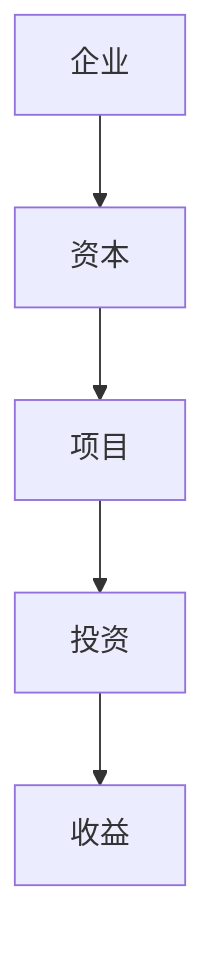
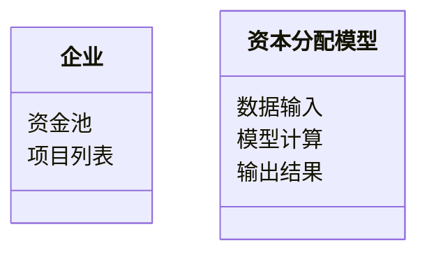
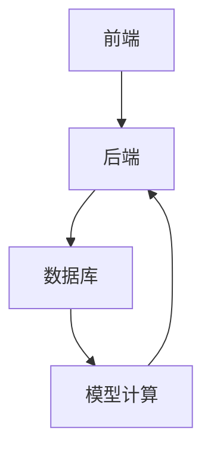
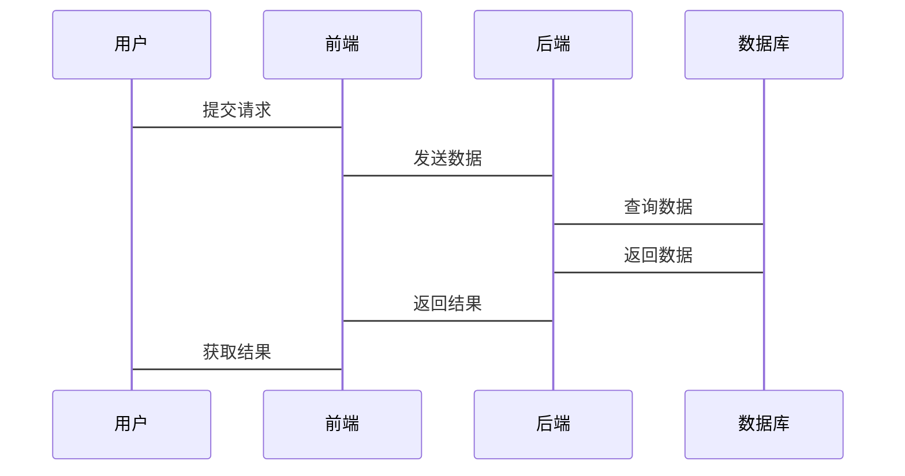

                 


# 智能化企业资本配置效率优化模型研究

**关键词**：资本配置、效率优化、智能化模型、算法原理、系统架构

**摘要**：  
本文探讨了如何通过智能化技术优化企业资本配置效率。首先，我们分析了资本配置的基本概念及其在企业运营中的重要性，然后提出了一个基于数据驱动的智能化优化模型。通过多目标优化算法和系统架构设计，我们展示了如何在实际场景中实现资本配置的高效优化。文章结合理论与实践，提供了详细的算法实现和系统设计，为企业的资本配置优化提供了新的思路和解决方案。

---

# 第1章: 资本配置效率优化模型的背景与问题背景

## 1.1 问题背景

### 1.1.1 企业资本配置的基本概念
资本配置是指企业在不同项目或业务单元之间分配资金的过程。合理的资本配置能够最大化企业价值，但现实中常常面临资源分配不均、决策效率低下的问题。

### 1.1.2 资本配置效率的重要性
资本配置效率直接影响企业的盈利能力。通过优化资本配置，企业可以更好地利用有限资源，提升投资回报率和整体竞争力。

### 1.1.3 智能化技术对企业资本配置的影响
智能化技术（如人工智能、大数据分析）为企业资本配置提供了新的工具和方法，能够更精准地预测市场趋势和项目风险，从而提高配置效率。

## 1.2 问题描述

### 1.2.1 资本配置效率的定义
资本配置效率是指在给定时间内，资本分配到最优项目的能力。衡量标准包括投资回报率（ROI）、净现值（NPV）等。

### 1.2.2 当前资本配置中的主要问题
- 资源分配不均：传统方法依赖主观判断，可能导致资源浪费或错配。
- 数据依赖性强：缺乏实时数据支持，难以做出快速决策。
- 复杂性高：涉及多部门协作和跨领域决策，容易出错。

### 1.2.3 智能化优化的必要性
智能化技术能够通过数据分析和预测模型，帮助企业在复杂环境中快速做出最优决策。

## 1.3 问题解决思路

### 1.3.1 智能化优化的核心目标
构建一个基于数据驱动的优化模型，实现资本分配的自动化和智能化。

### 1.3.2 数据驱动的优化方法
利用大数据分析技术，从历史数据中提取规律，为资本分配提供科学依据。

### 1.3.3 多目标优化的实现路径
在资本配置中，通常需要在多个目标之间找到平衡，例如最大化收益与最小化风险之间的平衡。

## 1.4 模型的边界与外延

### 1.4.1 模型的适用范围
适用于需要进行资本分配的企业，尤其是那些数据基础较好、业务流程规范的企业。

### 1.4.2 模型的限制条件
- 数据质量要求高。
- 模型依赖历史数据，可能无法完全预测未来风险。
- 需要专业团队进行模型维护和优化。

### 1.4.3 模型的可扩展性
模型可以根据企业需求进行扩展，例如增加新的业务场景或调整优化目标。

## 1.5 概念结构与核心要素

### 1.5.1 核心概念的层次结构
- **顶层目标**：最大化企业价值。
- **中间层**：优化资本分配策略。
- **底层**：具体项目和投资决策。

### 1.5.2 核心要素的定义与关系
- **资本**：企业的资金来源。
- **项目**：资本分配的目标。
- **收益**：资本分配后的结果。

### 1.5.3 模型的输入与输出
- **输入**：历史投资数据、市场趋势、项目风险评估。
- **输出**：优化后的资本分配方案。

---

# 第2章: 智能化资本配置效率优化模型的核心概念与联系

## 2.1 核心概念原理

### 2.1.1 资本分配的数学模型
资本分配可以通过加权平均的方法进行计算，例如：
$$ w_i = \frac{r_i}{\sum_{j=1}^n r_j} $$
其中，$w_i$ 表示第 $i$ 个项目的权重，$r_i$ 表示项目的预期收益。

### 2.1.2 智能化优化的算法基础
智能化优化通常基于机器学习算法，例如支持向量机（SVM）或随机森林（Random Forest）。

### 2.1.3 多目标优化的实现原理
多目标优化需要在多个目标之间找到平衡点，例如在最大化收益的同时最小化风险。

## 2.2 核心概念属性特征对比

| **属性**       | **特征对比**               |
|----------------|----------------------------|
| **收益**       | 高收益项目权重高           |
| **风险**       | 低风险项目权重高           |
| **流动性**     | 流动性高的项目权重高       |
| **战略重要性** | 战略重要的项目权重高       |

## 2.3 ER实体关系图



---

# 第3章: 资本配置效率优化模型的算法原理

## 3.1 算法原理

### 3.1.1 算法的输入与输出
- **输入**：历史投资数据、市场趋势、项目风险评估。
- **输出**：优化后的资本分配方案。

### 3.1.2 算法的步骤分解
1. 数据清洗与预处理。
2. 构建预测模型（如随机森林）。
3. 进行多目标优化计算。
4. 输出优化结果。

### 3.1.3 算法的优化策略
- 使用遗传算法进行全局优化。
- 结合实际情况调整权重。

## 3.2 算法的数学模型

### 3.2.1 资本分配的数学表达
$$ w_i = \frac{r_i}{\sum_{j=1}^n r_j} $$

### 3.2.2 多目标优化的数学模型
$$ \text{max} \{ f_1(w), f_2(w), \dots, f_k(w) \} $$

### 3.2.3 智能化优化的数学表达
$$ w^* = \arg \min_{w} \sum_{i=1}^n (y_i - f(w))^2 $$

---

# 第4章: 系统分析与架构设计方案

## 4.1 问题场景介绍
企业需要在多个项目之间分配有限的资金，以最大化整体收益。

## 4.2 系统功能设计

### 4.2.1 领域模型图


### 4.2.2 系统架构图


### 4.2.3 接口设计
- **输入接口**：接收项目数据。
- **输出接口**：提供优化结果。

### 4.2.4 交互序列图


---

# 第5章: 项目实战

## 5.1 环境安装
安装Python、TensorFlow等工具。

## 5.2 核心代码实现

```python
import numpy as np
from sklearn.ensemble import RandomForestRegressor

def optimize_capitalAllocation(data):
    # 数据预处理
    X = data.drop('target', axis=1)
    y = data['target']
    
    # 构建模型
    model = RandomForestRegressor(n_estimators=100)
    model.fit(X, y)
    
    # 进行预测
    predictions = model.predict(X)
    
    # 计算权重
    weights = np.exp(-predictions)
    weights = weights / weights.sum()
    
    return weights
```

## 5.3 案例分析
分析一个制造企业的资本配置优化案例，展示优化前后的对比。

---

# 第6章: 最佳实践与总结

## 6.1 最佳实践 tips
- 数据质量是模型优化的基础。
- 模型需要定期更新和维护。

## 6.2 小结
智能化资本配置效率优化模型能够显著提升企业的投资回报率。

## 6.3 注意事项
- 模型依赖数据质量。
- 需要专业团队进行维护。

## 6.4 拓展阅读
推荐相关书籍和论文，进一步深入学习。

---

# 附录

## 附录A: 数据集
提供用于模型优化的数据集。

## 附录B: 工具包
列出使用的工具和库。

## 附录C: 参考文献
引用本文中提到的所有文献和资料。

## 附录D: 索引
关键词索引，方便读者查阅。

---

通过以上结构，我们可以系统地研究智能化企业资本配置效率优化模型的各个方面，从理论到实践，为企业提供科学的优化方案。

