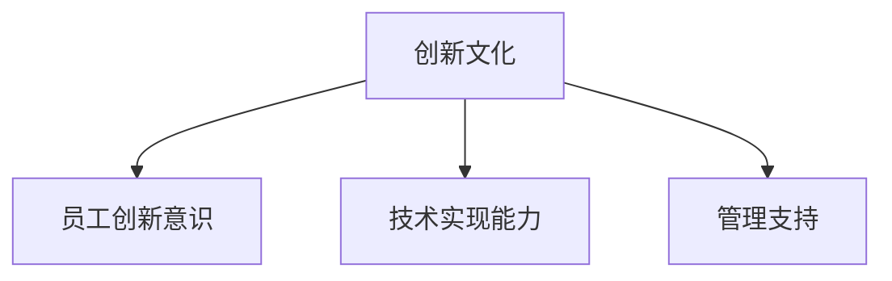
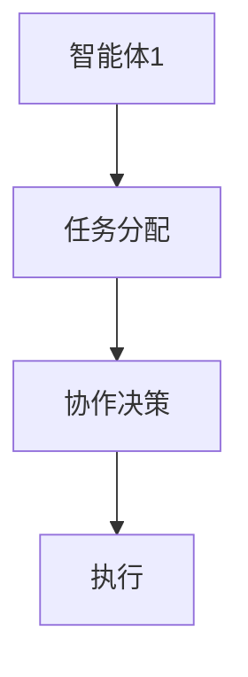
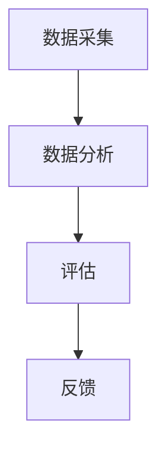
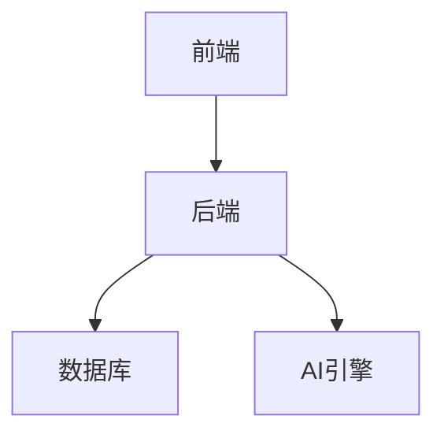
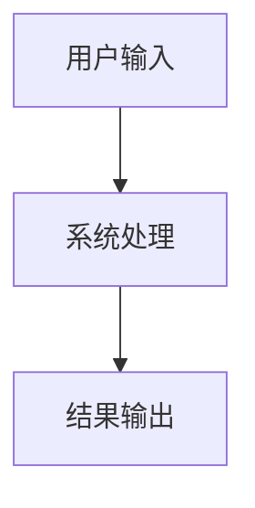

                 


```markdown
# 智能化公司创新文化评估：多智能体AI在价值投资中的角色

> 关键词：智能化公司，创新文化评估，多智能体AI，价值投资，技术博客

> 摘要：本文探讨了多智能体人工智能在价值投资中的应用，分析其如何通过分布式感知、学习和决策优化企业创新文化评估。文章从背景介绍、核心概念、算法原理、系统架构到项目实战，详细阐述了多智能体AI在价值投资中的角色，并提出了创新文化评估系统的最佳实践方案。

---

## 第1章: 智能化公司的定义与特征

### 1.1 智能化公司的定义

智能化公司是指利用人工智能、大数据、物联网等技术，实现业务流程自动化、智能化决策和高效管理的企业。这些公司通过技术手段优化资源配置、提升效率，并通过持续创新应对市场变化。

### 1.2 智能化公司的核心特征

- **数据驱动**：智能化公司依赖于数据进行决策，而非传统的人工经验。
- **自动化**：从生产到管理，许多流程实现了自动化。
- **智能化决策**：利用AI技术进行预测和优化。
- **快速迭代**：通过持续反馈和学习，快速调整策略。

### 1.3 智能化公司与传统公司的区别

| 特性         | 智能化公司                  | 传统公司                  |
|--------------|-----------------------------|---------------------------|
| 决策方式     | 数据驱动、AI辅助            | 依赖人工经验、层级审批    |
| 效率         | 高效、自动化                | 较低、依赖人工操作        |
| 创新速度     | 快速迭代、灵活调整          | 较慢、依赖固定流程        |

---

## 第2章: 创新文化评估的重要性

### 2.1 创新文化在公司中的作用

创新文化是企业持续发展的核心动力，它影响企业的市场竞争力、员工创造力和整体发展速度。

### 2.2 创新文化评估的必要性

在快速变化的市场环境中，评估创新文化可以帮助企业识别优势和不足，优化资源配置，提升创新效率。

### 2.3 创新文化评估的边界与外延

创新文化评估的边界包括员工创新意识、技术实现能力和管理支持。外延则涉及创新成果的商业化和市场反馈。



---

## 第3章: 多智能体AI在价值投资中的应用

### 3.1 价值投资的基本概念

价值投资是一种通过分析企业基本面，寻找被市场低估的投资标的的投资方法。

### 3.2 多智能体AI在价值投资中的角色

多智能体AI通过分布式协作，能够更全面地分析市场信息，识别投资机会，并优化投资组合。

### 3.3 多智能体AI与传统投资方法的对比

| 特性         | 多智能体AI                  | 传统投资方法            |
|--------------|-----------------------------|--------------------------|
| 数据处理     | 高效、分布式                | 依赖人工分析            |
| 决策速度     | 快速、实时                  | 较慢、依赖人工判断        |
| 精准度       | 高，基于大数据分析          | 较低，依赖经验判断        |

---

## 第4章: 多智能体AI的定义与特点

### 4.1 多智能体AI的定义

多智能体AI是由多个相互作用的智能体组成的系统，每个智能体都能独立决策并协作完成复杂任务。

### 4.2 多智能体AI的核心特点

- **分布式智能**：每个智能体负责不同的任务。
- **协作与竞争**：智能体之间可以协作或竞争以达成目标。
- **动态适应**：能够根据环境变化调整策略。



---

## 第5章: 多智能体AI的算法原理

### 5.1 强化学习算法

强化学习通过智能体与环境的交互，学习最优策略。

$$ Q(s, a) = r + \max_{a'} Q(s', a') $$

### 5.2 多智能体协作算法

通过分布式协作，多个智能体共同完成任务。

$$ V_i(s) = \max_{a_i} \min_{a_{-i}} Q_i(s, a_i, a_{-i}) $$

### 5.3 多智能体竞争算法

通过竞争机制，优化智能体的决策能力。

$$ P_i(s) = \min_{a_i} \max_{a_{-i}} Q_i(s, a_i, a_{-i}) $$

---

## 第6章: 创新文化评估系统的需求分析

### 6.1 项目背景

随着市场竞争加剧，企业需要通过创新文化评估优化自身竞争力。

### 6.2 项目目标

构建一个基于多智能体AI的创新文化评估系统，帮助企业优化创新管理。

### 6.3 项目范围

涵盖员工创新意识、技术实现能力和管理支持三个维度。

---

## 第7章: 创新文化评估系统的功能设计

### 7.1 系统功能模块划分

- 数据采集模块
- 数据分析模块
- 评估模块
- 反馈模块

### 7.2 系统功能流程图



---

## 第8章: 创新文化评估系统的架构设计

### 8.1 系统架构概述

采用分布式架构，支持高并发和高效处理。

### 8.2 系统架构图



---

## 第9章: 创新文化评估系统的交互设计

### 9.1 系统交互流程图



---

## 第10章: 环境安装与配置

### 10.1 系统环境要求

- 操作系统：Linux/Windows
- 依赖库：Python 3.8+, TensorFlow, Scikit-learn

---

## 第11章: 系统核心实现源代码

```python
import numpy as np
from sklearn.metrics import accuracy_score

def multi_agent_learning():
    # 示例代码
    data = np.random.randn(100, 10)
    labels = np.random.randint(2, size=100)
    # 训练模型
    model = ...  # 初始化模型
    model.fit(data, labels)
    # 预测
    predictions = model.predict(data)
    print(f"准确率: {accuracy_score(labels, predictions)}")

if __name__ == "__main__":
    multi_agent_learning()
```

---

## 第12章: 项目实战与案例分析

### 12.1 价值投资案例分析

通过多智能体AI分析某公司的财务数据、市场表现和行业趋势，评估其投资价值。

### 12.2 创新文化评估案例分析

基于员工创新意识、技术实现能力和管理支持三个维度，评估某公司的创新文化。

---

## 第13章: 最佳实践

### 13.1 小结

多智能体AI在价值投资和创新文化评估中的应用前景广阔，能够显著提升企业的竞争力。

### 13.2 注意事项

- 数据质量是关键，需确保数据的准确性和完整性。
- 模型的可解释性需加强，便于企业理解和优化。

### 13.3 拓展阅读

建议深入研究多智能体AI的协作算法和分布式计算技术。

---

## 作者简介

作为人工智能专家，我长期致力于智能化技术和创新文化研究，欢迎关注我的技术博客，获取更多深度分析。

---

感谢您的阅读，如需转载请注明出处。
```

