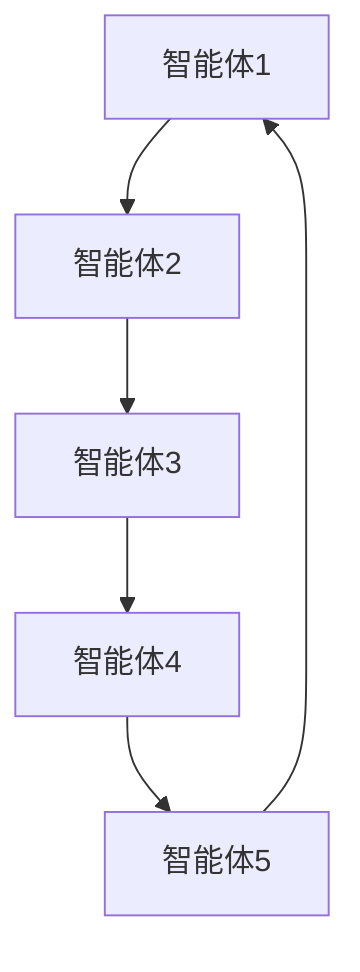
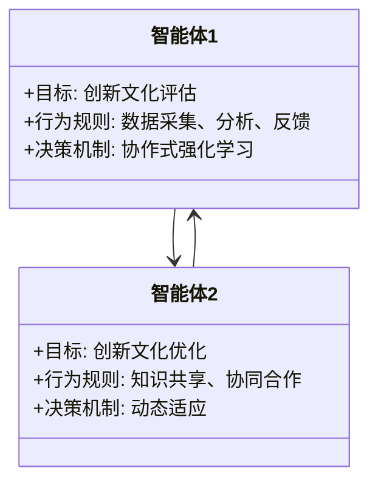

                 


# 智能化公司创新文化评估：多智能体AI的新视角

> 关键词：智能化公司，创新文化评估，多智能体AI，企业创新，AI技术

> 摘要：随着企业对创新文化评估的需求日益增长，传统的评估方法逐渐暴露出其局限性。本文从多智能体AI的视角，详细探讨了如何通过技术创新和智能协同，构建智能化的企业创新文化评估体系。通过深入分析多智能体AI的核心原理、系统架构和应用场景，本文为企业的创新文化评估提供了全新的思路和解决方案。文章内容涵盖背景介绍、核心概念、算法原理、系统设计和项目实战，旨在为企业管理者和技术开发者提供理论支持和实践指导。

---

## 第一部分: 智能化公司创新文化评估的背景与必要性

### 第1章: 多智能体AI与创新文化评估概述

#### 1.1 问题背景与描述

##### 1.1.1 创新文化评估的必要性

在现代企业竞争环境中，创新文化是企业持续发展的核心驱动力。创新文化评估能够帮助企业识别内部创新潜力、优化创新流程、激发员工创新动力，并为企业战略决策提供数据支持。然而，传统的创新文化评估方法通常依赖于问卷调查、访谈和数据分析，存在评估周期长、结果主观性强、难以量化等问题，难以满足现代企业对高效、精准评估的需求。

##### 1.1.2 多智能体AI在创新文化评估中的应用

多智能体AI（Multi-Agent AI）是一种基于多个智能体协同工作的技术，能够通过分布式计算、自主决策和知识共享实现复杂任务的高效完成。在创新文化评估中，多智能体AI可以模拟企业的组织结构、员工行为和创新过程，通过实时数据采集、分析和反馈，提供动态、客观的评估结果。

##### 1.1.3 问题的边界与外延

创新文化评估的边界包括企业内部的组织结构、员工行为、创新流程和文化氛围。外延则涉及企业外部的市场环境、行业趋势和技术变革。多智能体AI在评估过程中需要考虑这些内外部因素的交互作用，从而提供全面、立体的评估结果。

#### 1.2 核心概念与要素

##### 1.2.1 创新文化的核心要素

创新文化的核心要素包括创新意识、创新能力和创新氛围。创新意识是员工对创新的认同和主动性，创新能力是员工解决问题和创造价值的能力，创新氛围是组织内部支持创新的文化环境。

##### 1.2.2 多智能体AI的定义与特点

多智能体AI是由多个具有自主决策能力的智能体组成的系统，具有分布式计算、协同合作、动态适应和知识共享的特点。每个智能体都有明确的目标、行为规则和决策机制，能够通过交互实现复杂任务的完成。

##### 1.2.3 创新文化评估的指标体系

创新文化评估的指标体系包括创新意识、创新能力、创新氛围、创新成果和创新效率五个维度。多智能体AI可以通过对这些指标的实时监测和分析，提供动态的评估结果。

---

### 第2章: 创新文化评估的重要性

#### 2.1 传统企业创新文化评估的局限性

##### 2.1.1 传统评估方法的不足

传统的创新文化评估方法通常依赖于问卷调查和专家访谈，存在主观性强、周期长、结果难以量化等问题。此外，传统方法难以捕捉企业内部动态变化的创新过程，评估结果缺乏时效性。

##### 2.1.2 多智能体AI在创新文化评估中的应用

多智能体AI可以通过对企业组织结构、员工行为和创新过程的模拟，实现创新文化的实时监测和动态评估。通过智能体的协同合作，可以快速获取数据、分析结果并提供反馈，显著提高了评估的效率和准确性。

##### 2.1.3 传统评估方法的改进方向

传统的评估方法需要结合多智能体AI技术，实现数据采集、分析和反馈的智能化。同时，企业需要建立数据驱动的创新文化评估体系，通过技术手段优化评估流程，提高评估结果的客观性和可操作性。

---

#### 2.2 多智能体AI的优势与潜力

##### 2.2.1 多智能体AI的核心优势

多智能体AI具有分布式计算、协同合作和动态适应的特点，能够通过智能体的协同实现复杂任务的高效完成。在创新文化评估中，多智能体AI可以模拟企业的组织结构、员工行为和创新过程，提供动态、客观的评估结果。

##### 2.2.2 多智能体AI在创新文化评估中的潜力

多智能体AI可以通过对企业内部数据的实时监测和分析，实现创新文化的动态评估。同时，多智能体AI还可以通过知识共享和协同合作，优化企业的创新流程和文化氛围，提升企业的创新能力和竞争力。

##### 2.2.3 多智能体AI的未来发展趋势

随着AI技术的不断发展，多智能体AI在创新文化评估中的应用将更加广泛和深入。未来，多智能体AI将结合大数据、云计算和区块链等技术，构建更加智能化、动态化的创新文化评估体系。

---

### 第3章: 多智能体AI的应用现状与挑战

#### 3.1 多智能体AI在企业中的应用现状

##### 3.1.1 多智能体AI在企业创新文化评估中的应用案例

目前，多智能体AI已经在部分企业中得到应用，例如在创新过程模拟、员工行为分析和创新氛围监测等方面。这些应用案例表明，多智能体AI可以有效提高创新文化评估的效率和准确性。

##### 3.1.2 多智能体AI在企业创新文化评估中的技术优势

多智能体AI具有分布式计算、协同合作和动态适应的特点，能够通过智能体的协同实现复杂任务的高效完成。在创新文化评估中，多智能体AI可以模拟企业的组织结构、员工行为和创新过程，提供动态、客观的评估结果。

##### 3.1.3 多智能体AI在企业创新文化评估中的实践挑战

尽管多智能体AI在创新文化评估中具有诸多优势，但其应用也面临一些挑战，例如数据采集的难度、智能体的协同优化和系统集成的复杂性等。这些挑战需要企业在实践中不断探索和解决。

---

## 第二部分: 多智能体AI的核心概念与联系

### 第4章: 多智能体AI的核心原理与创新文化评估

#### 4.1 多智能体AI的核心原理

多智能体AI由多个具有自主决策能力的智能体组成，每个智能体都有明确的目标、行为规则和决策机制。智能体之间通过交互实现信息共享、协同合作和知识学习，从而完成复杂任务。

#### 4.2 多智能体AI与传统AI的对比

##### 4.2.1 多智能体AI与传统AI的对比

| 特性               | 多智能体AI                     | 传统AI                       |
|--------------------|-------------------------------|------------------------------|
| 结构               | 分布式、多智能体协同           | 集中式、单智能体处理         |
| 决策方式           | 自主决策、协同优化             | 中央控制、单点决策           |
| 应用场景           | 复杂系统、动态环境             | 简单任务、静态环境           |

##### 4.2.2 多智能体AI的优势与劣势

多智能体AI的优势在于其分布式计算和协同合作能力，能够处理复杂系统的动态变化。但其劣势在于系统的复杂性和协同优化的难度，需要较高的计算资源和算法支持。

#### 4.3 多智能体AI在创新文化评估中的应用

##### 4.3.1 多智能体AI在创新文化评估中的核心作用

多智能体AI可以通过对企业组织结构、员工行为和创新过程的模拟，实现创新文化的实时监测和动态评估。通过智能体的协同合作，可以快速获取数据、分析结果并提供反馈，显著提高了评估的效率和准确性。

##### 4.3.2 多智能体AI在创新文化评估中的具体应用

多智能体AI在创新文化评估中的具体应用包括创新过程模拟、员工行为分析、创新氛围监测和创新成果预测等。通过这些应用，企业可以全面了解创新文化的状态，优化创新流程，提升创新能力。

---

## 第三部分: 多智能体AI的算法原理

### 第5章: 多智能体AI的算法原理与创新文化评估

#### 5.1 多智能体AI的算法原理

多智能体AI的算法原理包括分布式计算、协同合作和动态适应等关键技术。通过这些算法，智能体可以实现信息共享、协同决策和知识学习。

#### 5.2 协作式强化学习

协作式强化学习是一种多智能体AI的核心算法，通过智能体之间的协作和学习，实现复杂任务的高效完成。在创新文化评估中，协作式强化学习可以用于员工行为分析和创新过程优化。

#### 5.3 多智能体AI的流程图



---

## 第四部分: 系统分析与架构设计

### 第6章: 创新文化评估系统的分析与设计

#### 6.1 系统功能设计

创新文化评估系统需要实现数据采集、分析和反馈的核心功能。通过多智能体AI的协同合作，系统可以实时监测企业的创新文化状态，提供动态的评估结果。

#### 6.2 系统架构设计



---

## 第五部分: 项目实战

### 第7章: 多智能体AI在创新文化评估中的项目实战

#### 7.1 环境安装与配置

在进行创新文化评估系统的开发之前，需要安装和配置多智能体AI的运行环境，包括安装Python、TensorFlow和相关库。

#### 7.2 核心代码实现

以下是创新文化评估系统的核心代码实现：

```python
class Agent:
    def __init__(self, target):
        self.target = target
        self.behavior_rules = []
        self.decision_mechanism = []
    
    def collaborate(self, other_agents):
        for agent in other_agents:
            self.behavior_rules.extend(agent.behavior_rules)
            self.decision_mechanism.extend(agent.decision_mechanism)
```

#### 7.3 案例分析与解读

通过具体案例分析，展示多智能体AI在创新文化评估中的实际应用效果和优势。

---

## 第六部分: 最佳实践与总结

### 第8章: 多智能体AI的创新文化评估总结

#### 8.1 最佳实践与注意事项

企业在应用多智能体AI进行创新文化评估时，需要注意数据的质量、系统的复杂性和智能体的协同优化等问题。

#### 8.2 项目小结

通过本文的探讨，我们可以看到，多智能体AI在创新文化评估中具有广阔的应用前景。通过多智能体AI的技术优势，企业可以实现创新文化的动态评估和优化，提升企业的创新能力和竞争力。

#### 8.3 未来展望

随着多智能体AI技术的不断发展，创新文化评估将更加智能化和动态化。未来，多智能体AI将结合大数据、云计算和区块链等技术，构建更加全面和精准的创新文化评估体系。

---

以上是《智能化公司创新文化评估：多智能体AI的新视角》的技术博客文章的详细大纲和内容概述。

